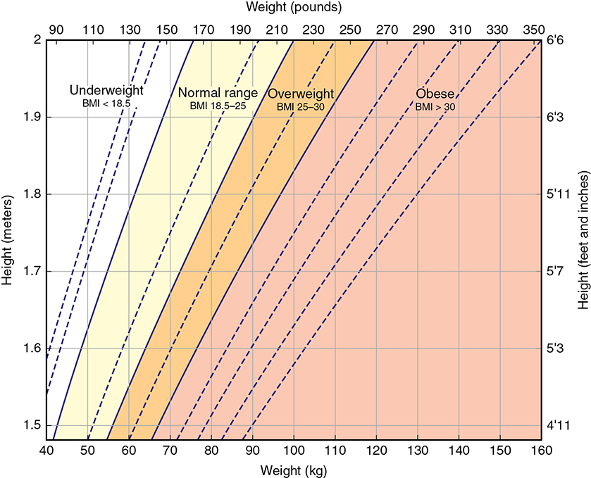
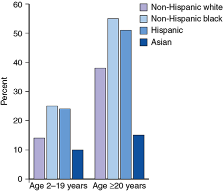
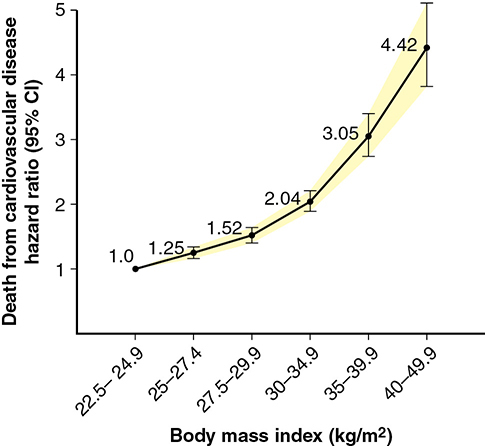
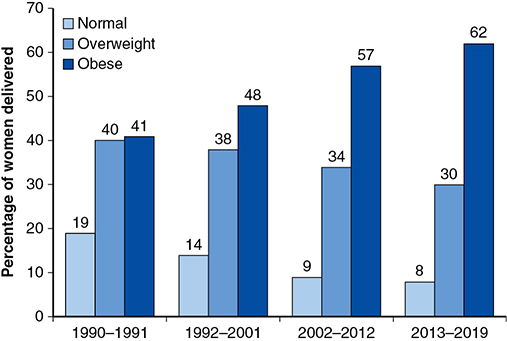
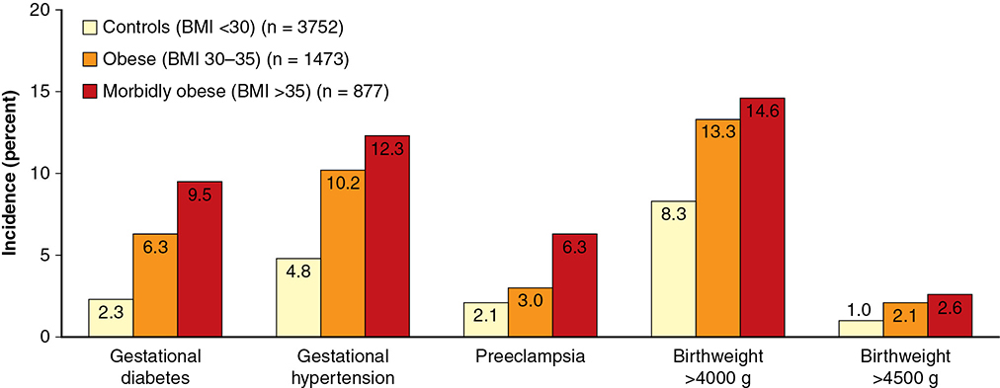
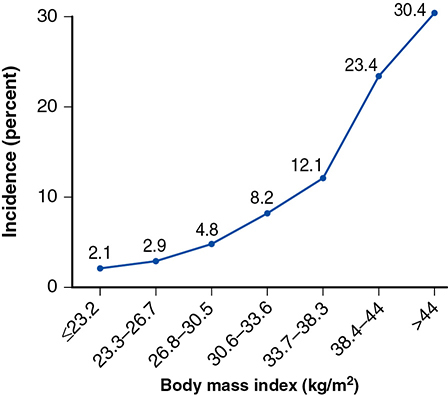
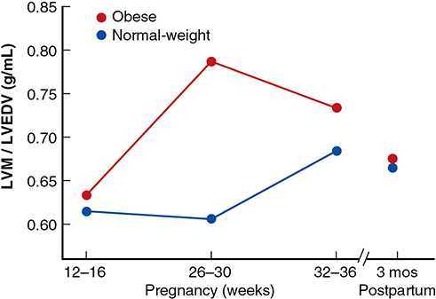
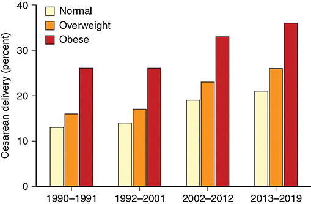
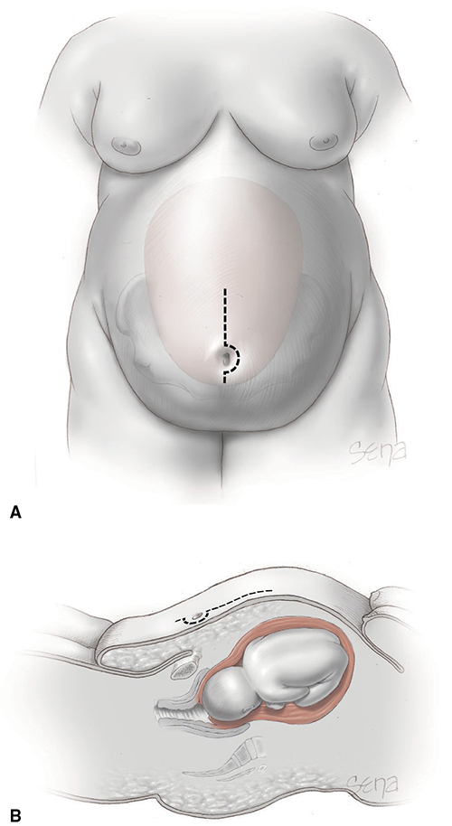

# Chapter 51: Obesity — Revision Notes

> Williams Obstetrics 26e, pp. 2350–2383 of the PDF. High-yield numbers are in **bold**.
> The three tables are transcribed from the PDF images (they are missing from the extracted chapter text). All 9 figures are included from the PDF.

**Big picture:** Obesity (now **>60%** of Parkland gravidas) raises almost every maternal, fetal and surgical risk in pregnancy — especially **hypertension/preeclampsia, GDM, stillbirth, cesarean delivery and wound infection**. Its offspring carry the risk into adult life. Bariatric surgery reverses much of this but brings its own nutritional and surgical hazards.

---

## 1. General Considerations

### Definitions and prevalence
- **BMI (Quetelet index) = weight (kg) / height (m)²**.
- US adult obesity prevalence (2017–2018): **42%**.

| Category (NIH, 2000) | BMI (kg/m²) |
|---|---|
| Normal | **18.5–24.9** |
| Overweight | **25–29.9** |
| Obese | **≥30** |
| Class 1 obesity | 30–34.9 |
| Class 2 obesity | 35–39.9 |
| Class 3 (**morbid**) obesity | **≥40** |
| **Supermorbid** obesity | **≥50** |

- Obesity in girls and women rises with **age**, varies with ethnicity and worsens with **poverty**. A **genetic predisposition** exists.

*Figure 51-1. BMI chart: find where height and weight intersect to read the BMI category.*

*Figure 51-2. US obesity prevalence by race (2015–2016): highest in non-Hispanic black (~55%) and Hispanic (~51%) adults, lowest in Asian adults (~15%).*

### Adipose pathophysiology
- Fat is an **endocrine/paracrine organ**: adipokines, lipokines, exosomal microRNAs (adiponectin, leptin, TNF-α, IL-6, resistin, visfatin, apelin, VEGF, lipoprotein lipase, IGF).
- **Adiponectin = the principal adipokine:**
  - ↑ insulin sensitivity, blocks hepatic glucose release, cardioprotective on lipids, anti-inflammatory.
  - **Negatively regulated by fat mass.** Deficit → diabetes, hypertension, endothelial activation, CVD.
- **Cytokines causing insulin resistance: leptin, resistin, TNF-α, IL-6** (all higher in pregnancy). Inflammatory adipokines may be the **primary stimulant of insulin resistance**.
- Perivascular fat also regulates vascular function; the placenta makes adipokines too.

### Metabolic syndrome
- Obesity + inherited factors → **insulin resistance** → type 2 diabetes, dyslipidemia, hypertension → accelerated CVD.
- **Diagnosis = any 3 of 5 criteria** (Table 51-1). **Waist circumference is the preferred screening measure.**
- Most type 2 diabetics meet the criteria. Obese hypertensive women typically have ↑ plasma insulin.
- US prevalence (NHANES, 2012): **34%** overall; **20%** at 18–29 y, **36%** at 30–49 y.

### Table 51-1. Criteria for Diagnosis of the Metabolic Syndrome

**Patients with three or more of the following:**

| Criterion | Threshold |
|---|---|
| Elevated waist circumferenceᵃ | Country- and population-specific |
| Elevated triglyceridesᵇ | **≥150 mg/dL** |
| Reduced HDL cholesterolᵇ | **<40 mg/dL in males; <50 mg/dL in females** |
| Elevated blood pressureᵇ | **Systolic ≥130 and/or diastolic ≥85 mm Hg** |
| Elevated fasting glucoseᵇ | **≥100 mg/dL** |

*ᵃAccording to country- and population-specific thresholds. ᵇThose with normal values while taking medications are considered to meet these criteria. From the National Heart, Lung, and Blood Institute, 2019.*

> **Memory hook:** "**1-5-0, 1-3-0/8-5, 1-0-0, 4-0/5-0**" — TG 150, BP 130/85, glucose 100, HDL 40 (men)/50 (women), plus waist.

### Nonalcoholic fatty liver disease (NAFLD)
- Visceral adiposity correlates with hepatic fat → **hepatic steatosis (NAFLD)** → **NASH** → cirrhosis → hepatocellular carcinoma.
- **The major cause of cirrhosis and liver cancer**; US cost >$100 billion/yr. Strongly linked with CVD (Ch 58).

### Obesity-associated morbidity
- Glucose intolerance, hypertension, dyslipidemia, metabolic syndrome → MI, **atrial fibrillation**, heart failure, stroke.
- Adiposity accounts for **up to 75% of primary hypertension**.
- Insulin resistance → hippocampal changes, ↓ executive function and memory. Cytokine-induced **osteoarthritis**.
- ↑ All-cause early mortality; CVD and cancer mortality rise **proportionally with BMI**. An "**obesity paradox**" (survival advantage in some groups) is hypothesized, but weight normalization clearly helps.

*Figure 51-3. Cardiovascular death hazard ratio vs BMI (1.46 million adults): 1.0 at 22.5–24.9 → 2.04 at 30–34.9 → 4.42 at 40–49.9.*

### Obesity treatment
- **Weight loss is tremendously difficult**, and maintenance equally so. Ob-gyns should help obese women lose weight.
- Options: behavioral, pharmacological, surgical, or combinations. Diet + exercise ↓ weight and metabolic syndrome.
- Long-term failure is appreciable: **50% failure** in diabetics after bariatric surgery.

---

## 2. Pregnancy and Obesity

- Reproductive disadvantages: **infertility, early and recurrent pregnancy loss, preterm delivery**, and obstetric, medical and surgical complications.
- Also: ↑ **oral contraceptive failure** and associated thromboembolism; ↑ complications of second-trimester surgical abortion.
- Offspring (as infants and adults) have ↑ morbidity.
- **Obese women now make up >60%** of Parkland gravidas.

*Figure 51-4. Parkland obesity at first prenatal visit: 41% (1990–91) → 62% (2013–19); normal-BMI women fell from 19% to 8%.*

### Maternal morbidity
- **Overweight women** already have significantly more complications than normal-BMI women (Table 51-2), though less than obese women.
- Obesity thresholds in studies range from >30 to >50 kg/m².
- **Maternal mortality nearly 4× higher** in obese women (Michigan).
- **Supermorbid obesity:** very high rates of preeclampsia, macrosomia, cesarean, meconium aspiration, ventilator support and neonatal death.

### Table 51-2. Adverse Pregnancy Effects in Overweight and Obese Women

| Complication | Normal BMI 18.5–24.9 (n = 621,048), % | Overweight BMI 25–29.9 (n = 228,945), % (ORᵃ, 95% CI) | Obese BMI >30 (n = 78,043), % (ORᵃ, 95% CI) |
|---|---|---|---|
| Gestational diabetes | 2.3 | 4.3 (1.91, 1.86–1.96) | **8.6 (4.04, 3.94–4.15)** |
| Preeclampsia | 2.7 | 4.3 (1.60, 1.56–1.64) | **8.1 (3.17, 3.08–3.25)** |
| Preterm birth | 3.8 | 4.1 (1.09, 1.05–1.13) | 4.8 (1.28, 1.23–1.34) |
| Labor induction | 20.9 | 23.8 (1.19, 1.17–1.21) | 29.7 (1.60, 1.57–1.64) |
| Prelabor or elective cesarean delivery | 6.6 | 8.3 (1.28, 1.26–1.31) | 11.5 (1.85, 1.81–1.89) |
| Cesarean delivery | 25.2 | 31.5 (1.37, 1.34–1.39) | **39.3 (1.92, 1.88–1.96)** |
| Shoulder dystocia | 2.0 | 2.4 (1.22, 1.17–1.28) | 2.3 (1.14, 1.08–1.21) |
| Postpartum hemorrhage | 6.7 | 8.4 (1.29, 1.26–1.31) | 8.7 (1.34, 1.31–1.37) |
| Pelvic infection | 0.6 | 0.7 (1.16, 1.06–1.26) | 0.8 (1.28, 1.15–1.43) |
| Wound infection or complication | 0.4 | 0.5 (1.42, 1.28–1.58) | **1.0 (2.70, 2.42–3.01)** |
| Large for gestational age | 8.7 | 13.1 (1.57, 1.54–1.61) | 16.3 (2.04, 1.99–2.10) |
| Macrosomia | 2.0 | 3.6 (1.81, 1.74–1.88) | 5.1 (2.60, 2.50–2.71) |
| Stillbirth | 0.3 | 1.8 (5.89, 5.57–6.22) | 0.5 (1.71, 1.56–1.87) |

*ᵃOdds ratios with 95% CI are significant when compared to normal BMI group. BMI = body mass index. Data from Kim, 2016; Lisonkova, 2017; Ovesen, 2011; Santos, 2019; Schummers, 2015.*
*The stillbirth row is transcribed as printed; the overweight value (1.8%, OR 5.89) exceeding the obese value (0.5%) is inconsistent with the text, which says stillbirth rises with the degree of obesity.*

> **Memory hook:** The biggest odds ratios in obesity are **GDM (~4×)**, **preeclampsia (~3×)**, **wound complication (~2.7×)** and **macrosomia (~2.6×)**.

### Hypertension and preeclampsia
- **Especially striking: hypertension and GDM** rates.
- Mechanism: insulin resistance → low-grade inflammation, endothelial activation, ↑ Na⁺ reabsorption → central to **preeclampsia**.
- Hypertension risk is **highest with BMI >50**.

*Figure 51-5. FASTER trial: GDM 2.3% → 6.3% → 9.5% and gestational hypertension 4.8% → 10.2% → 12.3% (controls → BMI 30–35 → BMI >35).*

*Figure 51-6. HAPO: preeclampsia rises steeply with BMI, from 2.1% (≤23.2) to 30.4% (>44).*

### Heart
- **Obesity + hypertension are common cofactors in peripartum heart failure.**
- Cardiac MR: **concentric remodeling** (abnormal) is greater in overweight/obese gravidas, but **regresses by 3 months postpartum**. Abnormal remodeling → ↑ hypertensive disorders.

*Figure 51-7. LVM/LVEDV ratio (concentric remodeling) peaks at 26–30 wk in obese women and returns to normal by 3 months postpartum.*

### Diabetes, liver and mental health
- **Obesity and GDM are inextricably linked** (Ch 60).
- **NAFLD in pregnancy** → ↑ preeclampsia, preterm birth, LBW, cesarean, GDM. **First-trimester sonographic NAFLD strongly predicts GDM.**
- **LDL-III predominance** (↑ in overweight/obese) = hallmark of ectopic liver fat (NAFLD).
- Steatohepatitis shows as ↑ transaminases; liver biopsy is rarely needed to exclude other causes.
- ↓ Quality of life; ↑ **depression** (during and after pregnancy) and **anxiety**.

### Perinatal mortality
- **Stillbirth rises with degree of obesity.** Obesity = the **highest-ranking modifiable risk factor for stillbirth** (~100 studies).
- Supermorbid vs normal weight: stillbirth **5.7× at 39 wk and 13.6× at 41 wk**. **25% of term stillbirths** involved obese women.
- Causes include chronic hypertension with superimposed preeclampsia; placental **decidual arteriopathy and infarcts**.
- ↑ Neonatal death. **Interpregnancy weight gain ↑ perinatal mortality**; weight loss between pregnancies (overweight women) ↓ it.

### Perinatal morbidity
- Cofactors: **chronic hypertension and diabetes** → FGR and indicated preterm birth.
- PPROM in obese women → more neonatal respiratory complications.
- Pregestational diabetes ↑ birth defects; GDM → LGA/macrosomia.
- Even without diabetes or hypertension, neonatal morbidity is ↑. Preterm birth may relate to adipokine-driven chronic inflammation.
- **Prepregnancy BMI** (via inflammation and placental gene expression) has the **strongest influence on macrosomia** — more than gestational weight gain or diabetes.
- **Neural-tube defects: 1.2× (overweight), 1.7× (obese), 3.1× (severely obese).** BMI also correlates with congenital heart defects (possibly via diabetes).
- **Obesity degrades ultrasound accuracy** for anomaly detection.

### Long-term offspring morbidity
- Obese mothers → **obese children → obese adults**.
- At ~9 years: childhood obesity, central obesity, ↑ systolic BP, insulin resistance, lipid abnormalities (all metabolic-syndrome elements).
- Adult offspring of overweight/obese mothers: ↑ **CVD and all-cause mortality** (n = 37,709). ↑ Glucose intolerance and metabolic syndrome.
- Excess maternal weight gain may predict adult offspring obesity.
- Mechanism unclear: **fetal programming**; epigenetics offers some support.

---

## 3. Antepartum Management

### Maternal weight gain (IOM 2009; endorsed by ACOG)
| Prepregnancy BMI | Recommended gain |
|---|---|
| Overweight | **15–25 lb** |
| Obese | **11–20 lb** |

- **Weight loss during pregnancy is discouraged** (fetus, placenta, fluid and blood volume must be provided for).
- ⚠️ These recommendations lack firm evidence. Conflicting data on inadequate gain:
  - No ↑ LBW/SGA with inadequate gain (47,494 obese women); weight loss did not impair fetal growth.
  - But gain below IOM → **~3× SGA**; weight loss → **~2× FGR**.
- **Excess gain:** ↑ maternal fat; ↑ preeclampsia, cesarean and fetal overgrowth in **overweight** (not obese) women. Overweight/obese women retain more weight postpartum.

### Dietary intervention
- Exercise in overweight women ↓ **GDM** (one RCT of 300). Other trials: diet had no effect on gain.
- Cochrane (11,444 women): lifestyle interventions give only a **modest ↓ in weight gain**, with **no significant benefit** for overgrowth, cesarean or neonatal outcome.
- **Metformin in obese gravidas does not improve outcomes.**
- Why lifestyle fails: **introduced too late** — placental gene expression is programmed early.

### Prenatal care
- Close monitoring detects early diabetes or hypertension. **Early GDM screening did not ↓ morbidity** vs standard screening.
- **Obstructive sleep apnea** is common.
- Standard anomaly screening is sufficient, remembering sonographic limitations. Ultrasound still estimates fetal weight accurately.
- **Serial sonography** is usually needed for growth: high specificity but **poor sensitivity for FGR** and low PPV for macrosomia.
- External FHR monitoring is harder.

---

## 4. Intrapartum Management

- ↑ **Postterm pregnancy** and labor abnormalities.
- Odds of **spontaneous labor at term ~half** those of normal-weight women (143,519 women).
- **BMI >30 → longer, slower early first stage.** Epidural does not lengthen labor in obese women.

### Labor induction
- Obese women are **~2× as likely to be induced** (Table 51-2) and more likely to have a **failed induction** (risk rises with BMI). Induced labor lengthens with BMI.
- Conflicting data:
  - Nulliparas BMI >30 induced at 39 wk: cesarean **40% vs 26%** with expectant management.
  - Class III obesity: cesarean after failed induction **49%** overall (46% BMI 30–40, 63% BMI 40–50, 69% BMI >60).
  - But: elective induction at **37–39 wk → lower cesarean rate** (74,725 deliveries).
  - **Foley + misoprostol** → shorter labor and fewer cesareans than misoprostol alone in obese nulliparas.

### Anesthesia risks
- **Difficult epidural/spinal placement** and failed/difficult intubation. **Anesthesia consult** for supermorbid obesity, during prenatal care or on arrival to labor unit (ACOG).
- Longer neuraxial procedure times and more failed attempts.
- Single-shot spinal and CSE are equally quick and effective in morbid obesity.
- Neuraxial hypotension → more **umbilical artery acidemia** (delayed delivery). **Cord pH <7.1: 3.5% (BMI <25) → 7.1% (BMI ≥40).**

### Cesarean delivery
- Cesarean rates (226,958 women): **overweight 34%, class I 38%, class II 43%, class III 50%**.
- Obese women have **less composite morbidity when labor is attempted** than with cesarean.
- More **emergency cesareans** and longer decision-to-incision and delivery times.
- **Failed TOLAC is more frequent**; interpregnancy weight gain ↓ VBAC rates.

*Figure 51-8. Parkland cesarean rates over 30 years: obese women consistently highest (~26% → ~36%).*

### Surgical concerns

**Incision**
- Parkland prefers a **vertical periumbilical incision** above the panniculus for direct access to the lower segment. Others use a low transverse incision ± rostral taping of the pannus. **No approach is proven superior.**

*Figure 51-9. Incision in the obese woman: a periumbilical vertical skin incision above the panniculus (A, frontal; B, sagittal) gives access to the lower uterine segment.*

**Wound infection** (directly related to BMI)
- Supermorbid vs nonobese: **23% vs 7%** (3×). BMI >45: **14–19%** wound complications. Range 2 to >40% across studies. **Diabetes ↑ risk.**
- **Close subcutaneous tissue if ≥2 cm deep** → ↓ wound complications.
- **Staples = subcuticular closure** (identical results).

**Antibiotic prophylaxis**
- Tissue antibiotic levels fall with ↑ BMI. **Cefazolin 3 g** → higher tissue levels than 2 g, but **no fewer SSIs** (335 women, median 310 lb).

| Source | Cefazolin dose |
|---|---|
| ACOG (2020) | **2 g or 3 g** for weight **≥80 kg** |
| CDC | **2 g for ≥80 kg; 3 g for ≥120 kg** |

- 2 g gives sufficient tissue levels for cesareans lasting **1.5 h**; consider **redosing** for longer surgery.
- **48 h oral cephalexin + metronidazole** postcesarean (added to routine prophylaxis): SSI **13.4% → 6.4%**.
- **Prophylactic negative-pressure wound therapy does not help**: 17% vs 19% (RCT of 441), confirmed later.

**Other**
- Puerperal tubal sterilization after vaginal birth is **safe regardless of BMI**.
- **Postpartum VTE risk ↑** (despite faster leg venous flow). Thromboprophylaxis is controversial (Ch 55):
  - **ACOG:** graduated compression stockings, hydration, **early mobilization** after cesarean.
  - **SMFM (2020):** **enoxaparin** if risk factors **in addition to class III obesity**.
  - Parkland: **no routine thromboprophylaxis for obesity alone**.

---

## 5. Bariatric Surgery

- Two types: **restrictive** (↓ gastric volume) and **restrictive malabsorptive** (bypass).
- In nonpregnant patients: improve/resolve diabetes, hyperlipidemia, hypertension, OSA; ↓ MI and death.

### Restrictive procedures
- **Laparoscopic adjustable silicone gastric banding (LASGB, LAP-BAND):** band **2 cm below the GE junction** creates a small pouch; diameter set by a **saline reservoir**.
- After surgery: significantly ↓ **hypertension, GDM and preterm birth** in later pregnancies.
- **Band deflation:**
  - All 22 women fully deflated in the 1st trimester and gained **14.7 kg** on average.
  - Deflated vs inflated: gain **15.4 vs 7.6 kg**, birthweight **3712 vs 3380 g**, **2× macrosomia**.
- **Band slippage** (nausea/vomiting, advancing gestation, postpartum). One fetal death from **cerebral hemorrhage due to maternal vitamin K deficiency** after vomiting from band-slip gastric outlet obstruction.

### Restrictive malabsorptive procedures
- **Laparoscopic Roux-en-Y gastric bypass = the most common procedure.** Remarkably ↓ hypertension, GDM and macrosomia (Table 51-3).
- ⚠️ **Upper abdominal pain** is frequent and may signal **internal herniation** (bowel through a mesenteric window defect):
  - Pain in **46%** of 139 pregnancies; **⅓ of these had internal herniation**.
  - Preterm birth **14/64 with pain vs 1/75 without**.
  - → **Intussusception, small bowel obstruction, maternal death.** Bowel obstruction is notoriously hard to diagnose in pregnancy.

### Table 51-3. Pregnancy Outcomes Following Bariatric Surgery

| Outcomeᵃ | Gastric Bandingᵇ | Gastric Bypassᶜ |
|---|---|---|
| Hypertension | 11% | 4% |
| Gestational diabetes | 7% | 4% |
| Cesarean delivery | 35% | 33% |
| Mean birthweight | 3206 g | 3084 g |
| Low birthweight | 7% | 11% |
| Stillbirth | 3/1000 | 3/1000 |

*ᵃData not reported identically — frequencies are approximations. ᵇData from Adams, 2015; Bar-Zohar, 2006; Carelli, 2011; Dixon, 2005; Ducarme, 2013; Facchiano, 2012; Lapolla, 2010; Pilone, 2014; Sheiner, 2009. ᶜData from Adams, 2015; Ducarme, 2013; Facchiano, 2012; González, 2015; Kwong, 2018; Sheiner, 2009.*

### Pregnancy after bariatric surgery
- **Fertility improves** and obstetric complications decline vs morbidly obese controls.
- Almost **half are still obese** at first pregnancy after bypass (670 women), yet:
  - **LGA 22% → 8.6%**
  - **SGA 7.6% → 15.6%** (smaller fetuses from lower maternal glucose, not altered fetoplacental flow)
- ↓ Diabetes, preeclampsia and **congenital anomalies**.
- **ACOG management:**
  - Assess **vitamin and nutritional sufficiency**; supplement **B12, vitamin D, folic acid, calcium** as indicated. **Vitamin A** deficiency also possible.
  - **Gastric band:** follow with the bariatric team (band adjustments may be needed).
  - **Special vigilance for internal herniation with bowel obstruction.**

> **Pearl:** Upper abdominal pain in a pregnant woman after Roux-en-Y bypass is internal hernia until proven otherwise — early surgical consultation.

---

## Quick-Recall: Obesity vs Bariatric Surgery Effects

| Outcome | Obesity (vs normal BMI) | After bariatric surgery (vs obese controls) |
|---|---|---|
| GDM | ↑↑ (OR ~4) | ↓ |
| Preeclampsia / hypertension | ↑↑ (OR ~3) | ↓ |
| Macrosomia / LGA | ↑ (OR ~2.6 / 2.0) | ↓ (LGA 22 → 8.6%) |
| SGA / FGR | ↑ (via HTN, diabetes) | ↑ (7.6 → 15.6%) |
| Stillbirth | ↑ (5.7× at 39 wk, 13.6× at 41 wk, supermorbid) | ~3/1000 |
| Congenital anomalies | ↑ (NTD up to 3.1×) | ↓ |
| Cesarean | ↑ (39% vs 25%) | ~33–35% |
| Preterm birth | ↑ (mostly indicated) | ↓ (banding); ↑ with internal hernia pain |
| Specific hazards | Wound infection, failed induction, difficult anesthesia, VTE | Band slip, internal hernia, micronutrient deficiency (B12, D, folate, Ca, A, K) |

## Key Numbers to Memorize
- BMI: overweight **25–29.9**, obese **≥30**, class 3 **≥40**, supermorbid **≥50**
- Metabolic syndrome: **3 of 5** — TG **≥150**, HDL **<40 M / <50 F**, BP **≥130/85**, FBG **≥100**, waist
- US obesity **42%**; metabolic syndrome **34%**; Parkland gravidas obese **>60%**
- Adiposity → **up to 75%** of primary hypertension
- Maternal mortality **~4×**; preeclampsia **30.4%** at BMI >44 (HAPO)
- Stillbirth **5.7× (39 wk) / 13.6× (41 wk)** with supermorbid obesity; **25%** of term stillbirths in obese women
- NTD **1.2 / 1.7 / 3.1×** (overweight / obese / severely obese)
- IOM gain: overweight **15–25 lb**, obese **11–20 lb**
- Cesarean: overweight **34%**, class I **38%**, class II **43%**, class III **50%**
- Cord pH <7.1: **3.5% → 7.1%** (BMI <25 → ≥40)
- Wound infection supermorbid **23% vs 7%**; close subcutaneous tissue if **≥2 cm**
- Cefazolin **2 g ≥80 kg, 3 g ≥120 kg** (CDC); redose if surgery **>1.5 h**
- Oral cephalexin + metronidazole **48 h** → SSI **13.4% → 6.4%**; NPWT **17% vs 19%** (no benefit)
- LAP-BAND **2 cm** below GE junction; Roux-en-Y pain **46%**, ⅓ internal hernia
