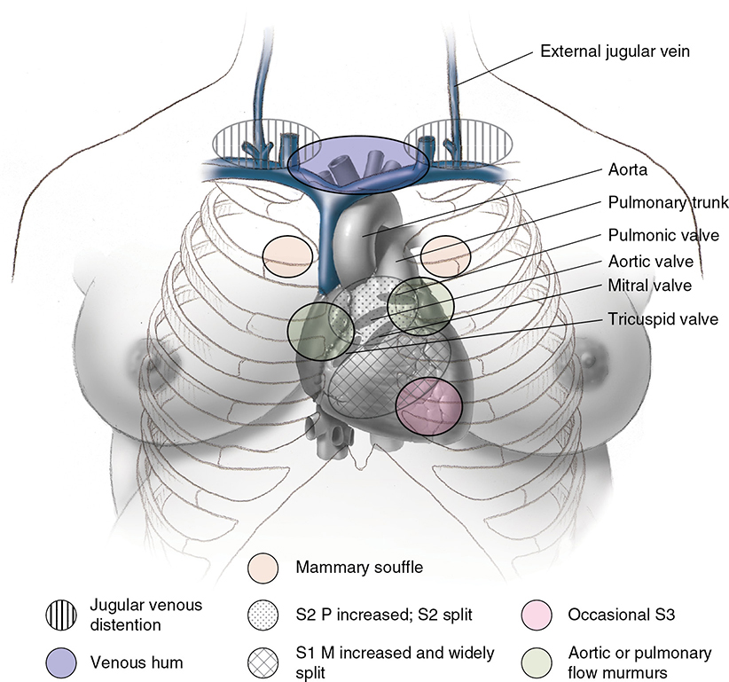
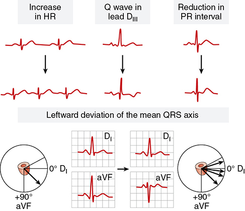
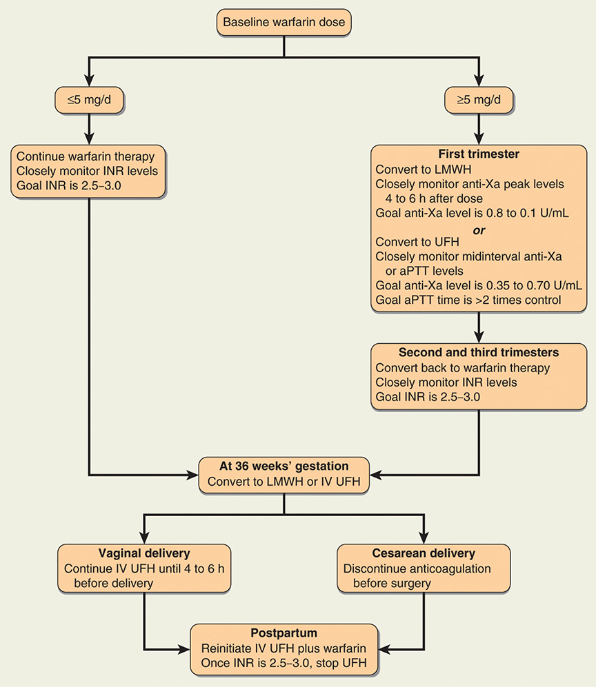
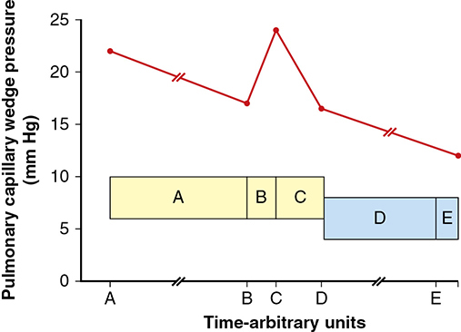
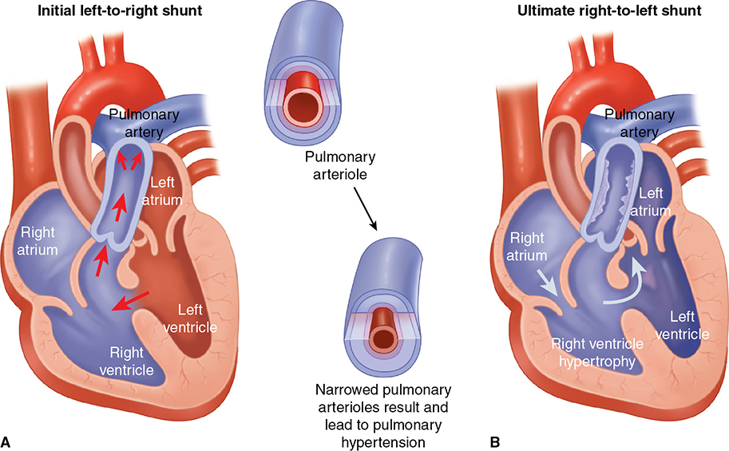
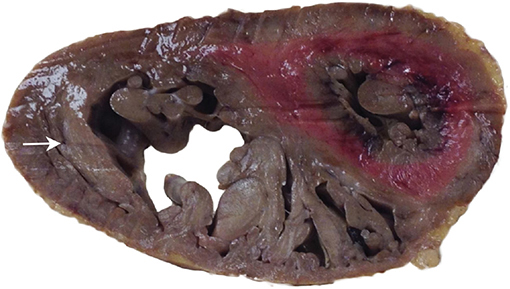
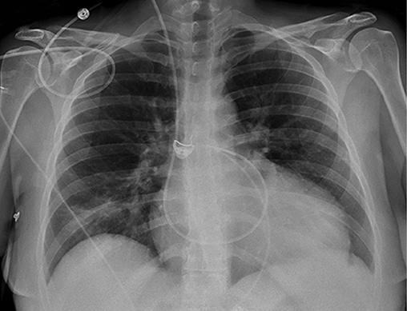

# Chapter 52: Cardiovascular Disorders — Revision Notes

> Williams Obstetrics 26e, pp. 2384–2456 of the PDF. High-yield numbers are in **bold**.
> The nine tables are transcribed from the PDF images (they are missing from the extracted chapter text). All 7 figures are included from the PDF.

**Big picture:** Heart disease complicates **1–4%** of US pregnancies and now causes **~¼ of pregnancy-related deaths** (rising, while hemorrhage, hypertension and embolism deaths fall). Drivers: obesity, hypertension, diabetes, older mothers, and more women with repaired **congenital heart disease** (now the most common type seen). Risk is stratified with the **modified WHO classification**; care is multidisciplinary, vaginal delivery is usually preferred, and the **peripartum and early postpartum period** is when most women decompensate.

---

## 1. Physiological Considerations in Pregnancy

### Cardiovascular physiology
- **Cardiac output ↑ ~40%**; almost **half of the rise occurs by 8 wk**, maximal by midpregnancy.
  - Early: ↑ stroke volume from ↓ vascular resistance.
  - Late: ↑ resting pulse and stroke volume from ↑ end-diastolic volume (hypervolemia). More marked with multifetal pregnancy.
- **Intrinsic LV contractility is unchanged** → pregnancy is **not a hyperdynamic or high-output state**.
- Heart failure timing in women with heart disease: rarely before midpregnancy; after **28 wk** (peak hypervolemia and CO); **most often peripartum** (labor plus preeclampsia, hemorrhage/anemia, sepsis).

### Table 52-1. Hemodynamic Changes in 10 Normal Pregnant Women at Term Compared with Repeat Values Obtained 12 Weeks Postpartum

| Parameter | Change (%) |
|---|---|
| Cardiac output | **+43** |
| Heart rate | +17 |
| Left ventricular stroke work index | +17 |
| Systemic vascular resistance | **−21** |
| Pulmonary vascular resistance | **−34** |
| Mean arterial pressure | +4 |
| Colloid osmotic pressure | −14 |

*Same Clark (1989) data as Table 4-5; there, MAP and LVSWI are listed as "no significant change".*

### Ventricular function
- Ventricular volumes and mass ↑ (↑ end-systolic and end-diastolic dimensions), but **septal thickness and ejection fraction are unchanged**.
- **Eccentric LV mass expansion averages 30–35%** near term; all returns to baseline within a few months.
- Braunwald graph: function is **eudynamic** (appropriate CO for filling pressures).
- Pregnancy causes **spherical** (not longitudinal) remodeling → standard longitudinal-deformation indices look depressed; nonpregnant norms are less accurate.
- 559 nulliparas at term: **chamber diastolic dysfunction 18%**, impaired relaxation **28%**, dyspnea at rest **7.4%** — all recovered by 1 year.
- Cardiac MR: LV mass/EDV ratio shows **concentric remodeling**, resolved by 12 wk postpartum; the RV remodels too → a **mixture of eccentric and concentric remodeling**.

---

## 2. Diagnosis of Heart Disease

- Normal pregnancy mimics heart disease: **functional systolic murmurs** (some loud), accentuated breathing, leg edema after midpregnancy, fatigue and exercise intolerance.

*Figure 52-1. Normal pregnancy auscultation: loud widely split S1, louder split S2 (P2), occasional S3, aortic/pulmonary flow murmurs, mammary souffle, venous hum and jugular distention.*

### Table 52-2. Clinical Indicators of Heart Disease During Pregnancy

| Symptoms | Clinical Findings |
|---|---|
| Progressive dyspnea or orthopnea | Cyanosis |
| Nocturnal cough | Clubbing of fingers |
| Hemoptysis | Persistent neck vein distention |
| Syncope | **Systolic murmur grade 3/6 or greater** |
| Chest pain | **Diastolic murmur** |
| | Cardiomegaly |
| | Persistent tachycardia and/or arrhythmia |
| | Persistent split second sound |
| | **Fourth heart sound** |
| | Criteria for pulmonary hypertension |

> **Pearl:** A diastolic murmur, a systolic murmur ≥3/6, an S4 or cyanosis/clubbing is never "just pregnancy" — get an echocardiogram.

### Diagnostic studies
- **ECG:** average **15° left-axis deviation** (elevated diaphragm); ↑ HR, shorter PR, flattened/inverted T waves, Q wave in lead III. **Voltage unchanged.** Atrial and ventricular premature beats are frequent.

*Figure 52-2. Normal ECG changes of pregnancy: ↑ heart rate, Q wave in lead III, shorter PR interval and leftward QRS axis.*

- **Chest radiograph** (AP + lateral, lead apron → minimal fetal dose): excludes gross cardiomegaly, but slight enlargement is hard to detect because the silhouette is normally larger.
- **Echocardiography** diagnoses most lesions. Normal: slight ↑ chamber size and LV mass, **↑ tricuspid and mitral regurgitation**; **systolic function and EF preserved**. Septal dimension may become abnormal before EF.
- TEE for complex congenital disease. **Cardiac MR:** more reproducible, less hindered by habitus; good for RV, congenital lesions, myocarditis.
- **Exercise stress testing** gives objective functional capacity and detects exercise-induced arrhythmias; 6-minute walk norms exist.
- Nuclear perfusion studies: fetal dose negligible. **Coronary angiography:** mean unshielded abdominal dose **1.5 mGy**, **<20%** reaches the fetus → do it when indicated.

### Functional classification
- **Pregnancy is a stress test** of cardiac reserve; no test measures capacity accurately.

| NYHA class | Description |
|---|---|
| **I** | Uncompromised — **no limitation**; no symptoms or angina |
| **II** | **Slight limitation** — comfortable at rest; **ordinary** activity → fatigue, palpitation, dyspnea, angina |
| **III** | **Marked limitation** — comfortable at rest; **less than ordinary** activity → symptoms |
| **IV** | Severely compromised — **symptoms at rest**, worse with any activity |

- Risk systems: CARPREG I and II, ZAHARA, WHO. **Modified WHO classification = most comprehensive and most accurate** (validated in 2742 women); best for counseling.

### Table 52-3. World Health Organization (WHO) Risk Classification of Cardiovascular Disease and Pregnancy with Management Recommendations

| Risk Category | Associated Conditions | Management |
|---|---|---|
| **WHO 1** — morbidity/mortality risk no higher than general population | Uncomplicated, small or mild: pulmonary stenosis, PDA, mitral valve prolapse with no more than trivial MR. Successfully repaired simple lesions: ostium secundum ASD, VSD, PDA, total anomalous pulmonary venous drainage. Isolated ventricular extrasystoles and atrial ectopic beats | Cardiology consult **once or twice** in pregnancy; **local hospital** care suitable |
| **WHO 2** — small ↑ maternal mortality, moderate ↑ morbidity | If otherwise uncomplicated: unoperated ASD or VSD, repaired Fallot tetralogy, most arrhythmias, Turner syndrome without aortic dilation | Cardiology consult **each trimester**; local hospital care suitable |
| **WHO 2 or 3** — intermediate ↑ mortality, moderate–severe ↑ morbidity | Mild LV impairment, hypertrophic cardiomyopathy, native or tissue valve disease not WHO 1 or 4, Marfan syndrome without aortic dilation, repaired coarctation, prior heart transplantation | Cardiology consult **bimonthly**; care at **referral hospital** |
| **WHO 3** — significantly ↑ mortality, severe ↑ morbidity | **Mechanical valve**, systemic right ventricle, post-Fontan operation, unrepaired cyanotic heart disease, other complex congenital heart disease, moderate LV impairment, **prior peripartum cardiomyopathy with no residual effect**, moderate mitral stenosis, severe asymptomatic aortic stenosis, **moderate aortic dilation (40–50 mm)**, ventricular tachycardia | Cardiology consult **monthly or bimonthly**; care at **tertiary-care hospital** |
| **WHO 4** — very high risk of mortality or severe morbidity; **pregnancy contraindicated**, termination discussed | **Pulmonary arterial hypertension**, severe systemic ventricular dysfunction (**NYHA III–IV or LVEF <30%**), **prior peripartum cardiomyopathy with residual effects**, severe left heart obstruction, severe aortic dilation, severe coarctation, Fontan with residual complications | **Pregnancy contraindicated.** If pregnancy occurs, cardiology consult monthly; tertiary-care hospital |

*Summarized from European Society of Gynecology [sic — Cardiology], 2018; Nanna, 2014; Thorne, 2006.*

> **Memory hook:** WHO 4 = "**PAH, EF <30, PPCM that didn't recover, tight left-sided obstruction, big aorta, bad coarct, failing Fontan**."

---

## 3. General Pregnancy Considerations

### Preconceptional counseling
- Severe disease → MFM/cardiology referral before pregnancy; goal = optimize function.
- Maternal mortality correlates with functional class, but class can change: **4.4%** of class I–II pregnancies worsened significantly.
- Some lesions can be surgically corrected first; with mechanical valves on warfarin, **teratogenicity** dominates.
- Many congenital lesions are **polygenic** → recurrence in offspring (Table 52-4).

### Table 52-4. Risks for Fetal Heart Lesions Related to Affected Family Members

| Cardiac Lesion | Previous Sibling Affected (%) | Father Affected (%) | Mother Affected (%) |
|---|---|---|---|
| Aortic stenosis | 2 | 3 | **15–18** |
| Pulmonary stenosis | 2 | 2 | 6–7 |
| Ventricular septal defect | 3 | 2 | **10–16** |
| Atrial septal defect | 2.5 | 1.5 | 5–11 |
| Patent ductus arteriosus | 3 | 2.5 | 4 |
| Coarctation of the aorta | NS | NS | 14 |
| Fallot tetralogy | 2.5 | 1.5 | 2–3 |
| Marfan syndrome | NS | **50** | **50** |

*NS = not stated.*

> **Pearl:** Recurrence is generally higher when the **mother** (rather than father or sibling) is affected; Marfan is autosomal dominant (50%) either way.

**ACOG maternal risk factors for CVD morbidity/mortality**
1. **Race/ethnicity** (highest in African-American women)
2. **Age >40 y**
3. **Hypertension** (all types)
4. **Obesity** (dose-related)

- Plus social/health disparities (low income, food/housing insecurity) → underuse of prenatal care → ↑ morbidity and mortality.

### Antepartum care
- **Team:** obstetrician, cardiologist, anesthesiologist ± others; early multidisciplinary review for complex lesions. Termination may be advisable in some.
- **NYHA I and most II** women go through pregnancy without morbidity. NYHA III is uncommon (**3%** of ~600 Canadian pregnancies; no class IV).
- Prevent and detect **heart failure** early. **Infection/sepsis** can precipitate decompensation; **endocarditis** is deadly with valve disease → avoid respiratory infections, report infection promptly.
- **Vaccines:** pneumococcal (if not given) and **yearly influenza**.
- **Smoking prohibited**; cocaine/amphetamines harmful; IV drug use ↑ endocarditis. Prolonged hospitalization or bed rest may be needed.

### Labor and delivery
- **Vaginal delivery preferred; induction usually safe.** Planned cesarean gave **no maternal or neonatal advantage** (869 planned vaginal vs 393 planned cesarean, ROPAC).
- Cesarean mainly for obstetric indications. **Simpson's cardiac indications for cesarean:**
  1. **Dilated aortic root >4 cm** or aortic aneurysm
  2. Acute severe congestive heart failure (Parkland prefers medical stabilization then vaginal delivery)
  3. Recent MI
  4. Severe symptomatic aortic stenosis
  5. Emergency valve replacement needed immediately after delivery
  6. **Warfarin within 2 wk of delivery** (fetal liver takes up to 2 wk to clear it → fetal intracranial hemorrhage)
- Labor position: **semirecumbent with lateral tilt**; frequent vitals between contractions.
- ⚠️ **Pulse >100 bpm or RR >24**, especially with dyspnea → impending ventricular failure → immediate intensive medical treatment. Delivery itself may worsen things; emergency cesarean is especially hazardous.
- Invasive (PA catheter) monitoring is rarely needed.

**Analgesia and anesthesia**
- **Continuous epidural recommended for most.** Main danger = **hypotension** — especially with **intracardiac shunts** (flow reversal), **pulmonary hypertension** and **aortic stenosis** (preload dependent). In these: narcotic regional analgesia, low-dose slow-infusion epidural, or general anesthesia.
- Mild disease: epidural + IV sedation; allows forceps/vacuum. Subarachnoid block approached very cautiously. Epidural preferred for cesarean (caution with pulmonary hypertension).

**Intrapartum heart failure**
- **¼ of pregnancy heart-failure cases are intrapartum.** Pain catecholamines and second-stage Valsalva ↑ LV work.
- **Preeclampsia + pre-existing heart disease → 30% risk of heart failure.**
- **Chronic hypertension with superimposed preeclampsia = most frequent cause of heart failure in pregnancy**; many have pre-existing concentric LVH (sometimes covert hypertensive cardiomyopathy). Obesity, hemorrhage/anemia (high output) and sepsis also contribute.
- Treatment: fluid-overload pulmonary edema → **aggressive diuresis**; tachycardia-driven → **β-blocker rate control**. Empirical therapy without understanding the cause is hazardous.

### Puerperium
- Women may decompensate **postpartum** even after an uneventful labor: fluid mobilized into the circulation + ↓ SVR.
- Hemorrhage, anemia, infection and thromboembolism are far more serious; sepsis and severe preeclampsia → capillary leak pulmonary edema. Hypertensive disorders → ↑ **readmission for heart failure within 90 days**.
- **Tubal sterilization after vaginal delivery can be delayed several days** until hemodynamically normal, afebrile, not anemic, ambulatory.
- Contraception crucial (US MEC).

---

## 4. Heart Failure

- Caused by primary structural or functional disorders (e.g., mitral stenosis, pulmonary hypertension, peripartum cardiomyopathy); high perinatal mortality.

### Diagnosis
- Chronic ventricular myopathy with episodic worsening → gradual onset or **acute "flash" pulmonary edema**.
- Onset most likely at the **end of the 2nd/start of the 3rd trimester and peripartum**.
- **Dyspnea is universal**; also orthopnea, palpitations, substernal pain, nocturnal cough, sudden decline in function. Signs: persistent basilar rales, hemoptysis, progressive edema, tachypnea, tachycardia.
- BNP variably ↑. CXR hallmarks: **cardiomegaly and pulmonary edema**.
- **Echo (systolic failure): EF <0.45 and/or fractional shortening <30%, end-diastolic dimension >2.7 cm/m².** Diastolic failure may coexist.

### Management
- **Diuretics** (furosemide = potent venodilator too) → ↓ preload.
- **Afterload reduction: hydralazine, nifedipine** or other vasodilators. ⚠️ **ACE inhibitors withheld until after delivery** (fetal effects).
- **β-blockers ↓ mortality** — **carvedilol** commonly used. **Digoxin** for inotropy (↓ hospitalizations).
- Chronic heart failure → high thromboembolism risk → **prophylactic heparin** often recommended.
- LVADs and ECMO have been used in pregnancy (e.g., fulminant PPCM, pulmonary hypertension).

---

## 5. Surgically Corrected Heart Disease

- Most significant congenital lesions are repaired in childhood. Often **not diagnosed until adulthood: ASD, pulmonic stenosis, bicuspid aortic valve, aortic coarctation.** Ideally repaired before pregnancy.

### Valve replacement before pregnancy
- Maternal mortality **~1.2%** (review); ROPAC: **1.4% mechanical, 1.5% tissue** → **>50× general maternal mortality**.
- **Mechanical valve thrombosis 4.7%.** Event-free pregnancy: **58% mechanical vs 79% tissue**.
- Pregnancy loss **61% mechanical vs 15% bioprosthetic** (417 women).
- Mechanical mitral valve: severe maternal morbidity/mortality **57%** (28 pregnancies).
- **Porcine (tissue) valves are safer** — thrombosis rare, **no anticoagulation needed** — but can deteriorate, last only **10–15 years**, and pregnancy may accelerate the need for replacement.

### Table 52-5. Selected Outcomes in Pregnancies Complicated by Heart-Valve Replacement

| Outcome | Mechanical Valve (n = 212) | Tissue Valve (n = 134) |
|---|---|---|
| Maternal mortality | 3 (1.4) | 2 (1.5) |
| Heart failure | 16 (7.5) | 11 (8.2) |
| Thrombotic complication | **13 (6.1)** | 1 (0.7) |
| Hemorrhagic complication | **49 (23)** | 7 (5.1) |
| Pregnancy loss <24 weeks | **33 (15.6)** | 2 (1.5) |
| Stillbirth | 6 (2.8) | 0 (0) |
| Preterm birth <37 weeks | 29 (18) | 24 (19) |

*Data presented as n (%). The printed heart-failure row reads "162 (7.5)" and "1 (8.2)"; these are misprints for 16 and 11 (7.5% of 212 and 8.2% of 134).*

### Anticoagulation for mechanical valves
- **Warfarin = most effective** against maternal valve thrombosis but is **fetotoxic**; heparin is safer for the fetus but ↑ maternal thromboembolism. Compromise: heparin early, warfarin in 2nd trimester.

### Table 52-6. Maternal and Fetal Composite Outcomes in 800 Women with a Mechanical Heart Valve Receiving Anticoagulation

| Treatment | Maternalᵃ composite adverse outcome (%) | Fetalᵇ composite adverse outcome (%) |
|---|---|---|
| VKA | **5** | **39** |
| LMWH | 16 | 14 |
| LMWHᶜ followed by VKA | 16 | 16 |
| UFHᶜ followed by VKA | 16 | 34 |

*ᵃMaternal death, valve failure, thromboembolism. ᵇMiscarriage, fetal death, congenital malformation. ᶜDuring first trimester. LMWH = low-molecular-weight heparin; UFH = unfractionated heparin; VKA = vitamin K antagonist. (The printed title reads "Heart Value", a typo for Valve.)*

**Warfarin fetal effects** (throughout pregnancy, 71 women): **miscarriage 32%, stillbirth 7%, embryopathy 6%**; highest when dose **>5 mg/d**.
- ACC/AHA: embryopathy **<3% if ≤5 mg/d**; **>8% if >5 mg/d**. At <5 mg/d fetal risk ≈ LMWH.

**Heparin**
- ⚠️ **Low-dose UFH is definitely inadequate** for mechanical valves (high maternal mortality). Even full UFH/LMWH can fail (valve thrombosis), partly from poor compliance/monitoring.
- Full-dose targets: **aPTT ≥2× control**, or **anti-Xa 0.8–1.2 U/mL 4–6 h postdose** (LMWH).
- Warfarin and LMWH have fewer valve thromboses than SC UFH; therapeutic SC UFH is hard to achieve in pregnancy (low peaks).
- **All regimens add aspirin 75–100 mg/d.**

*Figure 52-3. Mechanical-valve anticoagulation algorithm: warfarin ≤5 mg/d → continue (INR 2.5–3.0); >5 mg/d → LMWH or UFH in 1st trimester, then warfarin; all switch to LMWH/IV UFH at 36 wk. The printed LMWH anti-Xa goal "0.8 to 0.1 U/mL" is a typo for 0.8–1.2 U/mL (as in the text).*

**Delivery and postpartum**
- **Schedule delivery** to allow controlled stopping/partial reversal and regional anesthesia (epidural hematoma risk). Bleeding while heparinized → **protamine sulfate IV**; regional may not be possible.
- **Restart anticoagulation:** **6 h after vaginal delivery**; after cesarean, ACOG says **6–12 h** (Parkland waits **≥24 h**). After 1st-trimester D&C, heparin immediately.
- **Warfarin, LMWH and UFH are all compatible with breastfeeding.**

### Cardiac surgery during pregnancy
- Usually postponed; may be lifesaving but carries major morbidity. 23 urgent valve surgeries: 2 maternal and 10 fetal deaths (all <28 wk); only 6 term births.
- **Cardiopulmonary bypass in pregnancy: maternal mortality 11%, fetal loss 33%** (154 women).
- Optimize: elective when possible; **pump flow >2.5 L/min/m², perfusion pressure >70 mm Hg, hematocrit >28%**.

### Pregnancy after heart transplantation
- Not discouraged if **stable and >1 year post-transplant** (ISHLT). The transplanted heart adapts normally.
- 103 pregnancies: **~½ hypertension**, **11% rejection episode**, cesarean at mean **37 wk**. ≥16 women died >2 years postpartum (limited life expectancy), though pregnancy itself may not worsen survival.

---

## 6. Valvular Heart Disease

- Rheumatic fever is uncommon in the US but remains the **chief cause of serious mitral disease** in the nonindustrialized world.

### Table 52-7. Major Cardiac Valve Disorders

| Type | Cause | Pathophysiology | Pregnancy |
|---|---|---|---|
| **Mitral stenosis** | Rheumatic valvulitis | LA dilation and passive pulmonary hypertension; atrial fibrillation | **Heart failure from fluid overload, tachycardia** |
| Mitral insufficiency | Rheumatic valvulitis, mitral valve prolapse, LV dilation | LV dilation and eccentric hypertrophy | **Ventricular function improves with afterload decrease** |
| **Aortic stenosis** | Congenital bicuspid valve | LV concentric hypertrophy, ↓ cardiac output | Moderate stenosis tolerated; **severe is life-threatening with ↓ preload** (e.g., obstetrical hemorrhage or regional analgesia) |
| Aortic insufficiency | Rheumatic valvulitis, connective tissue disease, congenital | LV hypertrophy and dilation | **Ventricular function improves with afterload decrease** |
| Pulmonary stenosis | Rheumatic valvulitis, congenital | Severe stenosis associated with RA and RV enlargement | Mild usually well tolerated; severe → right heart failure and atrial arrhythmias |

*LA = left atrium; LV = left ventricle; RA = right atrium; RV = right ventricle.*

> **Memory hook:** "**Stenosis = trouble, regurgitation = relief.**" Pregnancy's ↓ SVR helps regurgitant lesions; stenotic lesions have a fixed output and cannot handle the volume and heart-rate load.

### Mitral stenosis
- Mostly **rheumatic**. Normal valve area **4.0 cm²**; symptoms when **<2.5 cm²**.
- LA dilates, LA pressure ↑ → **pulmonary hypertension**; **relatively fixed cardiac output** → ↑ preload of pregnancy → pulmonary edema.
- **Heart failure first appears in pregnancy in ¼** of women with MS. Symptoms: dyspnea, fatigue, palpitations, cough, **hemoptysis**. Murmur may be missed → confused with **peripartum cardiomyopathy** at term.
- **Tachycardia** shortens diastolic filling and ↑ the mitral gradient → pulmonary edema → **prophylactic β-blockers** for sinus tachycardia.
- **Atrial fibrillation** is common → mural thrombus → stroke; atrial thrombus can form even in sinus rhythm.

**Outcomes**
- Greatest risk if valve area **<2 cm²**. 273 gravidas: **43% heart failure**; severe MS → half had heart failure. **FGR more common if area <1.0 cm².**
- Rheumatic disease (486 pregnancies): **8 of 10 maternal deaths in NYHA III–IV**.

**Management**
- Limit activity; if congestion → further restriction, **sodium restriction, diuretics, β-blocker**.
- **New AF: IV verapamil 5–10 mg or electrocardioversion.** Chronic AF: digoxin, β-blocker or calcium-channel blocker.
- **Therapeutic anticoagulation** for persistent AF, LA thrombus and/or prior embolism.
- **Surgery** for symptomatic severe MS, or area **1.5–2.0 cm²** with recurrent embolism or severe pulmonary hypertension. **Balloon valvuloplasty preferred if the valve is pliable** (71 women: **98% NYHA I–II** by delivery).
- **Labor:** **epidural ideal**; avoid fluid overload — manage on the **"dry" side**. Contractions ↑ CO (autotransfusion) → ↑ wedge pressure.
- ⚠️ **Wedge pressure rises immediately postpartum** (loss of low-resistance placenta + autotransfusion from the contracted uterus and legs) → **pulmonary edema right after delivery**.
- Vaginal delivery preferred; **elective induction** reasonable (scheduled experienced team). PA catheter may help with severe MS and chronic failure.

*Figure 52-4. Wedge pressure in 8 women with mitral stenosis: high in labor and peaking 5–15 minutes postpartum (C), far above normal ranges (boxes).*

### Mitral insufficiency
- Trivial MR is normal. Abnormal MR → LV dilation and eccentric hypertrophy.
- **Acute:** chordae rupture, papillary muscle infarction, endocarditis perforation. **Chronic:** rheumatic, connective tissue disease, MVP, LV dilation (dilated cardiomyopathy); rarely calcified annulus, appetite suppressants, ischemia.
- **Libman-Sacks endocarditis** (mitral vegetations) with **antiphospholipid antibodies** ± SLE.
- **Well tolerated in pregnancy** (↓ SVR → less regurgitation). Moderate–severe MR: **23% heart failure** (117 women).

### Mitral valve prolapse
- **Myxomatous degeneration** of leaflets, annulus or chordae; MR may develop.
- Mostly asymptomatic; symptoms = anxiety, palpitations, atypical chest pain, exertional dyspnea, syncope.
- **Rarely complicates pregnancy**; hypervolemia may even improve alignment. **β-blockers** for symptomatic women (↓ chest pain, palpitations, arrhythmia risk).

### Aortic stenosis
- **Congenital bicuspid valve = most common cause** in young US women.
- Normal area **3–4 cm²**, gradient <5 mm Hg. **Severe obstruction if <1 cm²** → concentric LVH → ↑ end-diastolic pressure, ↓ EF and CO.

| Severity | Peak velocity | Mean gradient |
|---|---|---|
| Mild | 2–2.9 m/s | <20 mm Hg |
| Moderate | 3–3.9 m/s | 20–39 mm Hg |
| **Severe** | **≥4 m/s** | **≥40 mm Hg** |

- Late signs: **chest pain, syncope, heart failure, sudden death**. Mortality **1%/yr asymptomatic vs 25%/yr symptomatic** → replace valve if symptomatic.
- **Pregnancy:** mild–moderate tolerated; **severe → ~6% mortality**. Problem = **fixed CO**, worsened by anything that ↓ preload: caval compression, regional analgesia, sepsis, hemorrhage. Complications ↑ if area **<1.5 cm²**.
- **Management:**
  - Asymptomatic → observation only. Symptomatic → strict activity limitation, cautious diuretics; surgery or preterm delivery if symptoms persist.
  - Balloon valvuloplasty: maternal/fetal risk, poor durability. Valve replacement on bypass → fetal death risk. TAVR: little pregnancy experience.
  - ACC/AHA/ESC: **delay conception until severe AS is corrected**.
  - **Delivery route:** uncorrected severe **symptomatic** AS → **cesarean**; asymptomatic severe → individualize; nonsevere → **vaginal**.
  - **Labor: keep on the "wet" side** (margin for hemorrhage); avoid ↓ preload (→ hypotension, syncope, MI, sudden death). Pulmonary edema rare if the mitral valve is competent.
  - **Narcotic or low-dose, slow, dilute epidural** (epidural drops filling pressures profoundly).
  - Operative vaginal delivery if dizziness, dyspnea or tachycardia with pushing.

> **Memory hook:** "**Mitral stenosis — keep them DRY and SLOW; aortic stenosis — keep them WET and FULL.**"

### Aortic insufficiency
- Causes: rheumatic, connective tissue disease, congenital; **Marfan** (root dilation); acute with endocarditis or dissection; **fenfluramine/dexfenfluramine, cabergoline, pergolide** (also MR).
- Chronic → LVH and dilation → slow fatigue/dyspnea then rapid deterioration.
- **Generally well tolerated** (↓ SVR helps). Heart failure → diuretics and bed rest.

### Pulmonic stenosis
- Usually congenital; linked with **Fallot tetralogy, Noonan syndrome**.
- Severe → right heart failure or atrial arrhythmias. Correct before pregnancy; **balloon valvuloplasty** antepartum if symptoms progress.
- 81 pregnancies: few cardiac complications, but **preterm 17%, hypertension 15%, thromboembolism 4%**.

---

## 7. Congenital Heart Disease

- US incidence **~1.9% of live births** (half moderate–severe). **~90% survive to childbearing age** → now the **most common heart disease in pregnancy**.
- Delivery admissions with CHD: **6.4 → 9.0 per 10,000** (2000–2010).
- Obstetric/perinatal complications **2–3× ↑**. Maternal mortality **178 vs 7 per 100,000**.

### Atrial septal defects
- **PFO** (flap in the fossa ovale) in **~¼ of adults**. PFO-related stroke risk probably higher in pregnancy (hypercoagulability). **Preventive PFO repair not recommended.**
- **ASD = true hole**; **secundum type 70%**, often with myxomatous mitral prolapse. Usually asymptomatic until the **3rd–4th decade**; repair if found in adulthood.
- **Unrepaired ASD is well tolerated** unless pulmonary hypertension (uncommon). Treat heart failure or arrhythmia medically. **Endocarditis risk negligible.**
- **Paradoxical embolism** (venous clot → ASD → stroke): **filters on IV lines**. Routine anticoagulant prophylaxis is problematic; if immobile or other VTE risk → **compression stockings + prophylactic heparin**.

### Ventricular septal defects
- **90% close spontaneously** in childhood; most are **paramembranous**.
- Defect **<1.25 cm²** → no pulmonary hypertension or heart failure. Defect larger than the aortic orifice → rapid symptoms.
- Unrepaired large VSD in adults → LV failure, pulmonary hypertension, **high endocarditis risk** (prophylaxis often required).
- Small–moderate shunts are well tolerated. If PA pressure reaches systemic → **Eisenmenger** → pregnancy not advisable.
- **16% of offspring have a VSD.**

### Atrioventricular septal defects
- Common ovoid AV junction; **~3%** of cardiac malformations; linked with **aneuploidy** and Eisenmenger.
- More complications than simple defects (48 pregnancies): **NYHA deterioration 23%, arrhythmias 19%, heart failure 2%; CHD in 15% of offspring.**

### Persistent (patent) ductus arteriosus
- Connects proximal left pulmonary artery to descending aorta distal to the left subclavian.
- Unrepaired: if systemic BP falls, flow reverses → pulmonary hypertension, heart failure, cyanosis. ⚠️ **Sudden hypotension at delivery (regional analgesia, hemorrhage) → fatal collapse** → avoid hypotension, treat vigorously.
- **Endocarditis prophylaxis at delivery** for unrepaired defects. Inheritance **~4%**.

### Cyanotic heart disease
- Right-to-left shunting past the lungs. **Fallot tetralogy = most common in adults and pregnancy**: large **VSD, pulmonary stenosis, RVH, overriding aorta**.
- **Shunt varies inversely with SVR** → ↓ SVR in pregnancy → ↑ shunt → **worse cyanosis**. Eisenmenger = greatest risk.
- **Uncorrected Fallot: maternal mortality ~10%.**
- Chronic hypoxemia + polycythemia → miscarriage and perinatal morbidity. ⚠️ **Hb >20 g/dL → pregnancy wastage ~100%.**
- **Repaired Fallot** (197 pregnancies): well tolerated, **no maternal deaths**, but **~9%** adverse cardiac events (arrhythmias, heart failure).
- **Ebstein anomaly:** malpositioned tricuspid valve, small RV, huge RA; right heart failure, **very preload dependent**, hypervolemia ↑ TR; arrhythmias esp. **WPW**. Vaginal delivery preferred; well tolerated without cyanosis, failure or arrhythmia.

### Pregnancy after surgical repair
- **Transposition after arterial switch:** good outcomes; main concern **exercise-induced fatal arrhythmias** (heart failure 3/20; no events in 25 in another series).
- Repaired truncus arteriosus and double-outlet RV: successful, although eventful, pregnancies. Counseling rarely dissuaded childbearing.
- **Single functional ventricle / Fontan** (vena cava → pulmonary artery, bypassing the RV; flow is passive, **preload-driven**, volume-sensitive). 255 pregnancies:
  - **Miscarriage 45%**, elective termination 7%
  - Arrhythmias 8%, heart failure 4%
  - **Preterm birth 59%**, perinatal death 6% of live births
  - Postpartum **VTE** common. Systemic RV has similar complications.

### Eisenmenger syndrome
- **Secondary pulmonary hypertension from any cardiac shunt** — most often **ASD, VSD, PDA**. PVR exceeds SVR → **right-to-left shunt**.
- **Tolerates hypotension poorly**; death from **RV failure with cardiogenic shock**.
- **Maternal mortality 36%** (73 pregnancies); most deaths **intrapartum or within 1 month postpartum**. Other series: 1/13 died; 4/11 died.
- ⚠️ **Absolute contraindication to pregnancy** (ACOG).

*Figure 52-5. Eisenmenger syndrome: an initial left-to-right VSD shunt remodels and narrows pulmonary arterioles → pulmonary hypertension → shunt reverses to right-to-left with RV hypertrophy.*

---

## 8. Pulmonary Hypertension

- Normal mean PA pressure **12–16 mm Hg**; **pulmonary hypertension = resting mean PA pressure >25 mm Hg**.
- Normal late-pregnancy PVR **~80 dyn·s·cm⁻⁵ (34% below nonpregnant 120)**. In pulmonary hypertension the stiff vasculature **can't lower PVR** → ↑ CO raises PA pressure → **right heart failure**; septum bulges left → ↓ LV filling and CO.
- **Group 1 (PAH)** = arteriolar disease: idiopathic/primary, or with connective tissue disease (**~⅓ of scleroderma, 10% of SLE**), HIV, sickle cell, thyrotoxicosis.
- **Group 2 (left heart disease) is the most common in pregnancy** — e.g., mitral stenosis. Groups 3–5 are infrequent in young women.

### Table 52-8. Comprehensive Clinical Classification of Pulmonary Hypertension of the European Society of Cardiology and the European Respiratory Society

| Group | Disorders |
|---|---|
| **1. Pulmonary arterial hypertension** | Idiopathic; heritable; drug and toxin induced; associated with connective tissue disease, HIV infection, portal hypertension, congenital heart diseases, schistosomiasis |
| 1′. Pulmonary venoocclusive disease and/or pulmonary capillary hemangiomatosis | Idiopathic; heritable; drugs, toxins and radiation induced; associated with connective tissue disease, HIV infection |
| 1″. Persistent pulmonary hypertension of the newborn | — |
| **2. Due to left heart disease** | LV systolic dysfunction; LV diastolic dysfunction; valvular disease; congenital/acquired left heart inflow/outflow tract obstruction and congenital cardiomyopathies; congenital/acquired pulmonary vein stenosis |
| 3. Due to lung diseases and/or hypoxia | COPD; interstitial lung disease; other mixed restrictive/obstructive diseases; sleep-disordered breathing; alveolar hypoventilation; chronic high-altitude exposure; developmental lung diseases |
| 4. Chronic thromboembolic pulmonary hypertension / other pulmonary artery obstructions | CTEPH; other obstructions (tumors, arteritis, pulmonary stenosis, parasites) |
| 5. Unclear and/or multifactorial mechanisms | Hematological (chronic hemolysis, myeloproliferative disorders, splenectomy); systemic (sarcoidosis, pulmonary histiocytosis, neurofibromatosis); metabolic (glycogen storage disease, Gaucher disease, thyroid disorders); others (fibrosing mediastinitis, chronic renal failure) |

*HIV = human immunodeficiency virus. Adapted from Galiè, 2016. (The printed "Sleep-disoriented breathing" means sleep-disordered breathing.)*

### Diagnosis and prognosis
- **Exertional dyspnea** most frequent; orthopnea and PND with group 2. **Angina and syncope = fixed RV output → advanced disease.**
- CXR: enlarged hilar arteries, attenuated peripheral markings.
- Echo estimates PA pressure but **overestimates it in ~⅓** of pregnant women; **cardiac catheterization is the standard**.
- Final common path = right heart failure and death; **average survival <4 years** after diagnosis (depends on cause and severity).

### Pregnancy
- Mortality worst with **idiopathic PAH**. Overall: **38% (decade to 1996) → 25% (decade to 2007)**; **~80% of deaths in the first month postpartum**.
- **Group 1: 23% mortality vs 5% for other groups.** Risk ↑ with Eisenmenger, severe hypertension, higher NYHA class.
- Parkland audit (47 pregnancies): **9% maternal mortality**, 3 of 4 deaths with severe disease.
- **Pregnancy contraindicated with severe disease** (especially group 1). Mild–moderate (often group 2) may tolerate pregnancy, labor and delivery well.

*Figure 52-6. Heart of a gravida who died of undiagnosed primary pulmonary hypertension: dilated, hypertrophied right ventricle (arrow).*

### Management
- Limit activity; **avoid supine position** late. **Diuretics, supplemental O₂, pulmonary vasodilators**; some anticoagulate.
- **Prostacyclin analogues:** epoprostenol, treprostinil (parenteral), iloprost (inhaled). **Inhaled nitric oxide** for acute decompensation. **Sildenafil** (PDE-5 inhibitor) dilates pulmonary vessels and supports the RV.
- ⚠️ **Bosentan (endothelin-receptor antagonist) and riociguat are contraindicated** (teratogenic).
- **Labor:** O₂ to keep **saturation >90%**. Greatest danger = ↓ venous return/RV filling → meticulous **epidural induction, fluids, and prevention/treatment of blood loss** to avoid hypotension.

---

## 9. Cardiomyopathies

- Heterogeneous myocardial diseases with mechanical and/or electrical dysfunction; **most often genetic**.
- **Primary** (heart-confined): hypertrophic, dilated, peripartum. **Secondary** (systemic): diabetes, SLE, chronic hypertension, thyroid disease.

### Hypertrophic cardiomyopathy
- **~1 in 500 adults.** Hypertrophy, myocyte disarray, fibrosis. **Up to 60% sarcomere-gene mutations, autosomal dominant**; 5–10% other causes; ~25% unknown.
- LV hypertrophy with **LV outflow pressure gradient**. Diagnosis: **echo showing hypertrophied, nondilated LV** without another cause.
- Mostly asymptomatic; dyspnea, angina, syncope, arrhythmias. **Sudden death = most frequent cause of death** (especially asymptomatic runs of VT). Symptoms worsen with exercise.
- Pregnancy prognosis relatively good: **maternal mortality 0.5%** (408 pregnancies); worsening **29%**, preterm **26%**.
- **Manage like aortic stenosis:** control heart rate; **avoid ↓ preload and ↓ afterload**; no strenuous exercise; avoid abrupt position changes. Symptoms/angina → **β-blocker or calcium-channel blocker**. Avoid diuretics and vasodilators (monitor closely if needed).
- Delivery route by obstetric indications. Anesthesia controversial (some prefer general); regional OK with careful titration and adequate volume. Neonates rarely show the lesion at birth.

### Dilated cardiomyopathy
- LV and/or RV enlargement with ↓ systolic function, no coronary, valvular, congenital or systemic cause. **Etiology unknown in ~½**.
- Causes: viral myocarditis, HIV; potentially reversible — **alcohol, cocaine, COVID-19, thyroid disease**.
- **Major adverse cardiac events in pregnancy 25–40%** (heart failure, arrhythmias); worst with moderate–severe LV dysfunction or NYHA III–IV. Standard heart-failure therapy.

### Peripartum cardiomyopathy (PPCM)
- Nonischemic dilated cardiomyopathy linked to pregnancy; shares genetic predisposition with idiopathic DCM. **Diagnosis of exclusion.**
- **NHLBI diagnostic criteria (Pearson, 2000):**
  1. Cardiac failure in the **last month of pregnancy or within 5 months after delivery**
  2. **No identifiable cause** of heart failure
  3. **No recognizable heart disease before the last month** of pregnancy
  4. **LV systolic dysfunction on echo** (↓ EF or fractional shortening with a dilated LV)
- **Incidence ~1 per 1000–4000 births** (US).

*Figure 52-7. Peripartum cardiomyopathy: enlarged heart with mild perihilar opacification (pulmonary edema).*

**Pathogenesis — "two-hit hypothesis"**
- Hit 1: **genetic susceptibility** (TTNC1, TTN, STAT3 mutations).
- Hit 2: late-pregnancy **prolactin** surge → cleaved to a **16-kDa fragment (vasoinhibin)** that damages myocardium; worsened by placental **sFlt-1** (antiangiogenic; high with **preeclampsia and multifetal pregnancy**).
- → Rationale for **bromocriptine** and for **proscribing breastfeeding**.
- Hypertensive disorders frequently coexist; link to preeclampsia via antiangiogenic factors.

**PPCM vs hypertensive heart failure (Ntusi)**

| | PPCM | Hypertensive heart failure |
|---|---|---|
| Onset | **All postpartum** | **85% antepartum** |
| Associations | **Twins, smoking**, echo abnormalities | Family history of hypertension, prior hypertension/preeclampsia, **LVH** |

**Management**
- As for heart failure: treat volume overload, **afterload reduction**, rhythm control, inotropes; **β-blockers ↓ mortality**.
- **LMWH anticoagulation when EF reaches 30–35%** (LV thrombus risk).
- **Bromocriptine:** pilot study → better recovery and ↓ mortality, but a larger study (115) showed no difference → **still experimental**.

**Prognosis**
- **~½ recover baseline function within 6 months** (fewer if obese).
- 100 women: **72% had EF ≥50% at 1 year**; recovery **~90% if baseline EF ≥30%** vs **<40% if baseline EF <30%**. Event-free survival 93% at 1 year.
- **Baseline EF <34% and BNP >1860 pg/mL → ~3× risk** of persistent dysfunction.
- **Mortality 5–10% at 1 year** with persistent failure. Long-term: lower EF, less exercise capacity, subtle diastolic dysfunction even if asymptomatic.

**Subsequent pregnancy**
- **~⅓ relapse** (worse symptoms and LV function). Much higher risk if LV dysfunction persists; even with normalized function **~20%** deteriorate.

### Other cardiomyopathies
- **Arrhythmogenic RV dysplasia:** fibrofatty replacement of RV myocardium; **1 in 5000**; ventricular tachyarrhythmias and **sudden death** in the young. Heart failure/symptoms in **18–33%** of pregnancies; **counsel against pregnancy**.
- **Restrictive cardiomyopathy:** least common; stiff ventricle, small filling volume. **Pregnancy not advised.**
- **Takotsubo:** acute reversible **LV apical ballooning**, "stress-induced"; more common with **preeclampsia and cesarean**. Exclude MI.

---

## 10. Infective Endocarditis

- Highest risk: **congenital heart lesions, IV drug use, degenerative valve disease, intracardiac devices**.

| Setting | Usual organisms |
|---|---|
| Subacute, native valve | **Viridans streptococci**, *Staphylococcus*, *Enterococcus* |
| IV drug use, catheter-related | ***Staphylococcus aureus*** |
| Prosthetic valve | ***Staphylococcus epidermidis*** |
| Acute fulminant (occasionally) | *S. pneumoniae*, *N. gonorrhoeae* (also other *Neisseria*, GBS, *E. coli* in pregnancy) |

### Diagnosis and management
- **Fever (± chills) 80–90%; murmur up to 85%**; anorexia, fatigue. Clues: anemia, proteinuria, embolic signs (petechiae, focal neuro, chest/abdominal pain, limb ischemia); heart failure.
- **Duke-Li criteria** (microbiology + imaging + minor criteria).
- Transthoracic echo may miss lesions **<2 mm or on the tricuspid valve** → **TEE**. ⚠️ **A negative echo does not exclude endocarditis.**
- Treatment mainly medical per organism and sensitivities; **valve replacement** for recalcitrant bacteremia or valve-related heart failure.

### Pregnancy
- Uncommon: **~1 in 16,000 births** (Parkland, earlier era); may rise with the opioid epidemic.
- **Maternal and fetal mortality 25–35%.** Review of 51: IV drug use 14%, CHD 12%, rheumatic 12%; **streptococci 43%, staphylococci 26%**; maternal mortality **11%**.

### Endocarditis prophylaxis
- **AHA — prophylaxis for dental procedures only in:**
  1. **Prosthetic valve** or prosthetic material used in valve repair
  2. **Prior endocarditis**
  3. **Unrepaired cyanotic heart defect**, or repaired lesion with residual defect at prosthetic sites
  4. **Valvulopathy after heart transplantation**
- **ACOG: no prophylaxis for vaginal or cesarean delivery** (without pelvic infection) **except in these high-risk lesions**. Highest risk = cyanotic disease and/or prosthetic valves.
- Give **30–60 min before anticipated delivery**, if not already on antibiotics covering endocarditis.

### Table 52-9. Single-Dose Antibiotic Prophylaxis for Infective Endocarditis in High-Risk Patients

| Guideline | Standard | Penicillin-allergic | Oral |
|---|---|---|---|
| **ACOG (2018b)** | IV **ampicillin 2 g** *or* **cefazolin or ceftriaxone 1 g** | IV **cefazolin or ceftriaxone 1 g** *or* **clindamycin 600 mg** | **Amoxicillin 2 g** |
| **AHA/ESC (Karchmer, 2018)** | **Amoxicillin 2 g PO** *or* ampicillin 2 g IV or IM | Clarithromycin or azithromycin 500 mg PO; cephalexin 2 g PO; clindamycin 600 mg PO, IV or IM; *or* cefazolin or ceftriaxone 1 g IV or IM | — |

*IM = intramuscularly; IV = intravenously; PO = orally. Cefazolin or ceftriaxone given 30 minutes, and all others given 1 hour, prior to procedure.*

---

## 11. Arrhythmias

- Pre-existing and new arrhythmias are common and usually benign; incidence rising. Possible reasons: estradiol/progesterone are **proarrhythmic**, estrogen ↑ myocardial adrenergic receptors, mild **hypokalemia**, ↑ HR, more detection.

### Bradyarrhythmias
- **Complete heart block is compatible with successful pregnancy**; some have syncope in labor → **temporary pacing** occasionally.
- Permanent pacemakers well tolerated (fixed-rate: CO ↑ via stroke volume).
- **Surgery with implanted devices:** cardiology consult; **bipolar electrosurgery or Harmonic scalpel** (or minimal monopolar settings); continuous cardiac and pulse-oximetry monitoring; arrhythmia contingency plans; keep **active and return electrodes close together** (avoid stray current and myocardial burns).

### Supraventricular tachycardias
- **Paroxysmal SVT = most common arrhythmia in reproductive-age women**; **24 per 100,000** admissions; **~20%** have symptomatic exacerbations in pregnancy.
- Mean HR **184 bpm in pregnancy vs 166** nonpregnant. ~½ have first onset in pregnancy. Maternal SVT → **2× septal defects** (esp. secundum ASD) in offspring.
- **Acute treatment (stepwise):**
  1. **Vagal maneuvers** (Valsalva, carotid sinus massage, bearing down, face in ice water)
  2. **IV adenosine** — safe and effective in stable gravidas (transient fetal bradycardia reported)
  3. **IV metoprolol or propranolol** if adenosine fails/contraindicated
  4. **IV verapamil** if adenosine and β-blockers fail
  5. **IV procainamide**
  6. **IV amiodarone** for life-threatening SVT when others fail
- **Unstable → synchronized cardioversion** (standard energy; not contraindicated; one case of sustained uterine contraction + fetal bradycardia). **ICDs work normally in pregnancy.**
- If cardioversion fails or thrombus → long-term anticoagulation + rate control.
- **New AF/flutter** (rare in pregnancy) → search for cause: cardiac anomaly, **hyperthyroidism**, PE, drug toxicity, electrolytes. Risk: embolic stroke; with MS → pulmonary edema. Unstable → cardioversion and rate control.
- **WPW:** pregnancy unmasks arrhythmias (½ first SVT, ½ more frequent attacks); ablation sometimes. **Ebstein anomaly → WPW.**

### Ventricular tachycardia
- Uncommon but potentially fatal; most pregnant cases have **no structural disease**; triggered by exercise or stress (also MI, long QT, anesthesia). **β-blockers** for control.
- ARVD may cause VT. **Unstable → emergency cardioversion at standard adult energy.**

### Prolonged QT interval
- **Long QT = most frequent inherited channelopathy** → **torsades de pointes**.
- Cardiac events ↑ **postpartum, not during pregnancy** (↑ HR may protect).
- **β-blockers (preferably propranolol) continued throughout pregnancy and puerperium.**
- ⚠️ QT-prolonging drugs: **erythromycins, many antiemetics, methadone**.
- **~8× stillbirth risk.**

---

## 12. Diseases of the Aorta

### Aortic dissection
- **Half of dissections in young women are pregnancy-related.** Risk factors: **Marfan, coarctation**, bicuspid aortic valve, **Turner, Noonan, Loeys-Dietz, Ehlers-Danlos**.
- Intimal tear → hemorrhage into media → rupture.
- **Ripping/tearing chest pain**; ↓ or absent peripheral pulses + **new aortic regurgitation murmur**.
- Differential: MI, PE, pneumothorax, aortic valve rupture, **abruption, uterine rupture**.
- CXR abnormal in **>90%**. Angiography most definitive; sonography, CT and MR more often used.
- Treatment: lower BP first. **Proximal dissection → resection** ± valve replacement; distal often medical.

### Marfan syndrome
- **Autosomal dominant**, **1 in 3000–5000**, **FBN1 (fibrillin)** mutations (>1000). Joint laxity, scoliosis; aortic dilation → AR; MVP; endocarditis.
- **Main pregnancy concern = aortic dissection**: **~1.8–1.9%** (339 deliveries: 1 death; UK 258 pregnancies: no deaths).
- Normal aortic root **~2 cm** (slight expansion in pregnancy).

| Aortic root / ascending aorta | Recommendation |
|---|---|
| Repair (nonpregnant) | **4.0–4.5 cm** |
| ACC/AHA/AATS | **Prophylactic repair before pregnancy if >4 cm** |
| ESC | Repair if **>4.5 cm** (also consider height-indexed thresholds) |
| **<4 cm** | **Vaginal delivery**, regional analgesia, assisted second stage |
| **4.0–4.5 cm** | **Consider cesarean** |
| **>4.5 cm** | **Elective cesarean**; consider proximal aortic graft replacement |

- **Echo of ascending aorta monthly or bimonthly** in pregnancy with known dilation.
- **Prophylactic β-blockers are standard** (↓ aortic wall stress and dilation rate). Deliver where **cardiothoracic surgery** is available.
- Root replacement in pregnancy reported (fetal HIE reported). Type A dissection repaired at emergency cesarean described.
- Obstetric outcomes (111 pregnancies >20 wk): **preterm 15%, PPROM 5%**, 8 perinatal deaths; **½ of surviving infants had Marfan**.

### Aortic coarctation
- Narrowed aorta; **¼ have bicuspid aortic valve**, **10% cerebral (circle of Willis) aneurysms**; also PDA, septal defects, **Turner syndrome**.
- **Rib notching** from hypertrophied intercostal collaterals. **Upper-limb hypertension with normal/low leg pressures.** MR imaging diagnoses it in pregnancy.
- **No adverse outcomes if minimum coarctation diameter >15 mm** (risk inversely related to diameter).
- Complications: **heart failure, endocarditis of bicuspid valve, aortic rupture** (late pregnancy/early puerperium), **cerebral hemorrhage**.
- **β-blockers** for hypertension. **WHO: severe coarctation precludes pregnancy.**
- 188 pregnancies: ⅓ hypertension; 1 death from dissection at 36 wk. 700 deliveries: hypertensive complications **3–4× ↑**; adverse CV outcome **~5% vs 0.3%**; cesarean **41% vs 26%**.
- Heart failure → vigorous treatment, possibly pregnancy interruption; resection in pregnancy is risky (collateral clamping → fetal hypoperfusion).

---

## 13. Ischemic Heart Disease

- Classic risk factors: family history, diabetes, smoking, hypertension, hyperlipidemia, obesity.
- **~10 per 100,000** pregnancy/postpartum hospitalizations; **acute MI risk ~3× nonpregnant** women of similar age.

### Acute coronary syndrome
- Causes: atherosclerosis, **dissection**, embolism, spasm, arteritis.
- **MI mortality 5.1%** (859 pregnancies) — higher than nonpregnant. ⚠️ **MI <2 weeks before delivery → highest death risk.**
- Review of 150: mostly **3rd trimester or postpartum**; **~¾ STEMI**. Mechanisms: **spontaneous coronary artery dissection 43%**, atherosclerosis 27%. Complications: heart failure 38%, recurrent angina/MI 19%, ventricular arrhythmias 12%. **Maternal mortality 7%, fetal 5%.**
- Diagnosis as in nonpregnant: clinical picture, ECG, **high-sensitivity troponin I** (higher in preeclampsia/hypertension). **Coronary angiography = gold standard** (esp. for SCAD) — do it promptly.
- Treatment as nonpregnant; **PTCA and stenting** done successfully in pregnancy. If healed: cesarean for obstetric reasons only; **epidural ideal**.

### Prior ischemic heart disease
- Progressive and usually with hypertension/diabetes → pregnancy seems inadvisable.
- Prior remote MI (30 pregnancies): no deaths; 4 heart failure, 4 worse angina. **Diabetes-associated ischemic disease: 8 of 17 died.**
- **Assess ventricular performance before conception** (ventriculography, radionuclide, echo or angiography). No significant dysfunction → pregnancy likely tolerated. Already pregnant → echo ± exercise testing.

---

## 14. Common Obstetrical Medications in Cardiac Disease

| Drug | Cardiac concern |
|---|---|
| **Terbutaline** | Vasodilation + tachycardia → dangerous in **mitral and aortic stenosis** |
| **Nifedipine** | Hypotension → harmful in **aortic stenosis, pulmonary hypertension, Eisenmenger** |
| **Methylergonovine** | Generally **safe** choice for PPH (manage PPH aggressively) |
| **Prostaglandin F2α** | Pulmonary shunting and bronchospasm → **↑ PA pressure** |
| **Hydralazine** | Vasodilation (caution in **hypertrophic cardiomyopathy**) and tachycardia |
| **Labetalol** | Safe **unless ventricular failure** |
| **Oxytocin, magnesium sulfate** | **Minimal cardiac effects** |

---

## Quick-Recall: Lesion → Key Pregnancy Risk → Management Principle

| Lesion | WHO class (typical) | Main danger | Key management |
|---|---|---|---|
| Mitral stenosis | 3 (moderate) / 4 (severe) | Pulmonary edema from volume + tachycardia; AF; **postpartum wedge spike** | β-blocker, diuretics, **keep "dry"**, epidural, balloon valvuloplasty |
| Aortic stenosis | 3 (severe asymptomatic) / 4 | Fixed output; **hypotension** with ↓ preload | **Keep "wet"**, slow dilute epidural; cesarean if severe symptomatic |
| MR / AR / MVP | 1–2 | Well tolerated (↓ SVR helps) | Diuretics if failure; β-blocker for symptomatic MVP |
| Mechanical valve | 3 | Valve thrombosis, bleeding, warfarin embryopathy | Warfarin ≤5 mg/d or LMWH (anti-Xa 0.8–1.2), aspirin, LMWH/UFH at 36 wk |
| ASD / VSD / PDA | 1–2 | Paradoxical embolism (ASD); **hypotension → shunt reversal (PDA)** | IV filters, avoid hypotension |
| Fallot (uncorrected) | 3 | ↓ SVR → ↑ cyanosis; mortality ~10% | Correct before pregnancy |
| Fontan | 3 / 4 | Miscarriage 45%, preterm 59%, VTE | Preload maintenance |
| **Eisenmenger / PAH** | **4** | RV failure, death **36%** / 23% (group 1), mostly postpartum | **Contraindicated**; vasodilators, O₂ >90%, avoid hypotension |
| HCM | 2–3 | Sudden death; LVOT obstruction | Like AS: rate control, avoid ↓ preload/afterload |
| PPCM (prior) | 3 (recovered) / 4 (residual) | Relapse ~⅓ | β-blocker, LMWH if EF ≤30–35%; avoid pregnancy if LV not recovered |
| Marfan | 2–3 / 4 (severe dilation) | Aortic dissection ~1.8% | β-blocker; echo q1–2 mo; cesarean if root >4.5 cm |
| Coarctation | 2–3 / 4 (severe) | Rupture, cerebral hemorrhage | β-blocker; safe if diameter >15 mm |
| Long QT | — | Torsades, **postpartum** | Continue propranolol |

## Key Numbers to Memorize
- Heart disease in **1–4%** of pregnancies; **~¼** of pregnancy-related deaths
- CO **+43%** (half by **8 wk**); SVR **−21%**; PVR **−34%** (80 vs 120 dyn·s·cm⁻⁵); LV mass **+30–35%**
- ECG axis **15° left**; angiography dose **1.5 mGy** (<20% to fetus)
- Impending failure in labor: **pulse >100, RR >24**
- Heart failure echo: **EF <0.45**, FS **<30%**, EDD **>2.7 cm/m²**
- Valve replacement: maternal mortality **1.4% mechanical / 1.5% tissue**; valve thrombosis **4.7%**; event-free **58% vs 79%**
- Warfarin: embryopathy **<3% if ≤5 mg/d**, **>8% if >5 mg/d**; miscarriage 32%, stillbirth 7%, embryopathy 6%; fetal liver clears it in **~2 wk**
- Heparin targets: **aPTT ≥2×**; LMWH anti-Xa **0.8–1.2 U/mL** at 4–6 h; aspirin **75–100 mg**; switch at **36 wk**; restart **6 h** after vaginal delivery
- Bypass in pregnancy: maternal **11%**, fetal loss **33%**; flow **>2.5 L/min/m²**, MAP **>70**, Hct **>28%**
- Mitral valve: normal **4 cm²**, symptoms **<2.5**, high risk **<2**, FGR **<1**; verapamil **5–10 mg IV** for new AF
- Aortic valve: normal **3–4 cm²**, severe **<1 cm²**, **≥4 m/s**, **≥40 mm Hg**; severe AS mortality **~6%**; symptomatic **25%/yr**
- VSD **<1.25 cm²** benign; 16% offspring VSD; Hb **>20 g/dL** → ~100% loss
- CHD maternal mortality **178 vs 7/100,000**; Eisenmenger mortality **36%**
- Pulmonary hypertension mean PA **>25 mm Hg**; mortality **25%** (group 1 **23%**, others 5%); ~80% of deaths postpartum
- HCM **1 in 500**; maternal mortality **0.5%**
- PPCM **1 in 1000–4000**; last month → **5 months** postpartum; ~½ recover in 6 mo; relapse **~⅓**; LMWH at EF **30–35%**
- Endocarditis prophylaxis **30–60 min** before delivery; ampicillin **2 g** or cefazolin/ceftriaxone **1 g**
- Marfan root **<4 / 4–4.5 / >4.5 cm**; coarctation safe if **>15 mm**
- MI risk **3×**; mortality **5.1–7%**; SCAD **43%**
