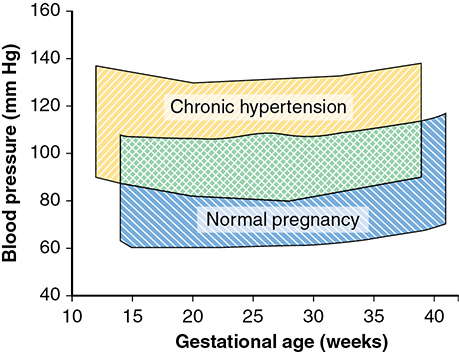
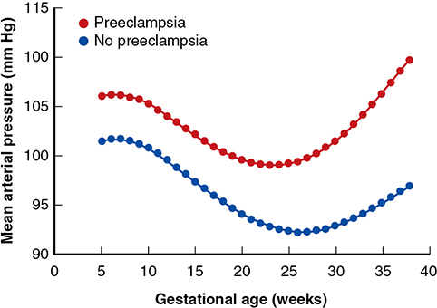
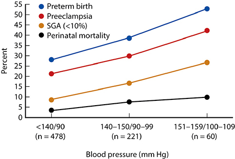

# Chapter 53: Chronic Hypertension — Revision Notes

> Williams Obstetrics 26e, pp. 2457–2488 of the PDF. High-yield numbers are in **bold**.
> The six tables are transcribed from the PDF images (they are missing from the extracted chapter text). All 3 figures are included from the PDF.

**Big picture:** Hypertension affects **~6%** of reproductive-age women and complicates **1.8–2.3%** of pregnancies. BP usually falls early in pregnancy, then rises in the third trimester. The dominant danger is **superimposed preeclampsia (20–50%)**, which drives abruption, FGR, stillbirth and maternal death. **Severe hypertension (≥160/110) must be treated**; the benefit of treating mild–moderate disease is unproven. ACE inhibitors and ARBs are contraindicated.

---

## 1. General Considerations

- BP is a **polygenic** trait (plus epigenetics); rises with age and weight. Normal range in adults is broad → defining hypertension is difficult.

### Definition and classification
- **140/90 mm Hg** is the usual upper limit of normal (derived from actuarial data on white men).
- Incidence of BP >140/90: **blacks 34%, whites 29%, Mexican Americans 21%**.
- New ACC/AHA criteria (Whelton, 2018) differ from the pregnancy (ACOG) criteria:

### Table 53-1. Criteria for Diagnosis of Hypertension

| SBP (mm Hg) | | DBP (mm Hg) | Nonpregnant (ACC/AHA) | Pregnant (ACOG) |
|---|---|---|---|---|
| <120 | and | <80 | Normal | Normal |
| 120–129 | and | <80 | Elevated | Normal |
| 130–139 | or | 80–89 | **Stage 1 HTN** | Normal |
| 140–159 | or | ≥90 | Stage 2 HTN | **Mild to moderate HTN** |
| **≥160** | or | **≥110** | Stage 2 HTN | **Severe HTN** |

*ACC = American College of Cardiology; ACOG = American College of Obstetricians and Gynecologists; AHA = American Heart Association; DBP = diastolic blood pressure; HTN = hypertension; SBP = systolic blood pressure.*

> **Memory hook:** In pregnancy there are only three bins — **<140/90 normal, 140–159/90–109 mild–moderate, ≥160/110 severe**. The ACC/AHA "stage 1" (130–139/80–89) counts as normal for ACOG.

### Treatment and benefits in nonpregnant adults
- Hypertension causes **~15% of deaths worldwide**; ↑ CVD, CHD, heart failure, stroke, renal failure, PAD and death — all ↓ with treatment.
- Nonpregnant guidelines treat **stage 1** if CVD risk factors. The best approach before and during pregnancy is **unknown**.

### Preconceptional counseling
- Ask about duration, control and current drugs; **check home BP devices** for accuracy; assess health, activity and diet (Table 53-2).
- **Multiple drugs or poor control → higher risk.**
- **Hypertension >5 years or with diabetes → assess cardiac and renal function**: serum creatinine + **spot urine protein:creatinine ratio**; if **>0.3** → quantify with 24-h urine.
- Prior stroke, MI, arrhythmia or ventricular failure → markedly ↑ risk of recurrence/worsening.
- No consensus that poor control contraindicates pregnancy, but **counsel about marked risks** if:
  - persistent SBP **≥160** or DBP **≥110** despite therapy
  - **multiple antihypertensives** needed
  - serum **creatinine >2 mg/dL**
  - prior **stroke, MI or cardiac failure**

### Table 53-2. Lifestyle Modifications for Hypertensive Patients

| Modification | Recommendation |
|---|---|
| Weight reduction | **BMI ≤25 kg/m²** |
| Diet | Emphasize vegetables, fruits, whole grains; include low-fat dairy, poultry, fish, legumes, nontropical vegetable oils, nuts; limit sweets and red meats. Examples: **DASH**, USDA Food Pattern, AHA Diet |
| Lower sodium intake | **No more than 2400 mg/d; 1500 mg/d desirable** |
| Aerobic physical activity | **3–4 sessions/wk, ~40 min each**, moderate- to vigorous-intensity |
| Alcohol moderation | **≤1 drink daily (none when pregnant)** |

*AHA = American Heart Association; DASH = Dietary Approaches to Stop Hypertension; USDA = United States Department of Agriculture. Summarized from Kotchen, 2018; Whelton, 2018.*

---

## 2. Pregnancy Considerations

### Diagnosis and evaluation
- **Chronic hypertension = hypertension preceding pregnancy or identified before 20 wk** (preeclampsia is rare before 20 wk).
- ACOG threshold: **SBP ≥140 or DBP ≥90 mm Hg**.
- Suspected **white-coat hypertension** → serial ambulatory monitoring.
- Repeated **gestational hypertension or prior preeclampsia** (especially **early-onset**) → risk factor for **latent chronic hypertension**. Gestational hypertension is analogous to gestational diabetes (a chronic hypertensive diathesis).
- **Secondary causes** to consider: chronic renal disease, **obstructive sleep apnea**, connective tissue disease, **primary aldosteronism, Cushing syndrome, pheochromocytoma**. Most cases are uncomplicated essential hypertension.

### Risk factors
- Most cited: **ethnicity (black women), obesity, diabetes**.
- **Obesity may raise chronic hypertension prevalence 10×** and ↑ superimposed preeclampsia.
- **Metabolic syndrome** = risk marker for superimposed preeclampsia and persistent postpartum hypertension.
- Commonest comorbidities: **pregestational diabetes 6.6%**, thyroid disorders 4.1%, collagen vascular disease 0.6%.

### Physiological effects
- **1st trimester: BP falls** because of a **30% ↓ in SVR**; then BP **rises in the 3rd trimester** in most chronically hypertensive women.
- Persistently ↑ vascular resistance and possibly ↓ plasma volume expansion; arterial stiffness most marked with superimposed preeclampsia.

*Figure 53-1. Chronic hypertension vs normal pregnancy: both show a midpregnancy dip and a third-trimester rise, with the chronic hypertensive curve running higher throughout.*

---

## 3. Adverse Pregnancy Effects

- Complication rates rise with **severity and duration** of prepregnancy hypertension. ACC/AHA "elevated" BP may also predict adverse outcomes.
- **Superimposed preeclampsia, especially early-onset, is especially dangerous.**

### Table 53-3. Some Adverse Effects of Chronic Hypertension on Maternal and Perinatal Outcomes

| Maternal | Perinatal |
|---|---|
| Superimposed preeclampsia | Stillbirth |
| HELLP syndrome | Fetal-growth restriction |
| Placental abruption | Preterm delivery |
| Pulmonary edema | Neonatal death |
| Stroke | Neonatal morbidity |
| Acute kidney injury | Congenital anomalies |
| Heart failure | |
| Hypertensive cardiomyopathy | |
| Myocardial infarction | |
| Maternal death | |

*HELLP = hemolysis, elevated liver enzyme levels, low platelet count.*

### Maternal morbidity and mortality
- **Well-controlled hypertension without end-organ damage → usually does well.**
- Complications more likely with severe baseline hypertension and end-organ damage — especially **LV hypertrophy** and **hypertensive glomerulosclerosis**.
- Nationwide sample (per 1000): **pulmonary edema 1.5, stroke 2.7, mechanical ventilation 3.8, AKI 5.9, maternal death 0.4**.
- Also: peripartum cardiomyopathy, coronary and aortic dissection.
- ⚠️ **SBP ≥160 or DBP ≥110 rapidly causes renal or cardiopulmonary dysfunction or cerebral hemorrhage.**
- Superimposed preeclampsia/eclampsia → poor maternal prognosis unless pregnancy is ended.
- **Chronic hypertension → 5× maternal death risk.** Hypertensive disorders = **7.4%** of US pregnancy-related deaths (2011–2013); related causes: CV conditions 15.5%, cardiomyopathy 11%, stroke 6.6%.

### Superimposed preeclampsia
- **Incidence 20–50%** (imprecisely defined); **25%** in the MFMU trial.
- Risk ↑ with **severity of baseline hypertension** and **need for antihypertensives**; greater still with **baseline proteinuria** (end-organ damage).
- **BP ≥130/80 early in pregnancy** → excess preeclampsia.
- Women who develop preeclampsia have higher MAP throughout and an **earlier MAP nadir (23.3 vs 26.4 wk)**.

*Figure 53-2. Treated chronic hypertension: women who develop superimposed preeclampsia have higher MAP from the start and an earlier nadir (~23 vs ~26 wk).*

**Prediction** — individual tests disappointing:
- First-trimester **inhibin A ↓** (low sensitivity, not useful) and **PAPP-A ↓**.
- **Low PlGF, high sFlt-1** associated with superimposed preeclampsia.
- ↑ First-trimester **umbilical artery pulsatility index** (as stated in the text).
- **Combining** factors may help.

**Prevention**
- Most drugs show little or no benefit. **Low-dose aspirin** is best studied: USPSTF "moderate certainty" of benefit.
- **ACOG: aspirin 81 mg/d, started between 12 and 28 wk, continued until delivery.**
- **Vitamins C and E do not work** (17% vs 20% preeclampsia).

**Placental abruption**
- **2–3× ↑ risk:** general population **1 in 200–300** → chronic hypertension **1 in 60–120**.
- Mostly with worsening hypertension or superimposed preeclampsia; **8.4%** with severe hypertension.

### Perinatal morbidity and mortality
- Almost all adverse perinatal outcomes ↑; much higher with preeclampsia; rates rise **stepwise with BP** (Fig. 53-3).
- **Congenital anomalies** (treated or untreated): **cardiac defects OR 1.5** (RR 1.4); **esophageal atresia aOR 3.2** in untreated hypertension.
- **Stillbirth 15–24 per 1000** (superimposed preeclampsia, abruption, FGR).
- **FGR averages 20%** (2.5× in Swedish study; 1.3× in Dutch nulliparas). With superimposed preeclampsia **~50% vs 21%** without. Treated hypertension → **11%** with birthweight **≤3rd percentile**.
- **Perinatal mortality 2–4× ↑.** By severity: **mild 31, moderate 72, severe 100 per 1000**. Parkland (treated): **32 per 1000**. **Doubles with superimposed preeclampsia.** Worse still with coexisting diabetes.
- Offspring: long-term endocrine/metabolic morbidity, especially **obesity**.

*Figure 53-3. Mild chronic hypertension: preterm birth, preeclampsia, SGA and perinatal mortality all rise with BP category (<140/90 → 151–159/100–109).*

---

## 4. Management During Pregnancy

- Goals: **prevent moderate/severe hypertension**, delay or dampen superimposed preeclampsia, ↓ adverse outcomes.
- **Home BP self-monitoring** (calibrated devices). Diet counseling; stop tobacco, alcohol, cocaine and other substances. **Low-sodium diet and low-dose aspirin.**
- Long-standing or untreated hypertension → **concentric LVH and proteinuria** concerns → **baseline echocardiogram and 24-h urine protein** early in prenatal care.

### Antihypertensive drugs

### Table 53-4. Some Antihypertensive Drugs Used for Treatment of Chronic Hypertension During Pregnancyᵃ

| Drug | Comment |
|---|---|
| **Adrenergic-receptor agentsᵇ** | |
| β-blockers: propranolol, metoprolol | Avoid with **asthma, decompensated heart function** |
| α/β-blocker: **labetalol** | — |
| α-agonist: methyldopa | Less effective for severe hypertension; **sedative side effects** |
| **Calcium-channel blocking agentsᵇ** | |
| **Nifedipine, amlodipine**, verapamil | Avoid with **tachycardia** |
| **Diureticᶜ** | |
| Hydrochlorothiazide | **Begin before 20 weeks' gestation** |
| **Vasodilating agentᶜ** | |
| Hydralazine | Hypertension complicated by **cardiac or renal dysfunction**; less effective with severe hypertension |

*ᵃDrugs compatible with pregnancy (Briggs, 2022). ᵇFirst-line agents. ᶜSecond-line agents.*

**Adrenergic-receptor blockers**
- **β-blockers** (propranolol, metoprolol) ↓ sympathetic tone and CO. ⚠️ **Atenolol not recommended — linked with FGR.**
- **Labetalol** (α/β-blocker) is considered safe.
- **Methyldopa and clonidine** act centrally (↓ sympathetic outflow). **Methyldopa and labetalol are the most used in pregnancy.**

**Calcium-channel blockers**
- **Nifedipine** (dihydropyridine), **verapamil** (phenylalkylamine). Negative inotropes → worsen ventricular dysfunction/heart failure; may theoretically potentiate **magnesium sulfate**.
- **Nifedipine = labetalol in efficacy**, with **less BP variability**. Appear safe.

**Diuretics**
- Thiazides (sulfonamides) and loop diuretics: short-term Na⁺/water diuresis → later "sodium escape"; long-term benefit partly from ↓ PVR.
- Mildly **diabetogenic**; may curtail normal **plasma volume expansion** → not first-line, especially **after 20 wk**. Overall **thiazides are considered safe**.

**Vasodilators**
- **Hydralazine:** IV for severe peripartum hypertension for decades. **Oral monotherapy not used** (weak, reflex tachycardia); useful **adjunct** with renal insufficiency or ventricular dysfunction.

**ACE inhibitors and ARBs** ⚠️
- ACE inhibitors in the **2nd and 3rd trimesters** → **oligohydramnios, hypocalvaria, renal dysfunction**; possible 1st-trimester teratogenicity.
- **Not recommended at any time in pregnancy.** **ARBs presumed to have the same effects → contraindicated.**

### Antihypertensive treatment in pregnancy

**Mild or moderate hypertension**
- Whether to start or continue therapy is **debatable**.
- Cochrane (~5000 women): treatment **↓ progression to severe hypertension**, but **no difference** in superimposed preeclampsia, preterm birth, SGA or perinatal mortality.
- Lowering MAP may ↓ uteroplacental perfusion → **SGA** (von Dadelszen; conflicting data). Large RCTs: no ↑ FGR with treatment. Worsening BP itself impairs growth. **Unresolved.**

**Severe chronic hypertension**
- **SBP ≥160 or DBP ≥110 → treat** (↓ maternal morbidity and mortality).
- With **cardiovascular or renal end-organ damage**, treat at **SBP ≥140–150 or DBP ≥90–100**.
- BP **≥170/110 at 6–11 wk** (44 pregnancies; methyldopa + hydralazine to keep <160/110): **½ developed superimposed preeclampsia**, and **all adverse perinatal outcomes occurred in that half**. Confirmed in 447 treated women (Parkland).
- **Baseline proteinuria >300 mg/d** → more superimposed preeclampsia, preterm birth and SGA (Table 53-5). **LVH/abnormal remodeling** → preeclampsia, preterm birth, NICU admission.

### Table 53-5. Selected Pregnancy Outcomes in Women with Chronic Hypertension with and without Baseline Proteinuriaᵃ and Who Were Treated During Pregnancy

| Outcome | Baseline Proteinuriaᵃ | No Proteinuria | p value |
|---|---|---|---|
| **Superimposed preeclampsia** | **79%** | **49%** | <0.001 |
| Abruption | 0 | 1% | 0.45 |
| EGA at delivery (mean)ᵇ | 35.1 ± 4.3 wk | 37.2 ± 3.3 wk | <0.001 |
| ≤30 weeks | 18% | 6% | 0.001 |
| ≤34 weeks | 34% | 17% | 0.005 |
| ≤37 weeks | 48% | 26% | 0.002 |
| Birthweight (mean)ᵇ | 2379 ± 1028 g | 2814 ± 807 g | <0.001 |
| ≤3rd percentile | 20% | 9% | 0.01 |
| ≤10th percentile | 41% | 22% | <0.001 |
| Perinatal mortality | 36/1000 | 31/1000 | 0.47 |

*ᵃDefined as ≥300 mg/d protein excretion before 20 weeks' gestation. ᵇMean ± standard deviations. EGA = estimated gestational age.*

**"Tight control"**
- Observational data (Ankumah) suggested better outcomes with BP <140 before 20 wk — **not confirmed**.
- **CHIPS trial (Magee, 987 women):** tight vs less-tight control → **only severe hypertension ↓ (28% vs 41%)**; nothing else differed. No gestational age at which tight control was better.
- **ACOG: no proven benefit or harm** of **"tight" (target DBP <85)** vs **"less-tight" (target DBP <100)**. **CHAP trial** ongoing (at the time of writing).

### Table 53-6. Selected Maternal and Perinatal Outcomes in Pregnant Women with Chronic Hypertension According to Less-Tight versus Tight Control

| Outcome | Less-Tight Control | Tight Control |
|---|---|---|
| **Maternal** | | |
| Placental abruption | 2.2% | 2.3% |
| **Severe hypertensionᵃ** | **41%** | **28%** |
| Preeclampsia | 49% | 46% |
| HELLP syndrome | 1.8% | 0.4% |
| **Perinatal** | | |
| Deaths | 28/1000 | 23/1000 |
| Weight <10th percentile | 16% | 20% |
| Weight <3rd percentile | 4.7% | 5.3% |
| Respiratory problem | 17% | 14% |

*ᵃp <0.001; all other comparisons p >0.05. HELLP = hemolysis, elevated liver enzyme levels, low platelet count.*

### Recommendations for therapy (ACOG / SMFM)
- **Must treat:** severe hypertension (neuro-, cardio- and renoprotection); prior **stroke, MI**, or **cardiac/renal dysfunction**.
- Reasonable to start in healthy women with persistent **SBP >150 or DBP >95–100**.
- **Parkland: start at ≥150/100 mm Hg.** Preferred monotherapy: **labetalol**, or a calcium-channel blocker (**nifedipine or amlodipine**).
- **Thiazide adjunct** reasonable in the **first half** of pregnancy — especially in **black women** (salt-sensitive hypertension).
- **Already on drugs at booking:**
  - ACOG/SMFM: for mild–moderate hypertension, reasonable to **stop in the 1st trimester** and restart if BP approaches the severe range.
  - Parkland: **continue** therapy.
  - **Always stop ACE inhibitors and ARBs.**
- **Refractory hypertension** → think of **superimposed preeclampsia**, inaccurate measurement, suboptimal treatment, **illicit drugs**, chronic **NSAID** use.

### Superimposed preeclampsia — diagnosis
- Supporting features: **worsening hypertension, new-onset proteinuria**, severe headache, visual disturbance, generalized edema, oliguria, convulsions, pulmonary edema.
- **Pitfalls:**
  1. BP normally rises near the **end of the 2nd trimester** in chronic hypertension (the upper end of Fig. 53-1) → if preeclampsia is excluded, start or increase treatment.
  2. Pre-existing end-organ damage mimics preeclampsia; **worsening proteinuria is unreliable with underlying renal disease**.
- **Supportive labs:** rising **creatinine** or **transaminases**, **thrombocytopenia**, any feature of **HELLP**.
- **With severe features → magnesium sulfate** neuroprophylaxis.

**Expectant management of early-onset superimposed preeclampsia**
- **40–50%** develop before 37 wk.
- **Maternal outcomes are generally better with delivery**, even if very preterm; delay → abruption, cerebral hemorrhage, peripartum heart failure, and later maternal heart disease.
- 42 of 68 selected women (median 31.6 wk) managed expectantly: **17% abruption or pulmonary edema**, latency **+10 days**, no neonatal benefit.
- ACOG: **<34 wk** may be candidates for expectant management **only where maternal and neonatal ICU resources exist**. Parkland delivers once diagnosed.

### Fetal assessment
- **Antepartum surveillance recommended** (↑ stillbirth, FGR); ideal test, interval and start are unknown.
- **All: third-trimester sonographic growth assessment.**
- **Low-risk** (Chahine) = all four of:
  1. **Age ≤35 y**
  2. Mild–moderate BP **not requiring medication**
  3. **No prior** hypertension-related adverse pregnancy outcome
  4. **No end-organ damage**

- Low-risk → **weekly NST or BPP**. **High-risk** (fails any criterion) → **earlier sonography and testing**.

### Delivery timing (ACOG)
| Situation | Timing |
|---|---|
| Mild–moderate, uncomplicated, **on medication** | Wait until 37–38 wk; **not before 37⁰/₇ wk** |
| Mild–moderate, uncomplicated, **no medication** | **Not before 38⁰/₇ wk** |
| Consensus committee | Consider **38–39 wk** (≥37 completed weeks) |
| FGR | Individualize (maternal health vs EFW, GA, neonatal survival) |

- Beyond **39 wk** → ↑ severe preeclampsia; planned delivery **<37 wk** → ↑ adverse neonatal outcomes.

### Intrapartum considerations
- **Route by obstetric factors**; **induction** preferred and many deliver vaginally. FGR fetuses often need cesarean for nonreassuring FHR.
- **Magnesium sulfate only with superimposed severe preeclampsia.**
- **Epidural ideal** but **not a treatment for hypertension**; women with superimposed preeclampsia are **more sensitive to epidural hypotension**. Superimposed preeclampsia may lengthen the first stage.
- **Severe hypertension (DBP ≥110 or SBP ≥160) → IV hydralazine, IV labetalol or oral nifedipine** (some treat at DBP 100–105).
  - **Hydralazine:** more maternal **palpitations and tachycardia**.
  - **Labetalol:** more **neonatal hypotension and bradycardia**.

### Postpartum care
- Manage like severe preeclampsia–eclampsia. **Persistent severe hypertension → consider pheochromocytoma or Cushing disease.**
- With end-organ damage: ↑ **cerebral/pulmonary edema, heart failure, renal dysfunction, cerebral hemorrhage**, especially in the **first 48 h**, often preceded by sudden ↑ MAP (especially systolic).
- Mechanism: ↑ peripheral resistance + mobilized interstitial fluid → ↑ LV workload → diastolic/systolic dysfunction → **pulmonary edema** → **prompt BP control + furosemide diuresis**.
- Continue the antepartum regimen; untreated women can use **labetalol or nifedipine**.
- **Furosemide** augments postpartum diuresis: **20 mg PO daily × 5 days** helped BP control after severe preeclampsia; daily furosemide ↓ need for antihypertensives at discharge.
- **Daily weights:** a woman should weigh **~15 lb less immediately after delivery**; (last prenatal weight − 15 lb) vs current weight estimates excess extracellular fluid.
- Chronic **NSAID** use may ↑ BP after severe preeclampsia (intermittent PRN use is probably fine).
- Postpartum readmission for severe hypertension **~1.5%**.
- Contraception: discuss before delivery; some methods are less ideal/contraindicated (Ch 38). SMFM encourages **immediate postpartum LARC** in the highest-risk women.

### Long-term prognosis
- **High lifetime cardiovascular risk**, especially with diabetes, obesity and metabolic syndrome.
- Persistent hypertension 3 years after severe preeclampsia → **thicker LV septum**.

---

## Quick-Recall: Antihypertensive Drugs in Pregnancy

| Drug | Status | Key point |
|---|---|---|
| **Labetalol** | First-line | α/β-blocker, safe; IV for acute severe HTN (neonatal hypotension/bradycardia) |
| **Nifedipine / amlodipine** | First-line | As effective as labetalol, less BP variability; avoid with tachycardia; oral nifedipine for acute severe HTN |
| Methyldopa | First-line | Central α-agonist; sedation; weaker for severe HTN |
| Propranolol, metoprolol | First-line | Avoid with asthma, decompensated heart |
| **Atenolol** | **Avoid** | **FGR** |
| Hydrochlorothiazide | Second-line | Begin before 20 wk; helpful in black women; mildly diabetogenic, ↓ volume expansion |
| Hydralazine | Second-line (oral) | Oral adjunct for renal/cardiac dysfunction; IV for acute severe HTN (maternal tachycardia) |
| **ACE inhibitors / ARBs** | **Contraindicated** | Oligohydramnios, hypocalvaria, renal dysfunction (2nd–3rd trimester) |

## Key Numbers to Memorize
- Prevalence **~6%** of reproductive-age women; **1.8–2.3%** of pregnancies
- Chronic HTN = before pregnancy or **<20 wk**; **≥140/90** (mild–moderate), **≥160/110** (severe)
- Counsel on marked risk: BP **≥160/110** on therapy, multiple drugs, creatinine **>2 mg/dL**, prior stroke/MI/heart failure; UPCR **>0.3** → 24-h urine
- SVR ↓ **30%** in 1st trimester
- Maternal death **5×**; hypertensive disorders **7.4%** of pregnancy-related deaths
- Superimposed preeclampsia **20–50%** (MFMU **25%**); **79% with baseline proteinuria vs 49%**; **40–50% occur <37 wk**
- Aspirin **81 mg** from **12–28 wk** until delivery
- Abruption **1 in 60–120** (vs 1 in 200–300); **8.4%** with severe HTN
- Stillbirth **15–24/1000**; FGR **~20%** (~50% with preeclampsia); perinatal mortality **31 / 72 / 100 per 1000** (mild / moderate / severe)
- Cardiac defects **OR 1.5**; esophageal atresia **aOR 3.2**
- Parkland treats at **≥150/100**; end-organ damage → treat at **≥140–150/90–100**
- Tight (DBP **<85**) vs less-tight (DBP **<100**): only severe HTN ↓ (**28% vs 41%**)
- Delivery: **37⁰/₇** on meds, **38⁰/₇** without; expectant management of superimposed preeclampsia only **<34 wk** with ICU resources
- Postpartum: furosemide **20 mg × 5 days**; weight **−15 lb** after delivery; readmission **~1.5%**; risk window **first 48 h**
