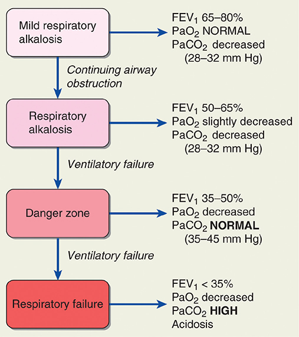
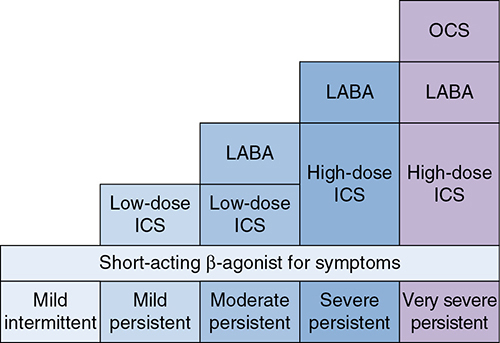
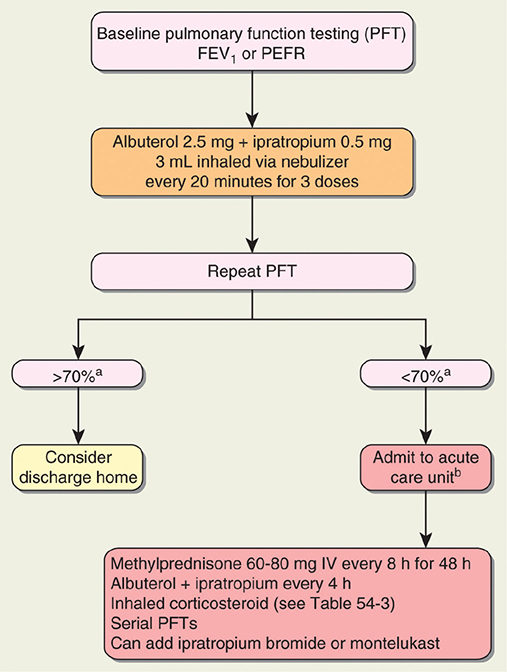
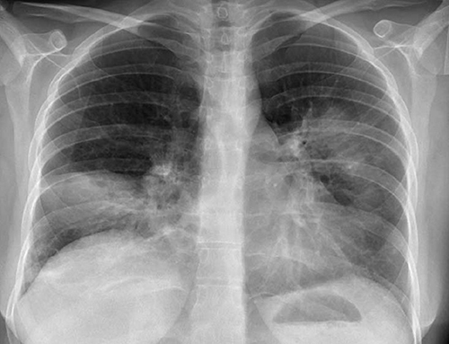

# Chapter 54: Pulmonary Disorders — Revision Notes

> Williams Obstetrics 26e, pp. 2489–2538 of the PDF. High-yield numbers are in **bold**.
> The eight tables are transcribed from the PDF images (they are missing from the extracted chapter text). All 4 figures are included from the PDF.

**Big picture:** Asthma and community-acquired pneumonia cause almost **10%** of nonobstetrical antepartum admissions. Pregnant women (especially in the 3rd trimester) tolerate lung disease poorly because ↓ FRC and ↑ O₂ demand make them quick to become hypoxemic, and the fetus suffers first.

---

## 1. Respiratory Physiology Recap (see Ch 4)

| Parameter | Change in late pregnancy |
|---|---|
| Vital capacity, inspiratory capacity | **↑ ~20%** |
| Expiratory reserve volume | 1300 → **~1100 mL** |
| Tidal volume | **↑ ~40%** (progesterone-driven) |
| Minute ventilation | **↑ 30–40%** → PaO₂ **100 → 105 mm Hg** |
| CO₂ production | ↑ 30% |
| PaCO₂ | **40 → 32 mm Hg** (hyperventilation + ↑ diffusion capacity) |
| Residual volume | ↓ ~20% (1500 → 1200 mL) |
| Chest wall compliance | ↓ by ⅓ |
| **Functional residual capacity** | **↓ 10–25%** (= ERV + RV) |
| FVC, peak expiratory flow | Progressively ↑ from **14–16 wk** |
| Basal O₂ consumption | ↑ 20 → 40 mL/min in 2nd half |

- Net effect: **deeper, not more frequent, breathing**.

---

## 2. Asthma

### Pathophysiology
- Chronic inflammatory airway syndrome with a strong hereditary component (**chromosome 5q** gene clusters: cytokines, β-adrenergic and glucocorticoid receptors, T-cell receptor).
- Morbidity higher in Black than white women.
- **Hallmarks:** **reversible airway obstruction** — smooth muscle contraction, vascular congestion, tenacious mucus, mucosal edema. Eosinophils, mast cells, T cells → histamine, leukotrienes, prostaglandins, cytokines, IgE.
- ⚠️ **F-series prostaglandins and ergonovine exacerbate asthma** → avoid these uterotonics.

### Clinical course
- Obstruction ↓ **FEV₁/FVC** and **PEFR**; worsening oxygenation is mainly from **V/Q mismatch**.
- Early: hyperventilation keeps PaO₂ normal but ↓ PaCO₂ → **respiratory alkalosis**.
- Late: fatigue → CO₂ retention. **A "normal" PaCO₂ can be the first sign of retention** → respiratory failure.
- Even early stages are dangerous in pregnancy: ↓ FRC + ↑ pulmonary shunting → rapid hypoxemia.

### Table 54-1. Classification of Asthma Severity

| Component | Intermittent | Mild persistent | Moderate persistent | Severe persistent |
|---|---|---|---|---|
| Symptoms | ≤2 d/wk | >2 d/wk, not daily | Daily | Throughout day |
| Nocturnal awakenings | ≤2×/mo | 3–4×/mo | >1×/wk, not nightly | Often 7×/wk |
| Short-acting β-agonist for symptoms | ≤2 d/wk | ≥2 d/wk, but not >1×/d | Daily | Several times daily |
| Interference with normal activity | None | Minor limitation | Some limitation | Extremely limited |
| Lung function | Normal between exacerbations | | | |
| FEV₁ | **>80%** predicted | **≥80%** predicted | **60–80%** predicted | **<60%** predicted |
| FEV₁/FVC | Normal | Normal | Reduced 5% | Reduced >5% |

*FEV₁ = forced expiratory volume in 1 second; FVC = forced vital capacity. From National Heart, Lung, and Blood Institute, 2007.*

*Figure 54-1. Clinical stages of asthma: a NORMAL PaCO₂ (35–45 mm Hg) with FEV₁ 35–50% is the "danger zone"; high PaCO₂ + acidosis = respiratory failure.*

| Stage | FEV₁ | PaO₂ | PaCO₂ |
|---|---|---|---|
| Mild respiratory alkalosis | 65–80% | Normal | ↓ (28–32 mm Hg) |
| Respiratory alkalosis | 50–65% | Slightly ↓ | ↓ (28–32 mm Hg) |
| **Danger zone** | **35–50%** | ↓ | **NORMAL (35–45)** |
| **Respiratory failure** | **<35%** | ↓ | **HIGH + acidosis** |

### Effects of pregnancy on asthma
- Affects up to **8%** of gravidas.
- **Rule of thirds:** ~⅓ improve, ⅓ unchanged, ⅓ worsen (Gluck, >2000 women).
- Exacerbations track baseline severity (Schatz, 2003):

| Baseline severity | Exacerbation | Admission |
|---|---|---|
| Mild | 13% | 2.3% |
| Moderate | 26% | 7% |
| Severe | **52%** | **27%** |

- Intrapartum exacerbation: 20% (mild/moderate, Schatz) vs only 1% (Wendel). **18-fold ↑ risk after cesarean** vs vaginal delivery (Mabie).

### Table 54-2. Maternal and Perinatal Outcomes in Women with Asthma

| Outcome (asthmaticsᵃ) | Odds ratio (95% CI) |
|---|---|
| **Maternal** | |
| Hemorrhage | 1.09 (1.03–1.16) |
| Gestational diabetes | 1.10 (1.03–1.19) |
| Chorioamnionitis | 1.12 (1.09–1.15) |
| Preeclampsia | 1.14 (1.06–1.22) |
| Placental abruption | 1.22 (1.09–1.36) |
| Placenta previa | 1.30 (1.08–1.56) |
| ICU admission | 1.34 (1.04–1.72) |
| Pulmonary embolism | **1.71** (1.05–2.79) |
| **Perinatal** | |
| SGA neonates | 1.10 (1.05–1.16) |
| Preterm delivery | 1.17 (1.12–1.23) |
| Preterm PROM | 1.18 (1.07–1.30) |
| Anomalies | **1.48** (1.04–2.09) |

*ᵃCompared with outcomes in 206,468 nonasthmatic women. CI = confidence interval; ICU = intensive care unit; PROM = premature rupture of membranes; SGA = small for gestational age. Data from Baghlaf, 2019; Mendola, 2013, 2014.*

- Findings are inconsistent: some large studies show ↑ pneumonia and cesarean but not perinatal mortality; spontaneous abortion may be slightly ↑.
- **Severe or poorly controlled asthma** drives risk: preterm birth **~2×** with severe asthma (MFMU). Baseline FEV₁ correlates directly with birthweight and inversely with gestational hypertension and preterm delivery.
- **Status asthmaticus** → respiratory arrest, pneumothorax, pneumomediastinum, acute cor pulmonale, arrhythmias. Mortality rises steeply once **mechanical ventilation** is needed.

### Fetal effects
- **Maternal respiratory alkalosis causes fetal hypoxemia before maternal oxygenation is compromised**: ↓ uterine blood flow, ↓ venous return, **left shift** of the O₂ dissociation curve.
- Fetal response: ↓ umbilical flow, ↑ systemic and pulmonary vascular resistance, ↓ cardiac output. FGR ↑ with asthma severity.
- **The FHR is a monitor of maternal status**: return of moderate variability/accelerations = improving maternal oxygenation.
- Drugs: possible slight ↑ cleft lip/palate and autism (unconfirmed). **Up to half stop essential treatment at 5–13 wk** — a real concern.

### Clinical evaluation
- Subjective severity correlates poorly with objective measures.
- Useful signs: labored breathing, tachycardia, **pulsus paradoxus**, prolonged expiration, accessory muscles. **Central cyanosis and altered consciousness = potentially fatal**.
- **Serial FEV₁ or PEFR is the best measure of severity.** **FEV₁ <1 L or <20% predicted** = severe disease (hypoxia, poor response, high relapse).
- PEFR correlates well with FEV₁ and is cheap; each woman should know her own asymptomatic baseline.

### Management of chronic asthma
1. Patient education.
2. Avoid or control triggers (viral URIs, including colds). **Influenza and pneumococcal vaccination** encouraged.
3. Objective monitoring: PEFR/FEV₁; fetal **serial growth ultrasound** ± antepartum testing.
4. Pharmacotherapy for baseline control and exacerbations; periodic medication review.
5. Treat related disorders: smoking, depression, rhinitis, GERD.

- Moderate–severe asthma: record FEV₁ or PEFR **twice daily**. Target **FEV₁ >80% predicted**; predicted **PEFR 380–550 L/min** (use her own baseline).
- **FeNO-guided** management → **50% fewer exacerbations**.

**Agents**
- **Mild intermittent:** **SABA as needed** is usually enough.
- **Persistent:** **inhaled corticosteroids (ICS)**, usually twice daily; step up from low- to medium-dose.
  - ICS ↓ hospitalizations by **80%** (Blais); at Parkland ↓ readmissions by **55%**.
  - As-needed **budesonide–formoterol** beat albuterol alone for mild asthma (nonpregnant) → now in guidelines.
- **Theophylline:** little benefit, many side effects; oral maintenance only if ICS + β-agonist inadequate.
- **Antileukotrienes** (zileuton, zafirlukast, montelukast): prevention only, **ineffective acutely**; ~half respond; less effective than ICS; limited pregnancy data.
- **Cromones:** mast cell stabilizers, ineffective acutely; mainly childhood asthma.
- **Vitamin D:** low levels linked to asthma severity; antenatal supplementation did **not** lower childhood asthma at 6 years (RCT).

*Figure 54-2. Stepwise therapy: SABA for all → low-dose ICS → + LABA → high-dose ICS + LABA → + oral corticosteroids.*

### Table 54-3. Chronic Asthma Treatment

**SABA inhaler**

| Agentᵃ | Brand | Dose per puff | Dosage |
|---|---|---|---|
| Albuterol | Proventil HFA, Ventolin HFA, ProAir HFA | 90 µg | 1–2 puffs every 4–6 hr |
| Levalbuterol | Xopenex HFA | 45 µg | 1–2 puffs every 4–6 hr |

**ICS inhalerᵇ — daily corticosteroid dosing**

| Agentᵃ | Brand | Dose per puff | Low | Medium | High |
|---|---|---|---|---|---|
| Beclomethasone HFA | QVAR | 40, 80 µg | 80–240 µg | >240–480 µg | >480 µg |
| Budesonide DPI | Pulmicort | 90, 180, 200 µg | 180–600 µg | >600–1200 µg | >1200 µg |
| Ciclesonide HFA | Alvesco | 80, 160 µg | 80–160 µg | >160–320 µg | >320 µg |
| Flunisolide HFA | Aerospan | 80 µg | 320 µg | >320–640 µg | >640 µg |
| Fluticasone furoate DPI | Arnuity Ellipta | 100, 200 µg daily | 100 µg | NA | 200 µg |
| Fluticasone propionate DPI | Flovent Diskus | 50, 100, 250 µg | 100–300 µg | >300–500 µg | >500 µg |
| Fluticasone propionate HFA | Flovent HFA | 44, 110, 220 µg | 88–264 µg | >264–440 µg | >440 µg |
| Mometasone DPI | Asmanex | 110, 220 µg | 110–220 µg | 330–440 µg | >440 µg |
| Mometasone HFA | Asmanex HFA | 100, 200 µg | 200 µg | 400 µg | >400 µg |

**LABA/ICS inhalerᵇ — daily dosing**

| Agentᵃ | Brand | Dose per puff | Low | Medium | High |
|---|---|---|---|---|---|
| Budesonide/formoterol | Symbicort | 80/4.5, 160/4.5 µg | 320/18 µg | >320/18–640/18 µg | >640/18 µg |
| Fluticasone/salmeterol DPI | Advair Diskus | 100/50, 250/50, 500/50 µg | 100/50–350/100 µg | 350/100–500/100 µg | >500/50 µg |
| Fluticasone/salmeterol HFA | Advair HFA | 45/21, 115/21, 230/21 µg | 100/50–250/50 µg | 300/50–500/50 µg | >500/50 µg |
| Fluticasone/salmeterol DPI | AirDuo Respiclick | 55/14, 113/14, 232/14 µg | 110/28 µg | 226/28 µg | 464/28 µg |
| Fluticasone/vilanterol | Breo Ellipta | 100/25, 200/25 µg daily | 100/25 µg | NA | 200/25 µg |
| Mometasone/formoterol | Dulera | 110/5, 200/5 µg | NA | 400/20 µg | 800/20 µg |

*ᵃAgents in each group are arranged alphabetically. ᵇTwice-daily dosing unless otherwise stated. DPI = dry powder inhaler; HFA = hydrofluoroalkane (aerosol propellant); ICS = inhaled corticosteroid; LABA = long-acting β-agonist; NA = not applicable; SABA = short-acting β-agonist. From American Academy of Allergy Asthma & Immunology, 2020; NHLBI, 2007; Therapeutic Research Center, 2017.*

---

### Management of acute asthma
- Same as nonpregnant, but the **threshold for hospitalization is much lower**.
- IV hydration; **O₂ by mask** to keep **PaO₂ >60 mm Hg** (preferably normal) and **SpO₂ 90–95%**.
- Baseline FEV₁/PEFR, continuous pulse oximetry, EFM as appropriate.
- ABG: interpret against pregnancy norms — **PaCO₂ >35 mm Hg with pH <7.35 = CO₂ retention** in a pregnant woman. Routine ABG didn't help most admissions (Wendel).
- **No antibiotics** unless pneumonia coexists.

**Drugs**
- **First line: short-acting β-agonist** (terbutaline, albuterol, etc.; SC, oral, inhaled or IV if severe).
- **Systemic corticosteroids early for all severe attacks** (onset takes hours): prednisone/prednisolone/IV methylprednisolone **30–45 mg daily for 5–10 days, no taper**. Parkland uses a higher IV dose.
- Add **nebulized ipratropium 0.5 mg every 20 min × 3**, then every 6–8 h.
- Severe: **IV magnesium sulfate** or theophylline.
- **Disposition:** FEV₁/PEFR **>70%** of baseline after β-agonist → consider discharge. **<70% after 3 doses** or obvious distress → **admit** (L&D, intermediate care or ICU).

*Figure 54-3. Parkland acute asthma protocol: albuterol 2.5 mg + ipratropium 0.5 mg neb q20 min × 3 → repeat PFT → >70% discharge, <70% admit for IV methylprednisolone 60–80 mg q8h × 48 h.*

*The printed flowchart reads "methylprednisone", an obvious typo for methylprednisolone.*

### Status asthmaticus and respiratory failure
- **Definition:** severe asthma **not responding after 30–60 min** of intensive therapy.
- In pregnancy, **intubate early** when status worsens despite aggressive treatment.
- Indications for ventilation: **fatigue, CO₂ retention, hypoxemia**.
- Refractory: **venovenous ECMO** has been used successfully.

### Labor and delivery
- PEFR/FEV₁ on admission, then serially. **Continue maintenance drugs**; **stress-dose steroids not needed**.
- Ripening/induction: **oxytocin, PGE₁ or PGE₂** are fine.
- Analgesia: **fentanyl** (non-histamine-releasing) preferred over meperidine; **epidural ideal**.
- Cesarean: **conduction analgesia preferred** (intubation can trigger severe bronchospasm).
- **PPH:** oxytocin, misoprostol (PGE₁), dinoprostone (PGE₂). ⚠️ **PGF₂α (carboprost/Hemabate) is contraindicated** → bronchospasm.

> **Memory hook:** "**F** is for **F**orbidden" — PG**F**₂α and ergonovine are avoided in asthma; PGE₁/PGE₂ are safe.

---

## 3. Acute Bronchitis
- Large-airway infection: **cough without pneumonitis**; mostly **viral** (influenza A/B, parainfluenza, RSV, coronavirus, adenovirus, rhinovirus).
- Cough lasts **10–20 days**, occasionally ≥1 month.
- Antibiotics: little evidence of benefit.
- Supportive: **dextromethorphan** and **guaifenesin** appear safe in pregnancy.

---

## 4. Pneumonia

- **Community-acquired pneumonia (CAP)** is the usual type in young women; outpatient-facility infections resemble hospital-acquired pneumonia.
- Pathogen found in only **38%** (CDC): viruses 23%, bacteria 11%, both 3%, fungi/protozoa 1%. **Half of bacterial isolates = *S. pneumoniae*.**
- Pneumonia = **4.2%** of antepartum nonobstetric admissions; also a common reason for postpartum readmission.
- Hypoxemia and acidosis are poorly tolerated by the fetus → may trigger **preterm labor**.
- **Any gravida suspected of pneumonia should have a chest radiograph.**

### Bacterial pneumonia
- Risk factors: smoking and chronic bronchitis (*S. pneumoniae*, *H. influenzae*, *Legionella*), asthma, binge drinking, HIV.
- **Pregnancy itself does not predispose**: **1.5 per 1000** deliveries (same as nonpregnant 1.47/1000).
- ≥Half viral, ~¼ bacterial (half of those pneumococcal). **CA-MRSA** → necrotizing pneumonia. Occasionally *Legionella*.

**Diagnosis**
- Cough, dyspnea, sputum, pleuritic pain; mild leukocytosis.
- **Chest radiograph is essential**; it does not predict the organism.
- Sputum culture, serology, cold agglutinins, bacterial antigens: **not routine**. Exception: **rapid nasal PCR for influenza A/B and COVID-19**. Procalcitonin didn't help.

*Figure 54-4. CAP in pregnancy: rounded right middle lobe and left apical infiltrates.*

**Management**
- PSI and CURB-65 guide admission but are **not validated in pregnancy**. **Parkland admits all gravidas with radiographic pneumonia.**
- **~20%** of admitted pregnant women need ICU/intermediate care. Severe pneumonia is a common cause of **ARDS** in pregnancy (12% of ventilated gravidas), though with lower mortality than other ARDS causes.

### Table 54-4. Risk Factors for Early Deterioration in Community-Acquired Pneumonia

| Risk factor |
|---|
| Respiratory rate **≥30/min** |
| Arterial O₂ saturation **<90%** |
| Hypothermia: core temperature **<36°C** |
| Hypotension requiring aggressive fluid resuscitation |
| Multilobular infiltrates |
| Leukopenia: **<4000/µL** |
| Thrombocytopenia: **<100,000/µL** |
| Confusion/disorientation |

**Treatment**
- Empirical. Healthy gravidas: pneumococcus, *Mycoplasma*, *Chlamydophila* → **macrolide monotherapy** (erythromycin worked in 98/99 women).
- Severe disease (Table 54-4): **respiratory fluoroquinolone** OR **macrolide + β-lactam**. Macrolide resistance favors fluoroquinolones; fluoroquinolone teratogenic risk is low → **give if indicated**.
- **MRSA suspected:** add **vancomycin 15 mg/kg IV q12h** or **linezolid 600 mg q12h**.
- **During flu season add oseltamivir** routinely.

### Table 54-5. Empirical Inpatient Antimicrobial Treatment for Community-Acquired Pneumonia in Pregnancyᵃ

| Category | Regimen |
|---|---|
| **Uncomplicated, otherwise healthy**ᵇ,ᶜ | **Macrolides**ᶜ: clarithromycin 500 mg twice daily **or** azithromycin 500 mg daily (IV and oral forms) |
| *Plus* | **Oseltamivir 75 mg orally twice daily for 5 d** for suspected influenza A |
| **Severe pneumonia**ᵈ | **Respiratory fluoroquinolones:** moxifloxacin 400 mg daily or levofloxacin 750 mg daily (IV and oral forms) |
| *or* | **β-lactams:** ampicillin/sulbactam 3 g IV q6h; ceftriaxone 1–2 g daily; ceftaroline 600 mg IV q12h; or cefotaxime 1–2 g q8h — **coupled with a macrolide above** |
| *Plus* | Oseltamivir, as above, for suspected influenza A |

*ᵃAntibiotics are discontinued after 5 to 7 days in those afebrile for 48 to 72 hours. ᵇUse as inpatient or outpatient regimen. ᶜDoxycycline may be given instead if postpartum. ᵈSee Table 54-4 for criteria. IV = intravenous.*

**Course**
- Improvement in **48–72 h**; fever resolves in **2–4 days** → switch to oral.
- Total **5–7 days**; must be **afebrile 48–72 h** and clinically stable before stopping.
- X-ray may take **up to 6 weeks** to clear. Persistent fever → serial radiographs.
- **~20% develop a pleural effusion**; **treatment failure up to 15%** → broaden cover, CT for **empyema** needing drainage.

**Pregnancy outcome**
- ~**7%** need intubation; maternal mortality **0.8%**.
- Up to ⅓: **PROM and preterm delivery**; LBW **2×**; ↑ FGR, preeclampsia, cesarean.

**Prevention: pneumococcal vaccines**
- **PPSV23** (60–70% protective) and **PCV13**. **Not** recommended for healthy pregnant women.
- **Diabetes, chronic heart/lung/liver disease:** one lifetime **PPSV23**.
- **Immunocompromise, malignancy, CKD, cochlear implant, asplenia (e.g., sickle cell):** **PCV13, then PPSV23 ≥8 wk later**, and again 5 years later.

### Influenza pneumonia
- Influenza A and B: RNA viruses; winter epidemics; aerosolized droplets.
- **10% of pregnant women get influenza each year.** Onset **1–4 days** after exposure: fever, cough, myalgia, chills.
- Pregnant women are more likely to be **hospitalized and admitted to ICU**. Pneumonia in 12% (Parkland 2003–04).
- **H1N1 2009–10 pandemic:** 10% of admitted pregnant/postpartum women in ICU, 11% of those died; influenza = **12% of pregnancy-related deaths**. Risk factors: advanced pregnancy, smoking, chronic hypertension. ECMO may be lifesaving.
- **Primary influenza pneumonitis:** sparse sputum, interstitial infiltrates.
- **Secondary bacterial pneumonia** (strep/staph) is more common, **2–3 days after initial improvement**; **CA-MRSA** case fatality **25%**.

**Management**
- **ACOG: treat ALL pregnant women with suspected or proven influenza**, regardless of rapid test (false negatives).
- Neuraminidase inhibitors (block viral release) — shorten illness by **1–2 days**, probably ↓ pneumonitis; low risk in pregnancy:

| Drug | Dose |
|---|---|
| **Oseltamivir** (Tamiflu) — preferred | **75 mg PO twice daily × 5 days** |
| Zanamivir (Relenza) | 10 mg inhaled twice daily × 5 days |
| Peramivir (Rapivab) | 600 mg IV once over 15–30 min |
| Baloxavir (Xofluza) | **Not recommended** in pregnancy |

**Prevention**
- **Influenza vaccine recommended** (ACOG, CDC), once each season: any **inactivated (IIV) or recombinant (RIV)** vaccine. ⚠️ **Live attenuated (LAIV) is contraindicated.**
- Only ~half of pregnant women were vaccinated (2018–19).
- Gives the infant temporary protection; no link to birth defects or childhood effects at 5 years; a miscarriage association (one case-control) should not change practice.

### Coronavirus
- **SARS-CoV (2002):** case fatality ~10%, **up to 40% in pregnancy**; placental fibrin deposition and fetal thrombotic vasculopathy.
- **MERS-CoV** (Saudi Arabia 2013): contained.
- **SARS-CoV-2 (COVID-19):** course similar to nonpregnant, but **↑ preterm labor**. Care in a **negative-pressure airborne infection isolation room**. Vertical transmission unclear; isolate the newborn from other neonates, but **rooming-in is allowed** with maternal mask and hand hygiene.

### Varicella pneumonia
- Pneumonitis in **5%** of gravidas with varicella (see Ch 67).

### Pneumocystis pneumonia
- *P. jirovecii* in immunocompromised, especially **AIDS** — the **most frequent HIV-related disorder in pregnancy**.
- Dry cough, tachypnea, dyspnea, **diffuse interstitial infiltrates**. Diagnosis: **PCR of bronchoalveolar lavage**.
- Mortality in pregnancy **50%** (22 cases).
- **Treatment:** **TMP-SMX for 14–21 days** (alternative sulfadiazine + pyrimethamine) + **glucocorticoids** (↑ survival).
- **Prophylaxis:** 1 **DS TMP-SMX daily** if **CD4 <200/µL**, **CD4 <14%**, or an AIDS-defining illness (especially oropharyngeal candidiasis).

### Fungal pneumonia
- Usually in HIV/immunocompromise; mild and self-limited otherwise.
- **Histoplasmosis, blastomycosis:** not more frequent or severe in pregnancy.
- **Coccidioidomycosis:** pregnancy may ↑ **dissemination**, especially if diagnosed in the **3rd trimester**. Maternal mortality 40% overall (20% since 1973). **Erythema nodosum = better prognosis**; mediastinal lymphadenopathy suggests dissemination.
- **Cryptococcosis:** usually meningitis in pregnancy.

| Antifungal | Pregnancy use |
|---|---|
| Itraconazole | Preferred for most disseminated fungal infections; ideally avoid in 1st trimester |
| **Amphotericin B** | **Used extensively, no embryofetal effects** |
| Fluconazole, ketoconazole | **Embryotoxic in large doses early** → avoid in 1st trimester |
| Echinocandins (caspofungin, micafungin, anidulafungin) | Teratogenic in animals; no human pregnancy data |

---

## 5. Tuberculosis

- **⅓ of the world** is infected with *M. tuberculosis*. In the US: elderly, urban poor, minorities, HIV; **immigrants >half of active cases** (usually reactivation).
- Infection contained and dormant in **>90%**; reactivates with immunocompromise.
- Active disease: cough with little sputum, low-grade fever, **hemoptysis, weight loss**; infiltrates, cavitation, mediastinal nodes. **AFB smear positive in ~⅔** of culture-positive cases.
- Extrapulmonary: lymph node, pleural, GU, skeletal, meningeal, GI, miliary. **Silent endometrial TB → tubal infertility.**

### Tuberculosis and pregnancy
- **7.1 per 100,000** pregnancy-related hospitalizations. Positive TST in half of foreign-born NYC prenatal patients; 21% of HIV-positive gravidas (Miami).
- **72% of active disease is pulmonary.**
- Untreated TB: LBW, preterm and preeclampsia **~2×**; **perinatal mortality ~10×**. **Treated TB → usually good outcomes.**

### Table 54-6. Adverse Maternal and Perinatal Outcomes in 3384 Pregnancies Complicated by Active Tuberculosis

| Outcome | Odds ratioᵃ (95% CI) |
|---|---|
| **Maternal** | |
| Cesarean delivery | 2.1 (1.17–3.79) |
| ARDS | 2.8 (1.35–6.10) |
| Anemia | 3.8 (2.21–6.71) |
| Pneumonia | 8.4 (5.8–12.3) |
| Miscarriage | **9.0** (4.93–16.7) |
| Prenatal admission | **9.6** (2.3–40.6) |
| **Perinatal** | |
| Preterm birth | 1.6 (1.2–2.4) |
| Low birthweight | 1.7 (1.2–2.4) |
| Anomalies | 1.8 (1.24–2.62) |
| Fetal distress | 2.3 (1.2–4.5) |
| Mortality | **4.2** (4.9–11.8) |

*ᵃCompared with women without tuberculosis. ARDS = acute respiratory distress syndrome. Data from El-Messidi, 2016; Sobhy, 2017.*
*The printed CI for perinatal mortality (4.9–11.8) does not contain the point estimate 4.2; one of the values is a misprint in the source, reproduced as printed.*

**Extrapulmonary TB**
- **5.8%**; worse outcomes and often **delayed diagnosis** (9 of 13).
- Renal/intestinal/skeletal: ⅓ LBW. **Tuberculous meningitis: ⅓ of mothers died.**
- Spinal TB → paraplegia (psoas abscess in 5%). Peritoneal TB can mimic ovarian carcinomatosis or degenerating leiomyoma; TB meningitis can mimic hyperemesis.

### Diagnosis
- **Latent TB:**
  - **IGRA** (blood test, interferon-γ release to *M. tuberculosis* antigens absent from **BCG**) — increasingly **preferred**.
  - **TST:** PPD intermediate strength **5 TU** intradermally. **Positive = ≥5 mm** → evaluate for active disease with **chest radiograph**.
- **Active TB:** **nucleic acid amplification + mycobacterial culture**. Notify the **state health department** (directly observed therapy, DOT).

### Treatment

**Latent infection**
- Nonpregnant <35 y: rifamycin-based regimen ± isoniazid for **3–4 months** (preferred), or **isoniazid 300 mg daily for 6–9 months**.
- **Pregnancy:** INH is safe, but most **delay treatment until after delivery** (some until 3–6 months postpartum, because of ↑ INH hepatitis risk postpartum). Monitor transaminases.
- Postpartum completion is poor (**10–18%**).
- **Treat antepartum (exceptions):**

| Group | Why |
|---|---|
| **Recent skin-test converters** | **5%** develop active disease in the 1st year |
| TST-positive + **exposed to active TB** | 0.5%/year |
| **HIV infection** | **~10% annual** risk of active disease |

**Active infection**
- Nonpregnant (WHO): **isoniazid + rifampin + ethambutol + pyrazinamide × 6 months** until susceptibilities are known. **Add pyridoxine** (INH neuropathy). New 4-month INH/rifapentine/moxifloxacin/PZA regimen is noninferior.
- **Pregnancy:** **2-month intensive phase INH + rifampin + ethambutol**, then **7-month continuation with INH + rifampin** (9 months total).
- Pyrazinamide if resistance to rifampin/rifabutin.
- ⚠️ **Aminoglycosides (streptomycin, kanamycin, amikacin, capreomycin) are fetal ototoxins → contraindicated.**
- **Breastfeeding is allowed**; breast-milk drug levels are too low to treat the neonate.
- **HIV:** starting ART and TB drugs together → **IRIS**; start ART **2–4 wk after** TB therapy. Rifampin/rifabutin interact with some PIs and NNRTIs.

**Transmission prevention**
- Airborne precautions, **negative-pressure room**; patient wears a surgical mask; staff wear fitted **N95**.
- Noninfectious when: (1) **2 weeks of DOT**, (2) **3 consecutive AFB-negative smears**, or (3) clinical improvement (afebrile, resolving cough).

### Neonatal tuberculosis
- Congenital TB: via placental bacillemia **or** aspiration of infected secretions at delivery (~half each).
- Mimics other congenital infections: hepatosplenomegaly, respiratory distress, fever, lymphadenopathy. Often diagnosed by **postpartum endometrial biopsy** of the mother.
- Unlikely if the mother is treated before delivery or sputum is culture negative.
- **Separate the newborn** from a mother suspected of active disease. **Infectious mother → neonatal INH prophylaxis for 3–6 months.**
- Untreated infant of a mother with active TB: **50% risk of disease in the first year**.

---

## 6. Sarcoidosis

- Chronic multisystem disease: T-helper cells + phagocytes in **noncaseating granulomas**; genetic predisposition.
- Prevalence **20–60/100,000**; equal sex; **>10× more common in Black people**; onset at **20–40 y**.
- Lung most common (then skin, eyes, lymph nodes). **>90% have an abnormal chest radiograph** at some point; **interstitial pneumonitis** is the hallmark; half have permanent changes.
- **Mediastinal lymphadenopathy 75–90%**; uveitis ⅓; skin ⅓ (**erythema nodosum**). Sarcoid causes ~10% of erythema nodosum in women.
- **Diagnosis: biopsy**, preferably a lymph node.
- Prognosis good: **50% resolve untreated**; 20% have mild chronic dysfunction; **~5% die**.
- **Treatment: glucocorticoids** for symptomatic disease (usually after a several-month observation period unless respiratory symptoms prominent): **prednisone 20–40 mg/d**, taper to **<10 mg by 6 months**. Poor response → immunosuppressives, cytokine modulators.

### Sarcoidosis and pregnancy
- Incidence **9.6 per 100,000 births**. Meningitis, heart failure, neurosarcoidosis reported.
- Treat active disease as in nonpregnant women; serial PFTs if severe; **prednisone** for symptomatic uveitis, constitutional or pulmonary symptoms.

### Table 54-7. Maternal and Perinatal Adverse Outcomes in 678 Women with Sarcoidosis

| Outcome | Odds ratioᵃ (95% CI) |
|---|---|
| Preeclampsia | 1.62 (1.18–2.22) |
| Preterm delivery | 1.73 (1.40–2.15) |
| Deep-vein thrombosis | **4.92** (1.58–15.33) |
| Eclampsia | **5.27** (1.69–16.40) |
| Pulmonary embolism | **6.68** (3.99–11.21) |

*ᵃCompared with 7,094,000 women without sarcoidosis. CI = confidence interval.*

- Preeclampsia and preterm delivery **~2×**; eclampsia, DVT, PE **5–7×**.

---

## 7. Cystic Fibrosis

### Pathophysiology
- **Autosomal recessive**; >2000 mutations in the **CFTR** gene (**chromosome 7q**, 230 kb) — a **chloride channel**.
- Thick secretions obstruct exocrine ducts: sinuses, lung, pancreas, liver, reproductive tract. **Sweat test**: ↑ Na⁺, K⁺, Cl⁻.
- Lung: mucus plugging → infection (*Pseudomonas*, *S. aureus*, *H. influenzae*) → bronchiectasis → fibrosis → V/Q mismatch → pulmonary insufficiency (usual cause of death).
- **Median predicted survival 37 years**; ~**80%** of females reach adulthood.
- **ΔF508 (Phe508del)** homozygosity is one of the most severe; **90%** of those with clinical disease carry ≥1 ΔF508 allele.

### Preconceptional counseling
- Women are **subfertile** (tenacious cervical mucus); endometrium/tubes functionally normal, ovaries don't express CFTR. IUI and IVF can work.
- Men: **CBAVD → 98% infertile**.
- ~**4%** of affected women conceive each year.
- **Screening:** **ACOG — offer carrier screening to all women** pregnant or planning pregnancy. CF is on newborn screening. CFTR2 website classifies variants.

### Prenatal care
- **Outcome is inversely related to severity of lung dysfunction.**
- **~10% have pregestational diabetes**; pregnancy insulin resistance → **GDM** after midpregnancy (a third needed insulin in one series); malnutrition from pancreatic insufficiency.
- **Pregnancy does not affect the course of CF** (matched for severity, no ↓ long-term survival).

### Management
- **Prepregnancy counseling is imperative.** Watch for infection, diabetes, heart failure. **Serial PFTs**.
- **FEV₁ ≥50%** → usually tolerate pregnancy well.
- Postural drainage, bronchodilators, infection control; inhaled **recombinant DNase I**; inhaled **7% saline**.
- Nutrition, **calcium + vitamin D**, **pancreatic enzyme replacement**.
- CFTR correctors (tezacaftor–ivacaftor) help ΔF508 homozygotes — no pregnancy data.
- Infection (↑ cough and mucus): oral semisynthetic penicillin or cephalosporin for staph; **inhaled tobramycin or colistin** for *Pseudomonas*; serious infection → **admit immediately**.
- **Epidural** recommended for labor.

### Pregnancy outcome
- **Prepregnancy FEV₁ <60% predicted** → ↑ preterm delivery, respiratory complications and **maternal death within a few years**.
- French registry: **~20% preterm**, **30% FGR**; 17% of women died long-term.
- **Meconium peritonitis in 10–20% of affected fetuses.**
- Pregestational diabetes did not worsen outcomes (French registry). Perinatal outcomes surprisingly good.

### Table 54-8. Odds Ratios for Maternal Complications in 1119 Pregnant Women with Cystic Fibrosis Compared with Controls

| Complication | Odds ratio |
|---|---|
| Asthma | 5 |
| Thrombophilia | 6 |
| Diabetes | 14 |
| Acute kidney injury | 16 |
| Respiratory failure | 30 |
| Mechanical ventilation | 32 |
| Pneumonia | **69** |
| Death | **125** |

### Lung transplantation
- CF is a common reason for lung transplant. 10 pregnancies → 9 liveborns, but **maternal outcomes poor**: all 3 with rejection in pregnancy died of chronic rejection within 38 months.
- Median survival **10.5 years** after surviving the first year.

---

## 8. Carbon Monoxide Poisoning

- Normal COHb **1–3%** (nonsmokers); **smokers 5–15%** (+ polycythemia).
- Most common poisoning worldwide; poorly ventilated rooms with **space heaters**. Odorless, tasteless, high Hb affinity → displaces O₂.
- Sequelae: death, anoxic encephalopathy; **cognitive defects in up to half** after LOC or COHb **>25%**. Cortex, white matter, **basal ganglia** → later Parkinsonism.

### Pregnancy and CO poisoning
- Endogenous CO production **almost doubles** in pregnancy. The mother is not more susceptible, but **the fetus tolerates it poorly**.

| COHb (maternal) | Effect |
|---|---|
| **5–20%** (chronic) | Headache, weakness, dizziness, visual impairment, palpitations, N/V |
| **30–50%** (acute) | Impending cardiovascular collapse |
| **>50%** | May be fatal |

- **HbF binds CO more avidly** → fetal COHb **10–15% higher** than maternal.
- **COHb half-life: 2 h mother vs 7 h fetus.** The fetus can be hypoxic before maternal levels rise much.
- Embryonic exposure → anomalies; later exposure → **anoxic encephalopathy**.
- Affected FHR: ↑ baseline, ↓ variability, absent accelerations/decelerations.

### Treatment
- **Immediate 100% O₂** + supportive care for all.
- **Hyperbaric O₂** reduced cognitive defects (6 wk and 1 y) in adults; **recommended in pregnancy for "significant" exposure** — some use **maternal COHb >15–20%**. Example: 2.5 atm, 100% O₂ for 90 min at 21 wk → healthy term baby.

---

## Quick-Recall: Drugs in Pregnancy with Lung Disease

| Situation | Use | Avoid / caution |
|---|---|---|
| Chronic asthma | SABA prn; ICS (budesonide, etc.); LABA add-on; budesonide–formoterol prn | Theophylline (side effects); antileukotrienes/cromones not for acute attacks |
| Acute asthma | Albuterol + ipratropium nebs; early systemic steroids; IV MgSO₄ | Antibiotics unless pneumonia |
| Labor, asthmatic | Oxytocin, PGE₁/PGE₂, fentanyl, epidural | **PGF₂α (Hemabate), ergonovine**, meperidine less preferred |
| CAP | Macrolide; severe → fluoroquinolone or β-lactam + macrolide; MRSA → vancomycin/linezolid | — |
| Influenza | Oseltamivir 75 mg bid × 5 d; IIV/RIV vaccine | Baloxavir; **LAIV** |
| PCP | TMP-SMX 14–21 d + steroids; prophylaxis if CD4 <200 | — |
| Fungal | Amphotericin B; itraconazole after 1st tri | Fluconazole/ketoconazole early; echinocandins |
| TB (active) | INH + rifampin + ethambutol (2 mo) → INH + rifampin (7 mo) + pyridoxine | **Aminoglycosides (streptomycin etc.)** — fetal ototoxicity |
| Latent TB | INH after delivery (antepartum if converter, exposure, HIV) | — |
| CO poisoning | 100% O₂; hyperbaric O₂ if significant (COHb >15–20%) | — |

## Key Numbers to Memorize
- Pregnancy: PaCO₂ **32 mm Hg**, PaO₂ **105 mm Hg**, tidal volume **+40%**, FRC **↓ 10–25%**
- Asthma in up to **8%**; **⅓ better / ⅓ same / ⅓ worse**; severe asthma exacerbation **52%**, admission **27%**
- Severe persistent asthma = FEV₁ **<60%**; severe disease FEV₁ **<1 L**; target FEV₁ **>80%**; PEFR **380–550 L/min**
- Acute asthma: keep **PaO₂ >60**, SpO₂ **90–95%**; **PaCO₂ >35 + pH <7.35 = retention**; discharge if **>70%**; status = no response in **30–60 min**
- Steroids **30–45 mg/d × 5–10 d**; ipratropium **0.5 mg q20 min × 3**
- Pneumonia **1.5/1000**; pathogen found in **38%**; ICU **20%**; ventilation **7%**; mortality **0.8%**; effusion **20%**; failure **15%**; treat **5–7 d**
- CAP deterioration: RR **≥30**, SpO₂ **<90%**, temp **<36°C**, WBC **<4000**, platelets **<100,000**
- Influenza **10%**/year; oseltamivir **75 mg bid × 5 d**; H1N1 = **12%** of pregnancy deaths
- PCP mortality **50%**; prophylaxis CD4 **<200** or **<14%**
- TB: pulmonary **72%**; perinatal mortality **~10×** untreated; TST **≥5 mm**; converters **5%** first year; HIV **10%/y**; therapy **9 months**; untreated neonate **50%**
- Sarcoid: **>90%** abnormal CXR; hilar nodes **75–90%**; **50%** remit; PE **OR 6.7**
- CF: survival **37 y**; FEV₁ **≥50%** tolerates pregnancy, **<60%** bad; meconium peritonitis **10–20%**; death **OR 125**
- CO: fetal COHb **10–15% higher**; half-life **2 h vs 7 h**; hyperbaric if **>15–20%**
