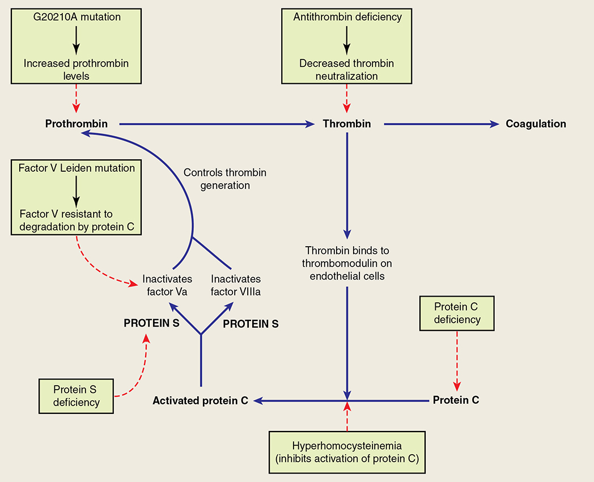
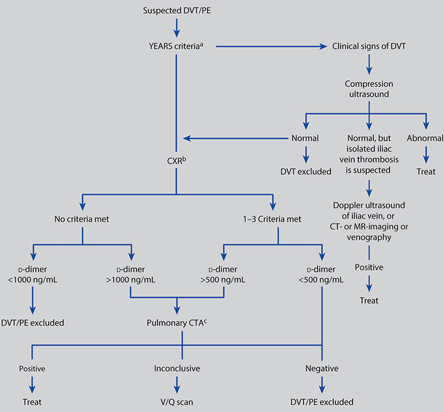
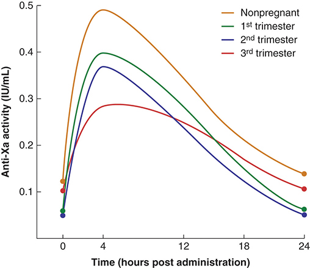
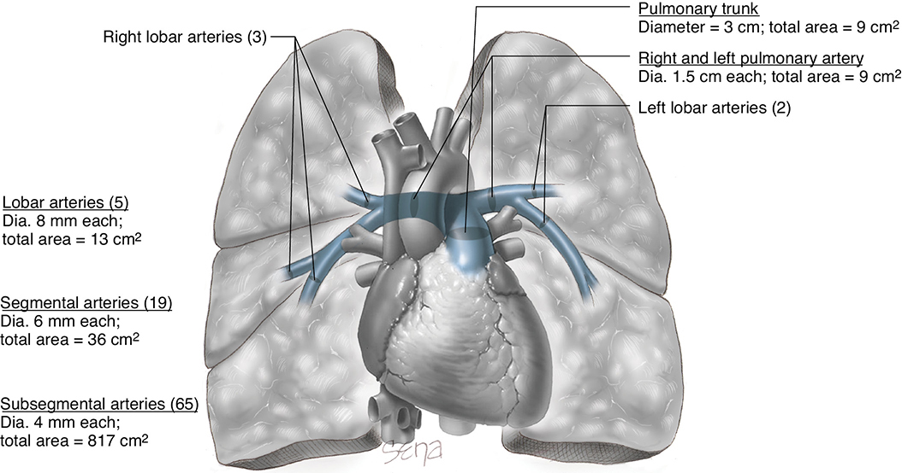
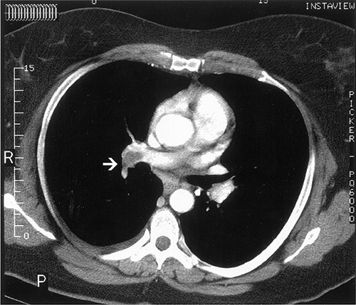

# Chapter 55: Thromboembolic Disorders — Revision Notes

> Williams Obstetrics 26e, pp. 2539–2583 of the PDF. High-yield numbers are in **bold**.
> The six tables are transcribed from the PDF images (they are missing from the extracted chapter text). All 5 figures are included from the PDF.

**Big picture:** VTE is rare (**1–2 per 1000 pregnancies**) but **~5× the nonpregnant risk**, and PE causes **~10% of pregnancy-related deaths**. Pregnancy raises all three parts of Virchow's triad. The biggest risk factors are **prior VTE** and **thrombophilia**. Diagnosis starts with **compression ultrasound**; treatment is **LMWH** (warfarin only postpartum or with mechanical valves). Prophylaxis guidelines disagree widely.

---

## 1. Epidemiology

- Early ambulation dramatically ↓ puerperal VTE, yet it remains a **leading cause of maternal morbidity and mortality**.
- **Thrombotic PE ≈ 10% of US pregnancy-related deaths** (2011–2015).
- Incidence **1–2 per 1000 pregnancies**, **~5× nonpregnant**.
- Cases split ~equally antepartum and postpartum, but **DVT alone is more frequent antepartum**, **PE is more common postpartum**.
- Postpartum incidence: **22 per 100,000 deliveries in weeks 0–6**, **~3 per 100,000 in weeks 7–12**.
- **Postthrombotic syndrome** in up to **2%**.

---

## 2. Pathophysiology

- **Virchow's triad** (1856) — all ↑ in pregnancy:
  1. **Stasis** — uterus compresses pelvic veins and IVC; **leg venous flow velocity ↓ 50%** from the early 3rd trimester to **6 wk postpartum**. **Stasis = the most constant predisposing factor.**
  2. **Endothelial injury** — stasis, delivery, preeclampsia, sepsis.
  3. **Hypercoagulability** — ↑ synthesis of most clotting factors.
- **Most important risk factor = personal history of thrombosis**: **15–25%** of pregnancy VTE are recurrences.
- **20–50%** of women with pregnancy/postpartum VTE have an identifiable **inherited thrombophilia**.
- Risk **~2×** with multifetal gestation, anemia, hyperemesis, hemorrhage, **cesarean**, obesity, preeclampsia, postpartum infection; higher after **stillbirth** or **peripartum hysterectomy**. **IBD 2–3×.**

### Table 55-1. Some Risk Factors Associated with an Increased Risk for VTE

| Obstetrical | General |
|---|---|
| Cesarean delivery | Age 35 years or older |
| Cesarean hysterectomy | Anatomical anomalyᵃ |
| Diabetes mellitus | Antiphospholipid antibodies |
| Hemorrhage and anemia | Connective tissue disease |
| Hyperemesis | Dehydration |
| Immobility — prolonged bed rest | Hormonal contraceptives |
| Multifetal gestation | Hospitalization |
| Multiparity | Immobility |
| Preeclampsia | Infection and inflammatory disease |
| Puerperal infection | Inflammatory bowel disease |
| Stillbirth | Malignancy |
| | Nephrotic syndrome |
| | Obesity |
| | Orthopedic procedures |
| | Paraplegia |
| | **Prior VTE** |
| | Sickle-cell disease |
| | Smoking |
| | Surgery |
| | **Thrombophilia** |

*ᵃIncludes May-Thurner syndrome (iliac vein compression syndrome). VTE = venous thromboembolism.*

---

## 3. Thrombophilias

- Inherited or acquired deficiencies of the **inhibitory (regulatory) proteins** of coagulation → hypercoagulability and recurrent VTE.
- Present in **~15%** of white Europeans but responsible for **~50%** of pregnancy VTE.

*Figure 55-1. Where each thrombophilia acts: G20210A ↑ prothrombin; antithrombin deficiency ↓ thrombin neutralization; FVL resists protein C; protein C/S deficiency and hyperhomocysteinemia impair the protein C pathway that inactivates Va and VIIIa.*

### Table 55-2. Inherited Thrombophilias and Their Association with Venous Thromboembolism (VTE) in Pregnancy

| Thrombophilia | VTE risk/pregnancy (%): No History | Prior VTE | Family History |
|---|---|---|---|
| Factor V Leiden heterozygote | 0.5–3.1 | **10** | 0.06–1.2 |
| Factor V Leiden homozygote | 2.2–14 | **17** | 1–16 |
| Prothrombin gene heterozygote | 0.4–2.6 | >10 | 0–0.73 |
| Prothrombin gene homozygote | 2–4 | >17 | 1.6 |
| FVL/prothrombin double heterozygote | 8.2 | **>20** | 0–2.4 |
| **Antithrombin deficiency** | 0.2–1.16 | **40** | 0–8 |
| Protein C deficiency | 0.1–5.4 | 4–17 | 0–5 |
| Protein S deficiency | 0.1–6.6 | 0–22 | 0–1.5 |
| Hyperhomocysteinemia | 0 | 0 | <1 |

*Data from Abbattista, 2020; ACOG, 2020a; Bates, 2018; Croles, 2017.*
*The printed FVL homozygote "no history" value reads "2.2–1.4" (reversed), probably 2.2–14. The printed family-history column conflicts with the text, which gives ≥10% for FVL heterozygotes (and >10% for prothrombin heterozygotes) with a personal or family history, and 6–7% for protein S deficiency with a family history.*

### Inherited thrombophilias — overview
- Often a **family history**; found in **up to ½ of patients with VTE before age 45**, especially unprovoked.
- Most significant family history: **sudden death from PE** or several relatives on long-term anticoagulation.

**Antithrombin deficiency**
- Liver-made; inactivates **thrombin and factor Xa**. **Heparin accelerates antithrombin >1000-fold.**
- Autosomal dominant. **Type I** ↓ synthesis (normal protein); **type II** normal levels, ↓ function.
- **Homozygous = lethal.** Heterozygous **~1 in 2500**.
- ⚠️ **The most thrombogenic heritable thrombophilia:** **25–50× RR** of VTE in the general population; **6×** in pregnancy.
- 18 pregnancies: untreated → 3 VTE, **50% stillbirth and FGR**; LMWH-treated → no VTE or stillbirth (¼ FGR). VTE **7% with LMWH vs 12%** without.
- **Anticoagulate in pregnancy regardless of prior thrombosis.** When anticoagulation must be withheld (surgery, delivery) or VTE occurs on treatment → **recombinant human antithrombin**.

**Protein C deficiency**
- Thrombin + thrombomodulin activates **protein C**, which with **protein S inactivates Va and VIIIa**. Protein C activity rises modestly in the first half of pregnancy.
- >160 autosomal dominant mutations; heterozygous prevalence **2–3 per 1000** (variable expression); lab threshold **50–60%** activity.
- **6–12× VTE risk.** Homozygous → **fatal neonatal purpura fulminans**; sepsis can cause purpura fulminans in heterozygous adults.

**Protein S deficiency**
- Cofactor for activated protein C. >130 mutations; prevalence **0.3–1.3 per 1000**.
- **Free, functional and total protein S all fall in normal pregnancy** (and with some OCs) → diagnosis in pregnancy is difficult.
- If screening in pregnancy is needed: **free protein S antigen <30% (2nd trimester), <24% (3rd trimester)**.
- VTE risk ↑ severalfold; **6–7% with a positive family history**. Maternal **cerebral vein thrombosis** described (5 of 29 pregnant women had thrombosis). Neonatal homozygous → purpura fulminans.

**Factor V Leiden (FVL)**
- **Most prevalent thrombophilia** → **activated protein C resistance**. Missense mutation: **glutamine for arginine at position 506** → factor Va inactivated **~10× more slowly**.
- **Heterozygous FVL = most common heritable thrombophilia:** **3–15%** of select Europeans, **1.2%** African Americans, 2.2% Hispanic Americans; **virtually absent in African blacks and Asians**.
- Heterozygotes account for **~40% of pregnancy VTE**.

| FVL genotype | No personal/family history | With personal or first-degree family history (<50 y) |
|---|---|---|
| Heterozygous | **5–12 per 1000 births** | **≥10%** |
| Homozygous | **1–4%** | **~17%** |

- **Diagnose by DNA analysis in pregnancy** — the APC-resistance bioassay is unreliable (normal APC resistance develops in pregnancy). **APS can also cause APC resistance.**
- 491 carriers vs 1055 controls: all 3 VTE in carriers, but no difference in preterm birth, birthweight or hypertension.
- **MFMU (~5000 women): 2.7% heterozygous**; none of the VTE (0.8/1000) in carriers; no ↑ preeclampsia, abruption, FGR or loss → **universal screening and prophylaxis for carriers without prior VTE not indicated.**

**Prothrombin G20210A mutation**
- Missense mutation → excess prothrombin: **+30% heterozygotes, +70% homozygotes**.
- Heterozygote **with** personal/first-degree family history (<50 y): **>10%**; **without: <1%**.
- ~4200 women: **3.8%** carriers (1 homozygous); no ↑ loss, preeclampsia, FGR or abruption.
- **Homozygous or double heterozygous (with FVL) → higher risk.**

**Hyperhomocysteinemia**
- Commonest cause: **MTHFR C677T thermolabile mutation** (autosomal recessive; printed as "C667T"). Also enzyme defects and deficiency of **folate, B6, B12**.
- Homocysteine **falls in normal pregnancy**; folate supplementation may explain the lack of VTE association in North America.
- ⚠️ **ACOG: do not test MTHFR polymorphisms or fasting homocysteine** for VTE evaluation.

**Others:** low **protein Z** and **PAI-1** promoter polymorphisms — slight ↑ risk; **screening not recommended**.

### Acquired thrombophilias
- **Antiphospholipid syndrome (APS)**, **heparin-induced thrombocytopenia**, **cancer**.

**Antiphospholipid syndrome**
- Venous and arterial thrombosis: most often **deep leg veins** and **cerebral arteries**.
- **Obstetric criteria** (any one):
  1. **≥1 unexplained fetal death ≥10 wk**
  2. **≥1 preterm birth <34 wk** from eclampsia, severe preeclampsia or placental insufficiency
  3. **≥3 unexplained consecutive spontaneous abortions <10 wk**
- **Test for aPL** with unexplained arterial or venous thrombosis, **one fetal loss**, or **≥3 recurrent embryonic/fetal losses**. Preterm severe preeclampsia or early placental insufficiency alone do not justify testing (aPL may worsen HELLP prognosis).
- **Test all three:** (1) **lupus anticoagulant**, (2) **anticardiolipin IgG and IgM**, (3) **anti-β₂ glycoprotein-I IgG and IgM**. **Repeat any positive test after 12 weeks.**
- **Anticardiolipin = most common sole antibody.** Thrombosis risk **5–12%** in pregnancy/puerperium; up to **25%** of APS thromboses occur then.

### Thrombophilias and pregnancy complications
- ⚠️ **No definite causal link between inherited thrombophilias and adverse pregnancy outcomes.**
- ACOG: **do not screen for inherited thrombophilias** after fetal loss, FGR, abruption or preeclampsia; **no benefit of aspirin/heparin** (unlike APS).
- Stillbirth not ↑ with heterozygous mutations (weak link with **homozygous FVL**). No ↑ FGR. Abruption: prospective cohorts negative (one older study positive). Preeclampsia: meta-analysis of ~22,000 negative for FVL/prothrombin; 12 thrombophilias negative.
- In contrast, **APS is strongly linked** to fetal loss, recurrent loss and preeclampsia.

### Thrombophilia screening
- **Universal screening is not cost-effective** → selective.
- **ACOG — consider screening if:**
  1. **Personal history of VTE** (with or without a recurrent risk factor such as fracture, surgery, prolonged immobilization)
  2. **First-degree relative** (parent or sibling) **with a high-risk inherited thrombophilia**

- **Not** for recurrent fetal loss or adverse outcomes; **no homocysteine screening**.
- Test **≥6 weeks after the thrombosis**, when **not pregnant**, **not anticoagulated**, and **not on hormonal therapy** where possible.

### Table 55-3. How to Test for Thrombophilias

| Thrombophilia | Testing Method | Reliable During Pregnancy? | Reliable During Acute Thrombosis? | Reliable with Anticoagulation? |
|---|---|---|---|---|
| Factor V Leiden mutation | Activated protein C resistance assay (second generation) | Yes | Yes | No |
| | If abnormal: DNA analysis | Yes | Yes | Yes |
| Prothrombin gene mutation G20210A | DNA analysis | Yes | Yes | Yes |
| Protein C deficiency | Protein C activity (<65%) | Yes | No | No |
| Protein S deficiency | Functional assay (<55%) | **Noᵃ** | No | No |
| Antithrombin deficiency | Antithrombin activity (<60%) | Yes | No | No |

*ᵃIf screening in pregnancy is necessary, cutoff values for free protein S antigen levels in the second and third trimesters have been identified at less than 30% and less than 24%, respectively. From ACOG Practice Bulletin No. 197: Inherited Thrombophilias in Pregnancy, 2018.*

> **Memory hook:** "**DNA tests never lie; protein tests lie during clots and heparin.**" Genetic tests (FVL, prothrombin) are reliable anytime; functional protein assays (C, S, AT) are not reliable during acute thrombosis or anticoagulation, and protein S not in pregnancy.

---

## 4. Deep-Vein Thrombosis

### Clinical presentation
- Pregnancy DVT is mostly **iliofemoral/iliac, without calf involvement** (vs **>80% calf** in the general population).
- **Vast majority left-sided** — the **right iliac artery and the ovarian artery cross the left iliac vein only** (contrast: the **ureter** is compressed more on the right).
- Abrupt **pain and edema of leg and thigh**; reflex arterial spasm may give a **pale, cool limb with ↓ pulses**; calf circumference discordance. Some large clots are nearly silent.
- **Homans sign** (calf pain on squeezing or Achilles stretch) is nonspecific (muscle strain, contusion).
- ⚠️ **30–60% of confirmed DVTs have an asymptomatic PE.**

### Diagnosis
- **Clinical diagnosis confirmed in only 10%** → objective testing needed. Most tests are not validated in pregnancy.

*Figure 55-2. Pregnancy-adapted YEARS algorithm: DVT signs → compression ultrasound; otherwise CXR, then D-dimer cutoffs of 1000 ng/mL (no criteria) or 500 ng/mL (1–3 criteria) decide on CT angiography.*

**Compression ultrasonography (first-line)**
- **Initial test for suspected DVT = compression US of the proximal leg veins** (noncompressibility + echo architecture).
- Nonpregnant: normal US → safe to withhold anticoagulation for 1 week; **serial studies** because **~¼ of missed calf clots extend proximally within 1–2 weeks**.
- Pregnancy caveat: normal US does not exclude PE (already embolized, or **iliac/pelvic clot** out of view).
- Two studies (221 and 210 women): **a single negative complete compression US safely excludes DVT in most pregnant women**.
- Isolated **iliac vein thrombosis** suspected → **Doppler of iliac vein, CT/MR, or venography**.

**MR imaging**
- Excellent above the inguinal ligament → **iliofemoral and pelvic vein thrombosis**; MR venography.
- **Sensitivity 100%, specificity 90%** (nonpregnant). ~½ of those without DVT had another diagnosis (cellulitis, myositis, edema, hematoma, superficial phlebitis).

**D-dimer**
- Rises with gestational age, multifetal pregnancy, cesarean, abruption, preeclampsia, sepsis → problematic.
- **Pregnancy-adapted YEARS** (3 criteria: **clinical signs of DVT, hemoptysis, PE most likely diagnosis**): PE excluded if **0 criteria + D-dimer <1000 ng/mL**, or **≥1 criterion + D-dimer <500 ng/mL**.
- **DiPEP:** neither clinical risk factors nor D-dimer identified PE accurately → image all.
- ⚠️ **ACOG recommends against D-dimer to diagnose VTE in pregnancy** (Parkland agrees), though a **negative D-dimer is reassuring** unless VTE is the most likely diagnosis.

### Management of VTE
- **Anticoagulation + limited activity.** **Thrombophilia testing does not change treatment.**
- **UFH or LMWH** acceptable; **LMWH preferred** (ASH): better bioavailability, longer half-life, predictable response, **less osteoporosis and thrombocytopenia**, less frequent dosing.

### Table 55-4. Anticoagulation Regimen Definitions

| Anticoagulation Regimen | Definition |
|---|---|
| **Prophylactic LMWH**ᵃ | **Enoxaparin 40 mg SC once daily**; dalteparin 5000 units SC once daily; nadroparin 2850 units SC once daily; tinzaparin 4500 units SC once daily |
| **Therapeutic LMWH**ᵇ | **Enoxaparin 1 mg/kg every 12 hours**; dalteparin 200 units/kg once daily; tinzaparin 175 units/kg once daily; dalteparin 100 units/kg every 12 hours. Target **anti-Xa 0.6–1.0 units/mL 4 hours after last injection** for twice-daily regimen; slightly higher doses may be needed for a once-daily regimen |
| **Prophylactic UFH** | **5000–7000 units SC q12h (1st trimester)**; **7500–10,000 units SC q12h (2nd trimester)**; **10,000 units SC q12h (3rd trimester)** unless the aPTT is elevated |
| **Adjusted-dose (therapeutic) UFH**ᵇ | **≥10,000 units SC q12h**, adjusted to target **aPTT 1.5–2.5 × control 6 hours after injection** |
| Postpartum anticoagulation | Prophylactic, intermediate or adjusted-dose LMWH for **6–8 weeks** as indicated. Oral anticoagulants may be considered postpartum based on planned duration, lactation and patient preference |
| Surveillance | Clinical vigilance and objective investigation of women with symptoms suspicious of DVT or PE. **VTE risk assessment prepregnancy or early in pregnancy**, repeated if complications develop (especially hospitalization or prolonged immobility) |

*ᵃAt extremes of body weight, modification of dose may be required. ᵇAlso referred to as weight-adjusted, full treatment dose. aPTT = activated partial thromboplastin time; LMWH = low-molecular-weight heparin; SC = subcutaneously; UFH = unfractionated heparin. From ACOG Practice Bulletin No. 197, 2018. (An "intermediate" regimen is referred to elsewhere but not defined in this table.)*

**Duration**
- Nonpregnant: **≥3 months**.
- **ACOG: therapeutic anticoagulation for 3–6 months, then intermediate or prophylactic dose for the rest of pregnancy and postpartum.** DOACs can be considered if not breastfeeding.
- Untreated DVT → **PE in up to 60%**; anticoagulation ↓ this to **<5%**. PE mortality (nonpregnant) **~1%**.
- **Recovery:** leg pain settles over days → graded ambulation with elastic stockings after **7–10 days**.
- **Graduated compression stockings for 2 years** ↓ **postthrombotic syndrome** (chronic paresthesia/pain, intractable edema, skin changes, ulcers). Catheter-directed thrombolysis does **not** prevent it (ASH).

**Unfractionated heparin**
- Consider for **initial treatment** and when **delivery, surgery or thrombolysis** may be needed.
- Two options: IV then adjusted-dose SC q12h, **or** adjusted-dose SC q12h with aPTT checked **6 h post injection**.
- **IV regimen:** bolus **70–100 U/kg (5000–10,000 U)** → infusion **1000 U/h (15–20 U/kg/h)** → titrate to **aPTT 1.5–2.5× control**; IV for **5–7 days**, then SC maintaining aPTT 1.5–2.5×.
- **Lupus anticoagulant → aPTT unreliable → use anti-Xa levels.**

**Low-molecular-weight heparin**
- MW **4000–5000 Da** (vs 12,000–16,000 for UFH). **No heparin crosses the placenta**; all act via **antithrombin**.
- UFH: equal anti-Xa and anti-thrombin activity; **LMWH: more anti-Xa**. More predictable, fewer bleeds (bioavailability, longer half-life, dose-independent clearance, less platelet interference).
- **Longer half-life prohibits neuraxial analgesia** in labor. **Renally cleared** → caution with renal dysfunction. More effective than UFH at shrinking thrombus.
- **Monitoring controversial:** ACOG → **anti-Xa 4 h after injection** with dose adjustment; ASH → routine anti-Xa monitoring hard to justify.
- **Clearance ↑ as pregnancy advances** (Fig. 55-3). Tinzaparin **75–175 U/kg/d** needed for peak anti-Xa 0.1–1.0 U/mL; dalteparin **100 U/kg q12h may be insufficient** → slightly higher doses may be needed.
- **No teratogenicity** (enoxaparin). Tinzaparin (1267 women): no HIT, no maternal deaths, no regional-anesthesia complications; bleeding needing intervention **3.4%**.
- **LMWH safe in breastfeeding.**

*Figure 55-3. Enoxaparin 40 mg daily: peak anti-Xa (at ~4 h) falls from ~0.49 IU/mL nonpregnant to ~0.29 IU/mL in the third trimester (faster clearance).*

**Labor and delivery (neuraxial timing)**
- **Switch LMWH → UFH in the last month** (or sooner if delivery imminent) — mainly to avoid **epidural/spinal hematoma**, not delivery bleeding.

| Dose | Withhold UFH before neuraxial | Withhold LMWH before neuraxial |
|---|---|---|
| Low-dose (prophylactic) | **4–6 h** | **12 h** |
| Intermediate | **12 h** | **12–24 h** |
| Therapeutic | **24 h** | **24 h** |

*Society for Obstetric Anesthesia and Perinatology (Leffert, 2018).*

- In labor on UFH → verify clearance with **aPTT**.
- **Protamine sulfate: 1 mg per 100 U heparin, max 50 mg** — rarely needed; **not indicated for prophylactic doses**.
- Anticoagulation paused → **pneumatic compression devices**.

**Warfarin (vitamin K antagonists)**
- ⚠️ **Contraindicated antepartum** (crosses placenta → fetal death, malformations, hemorrhage) — **sole antepartum use: mechanical heart valve**.
- **Safe in breastfeeding** (doesn't accumulate in milk).
- **Postpartum:** IV heparin + oral warfarin started together; warfarin **5–10 mg for 2 days**, then titrate to **INR 2–3**.
- **Overlap heparin ≥5 days AND until INR therapeutic for 2 consecutive days** (avoid paradoxical thrombosis and **skin necrosis** from early anti–protein C effect).
- Puerperal women need **more warfarin (median 45 vs 24 mg)** and **longer (7 vs 4 days)** to reach target INR.

**Direct-acting oral anticoagulants (DOACs)**
- **Dabigatran** (thrombin inhibitor); **rivaroxaban, apixaban** (Xa inhibitors) — drugs of choice outside pregnancy.
- Reproductive risks essentially unknown; **dabigatran crosses the placenta**; milk excretion unknown → **avoid breastfeeding or use another agent (e.g., warfarin)**.

### Complications of anticoagulation
- **Hemorrhage** (most serious; recent surgery/lacerations, excess dose), **thrombocytopenia** and **osteoporosis** (the last two unique to heparin, less with LMWH).

**Heparin-induced thrombocytopenia (HIT)**

| | Type 1 (common) | HIT (severe, immune) |
|---|---|---|
| Mechanism | Nonimmune, benign | **IgG against platelet factor 4–heparin complexes** |
| Timing | First few days | **Days 5–10** |
| Course | Resolves in ~5 days without stopping heparin | Platelets fall **>50%** (over 1–3 days, from the post-heparin peak) and/or **thrombosis**; nadir **40,000–80,000/µL** |

- Incidence **3–5% nonpregnant vs <0.1% obstetric** (0/244 gravidas vs 10/244 nonpregnant).
- ACCP: **no platelet monitoring if HIT risk <1%**; otherwise **every 2–3 days from day 4 to 14**.
- Management by clinical findings (antibody/functional assays take days): **stop heparin, start alternative** — LMWH may cross-react → **fondaparinux** (pentasaccharide Xa inhibitor; used in pregnancy). **Avoid platelet transfusion.**

**Heparin-induced osteoporosis**
- With **≥6 months** of heparin; worse in smokers; less with LMWH. **Calcium 1500 mg/d** for women on any heparin.

### Anticoagulation and abortion
- Heparin does not preclude **careful curettage**; restart full-dose heparin **several hours** after atraumatic evacuation.

### Anticoagulation and delivery
- Blood loss depends on (1) dose, route and timing; (2) number/depth of incisions and lacerations; (3) myometrial contraction; (4) other coagulation defects. Heparin is generally **stopped for labor and delivery**.
- **ACOG: restart UFH/LMWH no sooner than 4–6 h after vaginal delivery or 6–12 h after cesarean.** Prophylaxis within 24 h of cesarean appears safe. **Parkland: wait ≥24 h** before therapeutic heparin after cesarean or vaginal delivery with significant lacerations.

---

## 5. Superficial Venous Thrombophlebitis

- Saphenous system; with **varicosities** or after an **IV catheter**. Treat with **analgesia, elastic support, heat, rest**.
- **↑ DVT risk 4–6×**; meta-analysis: **18% concomitant DVT, 7% PE**. ASH suggests **LMWH** (controversial).

---

## 6. Pulmonary Embolism

- **~10% of maternal deaths.** **70%** of gravidas with PE have clinical DVT; **30–60%** of DVTs have silent PE.

### Clinical presentation
- (~2500 nonpregnant patients) **dyspnea 82%, chest pain 49%, cough 20%, syncope 14%, hemoptysis 7%**.
- Tachypnea, apprehension, tachycardia; ± loud P2, rales, friction rub.
- **ECG:** right-axis deviation, anterior T-wave inversion. **CXR usually normal** (or atelectasis, infiltrate, cardiomegaly, effusion, regional oligemia).
- ⚠️ **Normal ABG does not exclude PE:** ~⅓ of young patients have **PO₂ >80 mm Hg**. **A–a gradient >20 mm Hg in >86%** — more useful.

### Massive and submassive PE
- **Massive = hemodynamic instability**, **5–10%** of cases. Obstruction → ↑ PVR, pulmonary hypertension, **acute RV dilation**.
- Significant pulmonary hypertension needs **60–75% occlusion**; **circulatory collapse needs 75–80%** → acutely symptomatic emboli are usually large (**saddle**).
- **Submassive = RV dysfunction**; mortality **~25% vs 1%** without RV dysfunction.
- ⚠️ **Give crystalloid carefully; support BP with vasopressors** — aggressive fluids worsen RV dysfunction. O₂, intubation and ventilation in preparation for thrombolysis, filter or embolectomy.

*Figure 55-4. Pulmonary arterial cross-sectional area: trunk/main arteries 9 cm², 5 lobar 13 cm², 19 segmental 36 cm², 65 subsegmental 817 cm² — a saddle embolus (50–90% occlusion) causes instability; emboli beyond the lobar arteries rarely do. (The printed legend gives these areas in "cm", meaning cm².)*

### Diagnosis
- Needs **high index of suspicion**. Radiation concern is outweighed by the danger of missing PE; a false diagnosis is also harmful (anticoagulation, delivery plans, contraception, future prophylaxis) → aim for **diagnostic certainty**.
- Same algorithm as DVT (Fig. 55-2): **leg compression US**, CXR and ECG; **echo** to exclude mimics (MI, tamponade, aortic dissection). Confirm with **CTPA, MR or V/Q scan**.
- **ASH: V/Q scan first-line**; **Parkland: CTPA preferred**.

| Test | Fetal dose | Maternal breast dose | Notes |
|---|---|---|---|
| **CTPA** (multidetector) | **0.45–0.6 mGy** | **10–70 mGy** | Most used; detects small distal emboli of uncertain significance; **negative CTPA → no VTE at follow-up** (318 women) |
| **V/Q scan** (⁹⁹ᵐTc-MAA) | **0.1–0.4 mGy** (negligible, both) | negligible | **¼ nondiagnostic** in pregnancy (pneumonia, bronchospasm) → then CTPA |
| Pulmonary angiography | Higher | — | Reference standard but invasive; reserved for equivocal cases |

- CTPA vs V/Q in 137 pregnant women: comparable; **~20% indeterminate** with both. Either is appropriate to exclude PE.

*Figure 55-5. CT pulmonary angiogram: large filling defect (thrombus) in the right pulmonary artery (arrow).*

### Management
- **Full anticoagulation** as for DVT (Table 55-4), plus as needed:

**Vena caval filters**
- **Recent PE + need for cesarean** → consider filter **before surgery** (reversal risks re-embolism; full anticoagulation risks hemorrhage).
- Also: **recurrent PE despite heparin**, or massive PE when thrombolysis isn't possible.
- Jugular or femoral insertion, even in labor. **Routine filters add nothing** to heparin. **Retrievable filters** removed at **1–2 wk**. Pregnancy complication rates ≈ nonpregnant; one series **29%** complications (incl. removal failure).

**Thrombolysis**
- Faster clot lysis and ↓ pulmonary hypertension in life-threatening PE. Submassive PE: **alteplase** ↓ death or escalation.
- Meta-analysis: recurrence or death **10% vs 17%** (lytic + heparin vs heparin), but **2% fatal bleeding** with lysis.
- Pregnancy: complications similar to nonpregnant → **don't withhold if indicated**. Within 48 h of delivery: transfusion in 5/8 cesareans (3 hysterectomies). 141 pregnant women: **maternal death 3%, major bleeding 9%**.

**Embolectomy**
- Rarely needed. Maternal operative risk reasonable, but **stillbirth 20–40%**.

---

## 7. Thromboprophylaxis

- **No consensus** (Cochrane) on who should receive prophylaxis; ASH mostly "suggests" rather than "recommends". Unindicated intervention is common.
- Decision depends on **personal and family VTE history, thrombophilia severity, and extra risk factors** (obesity, cesarean, immobility).

### Table 55-5. Some Recommendations for Thromboprophylaxis During Pregnancy

| Clinical Scenario | Pregnancy — ACOGᵃ | Pregnancy — ASHᵇ | Postpartum — ACOGᵃ | Postpartum — ASHᵇ |
|---|---|---|---|---|
| **Prior single VTE** | | | | |
| Risk factor no longer present | Surveillance only | Surveillance only | Surveillance *or* prophylactic heparin with additional risk factorsᶠ | Prophylactic *or* intermediate-dose heparin |
| Pregnancy- or estrogen-related, or no known association | Prophylactic *or* intermediate-dose heparin | Prophylactic *or* intermediate-dose heparin | Prophylactic, intermediate *or* therapeutic-dose heparin | Prophylactic *or* intermediate-dose heparin |
| Associated with a high-risk thrombophiliaᵈ or affected first-degree relative | Prophylactic, intermediate *or* therapeutic-dose heparin | NSS | Prophylactic, intermediate *or* therapeutic-dose heparin | Prophylactic *or* intermediate-dose heparin |
| Associated with a low-risk thrombophiliaᵉ | Prophylactic *or* intermediate-dose heparin | NSS | Prophylactic *or* intermediate-dose heparin | Prophylactic *or* intermediate-dose heparin |
| **Two or more prior VTEs ± thrombophilia** | | | | |
| Not receiving long-term anticoagulation | Intermediate *or* therapeutic-dose heparin | NSS | Intermediate *or* therapeutic-dose heparin | Prophylactic *or* intermediate-dose heparin |
| Receiving long-term anticoagulation | **Therapeutic-dose heparin** | Therapeutic-dose heparin | Resume long-term anticoagulation | Resume long-term anticoagulation |
| **No prior VTE** | | | | |
| No thrombophilia | Surveillance | NSS | Surveillance *or* prophylactic heparin with additional risk factorsᶠ | NSS |
| High-risk thrombophilia | Surveillance only *or* prophylactic-dose heparin | Surveillance | Prophylactic *or* intermediate-dose heparin | Prophylactic heparin |
| Positive family history VTE *and* low-risk thrombophiliaᶜ | Surveillance *or* prophylactic-dose heparin | Surveillance | Prophylactic *or* intermediate-dose heparin | Surveillance |
| Low-risk thrombophilia | Surveillance | Surveillance | Surveillance; prophylactic-dose heparin with additional risk factorsᶠ | Surveillance |
| Compound heterozygous thrombophilia | Prophylactic *or* intermediate-dose heparin | Prophylactic heparin | Prophylactic *or* intermediate-dose heparin | Prophylactic heparin |
| **Antiphospholipid antibodies** | | | | |
| History of VTE | Prophylactic heparin (?plus low-dose aspirin) | NSS | Prophylactic heparin; referral to specialistᵍ | NSS |
| No prior VTE | Surveillance *or* prophylactic heparin plus low-dose aspirin with recurrent pregnancy loss or stillbirthʰ | NSS | Prophylactic heparin plus low-dose aspirin × 6 weeks with recurrent pregnancy loss or stillbirthᵍ | NSS |

*ᵃACOG 2020a,b. ᵇAmerican Society of Hematology (Bates, 2018). ᶜPostpartum treatment levels should be ≥ antepartum treatment. ᵈ**High-risk thrombophilia:** antithrombin deficiency; doubly heterozygous or homozygous for prothrombin 20210A and factor V Leiden. ᵉ**Low-risk thrombophilia:** heterozygous factor V Leiden or prothrombin 20210A; protein S or C deficiency. ᶠFirst-degree relative with VTE at <50 years; other major thrombotic risk factors, e.g., obesity, prolonged immobility. ᵍWomen with antiphospholipid syndrome should not use estrogen-containing contraceptives. ʰTreatment is recommended if the diagnosis of APS is based on three or more prior pregnancy losses. NSS = not specifically stated; VTE = venous thromboembolism. Regimens are in Table 55-4.*
*In the printed table, footnote h is never referenced and the APS "No prior VTE" pregnancy cell carries f; h is clearly the intended footnote and is placed there above.*

### Prior VTE
- Generally **antepartum surveillance or heparin prophylaxis** for prior VTE without a recurrent risk factor.
- Evidence:
  - 87 Swedish women (not tested for thrombophilia): antepartum recurrence **15% despite UFH 5000 U bid vs 12% without** → low-dose UFH may be ineffective.
  - 125 women, single prior VTE, no antepartum heparin (4–6 wk postpartum only): 6 recurrences; **none if no thrombophilia or the prior clot had a temporary risk factor**.
  - 88 women without aPL, no prophylaxis: **22%** pregnancy/puerperal VTE; transient-risk-factor group (not pregnancy/OC): no antepartum recurrences, 2 postpartum.
- → **Prior VTE with thrombophilia or without a temporary risk factor → antepartum and postpartum prophylaxis.** Tailor to the circumstances of the original event.
- VTE can recur despite prophylaxis: **10%** of 270 women (12 before prophylaxis started, 16 on LMWH).
- **Parkland:** formerly UFH 5000–7500 U SC 2–3× daily; now **enoxaparin 40 mg SC daily**, switched to UFH near delivery.

### Cesarean delivery
- DVT and especially **fatal PE risk rises many-fold** after cesarean; ⅓ of US births are cesarean.
- Guidelines vary hugely — proportion of a cohort qualifying for pharmacologic prophylaxis: **ACOG ~1%, ACCP ~35%, RCOG ~85%** (SMFM).

### Table 55-6. Thromboprophylaxis Guidelines for Women Undergoing Cesarean Delivery

| Organization | Recommendations | Risk Factors |
|---|---|---|
| **ACOG**ᵃ | **Pneumatic compression devices for all**; pharmacological prophylaxis for risk factors | Risk factors not defined; individualize therapy |
| **SMFM**ᵇ | Pneumatic compression devices for all; prophylactic LMWH; intermediate-dose LMWH; individualized therapy | History of VTE; thrombophilia without history of VTE; **class III obesity with a thrombophilia or history of VTE**; combination of the above factors |
| **RCOG**ᶜ | **Prophylactic LMWH for 10 days** | **Cesarean during labor**; **BMI >40 kg/m²**; medical comorbidities; *or* **≥2 of:** age >35, parity >3, obesity, smoker, varicose veins, systemic infection, preeclampsia, preterm delivery, stillbirth, operative vaginal delivery, PPH, prolonged admission |
| RCOG | **Prophylactic LMWH for 6 weeks** | Prior VTE; high-risk thrombophilia; low-risk thrombophilia and family history of VTE; antenatal LMWH therapy |

*ᵃACOG 2020b. ᵇSMFM 2020. ᶜRCOG 2015. BMI = body mass index; LMWH = low-molecular-weight heparin; PPH = postpartum hemorrhage; VTE = venous thromboembolism.*

- **ACOG (since 2011): pneumatic compression devices before cesarean for all** women not already on prophylaxis; add UFH/LMWH for additional risk factors. **Don't delay an emergency cesarean** to start prophylaxis.
- HCA implementation: PE deaths fell from **7/458,097 to 1/465,880** cesareans.
- National Partnership for Maternal Safety (2016): expand prophylaxis to antenatal admissions **≥3 days**, vaginal births, and most cesareans — criticized as based on sparse data (Parkland agrees with the critics).

---

## Quick-Recall: Thrombophilias at a Glance

| Thrombophilia | Inheritance / prevalence | Mechanism | Key facts |
|---|---|---|---|
| **Antithrombin deficiency** | AD; ~1/2500; homozygous lethal | ↓ thrombin/Xa inactivation | **Most thrombogenic**; 40% VTE with prior VTE; anticoagulate all; recombinant AT |
| Protein C deficiency | AD; 2–3/1000 | ↓ inactivation of Va/VIIIa | 6–12×; homozygous → neonatal purpura fulminans |
| Protein S deficiency | 0.3–1.3/1000 | Cofactor for protein C | Levels fall in pregnancy (free S <30% / <24% cutoffs) |
| **Factor V Leiden** | **Most common**; 3–15% Europeans | APC resistance (Arg506Gln) | **~40% of pregnancy VTE**; DNA test in pregnancy |
| Prothrombin G20210A | 3.8% | ↑ Prothrombin (30% / 70%) | <1% without history; >10% with history |
| Hyperhomocysteinemia (MTHFR) | AR | Inhibits protein C activation | **Don't test** |
| **Antiphospholipid syndrome** | Acquired | Venous + arterial | LA, aCL, anti-β₂GPI; repeat at 12 wk; strong link to loss/preeclampsia |

## Key Numbers to Memorize
- VTE **1–2 per 1000** pregnancies; **5×** nonpregnant; PE **~10%** of pregnancy-related deaths
- Postpartum VTE **22 / 100,000** (0–6 wk) → **3 / 100,000** (7–12 wk)
- Leg venous flow **↓ 50%** (early 3rd trimester → 6 wk postpartum)
- Prior VTE = **15–25%** of pregnancy VTE; thrombophilia in **20–50%**
- Antithrombin: heparin accelerates **>1000×**; RR **25–50×**
- FVL heterozygous: **5–12/1000** without history, **≥10%** with; homozygous **1–4%** / **17%**
- APS: fetal death **≥10 wk**, preterm **<34 wk**, **≥3** losses **<10 wk**; repeat test **12 wk**; thrombosis **5–12%**
- Test thrombophilia **≥6 wk** after the event, off anticoagulation/hormones, not pregnant
- DVT: **left-sided**, iliofemoral; **30–60%** silent PE; clinical diagnosis confirmed in **10%**
- YEARS: D-dimer **<1000** (0 criteria) / **<500** ng/mL (≥1 criterion)
- UFH IV: bolus **70–100 U/kg**, **1000 U/h** (15–20 U/kg/h), aPTT **1.5–2.5×**
- Enoxaparin **40 mg daily** (prophylactic) / **1 mg/kg q12h** (therapeutic); anti-Xa **0.6–1.0** at **4 h**
- Therapeutic anticoagulation **3–6 months**, then prophylactic through **6–8 wk postpartum**
- Neuraxial: stop UFH **4–6 / 12 / 24 h**, LMWH **12 / 12–24 / 24 h**; switch to UFH in the **last month**
- Restart heparin **4–6 h** after vaginal, **6–12 h** after cesarean (Parkland ≥24 h)
- Protamine **1 mg / 100 U**, max **50 mg**
- Warfarin **5–10 mg × 2 days**, INR **2–3**; overlap **≥5 days** + INR ×2 days
- HIT: day **5–10**, platelets ↓ **>50%**, nadir **40–80 × 10³/µL**; **<0.1%** obstetric → **fondaparinux**
- Heparin osteoporosis: **≥6 months**; calcium **1500 mg/d**
- PE: dyspnea **82%**; A–a gradient **>20 mm Hg** in **>86%**; collapse needs **75–80%** occlusion; submassive mortality **25%**
- CTPA fetal **0.45–0.6 mGy** (breast 10–70); V/Q **0.1–0.4 mGy**; V/Q nondiagnostic **¼**
- Thrombolysis in pregnancy: maternal death **3%**, major bleeding **9%**; embolectomy stillbirth **20–40%**
- Cesarean prophylaxis eligibility: ACOG **1%**, ACCP **35%**, RCOG **85%**; RCOG LMWH **10 days** or **6 weeks**
