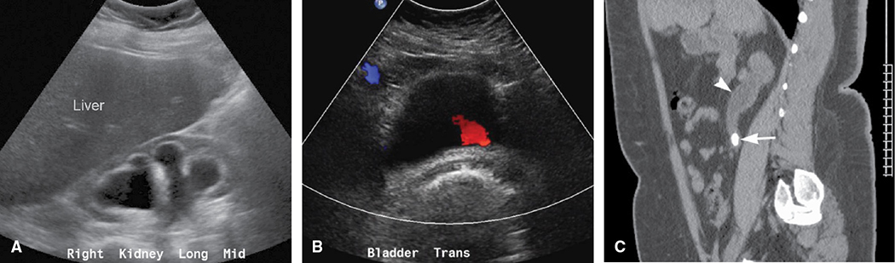
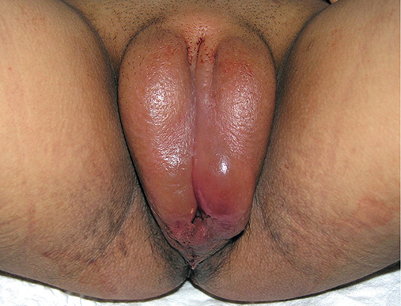
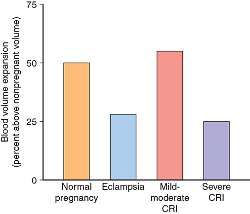
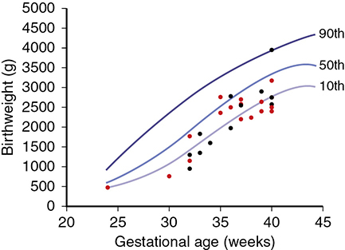
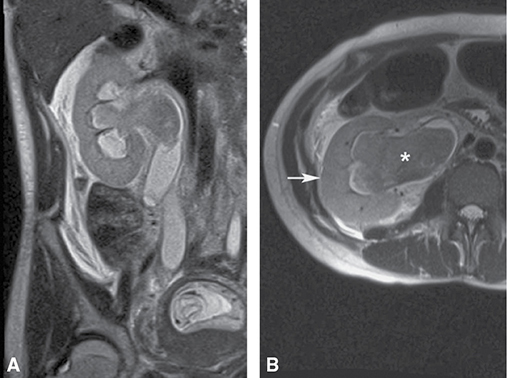
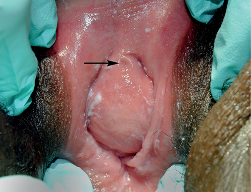

# Chapter 56: Renal and Urinary Tract Disorders — Revision Notes

> Williams Obstetrics 26e, pp. 2584–2629 of the PDF. High-yield numbers are in **bold**.
> The six tables are transcribed from the PDF images (they are missing from the extracted chapter text). All 6 figures are included from the PDF.

**Big picture:** Pregnancy dilates the collecting system (right > left) and raises GFR **~65%**, so creatinine normally falls and infections ascend easily. **Screen and treat asymptomatic bacteriuria** to prevent pyelonephritis — the **most common serious nonobstetric medical complication** and the leading cause of septic shock in pregnancy. For chronic renal disease, outcome depends on **degree of renal insufficiency and hypertension**, not on the specific lesion.

---

## 1. Pregnancy-Induced Urinary Tract Changes

- Kidney disorders in **~0.3%** of births (Australia).
- Kidneys enlarge; calyces and ureters dilate:
  - **Before 14 wk:** progesterone relaxes the muscularis.
  - **From midpregnancy:** ureteral compression, **especially right-sided**. Vesicoureteral reflux also occurs.
  - Consequences: ↑ **upper urinary infection** and **misread imaging**.
- Functional renal hypertrophy early; glomeruli larger (no more cells). Afferent and efferent arteriolar vasodilation.
- **GFR +20% by 12 wk**; ultimately **RPF +40%, GFR +65%** → serum creatinine and urea fall → **"normal" nonpregnant values may be abnormal in pregnancy**.

### Assessment of renal function
**Glucosuria**
- Occasional glucosuria is normal (↓ tubular glucose reabsorption). Dipstick ≥1+ is linked to later GDM but has **poor sensitivity**.
- **UK (NICE): early glucose testing for an isolated 2+ or repeated 1+** — reasonable.

**Proteinuria**
- Normal 24-h protein **115 mg** (95% limit **260 mg/d**), not different by trimester; albumin **5–30 mg/d**.
- **Abnormal = >300 mg/d.** Many regard **500 mg/d** as important with gestational hypertension.
- **Spot protein:creatinine ratio ≈ grams of protein per day**; best on a **first morning void**.
- Lower UTI does **not** increase proteinuria.

**Hematuria**
- Idiopathic dipstick hematuria (≥1+) in **3%** of nulliparas <20 wk → **2× preeclampsia** (not confirmed by all). Another series: dipstick hematuria **15%**, mostly trace, **false-positive rate 40%**.
- False positives: **vitamin C, povidone-iodine, myoglobin, free hemoglobin** → confirm with formal urinalysis.
- **Microscopic hematuria = >3 RBCs/HPF.**
- Workup: history/exam; exclude infection; glomerular disease → creatinine, BUN, PCR or 24-h protein, sediment (**dysmorphic RBCs, cellular casts**, proteinuria). **MR urography and cystoscopy** exclude tumor/stone.
- ⚠️ **ACOG: no cancer workup** for asymptomatic, low-risk, never-smoking women **<50 y with ≤25 RBCs/HPF**.

**Creatinine and imaging**
- **Serum creatinine persistently >0.9 mg/dL (75 µmol/L) → suspect intrinsic renal disease**; creatinine clearance estimates GFR.
- **Sonography:** size, consistency, obstruction. Full IVP not routine; **one-shot pyelography** (film 30 min after contrast) if needed. **MR** for renal masses.
- Cystoscopy for usual indications; **ureteroscopy for stones ~5% complications**.

**Renal biopsy**
- Relatively safe but usually postponed unless it will change therapy. **Complications 7% in pregnancy vs 1% postpartum** (243 biopsies).
- Consider for **rapid unexplained decline in renal function** or **symptomatic nephrotic syndrome**.
- **~50% of normal pregnant women** have slight–moderate **glomerular endotheliosis**; all 27 with proteinuric hypertension had moderate–severe endotheliosis.

### Pregnancy after unilateral nephrectomy
- The remaining kidney hypertrophies further in pregnancy; most do well.
- Check **serum creatinine and spot PCR**.
- **Prior kidney donation:** no permanent consequences, but **↑ subsequent preeclampsia**.

---

## 2. Urinary Tract Infections

- **UTIs are the most prevalent bacterial infections in pregnancy.** Perineal flora; **E. coli** causes most nonobstructive pyelonephritis.
- **~90% of these E. coli have adhesins (P- and S-fimbriae)** → ↑ adherence and virulence; maternal deaths with Dr+ and P adhesins.
- Predisposing: **urinary stasis, vesicoureteral reflux, diabetes**. Pregnancy → more severe urosepsis (reversed Th1:Th2 ratio, cytokine changes).
- **Puerperium:** ↓ bladder sensitivity (labor trauma, conduction analgesia), pain masking distention (episiotomy, laceration, hematoma), diuresis → overdistention → **catheterization → UTI**.

### Asymptomatic bacteriuria (ASB)
- **Definition: ≥10⁵ CFU/mL of ≥1 species on a voided culture** (IDSA 2019), without symptoms.
- Prevalence **2–6%** (sexually active nonpregnant) and **2–7%** in pregnancy — same as nonpregnant. **Highest in African-American multiparas with sickle-cell trait**; lowest in affluent white women of low parity; ↑ with diabetes.
- Usually **already present at the first prenatal visit**. After treatment, **<1%** develop symptomatic UTI.
- Pyelonephritis can occur at **20,000–50,000/mL** → may be prudent to treat lower counts.
- **Untreated ASB → symptomatic infection in ~25%**; treatment prevents most.
- **Screen at the first prenatal visit** (AAP/ACOG, USPSTF). **Leukocyte esterase/nitrite dipstick** is cost-effective where prevalence is low; Parkland cultures (prevalence **5–8%**). Susceptibilities not needed (empirical treatment). Agar-coated dipstick culture has excellent PPV/NPV.
- Benefits beyond pyelonephritis prevention are unclear (UTI linked with LBW, preterm birth, hypertension, anemia in some studies; symptomatic UTI → **1.4× preterm delivery <37 wk**).

**Treatment**
- **E. coli** most common. Parkland: **nitrofurantoin macrocrystals 100 mg at bedtime × 10 days**; 100 mg bid × 7 days also satisfactory; single-dose also works.
- ⚠️ **Recurrence ~30% with any regimen** (may reflect covert upper tract infection).
- **First recurrence = treatment failure** → consider **21 days** of therapy. Persistent/frequent ASB → **suppression for the rest of pregnancy: nitrofurantoin 100 mg at bedtime**. Rare serious side effects: **pulmonary and hepatic toxicity**.

### Table 56-1. Oral Antimicrobial Agents Used for Treatment of Pregnant Women with Asymptomatic Bacteriuria

| Regimen | Agents |
|---|---|
| **Single-dose treatment** | Amoxicillin 3 g; ampicillin 2 g; cephalosporin 2 g; nitrofurantoin 200 mg; trimethoprim-sulfamethoxazole 320/1600 mg |
| **3-day course** | Amoxicillin 500 mg three times daily; ampicillin 250 mg four times daily; cephalosporin 250 mg four times daily; nitrofurantoin 50–100 mg four times daily or 100 mg twice daily; trimethoprim-sulfamethoxazole 160/800 mg two times daily |
| **Other** | Nitrofurantoin 100 mg four times daily for 10 days; nitrofurantoin 100 mg twice daily for 5–7 days; **nitrofurantoin 100 mg at bedtime for 10 days** |
| **For treatment failures** | **Nitrofurantoin 100 mg four times daily for 21 days** |
| **Suppression for bacterial persistence or recurrence** | **Nitrofurantoin 100 mg at bedtime for remainder of pregnancy** |

### Cystitis and urethritis
- **7.2%** of pregnant women had outpatient UTI treatment (CDC, 2014).
- **Cystitis:** dysuria, urgency, frequency; few systemic signs. Pyuria, bacteriuria, microscopic (sometimes gross — hemorrhagic cystitis) hematuria.
- **~40% of pyelonephritis is preceded by lower tract symptoms.**
- **3-day regimens ~90% effective**; single-dose less effective (exclude pyelonephritis first).
- **Pyuria + sterile culture → urethritis from *Chlamydia trachomatis*** (often with mucopurulent cervicitis) → **azithromycin**.

### Acute pyelonephritis
- **Most common serious nonobstetrical medical complication of pregnancy.** ~29,000 US hospitalizations (2006); highest in **adolescents (17.5/1000)** and Hispanic women (10.1/1000). **3.5%** of antepartum admissions.
- **Leading cause of septic shock in pregnancy**; **12%** of Parkland intermediate-care antepartum admissions. Maternal urosepsis may ↑ **cerebral palsy** in preterm infants. No serious long-term maternal sequelae.

**Clinical findings**
- More common in the **second half**; risk factors **nulliparity and young age**.
- **Right-sided >½; bilateral ¼.**
- Abrupt **fever, shaking chills, lumbar pain**; anorexia, nausea, vomiting; **CVA tenderness**. Sediment: clumped leukocytes, bacteria.
- Differential: **labor, chorioamnionitis, appendicitis, abruption, infarcted leiomyoma**.
- **Bacteremia 15–20%.**

| Organism | Frequency |
|---|---|
| ***E. coli*** | **70–80%** |
| *Klebsiella pneumoniae* | 3–5% |
| *Enterobacter* or *Proteus* | 3–5% |
| Gram-positive (GBS, *S. aureus*) | up to 10% |

**Complications (endotoxin-mediated)**
- **Renal dysfunction in 5%** despite fluids (reversible) → monitor creatinine.
- **Respiratory insufficiency/pulmonary edema up to 10%** (alveolar injury) → may progress to **ARDS**.
- ⚠️ **β-agonist tocolysis → pulmonary edema 8% (4×)** (Na⁺/fluid retention).
- **Uterine contractions** (related to fever): **5/h at admission → 2/h within 6 h** of fluids and antibiotics.
- **Hemolysis → anemia in ~⅓**; recovery is normal (erythropoietin unaffected).

**Management**

### Table 56-2. Management of the Pregnant Woman with Acute Pyelonephritis

| Step |
|---|
| **Hospitalize** patient |
| Obtain **urine and blood cultures** |
| Evaluate hemogram, serum creatinine and electrolytes |
| Monitor vital signs frequently, including urinary output — consider indwelling catheter |
| **Establish urinary output ≥50 mL/h with IV crystalloid** |
| Administer IV antimicrobial therapy (see text) |
| Obtain **chest radiograph if dyspnea or tachypnea** |
| Repeat hematology and chemistry studies in 48 h |
| Change to oral antimicrobials when afebrile |
| **Discharge when afebrile 24 h**; consider antimicrobial therapy for 7–10 d |
| **Repeat urine culture 1–2 wk** after antimicrobial therapy completed |

*IV = intravenous. From Lucas, 1994; Sheffield, 2005. (The text recommends completing 10–14 days of total therapy; the table says 7–10 days of oral therapy after discharge.)*

- Blood cultures (Parkland: if **>39°C**) have limited utility.
- **IV hydration = cornerstone.** Antibiotics promptly — may transiently **worsen endotoxemia** (bacterial lysis). Monitor urine output, BP, pulse, temperature, O₂ saturation.
- Lower high fever (**cooling blanket, acetaminophen**) — especially early in pregnancy (hyperthermia teratogenic).
- **Antibiotics** (all ~95% effective): **ampicillin + gentamicin** (Parkland first-line); **cefazolin or ceftriaxone**; or an extended-spectrum agent. **<½ of E. coli are ampicillin-sensitive**, but gentamicin + ampicillin/cephalosporin is synergistic. Monitor creatinine with nephrotoxic drugs.
- **95% afebrile by 72 h.** After discharge, oral therapy to complete **10–14 days**.
- **Recurrence 30–40%** → **nitrofurantoin 100 mg at bedtime for the rest of pregnancy**.

**Persistent infection**
- Normal response: defervescence **~1°F per day**; **~20%** febrile >4 days.
- ⚠️ **No improvement by 48–72 h → look for obstruction, calculi or abscess** → **renal sonography**.
  - Stones may be missed by US → **plain film detects ~90%**; or modified one-shot IVP.
  - **Intrarenal/perinephric abscess or phlegmon → MR** if US inconclusive.
- **Relieve obstruction:** **percutaneous nephrostomy** preferred (easier to replace) or cystoscopic **double-J stent** (left until after delivery; encrusts, may need replacing). Some need stone surgery.
- **Abscess >3 cm** → percutaneous drainage or surgery.

**Outpatient management**
- 92 women given IM ceftriaxone 1 g × 2 (24 h apart): only **⅓ suitable** for outpatient care, and **⅓ of those failed** → **outpatient management suits very few pregnant women**.

### Reflux nephropathy
- Nephron loss from patchy interstitial scarring and tubular atrophy due to **high-pressure reflux of sterile urine**.
- Long-term **hypertension** (severe if renal damage). Impaired function and **bilateral scarring → more hypertensive disorders** (879 pregnancies).
- Women with childhood reflux surgery commonly have **bacteriuria** in pregnancy.

---

## 3. Nephrolithiasis

- Lifetime risk **9%** in women; onset in the **3rd decade**.
- **Calcium salts ~80%** → exclude **hyperparathyroidism**. Nonpregnant young women: **calcium oxalate**; **pregnancy: 65–75% calcium phosphate/hydroxyapatite** (↑ urinary pH ↓ calcium phosphate solubility).
- More common in parous women. **>½ form another stone within 10 years.**
- ⚠️ **A low-calcium diet promotes stones.** Prevention: **hydration, low-sodium, low-protein diet**; **thiazides** ↓ stones.
- **Indications for removal: obstruction, infection, intractable pain, heavy bleeding.** Cystoscopic basket extraction reasonable; lithotripsy not generally recommended in pregnancy.

### Stone disease during pregnancy
- Incidence **0.3–0.8 per 1000** pregnancies; mostly **2nd and 3rd trimesters**. Bladder stones rare (may obstruct labor).
- Outcomes conflicting: preterm delivery **10.6% vs 6.4%**; Taiwan **20–40% ↑ LBW and preterm**; others no difference. Stone formers before pregnancy → ↑ **GDM and preeclampsia**.

**Diagnosis**
- **Pain in >90%** (possibly fewer symptoms due to dilation). **Gross hematuria 2–23%** (less than nonpregnant).
- **Sonography first-line**, but many stones missed. **Indirect signs: abnormal dilation or absent ureteral "jets"**. Dilation without a visible stone → one-shot IVP.
- **MR = second-line** after nondiagnostic US. If CT needed: **unenhanced helical CT, fetal dose ~7 mGy**.

*Figure 56-1. Obstructing stone: (A) severe right hydronephrosis with thin parenchyma; (B) color Doppler shows a left ureteral jet but none from the right; (C) CT shows the mid-right ureteral stone (arrow) with hydroureteronephrosis.*

**Management**
- **IV hydration and analgesia**; strain urine. **Infection in ½** of symptomatic stones → treat vigorously. Persistent pyelonephritis → search for obstructing stone.
- **~75% improve with conservative therapy** and pass the stone.
- Others: **ureteral stent, ureteroscopy, percutaneous nephrostomy, transureteral laser lithotripsy** (holmium:YAG successful in 9/10), **basket extraction**. **<2%** need surgical exploration.
- Percutaneous nephrolithotomy limited by fluoroscopy. ⚠️ **Extracorporeal shock-wave lithotripsy is contraindicated in pregnancy.**

---

## 4. Pregnancy After Renal Transplantation

- >100,000 on the US waiting list (2020). **1-year graft survival 95% (living donor), 90% (deceased donor).**
- Immunosuppression: cyclosporine, OKT3 (anti-CD3), **tacrolimus**; ⚠️ **mycophenolate mofetil is teratogenic — 23% birth defects**.
- **Fertility returns promptly** after transplant → **counsel on contraception** (esp. on mycophenolate); >½ report no counseling.

### Pregnancy outcomes
- ↑ Severe maternal morbidity. >4700 pregnancies: **~70% live births**; ↑ preeclampsia, GDM, preterm delivery.
- UK cohort: live births **>90%**; **½ delivered <37 wk** (only **9% <32 wk**); **LBW ½, FGR 25%**; malformations not ↑ (except mycophenolate).
- **Preeclampsia 22%** (UK; up to ⅓ in reviews). ⚠️ **Rejection can be hard to distinguish from preeclampsia**; rejection only **~2%**.
- **BK virus (polyomavirus hominis 1)** infections frequent; **GDM ~5%** (immunosuppression).
- **Cyclosporine levels fall** with volume expansion (not linked to rejection). Cyclosporine and tacrolimus are **nephrotoxic** and cause hypertension; cyclosporine enters **breast milk**. Offspring neurodevelopment normal in small studies; late effects (malignancy, germ cells) remain a concern.
- Hyperfiltration did not harm long-term graft survival (34 recipients, 15 y).

**Italian Society of Nephrology — prerequisites before pregnancy**

| Requirement | Criterion |
|---|---|
| General health | Good for **≥1–2 years** after transplant |
| Stable renal function | **GFR ≥60 mL/min, creatinine <2 mg/dL, proteinuria <500 mg/d** |
| Rejection / drugs | **No recent rejection**; no teratogenic drugs |
| Hypertension | Absent or well controlled |

### Management
- **Close surveillance.** Treat covert bacteriuria; suppress if recurrent.
- Serial **liver enzymes and blood counts** (azathioprine, cyclosporine toxicity); ± cyclosporine levels.
- On **corticosteroids** → exclude overt diabetes with **GTT at first visit**.
- Surveillance for **HSV, CMV, toxoplasmosis**; BK virus in known carriers.
- **GFR usually ↑ 20–25%.** Significant creatinine rise → differential: **acute rejection, cyclosporine toxicity, preeclampsia, infection, obstruction**. Pyelonephritis or rejection → admit; imaging ± biopsy.
- Watch for hypertension and **superimposed preeclampsia** (manage as Ch 53). Fetal surveillance for FGR and preterm birth.
- **Cesarean for obstetric indications** (occasionally the transplanted kidney obstructs labor), yet overall cesarean rate **~80%**.

---

## 5. Polycystic Kidney Disease (PKD)

- Usually **autosomal dominant ciliopathy** of renal tubules. **~1 in 1000**; causes **5–10% of US ESRD**.
- **PKD1 (chromosome 16) ~85%; PKD2 (chromosome 4) ~15%.** Prenatal diagnosis if familial mutation/linkage known; **PGT ↓ affected fetuses to 1–2%**.
- Worse in men; symptoms in **3rd–4th decade**: flank pain, hematuria, proteinuria, masses, stones, infection. **Hypertension 75%**; progression to renal failure; acute failure from infection or **ureteral angulation** by cysts.
- Extrarenal: **hepatic cysts ⅓** (more aggressive in women); **~10% die from ruptured intracranial berry aneurysm**; **valvular lesions up to ¼** (MVP; mitral, aortic, tricuspid incompetence).

### Pregnancy outcomes
- Depend on **hypertension and renal insufficiency**. **UTIs common.**
- 605 pregnancies: composite perinatal complications **33% vs 26%** (similar), but **more hypertension/preeclampsia**. Pregnancy does **not accelerate** the disease.

---

## 6. Glomerular Diseases

- Glomerulonephritis = capillary inflammation, often autoimmune; single stimulus (post-streptococcal) or systemic (SLE, diabetes). Persistent disease → progressive renal decline, often silent until CKD.
- Goals before pregnancy: **stabilize disease, minimize proteinuria (immunosuppression), control hypertension, delay pregnancy until achieved**.

### Table 56-3. Patterns of Clinical Glomerulonephritis

| Syndrome | Causes |
|---|---|
| **Acute nephritic syndromes** | Poststreptococcal, infective endocarditis, SLE, antiglomerular basement membrane disease, **IgA nephropathy**, ANCA vasculitis, Henoch-Schönlein purpura, cryoglobulinemia, membranoproliferative and mesangioproliferative GN |
| **Pulmonary-renal syndromes** | **Goodpasture**, ANCA vasculitis, Henoch-Schönlein purpura, cryoglobulinemia |
| **Nephrotic syndromes** | Minimal change disease, FSGS, membranous GN, diabetes, amyloidosis, others |
| Basement membrane syndromes | Antiglomerular basement membrane disease, others |
| Glomerular vascular syndromes | Atherosclerosis, chronic hypertension, sickle-cell disease, thrombotic microangiopathies, antiphospholipid antibody syndrome, ANCA vasculitis, others |
| Infectious disease–associated syndromes | Poststreptococcal, infective endocarditis, HIV, HBV, HCV, syphilis, others |

*ANCA = antineutrophilic cytoplasmic antibodies; HBV = hepatitis B virus; HCV = hepatitis C virus; HIV = human immunodeficiency virus; IgA = immunoglobulin A; SLE = systemic lupus erythematosus.*

### Acute nephritic syndromes
- **Hypertension, hematuria, red-cell casts, pyuria, proteinuria**; salt/water retention → edema, circulatory congestion.
- May resolve, become **rapidly progressive** (→ ESRD) or chronic.
- **Poststreptococcal GN** = prototype (confused with eclampsia until the mid-1800s).
- **IgA nephropathy (Berger disease) = most common acute GN worldwide**; systemic form = Henoch-Schönlein purpura.
- **Anti-GBM (IgG) disease**; with lung involvement (alveolar hemorrhage) = **Goodpasture syndrome**.

**Pregnancy**
- Hard to distinguish from **severe preeclampsia** (e.g., lupus flare in the 2nd half) → renal biopsy sometimes needed.
- Primary GN (395 pregnancies, mostly normal function): **½ hypertension, ¼ preterm, perinatal mortality 80/1000 after 28 wk**; worst with impaired function, early/severe hypertension, nephrotic proteinuria.
- 48 pregnancies: **⅓ preeclampsia**, 39% doubled proteinuria, 27% creatinine ↑ ≥50%, **½ preterm, 13% perinatal death**.
- **IgA nephropathy** (376 pregnancies): perinatal mortality 12%, preterm 9%, LBW 10%, preeclampsia 7%. Whether pregnancy worsens IgA nephropathy is disputed.

### Nephrotic syndromes
- **Heavy proteinuria + hypoalbuminemia + hypercholesterolemia + edema**; hypertension often; albumin nephrotoxicity → progressive insufficiency.

### Table 56-4. Causes of the Nephrotic Syndrome in Adults

| Cause | Features |
|---|---|
| **Focal segmental glomerulosclerosis (FSGS) (35%)** | Viruses, hypertension, reflux nephropathy, sickle-cell disease |
| Membranous glomerulonephritis (~20%) | Idiopathic (most cases), malignancy, infection, connective tissue diseases |
| Minimal change disease (MCD) (10–15%) | Primary idiopathic (most cases), drug-induced (NSAIDs), allergies, viral infections |
| Diabetic nephropathy | **Most common cause of ESRD** |
| Glomerular deposition diseases | Light-chain, amyloidosis |

*ESRD = end-stage renal disease; NSAIDs = nonsteroidal antiinflammatory drugs.*

**Management**
- Treat by etiology (biopsy helps). **Normal amounts of high-biological-value protein** (high-protein diets ↑ proteinuria).
- ⚠️ **Thromboembolism ↑** (esp. **renal vein thrombosis**; arterial too): platelet hyperactivity, **urinary loss of antithrombotic factors**, ↑ hepatic prothrombotic factors.
- **Thromboprophylaxis throughout pregnancy if serum albumin <2 g/dL or proteinuria >3.5 g/24 h** (some recommend).
- Primary glomerular disease may respond to steroids/immunosuppressants; infection- or drug-induced cases remit when the cause is removed.

**Pregnancy**
- **½** with nephrotic-range proteinuria have rising protein excretion; Parkland: **⅔ exceeded 3 g/d**. With mild dysfunction, GFR still augments normally.
- Edema worsened by leg hydrostatic pressure; **massive vulvar edema** with comorbidities (diabetes, syphilis, preeclampsia).
- **Up to ½ have chronic hypertension**; preeclampsia is common and early.
- Without severe hypertension or renal insufficiency → usually successful; with them → much worse.
- **Parkland (65 pregnancies):** protein **~4 g/d**; renal insufficiency **75%**, chronic hypertension **40%**, anemia **25%**, **preeclampsia 60%**, **preterm 45%**; yet **53/57** liveborn.

*Figure 56-2. Massive vulvar edema in a gravida with heavy proteinuria from preeclampsia.*

**Long-term**
- **≥20% progress to ESRD within 10 years** (Parkland). Shortest renal survival with **creatinine >1.4 mg/dL and proteinuria >1 g/d**.

---

## 7. Chronic Kidney Disease (CKD)

- NKF staging by GFR: best stage **GFR ≥90 mL/min/1.73 m²** → **stage 5 GFR <15**.
- Commonest causes of ESRD: **diabetes, chronic hypertension, glomerulonephritis, PKD**.
- **Outcome depends mainly on degree of renal impairment and hypertension**, not the specific disease; systemic disease (diabetes, SLE) worsens prognosis.

| Older functional category (Davison) | Serum creatinine |
|---|---|
| Normal or mild impairment | **<1.5 mg/dL** |
| Moderate impairment | **1.5–3.0 mg/dL** |
| Severe insufficiency | **>3.0 mg/dL** |

*The text describes six NKF stages "from stage 0 (GFR ≥90)"; the NKF numbers stages 1–5 (stage 1 GFR ≥90), with stage 3 split into 3a/3b.*

### Pregnancy and CKD
- High rates of hypertension/preeclampsia, preterm birth, FGR. **Low-dose aspirin from 12–28 wk** to ↓ preeclampsia.
- Nephron loss → hyperfiltration of survivors → nephrosclerosis.
- **Pregnancy augmentation of RPF/GFR:** preserved with mild insufficiency; **only ½ with moderate** insufficiency; **none with severe**.
- **Blood volume expansion correlates inversely with creatinine:** mild–moderate **~55%**; severe **~25%** (like eclampsia) → plus chronic renal anemia → **hypovolemia and anemia even with normal delivery blood loss**.

*Figure 56-3. Blood volume expansion: normal pregnancy ~50%, mild–moderate CRI ~55%, but only ~25% with severe CRI — similar to eclampsia (~28%).*

**Renal disease with preserved function**
- Still ↑ complications (Table 56-5). Biopsy-proven glomerular disease (123 pregnancies): **40%** obstetric or renal complications.
- GN with minimal insufficiency (395): impaired function **15%**, worse proteinuria **60%**, hypertension **>½** (only 12% chronic HTN beforehand); **perinatal mortality 140/1000** (50/1000 even without severe features); **permanent decline in 5%**.

### Table 56-5. Complications (%) Associated with Chronic Kidney Disease During Pregnancy

| Complication | Preserved Function | Renal Insufficiency: Moderate and Severe | Renal Insufficiency: Severe |
|---|---|---|---|
| Chronic hypertension | 25 | 30–70 | 50 |
| Gestational hypertension | 20–50 | 30–50 | **75** |
| Worsening renal function | 8–15 | 20–43 | 35 |
| Permanent dysfunction | 4–5 | 10–20 | 35 |
| Preterm delivery | 7 | 30–60 | **73** |
| Fetal-growth restriction | 8–14 | 30–38 | **57** |
| Perinatal mortality | 5–14 | 4–7 | 0 |

*Data from Alsuwaida, 2011; Cunningham, 1990; Farwell, 2013; He, 2018; Imbasciati, 2007; Maruotti, 2012; Nevis, 2011; Piccoli, 2010, 2011; Stettler, 1992; Trevisan, 2004; Zhang, 2015.*

**Chronic renal insufficiency**
- Complications rise with impairment. Systematic review (1514 CKD pregnancies) — odds ratios: **preeclampsia 10.4, preterm 6.3, FGR 4.9, cesarean 2.7**.
- Despite frequent hypertension, anemia, preeclampsia, preterm birth and FGR, perinatal outcomes generally acceptable.

*Figure 56-4. Birthweights in renal insufficiency cluster at or below the 10th percentile, more so with severe disease (red).*

### Management
- **Frequent BP monitoring**; creatinine and 24-h protein as indicated.
- **Treat bacteriuria** (↓ pyelonephritis and nephron loss).
- ⚠️ **Protein-restricted diets not recommended.**
- Anemia may respond to **recombinant erythropoietin** (side effect: hypertension).
- **Serial sonography** for growth.
- Worsening hypertension vs superimposed preeclampsia is hard to separate; **PlGF and sFlt-1** may help.

### Long-term effects
- Pregnancy may accelerate CKD (hyperfiltration → nephrosclerosis), especially with severe insufficiency; few long-term effects with normal baseline function (360 women with GN).
- **Moderate–severe insufficiency: 20% ESRD by ~4 years** (Parkland); confirmed in stage 3–4 CKD.
- **10% ESRD at 1 year** postpartum (Jones & Hayslett). Prepregnancy **creatinine ≥1.4 mg/dL + proteinuria >1 g/d → 30% ESRD at ~3 years**.
- **Chronic proteinuria found in pregnancy → 20% ESRD within several years.**
- But nonpregnant women lose function at the same rate → pregnancy may not hasten a predetermined decline.

### Dialysis during pregnancy
- Severe renal impairment → **subfertility**, correctable with hemodialysis or peritoneal dialysis.
- Maternal complications: **severe hypertension, abruption, heart failure, sepsis**.

### Table 56-6. Pregnancy Outcomes in Women Undergoing Dialysis During Pregnancy

| Study (Year) | N | Delivery (weeks) | Birthweight (g) | Hypertension (%) | Hydramnios (%) | Perinatal Mortality (%) | Surviving Infants (%) |
|---|---|---|---|---|---|---|---|
| Toma (1999) | 54 | 31.9 | 1545 | 35 | 44 | 33 | 67 |
| Chao (2002) | 13 | 32 | 1540 | 72 | 46 | 31 | 69 |
| Tan (2006) | 11 | 31 | 1390 | 36 | 18 | 18 | 82 |
| Chou (2008) | 13 | 30.8 | 1510 | 57 | 71 | 50 | 50 |
| Luders (2010) | 52 | 32.7 | 1555 | 67 | 40 | 13 | 87 |
| Shahir (2013) | 13 | NS | 2130 | 19ᵃ | 14 | 22 | 78 |
| Jesudason (2014) | 77 | 33.8 | 1750 | NS | NS | 20 | 80 |
| **Approximate averages** | **233** | **~32** | **~1600** | **~50** | **~44** | **~25** | **~75** |

*ᵃPreeclampsia only. NS = not stated.*

- **Perinatal mortality ~250/1000** (Table 56-6); systematic review (681 pregnancies): **180/1000**. **More dialysis hours/week → better outcomes**; **hemodialysis superior to peritoneal dialysis**.
- Already on dialysis → continue the same method, **increasing frequency**.
- **Start dialysis when creatinine clearance ≤20 mL/min** (consider). **5–6 sessions/week** to avoid abrupt volume shifts and hypotension.
- **Protocol:** **double multivitamins**; oral **calcium and iron**; adequate protein and calories; **erythropoietin** for anemia; dialysate with **extra calcium and less bicarbonate**.

---

## 8. Acute Kidney Injury (AKI)

- **Definition:** creatinine ↑ **≥0.3 mg/dL within 48 h**, or **≥50% from baseline within a week**, or urine output **<0.5 mL/kg/h for >6 h**. Pregnancy criteria not standardized (most use ↑ ≥0.3 mg/dL).
- Incidence **2.68 per 10,000 births** (Canada, 2009–2010), much lower than before.
- Older series (266 women): **preeclampsia ~70%**, obstetric **hemorrhage ~50%**, **abruption ~30%**; **dialysis ~20%**; **maternal mortality ~15%**.
- Main causes today: **severe preeclampsia and hemorrhage** (abruption, **HELLP**), **sepsis** (resource-poor settings), **acute fatty liver** (renal insufficiency in virtually all 52 Parkland cases), **hyperemesis** dehydration, **thrombotic microangiopathies**.

### Diagnosis and management
- Mostly **postpartum** (no fetal issues). Acute creatinine rise is usually **renal ischemia**; oliguria is also key. Prerenal and intrarenal factors often coexist (e.g., abruption hypovolemia + preeclampsia).
- Severe azotemia and persistent oliguria → **hemofiltration or dialysis early**, before marked deterioration (↓ mortality, better recovery). Normalize hemodynamics.
- **Adjust drug doses** — especially **magnesium sulfate**.
- Function usually returns to (near) normal, but later pregnancies have ↑ hypertension and adverse fetal outcomes.

### Prevention
1. **Prompt, vigorous volume replacement** (crystalloid + blood) for massive hemorrhage — abruption, previa, uterine rupture, atony
2. **Deliver/terminate** pregnancies with severe preeclampsia or eclampsia; careful transfusion if blood loss is above average
3. **Close watch for sepsis and shock** with pyelonephritis, septic abortion, chorioamnionitis, pelvic infection
4. ⚠️ **No loop diuretics for oliguria** until blood volume and cardiac output are adequate
5. **Vasoconstrictors judiciously**, only once pathological vasodilation is confirmed as the cause of hypotension

**Acute cortical necrosis**
- Irreversible ischemic failure; now **exceedingly uncommon** (formerly **¼** of obstetric renal failure). Followed abruption, preeclampsia–eclampsia, endotoxic shock (septic abortion).
- Thrombosis of renal vascular segments (focal → gross). Indistinguishable from ATN early; recovery variable; may leave stable insufficiency.

### Obstructive renal failure
- Rarely, a **very large uterus** compresses both ureters → oliguria and azotemia.
- Twins at 34 wk: anuria, creatinine **12.2 mg/dL** → after **amniotomy**, urine **500 mL/h** and creatinine normalized.
- **Ureteral stents** (10 women) left a mean **15.5 wk**, removed **4–6 wk postpartum**.
- ↑ Risk after **prior reflux surgery**. Partial obstruction → fluid retention and hypertension; relief → diuresis. Hydramnios (9.4 L) case: amnioreduction → diuresis, ↓ creatinine, better BP.

*Figure 56-5. MR of ureteral obstruction with hydronephrosis in pregnancy (creatinine 8 mg/dL → 0.8 mg/dL after percutaneous nephrostomy).*

---

## 9. Lower Urinary Tract Lesions

### Urethral diverticulum
- From a **paraurethral gland abscess** rupturing into the urethra → persistent sac with ostium.
- Urine dribbling from the sac, pain, **palpable mass**, **recurrent UTIs**.
- **Managed expectantly in pregnancy**; rarely drainage or surgery. **MR** preferred for further evaluation.

*Figure 56-6. Asymptomatic urethral diverticulum: midline bulge beneath the urethral meatus (arrow).*

### Urinary tract fistulas
- Usually pre-existing; rarely form in pregnancy.
- **Vesicovaginal fistula after McDonald cerclage**; **prolonged obstructed labor** (resource-poor countries) → pressure necrosis between fetal head and pelvis.
- **Vesicouterine fistula** after prior cesarean; **vesicocervical fistula** after cesarean or compression of the anterior cervical lip against the symphysis.

---

## Quick-Recall: Urinary Tract Infection Spectrum in Pregnancy

| | Asymptomatic bacteriuria | Cystitis | Acute pyelonephritis |
|---|---|---|---|
| Definition / features | **≥10⁵ CFU/mL**, no symptoms | Dysuria, urgency, frequency; few systemic signs | Fever, chills, flank pain, CVA tenderness; bacteremia 15–20% |
| Frequency | **2–7%** | 7.2% treated as outpatients | Most common serious nonobstetric complication |
| Why it matters | **25% → symptomatic** if untreated | 40% of pyelonephritis preceded by lower tract symptoms | Septic shock, ARDS (up to 10%), renal dysfunction (5%), anemia (⅓), contractions |
| Treatment | Nitrofurantoin 100 mg qHS × 10 d (or Table 56-1) | 3-day regimens (~90% effective) | Admit, IV fluids (UO ≥50 mL/h), ampicillin + gentamicin or cephalosporin; 95% afebrile by 72 h |
| Recurrence | **~30%** → 21 days, then suppression | — | **30–40%** → nitrofurantoin 100 mg qHS rest of pregnancy |
| Red flag | — | Pyuria + sterile culture → *Chlamydia* | No response by **48–72 h** → US for obstruction/stone/abscess |

## Key Numbers to Memorize
- GFR **+20%** by 12 wk; ultimately RPF **+40%**, GFR **+65%**; creatinine **>0.9 mg/dL** abnormal
- Proteinuria normal **115 mg/d** (limit 260); abnormal **>300 mg/d**; PCR ≈ g/day
- Microscopic hematuria **>3 RBC/HPF**; no cancer workup if <50 y, never-smoker, **≤25 RBC/HPF**
- Renal biopsy complications **7%** pregnant vs **1%** postpartum
- ASB **≥10⁵ CFU/mL**, **2–7%**; untreated → **25%** symptomatic; recurrence **30%**
- Pyelonephritis: E. coli **70–80%**; bacteremia **15–20%**; right-sided **>½**; renal dysfunction **5%**; pulmonary insufficiency **≤10%** (β-agonists **8%**); anemia **⅓**; **95%** afebrile by **72 h**; recurrence **30–40%**; UO **≥50 mL/h**
- Stones: lifetime **9%**; pregnancy **0.3–0.8/1000**; **65–75%** calcium phosphate; **75%** pass spontaneously; plain film sees **~90%**; CT fetal dose **~7 mGy**; **no ESWL**
- Transplant: wait **1–2 y**; GFR **≥60**, creatinine **<2**, proteinuria **<500 mg/d**; preeclampsia **22%**; rejection **~2%**; mycophenolate **23%** defects; cesarean **~80%**
- PKD: **1/1000**; PKD1 **85%**; hypertension **75%**; berry aneurysm deaths **10%**
- Nephrotic prophylaxis: albumin **<2 g/dL** or proteinuria **>3.5 g/d**; preeclampsia **60%**; **≥20%** ESRD in 10 y
- CKD categories: creatinine **<1.5 / 1.5–3.0 / >3.0**; blood volume **+55%** (mild–moderate) vs **+25%** (severe)
- CKD ORs: preeclampsia **10.4**, preterm **6.3**, FGR **4.9**, cesarean **2.7**
- Dialysis: start at CrCl **≤20 mL/min**; **5–6×/wk**; perinatal mortality **~250/1000** (180 in review); delivery **~32 wk**, ~1600 g
- AKI: creatinine ↑ **≥0.3 mg/dL/48 h** or **≥50%/wk**, UO **<0.5 mL/kg/h × 6 h**; **2.68/10,000**; historical mortality **~15%**
