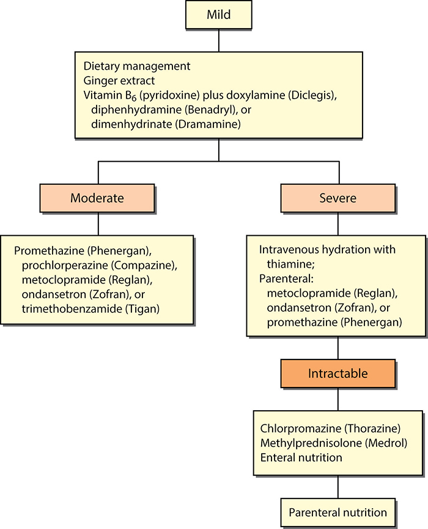
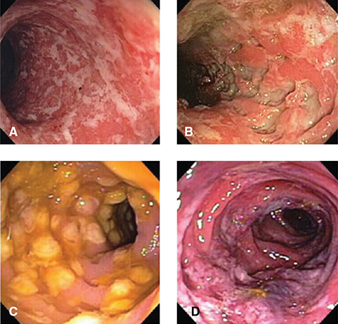
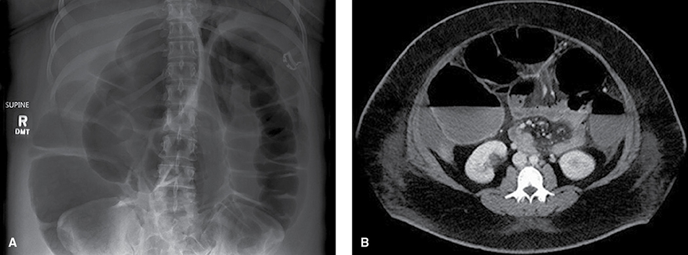
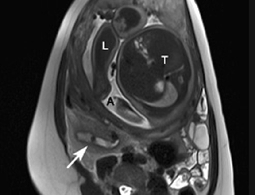

# Chapter 57: Gastrointestinal Disorders — Revision Notes

> Williams Obstetrics 26e, pp. 2630–2674 of the PDF. High-yield numbers are in **bold**.
> The seven tables are transcribed from the PDF images (they are missing from the extracted chapter text). All 4 figures are included from the PDF.

**Big picture:** Pregnancy displaces and alters the GI tract, so symptoms, signs and the WBC become less reliable as gestation advances. Investigate and operate when indicated (ideally 2nd trimester for elective procedures): **delay in diagnosis, not the intervention, is what harms mother and fetus**, especially with appendicitis and bowel obstruction.

---

## 1. General Considerations

### Diagnostic techniques
- **Endoscopy** (upper GI, ERCP, colonoscopy, sigmoidoscopy) can be used in pregnancy without radiation. Perform **when indicated, ideally in the 2nd trimester**, with a multidisciplinary team (obstetrics, GI, anesthesia).
  - Video capsule endoscopy: limited experience (slow GI transit; capsule electromagnetic field are theoretical concerns).
  - Colonoscopy indications: chronic abdominal pain, hematochezia, diarrhea.
  - **Bowel prep: polyethylene glycol electrolyte (GoLYTELY) or sodium sulfate (Suprep)** → avoids serious dehydration and ↓ uteroplacental perfusion. Tap water enemas are an alternative for rectosigmoidoscopy.
- **Noninvasive imaging:**
  - **Sonography is the ideal first technique**, but the gravid uterus obscures organs.
  - **MR imaging** (e.g., MRCP, MR enterography) avoids CT radiation.
- **Surgery:** intraabdominal surgery is the **most frequent nonobstetrical procedure** in pregnancy; **perforative appendicitis** is the most common lifesaving example. **Laparoscopy** has replaced open surgery for many conditions (ACOG 2019; SAGES guidelines).

### Table 57-1. Preprocedural Considerations for Gastrointestinal Endoscopy During Pregnancy

| Consideration |
|---|
| Plan consultation with an obstetrician, gastroenterologist, and anesthesiologist |
| Place patient in **left lateral decubitus** position |
| Use **lowest effective dose** of sedation necessary |
| Give prophylactic antibiotics as indicated. **Penicillin, cephalosporin, erythromycin, and clindamycin** are safe options |
| Minimize procedure time |
| Obtain fetal heart tones at the discretion of the obstetrician. In general, **pre- and post-procedure heart tones are adequate** |
| For colonoscopy, favor preparation with **PEG-ES** or with tap water enemas depending on GI level to be evaluated |

*GI = gastrointestinal; PEG-ES = polyethylene glycol electrolyte solution. From American Society for Gastrointestinal Endoscopy, 2012, 2015.*

### Nutritional support
- **Enteral (usually nasogastric) is preferred** — fewer serious complications. Very few obstetric conditions prohibit enteral feeding as a first effort.
  - Extreme cases (recalcitrant hyperemesis): **PEG with jejunal port (PEG-J)**.
- **Parenteral nutrition** when the gut must be quiescent:
  - **Peripheral (PPN):** dilute solutions, short-term use.
  - **Central (CPN):** hyperosmolar, needs central access; gives **24–40 kcal/kg/d**, mainly hypertonic glucose.
  - Most common CPN indications in pregnancy: **short bowel syndrome and dysmotility**; mean duration **33 days**.
- **Complications of parenteral nutrition:**
  - **Catheter sepsis is most common** (**25%** in 27 women with hyperemesis).
  - Upper-extremity venous thrombosis, volume overload, reversible liver dysfunction.
  - Fetal subdural hematoma from maternal **vitamin K deficiency** (rare).
- **PICC lines:** **56% complication rate** (bacteremia most frequent) in 66 pregnant women. Reasonable for **short-term (few weeks)** nutrition.

### Table 57-2. Some Conditions Treated with Enteral or Parenteral Nutrition During Pregnancyᵃ

| Conditions | | |
|---|---|---|
| Achalasia | Crohn disease | Ostomy obstruction |
| Anorexia nervosa | Diabetic gastropathy | Pancreatitis |
| Appendiceal rupture | Esophageal injury | Preeclampsia syndrome |
| Bowel obstruction | Hyperemesis gravidarum | Short bowel syndrome |
| Burns | Jejunoileal bypass | Stroke |
| Cholecystitis | Malignancies | Ulcerative colitis |

*ᵃThe printed footnote reads "Complications arranged alphabetically"; the entries are conditions, arranged alphabetically (read down each column). From Billiauws, 2017; Folk, 2004; Guglielmi, 2006; Mahadevan, 2019; Porter, 2014; Russo-Stieglitz, 1999; Saha, 2009; Spiliopoulos, 2013.*

---

## 2. Hyperemesis Gravidarum

### Definition and epidemiology
- Nausea and vomiting are common until **~16 wk**. Hyperemesis = **severe unrelenting nausea and vomiting** producing:
  - **Weight loss, dehydration, ketosis**
  - **Alkalosis** (loss of HCl) and **hypokalemia**
  - Acidosis from partial starvation
  - ± transient hepatic dysfunction and biliary sludge
- **A diagnosis of exclusion.**
- **Hospitalization rate 0.5–2.1%**. **Up to 25%** admitted in one pregnancy need admission again in the next.
- Etiology unknown, multifactorial: high or rapidly rising **hCG**, estrogen, progesterone, placental GH, prolactin, thyroxine, adrenocortical hormones; also ghrelin, leptin, nesfatin-1, peptide YY 3–36. Psychological components in some.

### Risk factors
| ↑ Risk | ↓ Risk |
|---|---|
| Hyperthyroidism, prior hyperemesis, diabetes, GI illness, restrictive diets, asthma | **Smoking and obesity** (↓ 1.5-fold) |
| **Female fetus** (perhaps estrogen-related) | |
| *H pylori* (proposed, inconclusive) | |

- **Chronic marijuana use → cannabinoid hyperemesis syndrome** (mimic).
- Associations: anemia, **VTE**, gestational hypertension, preeclampsia. Link with preterm birth unclear.
- **No long-term maternal consequences** (no ↑ cardiovascular risk).

### Complications

### Table 57-3. Some Serious and Life-Threatening Complications Reported with Hyperemesis Gravidarumᵃ

| Complication |
|---|
| **Acute kidney injury**—may require dialysis |
| Depression—cause versus effect? |
| Diaphragmatic rupture |
| **Esophageal rupture—Boerhaave syndrome** |
| Hyperalimentation complications |
| **Hypokalemia**—arrhythmias, cardiac arrest |
| Hypoprothrombinemia—**vitamin K deficiency** |
| **Mallory–Weiss tears**—bleeding, pneumothorax, pneumomediastinum, pneumopericardium |
| Rhabdomyolysis |
| **Wernicke encephalopathy—thiamine deficiency** |

*ᵃComplications arranged alphabetically.*

- **Wernicke encephalopathy (thiamine deficiency):**
  - Triad **ocular signs + confusion + ataxia** in **~60%**.
  - EEG may be abnormal; **MR imaging usually shows findings**.
  - Can recur in a later pregnancy. Maternal deaths; sequelae = **blindness, convulsions, coma**.
- **Vitamin K deficiency:** maternal coagulopathy, **fetal intracranial hemorrhage**, vitamin K embryopathy.
- AKI from dehydration (± rhabdomyolysis); rarely dialysis.

### Management
- **First line (outpatient): doxylamine 10 mg + pyridoxine 10 mg (Diclegis)**
  - **2 tablets at bedtime** → add 1 first-morning tablet → then 1 morning + 1 midafternoon + 2 bedtime (max 4/d).
  - Parkland cost-saving version: **½ of a 25-mg Unisom (doxylamine) + 25-mg vitamin B6**; same graduated dosing, max 3 doses/d.
- **Ondansetron:** slightly more effective than doxylamine–pyridoxine. Not teratogenic on recent review, but risks **prolonged QT and serotonin syndrome** → **reserve for severe cases after 8 wk**.
- **IV crystalloid** for dehydration, ketonemia, electrolyte and acid–base deficits.
  - **Hypokalemia is common**; cardiac arrest reported.
  - **No benefit from adding 5% dextrose.**
  - **Thiamine 100 mg in 1 L crystalloid** for women needing IV hydration who have **vomited >3 weeks**; repeat daily for **2–3 days**, then IV multivitamins if IV fluids continue.
- **Hospitalize** if vomiting persists after rehydration and failed outpatient care: parenteral **promethazine, prochlorperazine, chlorpromazine or metoclopramide** (several prolong QT).
- **Glucocorticoids:** largely ineffective; **only for refractory cases** (putative teratogenicity).
- **Persistent vomiting → exclude other causes:** gastroenteritis, cholecystitis, pancreatitis, hepatitis, peptic ulcer, pyelonephritis; after midpregnancy, **severe preeclampsia and fatty liver**. Endoscopy changed management in none of 49 women.
- **Thyroxine:** raised free T4 is usually a **surrogate for high hCG**, not true thyrotoxicosis; normalizes quickly with hydration and antiemetics.
- **Readmission 25–35%** (more than ⅓ at Parkland); not predictable from patient characteristics. ↑ Anxiety, depression; relapse in ¼ of those with psychosocial factors; some develop PTSD.
- **Nutrition for recalcitrant cases:**
  - Early enteral tube feeding: **no advantage**.
  - **Nasojejunal feeding** used for up to 41 days (107 women); sonography can confirm tube position. PEG-J reported.
  - Very few need parenteral nutrition (though 20% needed CPN in one study of 599 women).

*Figure 57-1. Stepwise NVP algorithm: diet/ginger/B6 + doxylamine → oral antiemetics (moderate) → IV fluids with thiamine + parenteral antiemetics (severe) → chlorpromazine, methylprednisolone, enteral feeds (intractable) → parenteral nutrition.*

### Table 57-4. Medications for Gastrointestinal Disorders in Pregnancy

**Options for nausea and vomiting**

| Class / Medication (Brand) | Usual Dosing | Route(s) |
|---|---|---|
| ***Antihistamine*** | | |
| Doxylamine + pyridoxine (Diclegis)ᵃ | At bedtime; up to 4 times daily | PO |
| ***Phenothiazines*** | **Every 6 hr** | |
| Promethazine (Phenergan)ᶜ | 12.5–25 mg | IM, IV, PO, PR |
| Prochlorperazine (Compazine)ᶜ | 5–10 (25 PR) mg | IM, IV, PO, PR |
| Chlorpromazine (Thorazine)ᶜ | 25–50 mg | IM, PO |
| ***Serotonin antagonist*** | **Every 8 hr** | |
| Ondansetron (Zofran)ᵇ | 8 mg | IV, PO |
| ***Benzamides*** | **Every 6 hr** | |
| Metoclopramide (Reglan)ᵇ | 5–15 mg | IM, IV, PO |
| Trimethobenzamide (Tigan) | 300 mg | PO |

**Oral options for gastroesophageal reflux disease (GERD)**

| Class / Medication (Brand) | Usual Dosing |
|---|---|
| ***Proton-pump inhibitors*** | |
| Pantoprazole (Protonix)ᵇ | 40 mg daily for up to 8 wks |
| Lansoprazole (Prevacid)ᵇ | 15 mg daily for up to 8 wks |
| Omeprazole (Prilosec, Zegerid)ᶜ | 20 mg daily for 4–8 wks |
| Dexlansoprazole (Dexilant)ᶜ | 30 mg daily for up to 4 wks |
| ***H2-receptor antagonists*** | |
| Cimetidine (Tagamet)ᵇ | 400 mg 4 times daily for up to 12 wks, or 800 mg twice daily for up to 12 wks |
| Nizatidine (Axid)ᵇ | 150 mg twice daily |
| Famotidine (Pepcid)ᵇ | 20 mg twice daily up to 6 wks |

*ᵃFood and Drug Administration category A. ᵇFDA category B. ᶜFDA category C. IM = intramuscularly; IV = intravenously; PO = orally; PR = rectally.*

---

## 3. Gastroesophageal Reflux Disease
- Symptomatic reflux in up to **15%** of nonpregnant people. Sequelae: esophagitis, stricture, Barrett esophagus, adenocarcinoma.
- **Heartburn (pyrosis) prevalence: 26% → 36% → 51%** in the 1st / 2nd / 3rd trimesters. Caused by relaxation of the lower esophageal sphincter.
- **Diagnosis is clinical** (symptoms alone).
- **Stepwise treatment:**
  1. Lifestyle: stop tobacco and alcohol, small meals, **elevate head of bed**, limit postprandial recumbency, avoid triggers (fatty and tomato-based foods, coffee)
  2. **Oral antacids = first line**
  3. Severe/persistent → **proton-pump inhibitor**; H2-receptor antagonist and sucralfate can be added. Both classes are generally safe.
  4. No relief → consider **endoscopy**
- PPIs early in pregnancy may ↑ preeclampsia risk (preliminary data).
- **Sucralfate:** aluminum salt of sulfated sucrose, inhibits pepsin; **~10% absorbed**, safe. **1 g PO 1 h before each meal and at bedtime for up to 8 wk**; no antacids within ½ h of a dose.
- **Misoprostol is contraindicated** (stimulates labor).
- Fundoplication is not done in pregnancy; after prior laparoscopic Nissen, only **20%** had reflux in pregnancy.

---

## 4. Hiatal, Diaphragmatic Hernia and Achalasia

### Hiatal hernia
- On late-pregnancy radiographs: **20% of multiparas vs 5% of nulliparas**; persisted in 3 of 10 at 1–18 months postpartum.
- Link with reflux unclear (the LES can work even when intrathoracic).
- Can cause vomiting, epigastric pain, bleeding from ulceration; rarely gastric outlet obstruction (paraesophageal hernia) or surgery needed.

### Diaphragmatic hernia
- Through the **foramen of Bochdalek or Morgagni**; rare.
- **Acute obstruction → maternal mortality 45%** (18 cases).
- Spontaneous diaphragmatic rupture from ↑ intraabdominal pressure at delivery reported. Surgery individualized by gestational age.

### Achalasia
- LES **fails to relax** + nonperistaltic contractions, from inflammatory destruction of the **myenteric (Auerbach) plexus**; postganglionic cholinergic neurons spared → unopposed sphincter stimulation.
- Symptoms: **dysphagia, chest pain, regurgitation**.
- **Barium swallow: "bird beak" or "ace of spades"** distal narrowing. Endoscopy excludes gastric carcinoma; **manometry confirms**.
- Pregnancy: physiological LES relaxation shouldn't occur; half worsened in one series, but most don't; reflux uncommon. One death at 24 wk (perforated **14-cm megaesophagus**).
- **Management:** soft diet + anticholinergics → nitrates, calcium-channel blockers, **botulinum toxin A** → **balloon dilation** (85% respond; risk of perforation) → **myotomy**.

---

## 5. Peptic Ulcer Disease
- Lifetime prevalence of acid peptic disease in women **10%**. Causes: **chronic *H pylori* gastritis or NSAIDs** — neither common in pregnancy.
- **Natural gastroprotection in pregnancy:** ↓ gastric acid, ↓ motility, markedly ↑ mucus. Complications are less frequent than in nonpregnant controls; perforation rare. May be underdiagnosed (treated as reflux).
- Historical: **remission in ~90%** during pregnancy, but symptoms recurred in >½ by 3 months postpartum and almost all by 2 years.
- **Management:** eradicate *H pylori*, prevent NSAID injury. First line = **PPI or H2 blocker** (± sucralfate coating).
- ***H pylori* testing** (with active ulcer): urea breath test, serology, fecal test, or endoscopic biopsy.
- **Pregnancy-safe 14-day eradication (no tetracycline):** **clarithromycin 500 mg bid + either amoxicillin 1000 mg bid or metronidazole 500 mg tid, + a PPI**.

### Upper GI bleeding
- With persistent vomiting, most bleeds are **Mallory-Weiss tears** (linear mucosal tears at the GE junction); occasionally a peptic ulcer.
- Conservative: **IV PPI + topical antacids**; transfuse as needed; **endoscopy if bleeding persists**.
- Sustained retching → **Boerhaave syndrome** (esophageal rupture) — less common, more serious.

---

## 6. Small Bowel and Colon Disorders

### Motility and constipation
- **Small bowel transit slows: 99 / 125 / 137 min** by trimester vs **75 min** nonpregnant.
- Colonic relaxation + ↑ water and Na⁺ absorption → **constipation in ~25%**.
- Treatment: fluids **>8 glasses/d**, fiber **20–35 g/d** → bulk agents (methylcellulose) → stimulant (bisacodyl) if severe.
- **Megacolon from impacted stool** seen almost only in women who chronically abused stimulant laxatives.

### Acute diarrhea
- Monthly prevalence **3–7%** in adults.
- **Classification: acute <2 wk; persistent 2–4 wk; chronic >4 wk.** Most acute cases are infectious; ⅓ foodborne.
- **Indications for evaluation:**
  - Profuse watery diarrhea with dehydration
  - Grossly bloody stools
  - **Fever >38°C**
  - **Duration >48 h** without improvement
  - Recent antimicrobial use
  - Immunocompromise
- **Treatment:**
  - **Mainstay: IV hydration** (normal saline or Ringer lactate) + **K⁺**, to restore volume and uteroplacental perfusion. Monitor vitals and urine output for sepsis.
  - **Loperamide** (moderate, afebrile, nonbloody, no recent travel): **4 mg, then 2 mg after each watery stool; max 8 mg/d; ≤48 h**.
  - **Bismuth subsalicylate:** 30 mL (525 mg) or 2 tablets (263 mg each) every 30–60 min, **max 8 doses/24 h**; harmless black stools.
  - Empirical antibiotics for moderate–severe illness: **ciprofloxacin 500 mg bid × 3 days** (reasonable to wait for stool tests).
  - Usually no treatment needed: *E coli*, staphylococci, *B cereus*, norovirus.
  - **Specific:** *Salmonella* → ciprofloxacin or TMP-SMX; ***Campylobacter* → azithromycin**; ***C difficile* → oral vancomycin or fidaxomicin**; ***Giardia*, *E histolytica* → metronidazole**.

### Table 57-5. Etiology, Clinical Features, and Treatment of Common Acute Diarrheal Syndromes

| Agents | Incubation | Emesis | Pain | Fever | Diarrhea | Treatment |
|---|---|---|---|---|---|---|
| **Toxin producers** | 1–72 hr | 3–4+ | 1–2+ | 0–1+ | 3–4+, watery | |
| 1. *Staphylococcus* spp. | | | | | | None |
| 2. *C perfringens* | | | | | | None |
| 3. *E coli* (enterotoxin) | | | | | | Ciprofloxacin |
| 4. *B cereus* | | | | | | None |
| **Enteroadherent** | 1–8 days | 0–1+ | 1–3+ | 0–2+ | 1–2+, watery, mushy | |
| 1. *E coli* | | | | | | Ciprofloxacin |
| 2. *Giardia* spp. | | | | | | Tinidazole |
| 3. Helminths | | | | | | As detected |
| **Cytotoxin producers** | 1–3 days | 0–1+ | 3–4+ | 1–2+ | 1–3+, watery, then bloody | |
| 1. *C difficile* | | | | | | Vancomycin |
| 2. *E coli* (hemorrhagic) | | | | | | None |
| **Inflammatory — *Minimal*** | 1–3 days | 1–3+ | 2–3+ | 3–4+ | 1–3+, watery | |
| 1. Rotavirus | | | | | | None |
| 2. Norovirus | | | | | | None |
| **Inflammatory — *Variable*** | 12 hr–11 days | 0–3+ | 2–4+ | 3–4+ | 1–4+ watery or bloody | |
| 3. *Salmonella* spp. | | | | | | Ciprofloxacin |
| 4. *Campylobacter* spp. | | | | | | Azithromycin |
| 5. *Vibrio* spp. | | | | | | Doxycycline |
| **Inflammatory — *Severe*** | 12 hr–8 days | 0–1+ | 3–4+ | 3–4+ | 1–2+, bloody | |
| 6. *Shigella* spp. | | | | | | Ciprofloxacin |
| 7. *E coli* | | | | | | Ciprofloxacin |
| 8. *Entamoeba histolytica* | | | | | | Metronidazole |

*B cereus = Bacillus cereus; C difficile = Clostridioides difficile; C perfringens = Clostridium perfringens; E coli = Escherichia coli; spp. = species. Modified from Camilleri, 2018; DuPont, 2014; McDonald, 2018.*

> **Memory hook:** "Toxins vomit, cytotoxins hurt, inflammatory ones burn (fever)." Toxin producers = emesis 3–4+ with short incubation (hours); cytotoxins = pain 3–4+ and bloody diarrhea; inflammatory = fever 3–4+.

### *Clostridioides difficile* infection
- Anaerobic gram-positive bacillus, fecal–oral. **3.7%** of normal gravidas colonized. **Most frequent nosocomial infection in the US**; incidence in pregnancy has **doubled** in a decade.
- **Biggest risk factor = antibiotics** — highest with **aminopenicillins, clindamycin, cephalosporins, fluoroquinolones**. Others: IBD, immunosuppression, age, GI surgery. **10% community-acquired.**
- **Severe colitis mortality 5%.**
- **Diagnosis:** stool **NAAT** or enzyme-immunoassay algorithm (a unique *C difficile* enzyme, or **toxins A and B**); endoscopy less often (pseudomembranes). **Test only with new diarrhea and ≥3 unformed stools** of unexplained cause; **no test of cure**.
- **Prevention:** **soap-and-water hand washing** + isolation.
- **Treatment:** stop the offending antibiotic + **oral vancomycin 125 mg qid × 10 days** or **fidaxomicin 200 mg bid**.
- **Recurrence 20%**; fecal microbial transplantation may become standard for recurrence.

*Figure 57-2. Colitis at endoscopy: (A) ulcerative colitis—diffuse ulcers and exudate; (B) Crohn—deep ulcers; (C) pseudomembranous (C difficile)—yellow adherent membranes; (D) ischemic colitis.*

---

## 7. Inflammatory Bowel Disease

### Table 57-6. Some Shared and Differentiating Characteristics of Inflammatory Bowel Disease

**Shared characteristics**

| Feature | Both |
|---|---|
| Hereditary | More than **100 disease-associated genetic loci**—a third shared; Jewish predominance; **familial in 5–10%** of cases; Turner syndrome; immune dysregulation |
| Other | Chronic and intermittent with exacerbations and remissions; extraintestinal manifestations: **arthritis, erythema nodosum, uveitis** |

**Differentiating characteristics**

| Feature | Ulcerative Colitis | Crohn Disease |
|---|---|---|
| Major symptoms | Diarrhea, tenesmus, **rectal bleeding**, cramping pain; chronic, intermittent; anemia | *Fibrostenotic*—recurrent RLQ colicky pain; fever. *Fistulizing*—cutaneous, bladder, interenteric |
| Bowel involvement | **Mucosa and submucosa of large bowel**; usually begins at rectum (**40% proctitis only**); **continuous** disease | Deep layers small and large bowel; commonly **transmural**; **discontinuous** involvement; strictures and fistulas |
| Endoscopy | Granular and friable erythematous mucosa; bleeding; rectal involvement | Patchy; segmental colitis; **rectum spared**; perianal involvement |
| Serum antibodies | Antineutrophil cytoplasmic (**pANCA**) **~70%** | **Anti–*S cerevisiae*** **~50%** |
| Complications | Toxic megacolon; strictures; arthritis; cancer (3–5%) | Fistulas; arthritis; toxic megacolon; small bowel obstruction |
| Management | Medical; **proctocolectomy curative** | Medical; segmental and fistula resection |

*RLQ = right lower quadrant; S cerevisiae = Saccharomyces cerevisiae. From Friedman, 2018; Lichtenstein, 2009.*

### Ulcerative colitis
- **Mucosal** inflammation of the colon, **starts at the rectum** and extends proximally. **~40%** rectum/rectosigmoid only; **20% pancolitis**.
- **Prior appendectomy protects** against UC.
- Symptoms: diarrhea, rectal bleeding, tenesmus, cramps; exacerbations and remissions.
- Dangerous complications: **toxic megacolon, catastrophic hemorrhage** → colectomy. Extraintestinal: arthritis, uveitis, erythema nodosum.
- **Colon cancer risk approaches 1%/year.**

### Crohn disease
- Regional enteritis / granulomatous colitis. **Transmural**, anywhere **mouth to anus**, **segmental**.
- Distribution: **30% small bowel only, 25% colon only, 40% both** (terminal ileum + colon).
- **Perianal fistulas/abscesses in ⅓** of those with colonic disease.
- Symptoms: RLQ cramping pain, diarrhea, weight loss, low-grade fever, obstruction.
- **Cannot be cured medically or surgically.** ~⅓ need surgery in the first year, then **5%/year**.

### IBD and fertility
- **Subfertility linked to active disease**; normal fertility likely when quiescent.
- **Sulfasalazine → reversible sperm abnormalities** (male partners).
- Laparoscopic resection → better fertility. After colectomy **up to half remain infertile**. Ileal pouch–anal anastomosis only modestly affects fertility.

### IBD and pregnancy (general rules)
- Prevalence **1 in 320 births** (Australia).
- **Pregnancy does NOT increase flares** (rate even lower than preconception). But **activity at conception predicts activity in pregnancy**, and flares can be severe.
- **Continue usual treatment**; investigate and operate if indicated.
- **Fecal calprotectin** is valid for detecting flares in pregnancy.
- Adverse outcomes are concentrated in women with **severe/active disease**; with quiescent disease outcomes are similar to controls (ECCO-EpiCom, 332 women). **Active disease → ↑ preterm birth.** Perinatal mortality not appreciably ↑.
- **VTE risk ↑** even when asymptomatic (UC: **doubled**), but thromboprophylaxis is **not routine**.

### Ulcerative colitis in pregnancy
| Disease state at conception | Course in pregnancy |
|---|---|
| **Quiescent** | Worsens in **~⅓** |
| **Active** | **~45% worsen, 25% unchanged, 25% improve** |

- **Osteoporosis** in up to ⅓ → **vitamin D 800 IU/d + calcium 1200 mg/d**.
- **Folic acid 2–4 mg/d** preconception and 1st trimester (counteracts **sulfasalazine's antifolate** action).
- Stress may trigger flares → reassurance.
- **Drug therapy mirrors nonpregnant care:**
  - **5-ASA (mesalamine)**: sulfasalazine (prototype; inhibits prostaglandin synthase), olsalazine, balsalazide, delayed-release forms.
  - **Glucocorticoids** (oral, parenteral, enema) for moderate–severe disease not responding to 5-ASA — **high remission rate, but not for maintenance**.
  - **Immunomodulators** for recalcitrant disease: azathioprine, 6-MP, cyclosporine, tacrolimus — relatively safe.
  - ⚠️ **Methotrexate is teratogenic → contraindicated.**
  - **Biologics (anti-TNF-α etc.)** now often used first for moderate–severe disease. **Continue through pregnancy until several weeks before delivery** (Table 57-7). Stopping may prompt relapse.
  - **Neonate:** possible immunosuppression → **delay live-attenuated vaccines ≥6 months**.
- **Surgery:** colectomy/ostomy for fulminant colitis is lifesaving and has been done in every trimester, generally with good outcomes (42 cases).
- **Ileal pouch:** ↑ stool frequency, incontinence and **pouchitis** (bacterial overgrowth, stasis) → **ciprofloxacin or metronidazole**. Rarely pouch perforation from adhesions.
- **Delivery:**
  - Uncomplicated colitis → **vaginal delivery**; but cesarean rate is ↑.
  - **After ileal pouch–anal anastomosis: controversial.** Hahnloser: similar function → cesarean only for obstetric indications. Foulon review: recommends cesarean, though uncomplicated vaginal delivery is safe.
- Quiescent UC: abortion, preterm and stillbirth rates remarkably low (2398 pregnancies).

### Table 57-7. Biologics Used to Treat Inflammatory Bowel Disease in Pregnancy

| Drug (Brand Name) | Recommendations |
|---|---|
| Adalimumab (Humira) | Last dose **2–3 wks** before EDC |
| Certolizumab pegol (Cimzia) | **Continue throughout pregnancy** |
| Infliximab (Remicade) | Last dose **6–10 wks** before EDC |
| Natalizumab (Tysabri) | Last dose **4–6 wks** before EDC |
| Ustekinumab (Stelara) | Last dose **6–10 wks** before EDC |
| Vedolizumab (Entyvio) | Last dose **6–10 wks** before EDC |

*EDC = estimated date of confinement.*

> **Pearl:** certolizumab pegol lacks an Fc region, so it crosses the placenta minimally — which is why it alone can be continued throughout pregnancy.

### Crohn disease in pregnancy
| Disease state at conception | Course in pregnancy |
|---|---|
| **Inactive** | **~¼ relapse** |
| **Active** | **⅔ remain active or worsen** |

- Calcium, vitamin D and folic acid as for UC.
- Maintenance: no universally effective regimen; 5-ASA (newer forms better tolerated than sulfasalazine).
- **Glucocorticoids → 60–70% remission**; prednisone less effective for small-bowel disease.
- Immunomodulators (azathioprine, 6-MP, cyclosporine, tacrolimus) relatively safe; **methotrexate contraindicated**; **TNF-α inhibitors** often used first.
- **Surgery** for fistulas, strictures, obstruction, abscess, intractable disease (small-bowel disease more likely); abdominal surgery needed in **5%** of pregnancies.
- **Delivery: vaginal unless perianal fistula or active perianal disease.**
- Outcomes worse than with UC, related to activity: **~2× preterm** (Danish), **2–3× preterm, LBW, FGR, cesarean** (149 women). ECCO-EpiCom: similar to controls.

### Ostomy and pregnancy
- **Stomal dysfunction common** but usually responds to conservative care (82 pregnancies).
- Surgery needed in 3 of 6 with bowel obstruction and 4 with **ileostomy prolapse** — **~10% overall**.
- Adhesions usually cause obstruction, but the enlarging uterus may too. Pregnancy does **not** worsen long-term ostomy function.

---

## 8. Intestinal Obstruction
- **Incidence not increased** in pregnancy, but harder to diagnose: ~**1 in 17,000** deliveries.
- Among acute abdomens in pregnancy: **appendicitis 30% > adhesive small-bowel obstruction 15%**.
- **Causes:**
  - **Adhesions ~50%** (prior pelvic surgery, including cesarean)
  - **Volvulus ~25%** (sigmoid, cecum, small bowel) — late pregnancy or early puerperium
  - Others: after **Roux-en-Y gastric bypass** (internal hernia/intussusception), intussusception, ventral hernia. Open (vs laparoscopic) colorectal surgery → 3× obstruction.
- **High-risk times** (uterus pressing on adhesions):
  1. **Midpregnancy** — uterus becomes an abdominal organ
  2. **3rd trimester** — fetal head descends
  3. **Immediately postpartum** — uterus shrinks acutely
- **Presentation:** abdominal pain (continuous or colicky) **98%**; nausea/vomiting **80%**; tenderness **70%**; abnormal bowel sounds only **55%**.
- **Imaging:** plain films after soluble contrast show obstruction in **90%**, but are less accurate for small bowel → **CT and MR can be diagnostic**. **Colonoscopy can diagnose and treat colonic volvulus.**
- **Mortality is excessive** from delayed diagnosis, reluctance to operate, and emergency surgery: **maternal 6%, fetal 26%** (66 pregnancies); deaths in late pregnancy from perforated sigmoid/cecal volvulus.

### Colonic pseudo-obstruction (Ogilvie syndrome)
- **Adynamic colonic ileus** → massive distention with **cecal and right-colon dilation**.
- **~10%** of all cases are pregnancy-associated; **1 in 1500 births**.
- Usually **postpartum — 90% after cesarean**; also antepartum.
- **Perforation risk high if cecal diameter >12 cm.**
- **Treatment: IV neostigmine 2 mg with cardiac monitoring** → prompt decompression. Otherwise colonoscopic decompression; laparotomy for perforation.

*Figure 57-3. Ogilvie syndrome after cesarean: (A) plain film and (B) CT show massive gaseous colonic dilation without a mechanical obstruction.*

---

## 9. Appendicitis

### Epidemiology
- Lifetime incidence **7–10%**. Confirmed appendicitis in pregnancy **1 in 1000 to 1 in 5500 births** (only 14 of 171 evaluated women had it).
- **Most common reason for lifesaving GI surgery in pregnancy.**

### Why diagnosis is harder
- Nausea and vomiting are normal in pregnancy.
- **The appendix moves upward and outward** from the RLQ as the uterus grows.
- Physiological leukocytosis — but **WBC >18,000/µL makes appendicitis 10× more likely**; a neutrophilic shift also helps.
- Often confused with **cholecystitis, labor, pyelonephritis, renal colic, placental abruption, leiomyoma degeneration**.
- **Omental containment fails** as the appendix is pushed up → **perforation ↑ with gestational age: ~8%, 12%, 20%** by trimester. Morbidity and mortality rise with gestational age.

### Diagnosis
- **Persistent abdominal pain and tenderness** are the most reproducible findings; **RLQ pain most frequent**, but pain migrates upward.
- **Sonography first** (also excludes obstetric causes); graded compression is difficult.
- **CT** is more sensitive and accurate than sonography; views can limit fetal dose.
- **MR imaging is preferred when available** — high accuracy and gives alternative diagnoses. Meta-analysis: **PPV 96%, NPV 99.5%** (but one study: sensitivity only 18%).

*Figure 57-4. MR (T2) of midtrimester acute appendicitis: bright inflamed appendix with a dark fecalith (arrow) below the gravid uterus (T = fetal trunk, L = leg, A = amnionic fluid).*

### Management
- **Suspected appendicitis → prompt surgical exploration.** A negative appendectomy is preferable to delayed surgery and generalized peritonitis.
  - Historically the diagnosis was confirmed in only **60–70%**; CT/MR have improved this. **Diagnostic accuracy is inversely proportional to gestational age.**
- **Laparoscopy is almost always used in the 1st–2nd trimesters**, and in many centers also in the 3rd (SAGES supports). Evidence does not clearly favor laparoscopic vs open for fetal outcome.
- **Preoperative IV antibiotics:** 2nd-generation cephalosporin or 3rd-generation penicillin. Stop after surgery unless **gangrene, perforation or phlegmon**.
- Without generalized peritonitis, **prognosis is excellent**.
- **Cesarean at the time of appendectomy is seldom indicated.**
- Uterine contractions are common, but **tocolytics are NOT recommended** — they ↑ risk of **pulmonary permeability edema** from sepsis.
- **Antibiotics alone (nonoperative):** in pregnancy linked to ↑ septic shock, peritonitis and VTE (6% treated medically); **25% failure** in 20 women. **Discouraged** in pregnancy; if used, exclude obstructive appendicitis and keep a low threshold to operate.

### Pregnancy outcomes
- **↑ Preterm labor**, especially with **peritonitis**. Spontaneous labor after 23 wk is commoner after appendectomy than after other surgery.
- **Fetal loss 22%** if surgery after 23 wk; **20%** in the California database.
- LBW and preterm birth **↑ 1.5–2-fold** (Taiwan); preterm birth ~2× (Australia).

---

## Quick-Recall: Condition → Key Diagnostic Clue → Key Management

| Condition | Key clue / fact | Management pearl |
|---|---|---|
| Hyperemesis gravidarum | Weight loss, ketosis, **hypokalemic alkalosis**; diagnosis of exclusion | Doxylamine–pyridoxine → ondansetron (>8 wk) → IV fluids + **thiamine 100 mg** → steroids only if refractory |
| Wernicke encephalopathy | Ocular signs + confusion + ataxia (~60%); MR findings | **Thiamine before/with IV fluids** if vomiting >3 wk |
| GERD | Heartburn **26 → 36 → 51%** by trimester | Lifestyle → antacids → PPI/H2RA/sucralfate; **no misoprostol** |
| Achalasia | Bird-beak on barium swallow; manometry confirms | Diet/anticholinergics → nitrates/CCB/botox → balloon dilation → myotomy |
| Peptic ulcer | Rare in pregnancy; ~90% remit | PPI/H2RA; ***H pylori*: clarithromycin + amoxicillin or metronidazole + PPI × 14 d** |
| Mallory-Weiss vs Boerhaave | Linear GE-junction tear vs full-thickness rupture | IV PPI, antacids, endoscopy if persistent vs surgical emergency |
| *C difficile* | New diarrhea + ≥3 unformed stools, recent antibiotics | Stop antibiotic; **oral vancomycin 125 mg qid × 10 d** or fidaxomicin |
| Ulcerative colitis | Continuous from rectum, mucosal, **pANCA 70%** | 5-ASA, steroids, thiopurines, biologics; **no methotrexate**; vaginal birth usual |
| Crohn disease | Transmural, skip lesions, rectum spared, **ASCA 50%** | Same drugs; **cesarean if active perianal disease/fistula** |
| Bowel obstruction | Pain 98%, vomiting 80%; mid-pregnancy, descent, postpartum | CT/MR; surgery without delay; volvulus → colonoscopy |
| Ogilvie syndrome | Cecal dilation, **90% after cesarean** | **IV neostigmine 2 mg** with monitoring; perforation risk if cecum >12 cm |
| Appendicitis | Persistent pain; appendix displaced up; **WBC >18,000** | **MR preferred**; prompt (laparoscopic) appendectomy; no tocolytics |

## Key Numbers to Memorize
- Hyperemesis admissions **0.5–2.1%**; recurrence of admission **up to 25%**; readmission **25–35%**
- Diclegis = **doxylamine 10 mg + pyridoxine 10 mg**, 2 at bedtime, max 4/d; **thiamine 100 mg/L** if vomiting **>3 wk**; ondansetron **after 8 wk**
- CPN **24–40 kcal/kg/d**; catheter sepsis **25%**; PICC complications **56%**
- Heartburn **26 / 36 / 51%**; sucralfate **1 g** qid, **~10%** absorbed
- Hiatal hernia **20% multiparas vs 5% nulliparas**; obstructed diaphragmatic hernia mortality **45%**
- Diarrhea: acute **<2 wk**, persistent **2–4 wk**, chronic **>4 wk**; loperamide max **8 mg/d, 48 h**
- *C difficile*: vancomycin **125 mg qid × 10 d**; recurrence **20%**; severe colitis mortality **5%**
- UC: **40%** proctitis only, **20%** pancolitis; cancer **~1%/yr**; pANCA **70%**. Crohn: **30/25/40%** small bowel/colon/both; ASCA **50%**
- Quiescent UC worsens **⅓**; active UC worsens **45%**; inactive Crohn relapses **¼**; active Crohn stays active/worse **⅔**
- IBD supplements: vitamin D **800 IU**, calcium **1200 mg**, folic acid **2–4 mg**; live vaccines in exposed neonates delayed **≥6 months**
- Obstruction: **1 in 17,000**; adhesions **50%**, volvulus **25%**; maternal/fetal mortality **6% / 26%**
- Ogilvie: **1 in 1500 births**, **90%** post-cesarean, cecum **>12 cm**, neostigmine **2 mg IV**
- Appendicitis: **1 in 1000–5500**; perforation **8 / 12 / 20%** by trimester; WBC **>18,000** (10×); MR PPV/NPV **96 / 99.5%**; fetal loss **~20–22%** after 23 wk
