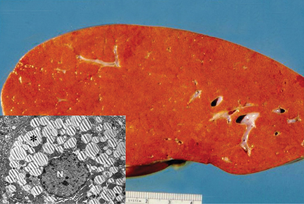
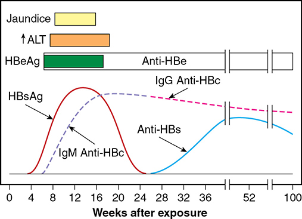
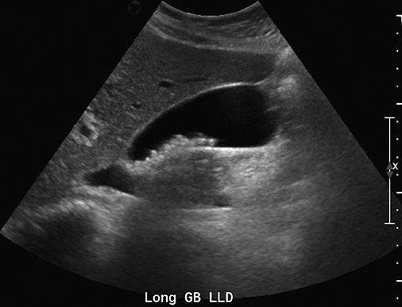

# Chapter 58: Hepatic, Biliary, and Pancreatic Disorders — Revision Notes

> Williams Obstetrics 26e, pp. 2675–2723 of the PDF. High-yield numbers are in **bold**.
> The five tables are transcribed from the PDF images (they are missing from the extracted chapter text). All 3 figures are included from the PDF.

**Big picture:** Liver disease in pregnancy falls into three groups: (1) **pregnancy-specific** — hyperemesis, ICP, AFLP, HELLP — which resolve with delivery; (2) **coincidental acute disease** — e.g., viral hepatitis; (3) **pre-existing chronic disease** — chronic viral or autoimmune hepatitis, cirrhosis, varices. **Gallstones cause almost all pancreatitis in pregnancy**, and surgery (laparoscopic cholecystectomy, ERCP) is safe in every trimester.

---

## 1. Hepatic Disorders — Overview

- **Normal pregnancy mimics liver disease:** ↑ **alkaline phosphatase**, palmar erythema, spider angiomas.
- **Cytochrome P450:** CYP1A2 ↓; **CYP2D6 and CYP3A4 ↑** (alters drug metabolism). No major histological change in the liver.
- **Severe preeclampsia/HELLP** can rarely cause liver failure (Ch 40).

### Table 58-1. Clinical Findings with Liver Diseases in Pregnancy

| Diagnosis | Onset | Symptoms | AST (U/L) | Bili (mg%) | Cr (mg%) | Hematological | Comments |
|---|---|---|---|---|---|---|---|
| Hyperemesis gravidarum | Early | N&V | **<300** | 1–4 | NL or elevated (prerenal) | NL | Common; infant vitamin K deficiency, Wernicke encephalopathy, Boerhaave syndrome |
| **ICP** | Late | **Pruritus ± jaundice** | **<200** | 1–5 | NL | NL | Common (0.5–2%); **bile acids (>10 µmol/L)**; normal hepatic function |
| **AFLP** | Late | N&V (70%), HTN/preeclampsia, RUQ pain | 145–565 | 2–8 | **>0.9** | Thrombocytopenia, coagulopathy ± DIC, nucleated red cells, hemolysis, echinocytosis | **Low glucose, cholesterol <220 mg/dL, fibrinogen <300 mg/dL** |
| **HELLP** | Late | Preeclampsia, RUQ pain | 75–250 (initial) | 1–2 | <1.0 | Thrombocytopenia, mild hemolysis | Common (**7–10% of preeclampsia**); normal hepatic function |
| Hepatitis, viral | Variable, chronic, episodic | Jaundice, RUQ pain, fatigue | **400–5000** | 20 | NL | Coagulopathy if cirrhotic, thrombocytopenia | Common (1–3%); serological tests for hepatitis A, B, C, E |
| Hepatitis, autoimmune | Variable, chronic, episodic | Jaundice, RUQ pain, fatigue | 100–1000 | 3–10 | NL | Coagulopathy if cirrhotic, thrombocytopenia | Uncommon; **ANA+, anti-LKM1, anti–smooth muscle** |
| NAFLD | Variable, chronic, episodic | Obese, diabetes, ± RUQ pain | NL to slightly elevated | NL | NL | NL | Common (6–8%); sonographic, MR/CT findings; ± metabolic syndrome, NASH, cirrhosis |

*AFLP = acute fatty liver of pregnancy; ANA = antinuclear antibodies; AST = aspartate transaminase; Bili = bilirubin; Cr = creatinine; DIC = disseminated intravascular coagulation; HELLP = hemolysis, elevated liver enzymes, low platelets; HTN = hypertension; ICP = intrahepatic cholestasis of pregnancy; LKM1 = liver, kidney microsome 1; NAFLD = nonalcoholic fatty liver disease; NASH = nonalcoholic steatohepatitis; NL = normal; N&V = nausea and vomiting; RUQ = right upper quadrant. The table gives viral-hepatitis AST as 400–5000 U/L; the text gives peaks of 400–4000 U/L.*

### Acute liver failure in pregnancy
- Uncommon. **Most frequent nonpregnancy cause = drug-induced liver injury; acetaminophen is the most prevalent cause in the US.**
- Others: **AFLP**, fulminant viral hepatitis, toxins, autoimmune hepatitis, shock liver, alternative medicines. In 70 referred women with hepatic encephalopathy: **half AFLP, half HELLP**.
- **Team:** obstetrics, MFM, critical care, hepatology, transplant surgery.
- **Initial labs:** transaminases, bilirubin, amylase, lipase, electrolytes, creatinine, albumin, **fibrinogen, lactate, total cholesterol**, CBC, coagulation; then viral/autoimmune serology and acetaminophen, iron and copper tests; CT/MR as needed.
- **Pregnancy-related cause → deliver.** **Vaginal delivery preferred** (coagulopathy) if quick and fetal condition allows.
- Avoid hepatotoxins, correct coagulopathy, **monitor for cerebral edema/↑ ICP**. Consider delivery before transplantation.

---

## 2. Intrahepatic Cholestasis of Pregnancy (ICP)

### Epidemiology
- Also called recurrent jaundice of pregnancy, cholestatic hepatosis, icterus gravidarum.
- More common with **multifetal pregnancy**; strong genetic influence → varies by population.
- **North America ~1 in 500–1000**; **5.6% in Latina women in Los Angeles**; Chile/Bolivia now <2% (falling since the 1970s); Sweden/China/Israel 0.25–1.5%.

### Pathogenesis
- **Sex steroids** implicated: **vaginal progesterone → 4× ICP rate**.
- Gene mutations in hepatocellular transport: **ABCB4 (MDR3)**, **ABCB11 (bile-salt export pump)**, farnesoid X receptor, **ATP8B1** (predisposes to drug-induced cholestasis — e.g., azathioprine after renal transplant).
- Bile acids incompletely cleared → accumulate in plasma.
- **Labs:**
  - **Conjugated hyperbilirubinemia, rarely >4–5 mg/dL**
  - **ALP ↑** more than in normal pregnancy
  - **Transaminases normal to moderately ↑, seldom >200 U/L**
- **Biopsy:** mild cholestasis, bile plugs in **centrilobular** hepatocytes and canaliculi; **no inflammation or necrosis**.
- Resolves after delivery; **recurs** in later pregnancies or with **estrogen-containing contraceptives**.

### Clinical presentation and diagnosis
- **Generalized pruritus, worst on palms and soles**, in late pregnancy. **No constitutional symptoms**; skin shows only excoriations.
- **Normal total bile acids <10 µmol/L** in pregnancy.
- **Diagnosis = pruritus + ↑ total serum bile acids or transaminases.** Labs may lag behind pruritus by weeks; **transaminases may rise before bile acids**.
- **Jaundice in ~10%.**
- Normal enzymes or specific skin lesions → think of dermatoses (Ch 65). Sonography to exclude gallstones/obstruction.
- Low transaminases make acute viral hepatitis unlikely. **Chronic hepatitis C → up to 20× ICP risk.**

### Management
- Antihistamines and emollients give some relief.
- **Cholestyramine:** effective but ↓ fat-soluble vitamin absorption → **vitamin K deficiency → fetal coagulopathy, ICH, stillbirth**.
- **Ursodeoxycholic acid (Actigall) = most popular:** relieves itch, ↓ bile salts and enzymes. **300-mg capsules; 10–15 mg/kg/d in 2–3 divided doses.**
  - Large RCT (Chappell 2019): itch score **not** significantly better vs placebo, and **did not lower perinatal death**. Parkland: pruritus improves after **2–3 wk**.
- Others: plasma exchange, rifampin.

### Perinatal outcomes
- Recent data are ambiguous about perinatal mortality; induction and cesarean rates are ↑. Lower 5-min Apgar.
- **Stillbirth risk tracks bile acids:**
  - **>40 µmol/L** → ↑ perinatal mortality (Glantz, 693 Swedish women)
  - **>100 µmol/L** → ↑ stillbirth (confirmed in a meta-analysis of 5557 women)
  - Stillbirths occur **despite normal antenatal testing**.
- Also: **spontaneous preterm birth 19%**, **meconium 48%**; associations with preeclampsia, GDM, LGA.
- **Antenatal testing does not reliably predict fetal death** → not routinely used for uncomplicated ICP.
- **Delivery:** many recommend **37 wk**. **Parkland: induce at 38 wk, or earlier if symptoms worsen or bile acids >40 µmol/L.**
- **Mechanism of fetal death:** bile acid **cardiotoxicity** (cholic acid ↓ myocyte beating rate, ↑ intracellular Ca²⁺); **prolonged fetal PR interval** (reversed by ursodeoxycholic acid); impaired ventricular function.

> **Memory hook:** "ICP = Itch, Palms/soles, bile acids >10; danger >40, death >100."

---

## 3. Acute Fatty Liver of Pregnancy (AFLP)

### Definition and pathology
- **Most frequent cause of acute liver failure in pregnancy.** Also called acute fatty metamorphosis or acute yellow atrophy.
- **Microvesicular fat** "crowds out" hepatocyte function; the **nucleus stays central** (unlike macrovesicular fat). Liver is **small, soft, yellow and greasy**.
- Severe form **~1 in 10,000 births**. **Recurrence is rare.**

*Figure 58-1. AFLP: greasy yellow liver; inset EM shows a hepatocyte packed with microvesicular fat droplets (\*) with a central nucleus (N).*

### Etiopathogenesis
- Many cases linked to **recessively inherited mitochondrial fatty acid β-oxidation defects** (mitochondrial trifunctional protein complex).
  - Most common: **LCHAD G1528C and E474Q** missense mutations (chromosome 2).
  - Also **MCAD** and **CPT1** deficiency — similar to children with **Reye-like syndromes**.
- Heterozygous LCHAD-deficient mothers carrying a **homozygous (or compound heterozygous) fetus** are at risk — but not always.
- Mothers of children with FAO defects: **HELLP 12%, AFLP 4%** vs 0.9% liver problems in controls. Still, **AFLP and severe preeclampsia/HELLP are distinct syndromes**.

> **Pearl:** after AFLP, the newborn should be screened for a fatty acid oxidation disorder (e.g., LCHAD deficiency).

### Clinical findings
- **Almost always 3rd trimester** (rarely midpregnancy). Parkland series (51 women): **mean 37 wk** (31.7–40.9); 41% nulliparous; **20% delivered ≤34 wk**. **Multifetal gestation = 20%** of cases.
- Symptoms progress over days: **persistent nausea and vomiting (major complaint)**, malaise, anorexia, epigastric pain, progressive jaundice.
- Severe cases: endothelial activation → **capillary leak, hemoconcentration, AKI, ascites**, ± pulmonary permeability edema.
- **Half have hypertension, proteinuria, edema** → mimics preeclampsia.
- **Labs:**
  - **Hypofibrinogenemia, hypocholesterolemia, prolonged clotting times**
  - **Bilirubin usually <10 mg/dL**; **transaminases modestly ↑, usually <1000 U/L**
  - **Hemolysis** (hypocholesterolemia damages RBC membranes): leukocytosis, nucleated RBCs, ↑ LDH, ↓ haptoglobin, **echinocytes**. Hct often normal/high from hemoconcentration.
  - **Fibrinogen <100 mg/dL in almost ⅓**; platelets <100,000 in 20%, <50,000 in 10%.
  - ↑ D-dimers → some consumptive coagulopathy, but mainly **↓ hepatic procoagulant synthesis**.
- **Hypoglycemia is common.** Encephalopathy, severe coagulopathy and some renal failure each in **~half**.
- **AFLP keeps worsening after diagnosis**; delivery halts it.
- **Diagnosis is clinical + laboratory — biopsy is unnecessary.** Imaging is unreliable: only **¼** have classic sonographic findings (ascites, echogenic liver).
- Spectrum: mild "underdeveloped" forms (just hemolysis + low fibrinogen) → forms mistaken for preeclampsia → fulminant failure with encephalopathy.
- **FaCCT** (to separate AFLP from HELLP): **Fibrinogen <300 mg/dL, Cholesterol <220 mg/dL, Creatinine >0.9 mg/dL, Total bilirubin >1 mg/dL.**
  - AFLP = liver **dysfunction**; in HELLP, liver synthetic function is relatively preserved.

### Table 58-2. Comparison of Clinical Findings at the Time of Admission in 67 Women with Acute Fatty Liver of Pregnancy and 67 with HELLP Syndrome

| Factor | AFLP | HELLP | *p* Value |
|---|---|---|---|
| ***Clinical findings (%)*** | | | |
| Hypertension | 62 | **94** | <0.001 |
| Abdominal pain | 34 | 46 | 0.18 |
| Nausea/vomiting | **63** | 19 | <0.001 |
| ***Laboratory values*** | | | |
| AST (U/L) | **278** [146, 564] | 135 [77, 250] | <0.001 |
| Creatinine (mg/dL) | **1.6** [1, 2] | 0.6 [1, 1] | <0.001 |
| Fibrinogen (mg/dL) | **200** [95, 298] | 455 [367, 519] | <0.001 |
| Bilirubin (mg/dL) | **2.9** [1, 6] | 0.6 [0, 1] | <0.001 |
| Platelets (per µL) | 163,000 [121, 205] | **115,000** [78, 150] | <0.001 |
| LDH (U/L) | 464 [361, 749] | 552 [439, 759] | 0.19 |
| Glucose (mg/dL) | **88** [68, 102] | 98 [83, 114] | 0.011 |

*AFLP = acute fatty liver of pregnancy; AST = aspartate transaminase; HELLP = hemolysis, elevated liver enzymes, and low platelets; LDH = lactic acid dehydrogenase. Values in brackets are presumably interquartile ranges (platelets in thousands). Data from Byrne, 2020; Nelson, 2020.*

> **Memory hook:** AFLP = the liver **fails** (↑ creatinine, ↑ bilirubin, ↓ fibrinogen, ↓ glucose, more vomiting). HELLP = the **platelets** fall and **BP** rises (hypertension 94%).

### Table 58-3. Swansea Criteria for AFLP Diagnosisᵃ

| Category | Features |
|---|---|
| **Clinical** | Vomiting; abdominal pain; encephalopathy; polydipsia/polyuria |
| **Laboratory** | Bilirubin >0.8 mg/dL; glucose <72 mg/dL; WBC >11,000/µL; AST or ALT >42 U/L; AKI or Cr >1.7 mg/dL; ammonia >47 µmol/L; coagulopathy or PT >14 s; urea (see note) >340 µmol/L |
| **Ultrasound** | Ascites or echogenic liver |
| **Histologic** | Microvesicular steatosis |

*ᵃ**The presence of six or more features** without another explanation for them supports a diagnosis of AFLP. AFLP = acute fatty liver of pregnancy; AKI = acute kidney injury; ALT = alanine transaminase; AST = aspartate transaminase; PT = protime; WBC = white blood cell count. The table prints "Urea >340 µmol/L"; in the original Swansea criteria this item is **urate (uric acid) >340 µmol/L**.*

### Management
- **Delivery is necessary**; delay ↑ maternal and fetal risk. Intensive supportive care.
- **Parkland prefers labor induction** with close fetal surveillance (cesarean ↑ bleeding with severe coagulopathy). Still, **cesarean rate approaches 90%** (fetal intolerance of labor). Fetus may already be dead at diagnosis.
- **Correct coagulopathy** for surgery or laceration repair: whole blood/PRBCs, **FFP, cryoprecipitate, platelets**.
- **Liver function normalizes within ~1 week postpartum.** Watch for:
  - **Transient diabetes insipidus (~¼)** — ↑ vasopressinase because the liver makes less of its inactivating enzyme
  - **Acute pancreatitis (~20%)**
- Deaths: liver failure, sepsis, hemorrhage, **aspiration**, renal failure, pancreatitis, GI bleeding.
- Other options: plasma exchange, liver transplantation.

### Outcomes
| | Past | Sibai review (2007) | Parkland (4 decades) |
|---|---|---|---|
| Maternal mortality | **~75%** | **7%** | **4%** |
| Perinatal mortality | ~90% | 15% | **12%** |
| Preterm delivery | — | 70% | — |

---

## 4. Viral Hepatitis

### General
- Five main viruses: **A, B, C, D (delta, needs HBV), E**. The immune response (not the virus) causes hepatocellular necrosis. CMV and HSV can also infect the liver.
- Acute infection is usually **subclinical and anicteric**. Prodrome (nausea, vomiting, headache, malaise) precedes jaundice by **1–2 wk**; symptoms improve as jaundice appears. Low-grade fever commoner with **HAV**.
- **Transaminases peak 400–4000 U/L** by the time of jaundice; peaks do **not** track severity. **Bilirubin keeps rising to 5–20 mg/dL** as transaminases fall.
- **Hospitalize for severe features:** persistent vomiting, **prolonged PT**, low albumin, **hypoglycemia**, high bilirubin, **CNS symptoms**.
- Recovery in 1–2 months: all HAV, most HBV, few HCV.
- Infection control: gloves for feces/secretions; **double gloving** at delivery and surgery. HBV: CDC recommends active + passive vaccination after exposure; HCV: no vaccine, postexposure serosurveillance only.
- **Case-fatality 0.1%** (1% if hospitalized). Death is from **fulminant hepatic necrosis** (can resemble AFLP late in pregnancy): encephalopathy, **mortality 80%**. **~Half of fulminant cases are HBV**, often with delta co-infection.

### Chronic viral hepatitis
- ~**3.5 million** in the US. Mostly asymptomatic; **~20% develop cirrhosis in 10–20 years**. Leading cause of **liver cancer and liver transplantation**.
- Classified by **cause, grade (histological activity) and stage (progression)**.
- Asymptomatic or mild disease → pregnancy usually uncomplicated. Symptomatic chronic active hepatitis → outcome depends on severity and **portal hypertension**; long-term prognosis poor → counsel about transplantation, contraception, sterilization.

### Table 58-4. Laboratory Features of Chronic Hepatitis

| Disorders | Tests | Autoantibodies |
|---|---|---|
| Hepatitis B | HBsAg, IgG anti-HBc, HBeAg, HBV DNA | Uncommon |
| Hepatitis C | Anti-HCV, HCV RNA | **Anti-LKM1** |
| Hepatitis D | Anti-HDV, HDV RNA, HBsAg, IgG anti-HBc | **Anti-LKM3** |
| Autoimmune | ANA, anti-LKM1, anti-SLA, hyperglobulinemia | ANA, anti-LKM1, anti-SLA |
| Cryptogenic | All negative | None |

*HBc = hepatitis core; HBeAg = hepatitis B e antigen; HBsAg = hepatitis B surface antigen; LKM = liver, kidney microsome; SLA = soluble liver antigen. Modified from Harrison's Principles of Internal Medicine, 20th ed, 2018.*

### Hepatitis A
- **RNA picornavirus, fecal–oral** (contaminated food/water). **Incubation ~4 wk.** Vaccination ↓ incidence **95%** (6/100,000 in the US, 2019).
- Usually mild; jaundice in most. Symptoms <2 months; **10–15%** relapse or stay symptomatic up to 6 months.
- **IgM anti-HAV = acute**; IgG = immunity. **No chronic stage.**
- **Inactivated vaccine >90% effective.** Recommended for high-risk adults, **including pregnant women at risk**: chronic liver disease, HIV, homelessness, illicit drugs, group facilities, HAV research, travel to/adoption from endemic areas.
- **Exposed unvaccinated gravida:** **immune globulin 0.1 mL/kg** + first vaccine dose in the other arm.
- **Pregnancy:** diet, less activity; outpatient if mild. Not teratogenic; **fetal transmission negligible**; preterm birth may ↑; neonatal cholestasis reported. Breastfeeding has not caused neonatal HAV.

### Hepatitis B
- **Double-stranded DNA virus**; endemic prevalence 5–20% (Africa, Asia, China, E. Europe, Middle East, parts of S. America). US prevalence **<2%** (~1.6 million chronic). **Carcinogenic** (HCC) and causes cirrhosis.
- **Transmission:** blood/body fluids. **Vertical transmission = 35–50%** of chronic infections in endemic countries; sexual contact/needles in low-prevalence countries.
- **Incubation 40–150 days.** ≥ Half of acute infections asymptomatic; resolves in 3–4 months in most. **Acute HBV causes half of fulminant hepatitis.**
- **Serology (Fig 58-2):**
  - **HBsAg** = first marker (before ALT rises)
  - **Anti-HBs** appears as HBsAg disappears = **resolution/immunity**
  - HBcAg is intracellular (not in serum); **anti-HBc** appears within weeks of HBsAg (IgM early, IgG persists)
  - **HBeAg = high viral replication** (correlates with HBV DNA)
- **≥90% of adults recover**; the rest have chronic HBV (**persistent HBsAg**).
- **Risk of chronicity by age: >90% newborns, 50% young children, <10% immunocompetent adults.** Immunocompromise (HIV, transplant, chemotherapy) ↑ risk.
- High HBV DNA (± HBeAg) → greatest risk of cirrhosis and HCC.
- Chronic extrahepatic features: arthritis, vasculitis, **glomerulonephritis**, pericarditis, myocarditis, transverse myelitis, neuropathy.

*Figure 58-2. Acute hepatitis B serology: HBsAg appears first (~4–24 wk), IgM then IgG anti-HBc follow, HBeAg is present during replication, and anti-HBs appears only after HBsAg clears (the "window" is covered by anti-HBc).*

**Pregnancy and hepatitis B**
- **Screen all pregnant women: HBsAg at the first visit**; repeat at delivery if high risk (USPSTF).
- No ↑ maternal morbidity/mortality; **14% flare** antepartum or within 6 months postpartum; modest ↑ preterm birth; no effect on FGR or preeclampsia.
- **Transplacental infection uncommon**; transmitters have the highest HBV DNA levels.
- **Vertical transmission without prophylaxis:**
  - HBsAg+ → **10–20%**
  - **HBsAg+ and HBeAg+ → ~90%**
- **Newborn: HBIG + first dose of HBV vaccine very soon after birth** → prevents **~90%** of infections.
- **Viral load 10⁶–10⁸ copies/mL or HBeAg+ → still ≥10% transmission** despite immunoprophylaxis → **antiviral therapy in pregnancy**.
  - **Tenofovir = first-line** (adenosine nucleoside analogue; no dose adjustment); telbivudine (thymidine analogue) also used. Safe: no ↑ malformations; children normal at 6–7 years.
  - RCT evidence mixed (Thai trial: no reduction when neonatal HBIG + vaccine given; another trial: significant reduction).
- **Breastfeeding is NOT contraindicated** (transmission 2.4%, not ↑ if neonatal vaccination is complete; formula doesn't reduce it).
- **Vaccinate seronegative high-risk gravidas:** chronic liver disease, diabetes, HIV/HCV, injection drug use, occupational exposure, household contacts, travel to endemic areas, dialysis, long-term care or prison, multiple/HBV-infected sex partners.
  - Seroconversion **~95%** after 3 doses. **Accelerated schedule 0, 1, 4 months** → seroconversion **56%, 77%, 90%** (easier to complete than 0, 1, 6).

*The extracted text reads "HPV DNA in serum tests is a marker of HBV replication"; this should be HBV DNA.*

### Hepatitis D
- **Defective RNA virus** with an HBsAg coat and delta core. **Needs HBV** (co-infection or superinfection); transmitted like HBV. Common in fulminant HBV.

### Hepatitis C
- **Single-stranded RNA**; blood-borne; **sexual transmission inefficient**. US prevalence **2–5 per 1000 births**; up to ⅓ have no identifiable risk factor.
- **CDC 2020: screen all adults at least once, and prenatal screening of all pregnant women regardless of risk** (USPSTF agrees).
- **Diagnosis:** anti-HCV immunoassay; **HCV RNA confirms active/acute** infection (appears before ALT and antibody). Anti-HCV takes **~15 wk** (up to 1 year) to appear.
- Acute infection usually mild; **jaundice in only 10–15%**. **Incubation 15–160 days (mean 7 wk).**
- **80–90% become chronic**; **20–30% cirrhosis in 20–30 years**; overall long-term prognosis good for most.
- **Pregnancy:**
  - Modest ↑ LBW, NICU admission, preterm birth, ventilation (confounded by behaviors).
  - **Vertical transmission** is the main risk and depends on viremia: **RNA-negative 1–3% (or ~0) vs RNA-positive 4–7%**; higher with **HIV co-infection**. **⅔ occur peripartum.**
  - **Genotype, invasive procedures, breastfeeding and delivery mode do NOT affect transmission** — but avoid scalp electrodes.
  - **Breastfeeding allowed.** No vaccine.
  - **Direct-acting antivirals: not recommended in pregnancy** outside trials (ledipasvir–sofosbuvir promising).

### Hepatitis E
- **Water-borne enteric RNA virus**; endemic in Mexico, Asia, Africa (seroprevalence ~10%; Durango State 37%). **Most common cause of acute hepatitis worldwide.**
- **Pregnant women have higher case fatality**: maternal **21%**, fetal **34%** (meta-analysis ~4000 women); fulminant hepatitis more common in gravidas.
- **Recombinant vaccine (China):** >95% effective at 12 months; long-term 87%, titers to 4.5 years; no harm in inadvertently vaccinated gravidas.

---

## 5. Autoimmune Hepatitis
- Progressive chronic hepatitis, more common in **women** and in western countries. Coexists with **autoimmune thyroid disease and Sjögren**.
- Antibodies: **ANA, anti–smooth muscle, anti-LKM1**. **Type 2** (anti-LKM1): even more female, peaks in childhood/adolescence, more aggressive, more often steroid-resistant, needs long-term intensive therapy.
- ¼ asymptomatic. **Treatment: corticosteroids ± azathioprine.** HCC may develop with cirrhosis.
- **Pregnancy:** ↑ adverse outcomes, especially if severe.
  - **Flare in ⅓** — more likely **off medication** or with **active disease in the year before conception**; **postpartum flare in ⅓**.
  - ↑ Preterm birth, LBW, diabetes; delivery <38 wk in 25%. Not ↑ preeclampsia or cesarean.
  - Monitor coagulation indices (hemorrhage risk). Give usual vaccines + **pneumococcal vaccine**.

---

## 6. Iron and Copper Overload

### Hereditary hemochromatosis
- Mutations often involve **hepcidin** → dysregulated iron transport (common in northern Europeans).
- Liver disease ± cardiomyopathy, diabetes, joint disease, skin changes.
- **Diagnosis: HFE mutation + ↑ ferritin + ↑ transferrin saturation** (HFE alone is not diagnostic — low penetrance).
- Pregnancy outcome depends on liver dysfunction; high iron may affect birthweight.

### Gestational alloimmune liver disease (neonatal hemochromatosis)
- Maternal alloantibodies cross to the fetus and disrupt iron homeostasis; mother unaffected.
- Significant neonatal morbidity/mortality and **frequent recurrence** → **antepartum IVIG** may improve outcomes.

### Wilson disease
- **Autosomal recessive ATP7B** mutations (P-type ATPase for copper transport to ceruloplasmin and bile) → chronic hepatitis, cirrhosis; also cardiomyopathy, renal, **neuropsychiatric**, endocrine features.
- **Tests:** serum ceruloplasmin, **slit-lamp (Kayser-Fleischer ring — highly specific)**, 24-h urinary copper; confirm genetically.
- Infertility possible. 282 pregnancies: **miscarriage 26%**, liver worsening 6%; no ↑ birth defects with chelation; good outcomes.
- **Continue chelation in pregnancy** (penicillamine, zinc, trientine) — stopping risks hepatic decompensation and placental/fetal liver injury. **Reduce dose 25–50%** to aid wound healing if cesarean is planned.

---

## 7. Nonalcoholic Fatty Liver Disease (NAFLD)
- **Most common chronic liver disease in the US** (~**25%** of adults). **Macrovesicular** steatosis without alcohol abuse.
- **NASH** = severe form → fibrosis → cirrhosis; **3rd most common indication for liver transplant** in the US.
- Associated with obesity, type 2 diabetes, hyperlipidemia (syndrome X). Half of type 2 diabetics with normal enzymes have NAFLD.
- **Causes up to 90% of asymptomatic transaminase elevations** once other disease is excluded.
- **Treatment: weight loss + control of diabetes and dyslipidemia** only.
- **Pregnancy:** outcomes similar to weight-matched women at Parkland, but registry data show **2–3× GDM, preeclampsia, preterm birth, LBW**. ↑ 1st-trimester ALT in nonobese women → GDM. ~¼ of women with prior GDM have NAFLD. Offspring may be at ↑ risk of adult NAFLD.

---

## 8. Cirrhosis
- Irreversible fibrosis + regenerative nodules. Laënnec (alcohol) is most common overall, but **in young women most is postnecrotic from chronic HBV or HCV**; many "cryptogenic" cases are NAFLD.
- Features: jaundice, edema, coagulopathy, metabolic changes; **portal hypertension → varices**; splenomegaly → thrombocytopenia; **↑ VTE**.
- **Prognosis poor: 75% progress to death in 1–5 years.**
- **Pregnancy incidence 1 in 3300 births.** Complications: transient hepatic failure, **variceal hemorrhage**, preterm birth, FGR, spontaneous bacterial peritonitis, maternal death. Worst with varices.
- **Splenic artery aneurysm:** **up to 20% of ruptures occur in pregnancy, 70% of those in the 3rd trimester**; **maternal mortality 20%**.

---

## 9. Portal Hypertension and Esophageal Varices
- In pregnancy, causes are **split equally between cirrhosis and extrahepatic portal vein obstruction** (portal vein thrombosis from thrombophilia, or **neonatal umbilical vein catheterization**, especially if born preterm). Rare **Budd-Chiari** (hepatic vein thrombosis) — favorable outcomes in 16 pregnancies.
- Portal pressure rises from normal **5–10 mm Hg** to **>30 mm Hg**; collaterals form; bleeding usually near the GE junction.
- **Variceal bleeding in pregnancy: ⅓ to ½** of affected women — **major cause of maternal death**.
- **Maternal mortality 18% with cirrhosis vs 2% without cirrhosis.** Perinatal mortality also high (worse with cirrhosis); ↑ neonatal death, preterm, LBW, preeclampsia, PPH.
- **Management = same as nonpregnant:**
  - **Endoscopic screening** for varices in all cirrhotics, including pregnant women.
  - **β-blocker (propranolol)** to ↓ portal pressure.
  - **Endoscopic band ligation preferred over sclerotherapy** (acute and prophylaxis).
  - Acute bleeding: **IV octreotide or somatostatin + banding**; vasopressin less used.
  - No endoscopy → **Sengstaken-Blakemore balloon tamponade** can be lifesaving.
  - Refractory (gastric varices) → **TIPSS**; Parkland has done it electively in pregnancy after prior bleeds.

---

## 10. Acetaminophen Hepatotoxicity
- **Most frequent cause of acute liver failure in the US.** Toxicity at **>4 g/d** (less in some populations); accidental or suicidal overdose.
- Early: nausea, vomiting, diaphoresis, malaise, pallor → **latent period 24–48 h** → liver failure, usually resolving from **~5 days**. Only 35% with fulminant failure recover spontaneously before transplant listing.
- **Antidote: N-acetylcysteine (NAC), give promptly** — ↑ glutathione to detoxify **NAPQI**.
- **Rumack-Matthew nomogram:** treat if plasma level **>150 µg/mL at 4 h**. If no level available, treat empirically if ingestion **>7.5 g**.
- **Oral NAC: 140 mg/kg load, then 70 mg/kg every 4 h, total 72 h** (IV regimen equally effective).
- NAC reaches the fetus (benefit unknown). **Fetal CYP450 can form the toxic metabolite after 14 wk.** Early antidote → better maternal and fetal survival; fetal deaths from hepatotoxicity reported.

---

## 11. Benign Liver Tumors and Transplantation

| | Focal nodular hyperplasia | Hepatocellular adenoma |
|---|---|---|
| Pathology | Normal but disordered hepatocytes around a **central stellate scar** | Rare benign neoplasm of young women; linked to **COCs/steroids** |
| Differentiation | MR or CT | MR or CT |
| Pregnancy course | Mostly asymptomatic; no complications in 20 cases; size unchanged in 80% of 44 lesions (changes unrelated to pregnancy/COCs) | **Rupture/hemorrhage risk, especially in pregnancy**; 25% of <5-cm lesions grew ~14 mm |
| Malignancy | — | **5%** |
| Management | Surgery only for unremitting pain; **not a contraindication to estrogen contraception** | **Resect if >5 cm**; **sonographic surveillance in pregnancy**; bleeding → angiographic embolization then resection |

- Adenoma in pregnancy (27 cases): 23 presented in the 3rd trimester/puerperium; **no bleeding if <6.5 cm**; **60% presented with rupture** → 7 maternal and 6 fetal deaths; 13 of 27 presented within 2 months postpartum.

### Liver transplantation
- **2 per 100,000 deliveries.** **Live-birth rate ~80%.**
- ↑ **Preeclampsia, cesarean, FGR, preterm birth.** Vaginal delivery not contraindicated.
- Half have maternal complications (including **acute rejection**); **4% maternal death within 1 year** (similar to nonpregnant recipients).

---

## 12. Gallbladder Disorders

### Cholelithiasis and cholecystitis
- **17% of US women have gallstones**, mostly **cholesterol** stones. **Cumulative risk of becoming symptomatic 20%** → **no prophylactic cholecystectomy** for asymptomatic stones.
- **Biliary colic:** RUQ/epigastric pain, bloating, belching, nausea, fatty-food intolerance; labs normal. **Leukocytosis or ↑ liver/pancreatic enzymes → think cholecystitis or pancreatitis.**
- Standard care for symptomatic stones = **laparoscopic cholecystectomy**.
- **Acute cholecystitis:** stone obstructs the cystic duct; **bacterial infection in 50–85%**; prior biliary colic in >½. Pain + anorexia, vomiting, low-grade fever, mild leukocytosis.
- **Sonography:** false-positive and false-negative rates **2–4%**.
- Treat: IV fluids, antibiotics, analgesia ± NG suction → **laparoscopic cholecystectomy**.

*Figure 58-3. Sonogram: multiple hyperechoic gallstones layering along the dependent wall of an anechoic gallbladder.*

### Gallbladder disease during pregnancy
- After the 1st trimester, **fasting and residual gallbladder volumes double** → retained cholesterol crystals.
- **Sludge + stones in 5–8%**; sludge often regresses postpartum.
- **Gallbladder disease = most common cause of nonobstetric admission in the first postpartum year**, especially after conservative management (half of 53 women needed postpartum cholecystectomy; 80% had recurrent symptoms first).

### Medical vs surgical management
- **Conservative management → more pain, ED visits, admissions, prolonged TPN, unplanned inductions, and ↑ cesarean.**
- Acute cholecystitis can be complicated by sepsis, pancreatitis, VTE, bowel obstruction.
- Medical therapy: **high recurrence in the same pregnancy; 25–50% eventually need cholecystectomy**; later recurrence → ↑ preterm labor and harder surgery.
- **Cholecystectomy is safe in all trimesters**; meta-analysis: no ↑ preterm labor or maternal/fetal death. **Laparoscopic approach favored.** Parkland favors surgery, especially with biliary pancreatitis.

### ERCP
- **~10%** of symptomatic stone disease has **common duct stones**. ERCP if CBD obstruction is suspected or proven.
- Radiation can be avoided in many cases; otherwise **lead shield between source and fetus**.
- Parkland (68 ERCPs): CBD stones in half; stones removed in all but one; **stent in 22%**; **post-ERCP pancreatitis 16%**; pregnancy outcomes normal.
- **MRCP** is a less invasive alternative.
- **Ascending cholangitis:** **Charcot triad (jaundice, abdominal pain, fever) in ~70%** → sonography, broad-spectrum antibiotics, **ERCP drainage**.

---

## 13. Pancreatic Disorders

### Acute pancreatitis
- Trypsinogen activation → autodigestion: edema, hemorrhage, necrosis.
- **Necrotizing pancreatitis in up to 10% → mortality 15%** (higher if infected).
- **Incidence: ~1 in 3300** (Parkland) to **1 in 3500–6000** pregnancies.
- **Cause in pregnancy: almost always gallstones** (nonpregnant: gallstones ≈ alcohol). Others: **hypertriglyceridemia**, hyperparathyroidism, ductal anomalies, post-ERCP, drugs, autoimmune, trauma, viral, **AFLP**, familial hypertriglyceridemia, CFTR mutations.

**Diagnosis**
- **Incapacitating epigastric pain**, nausea, vomiting, distention; low-grade fever, tachycardia, hypotension, tenderness. **Sepsis in up to 10%** → ARDS.
- **Serum lipase preferred** (amylase also usable). Mean in pregnancy: **amylase ~2000 IU/L, lipase ~3000 IU/L**.
- ⚠️ **Enzyme level does not correlate with severity.** Amylase may normalize by **48–72 h**; **lipase stays ↑** with ongoing inflammation.
- Leukocytosis; **hypocalcemia in 25%**; ↑ bilirubin and AST suggest gallstones.

### Table 58-5. Laboratory Values in 173 Pregnant Women with Acute Pancreatitis

| Analyte | Mean | Range | Normal |
|---|---|---|---|
| Serum amylase (IU/L) | **1980** | 111–8917 | 28–100 |
| Serum lipase (IU/L) | **3076** | 36–41,824 | 7–59 |
| Total bilirubin (mg/dL) | 1.7 | 0.1–8.71 | 0.2–1.3 |
| Aspartate transaminase (U/L) | 115 | 11–1113 | 10–35 |
| Leukocytes (per µL) | 10,700 | 1000–27,200 | 3900–10,700 |

*From Ramin, 1995; Tang, 2010; Turhan, 2010.*

**Severity scoring**
- Ranson and APACHE II may be less relevant in pregnancy. **Atlanta Classification** (based on organ failure) fits better:

| Severity | Definition |
|---|---|
| Mild | **No organ failure** or systemic complications |
| Moderately severe | Organ failure **<48 h**, ± local/systemic complications |
| Severe | **Persistent** single- or multi-organ failure |

**Management**
- Same as nonpregnant: **analgesia, IV hydration, nil by mouth**. NG suction does **not** help mild–moderate disease.
- All 43 pregnant women responded to conservative care (mean stay **8.5 days**).
- **Antibiotics** only for superinfection, necrosis, sepsis or cholangitis. **ERCP** for common duct stones.
- **Enteral feeding** once pain and ileus settle; in severe/prolonged disease **nasojejunal feeding is superior to TPN**.
- **Cholecystectomy after inflammation subsides** (gallstone pancreatitis recurs): without cholecystectomy **⅓ readmitted** (30% of these with recurrent pancreatitis) vs **5%** with cholecystectomy.

**Pregnancy outcomes** (worse with ↑ severity)
- 101 cases: **preterm delivery 30%** (11% <35 wk), **stillbirth 4%**, 2 maternal deaths, **recurrence in pregnancy ~⅓**.

### Pancreatic transplantation
- Pancreas–kidney recipients: encouraging outcomes, vaginal delivery possible; high hypertension, preeclampsia, preterm birth, FGR; one perinatal death; 4 rejection episodes treated successfully. Pregnancies after islet autotransplant reported.

---

## Quick-Recall: Liver Disease Differential in Late Pregnancy

| Feature | ICP | AFLP | HELLP | Acute viral hepatitis |
|---|---|---|---|---|
| Hallmark | **Pruritus (palms/soles)** | **Vomiting + liver failure** | **Hypertension + low platelets** | Prodrome then jaundice |
| AST | <200 | 145–565 (usually <1000) | 75–250 initially | **400–4000(+)** |
| Bilirubin | 1–5 (rarely >5) | 2–8 (usually <10) | 1–2 | 5–20 |
| Creatinine | NL | **>0.9** | <1.0 | NL |
| Glucose | NL | **Low** | NL | Low if severe |
| Fibrinogen / cholesterol | NL | **<300 / <220** | NL (preserved synthesis) | ↓ if fulminant |
| Key test | **Bile acids >10 µmol/L** | Swansea ≥6; FaCCT | Platelets, LDH, AST | Serology |
| Treatment | Ursodeoxycholic acid; deliver 37–38 wk | **Prompt delivery**, correct coagulopathy | Delivery (Ch 40) | Supportive |

## Key Numbers to Memorize
- ICP: **1 in 500–1000** (N. America); bile acids **>10** abnormal, **>40** Parkland induce, **>100 µmol/L** stillbirth; AST **<200**; bilirubin **<4–5 mg/dL**; jaundice **10%**; UDCA **10–15 mg/kg/d**; deliver **37–38 wk**
- AFLP: **1 in 10,000**; mean **37 wk**; twins **20%**; bilirubin **<10**, AST **<1000**; fibrinogen **<100 in ⅓**; cesarean **~90%**; DI **¼**, pancreatitis **20%**; maternal mortality **4–7%**, perinatal **12–15%**
- FaCCT: fibrinogen **<300**, cholesterol **<220**, creatinine **>0.9**, bilirubin **>1**; Swansea **≥6 features**
- HBV: chronicity **>90% newborns / 50% children / <10% adults**; vertical transmission **10–20%** (HBsAg+) → **~90%** (HBeAg+); HBIG + vaccine prevents **~90%**; tenofovir if **10⁶–10⁸ copies/mL**; incubation **40–150 d**
- HCV: vertical **1–3%** (RNA–) vs **4–7%** (RNA+); chronic **80–90%**; cirrhosis **20–30%** in 20–30 yr; incubation mean **7 wk**
- HAV: incubation **4 wk**; immune globulin **0.1 mL/kg**. HEV: maternal/fetal case-fatality **21% / 34%**
- Fulminant hepatitis mortality **80%**; acute hepatitis case-fatality **0.1%**
- Varices: maternal mortality **18%** (cirrhosis) vs **2%**; portal pressure **5–10 → >30 mm Hg**; splenic artery aneurysm rupture mortality **20%**
- Acetaminophen: toxic **>4 g/d**; treat if **>150 µg/mL at 4 h** or **>7.5 g** ingested; NAC **140 mg/kg** then **70 mg/kg q4h × 72 h**
- Adenoma: resect **>5 cm**; malignancy **5%**. Liver transplant live births **80%**
- Gallstones **17%**; symptomatic **20%**; sludge/stones in pregnancy **5–8%**; CBD stones **10%**; post-ERCP pancreatitis **16%**; Charcot triad **70%**
- Pancreatitis **1 in 3300–6000**; amylase **~2000**, lipase **~3000 IU/L**; hypocalcemia **25%**; necrotizing **10%** (mortality **15%**); preterm **30%**; readmission without cholecystectomy **⅓** vs **5%**
