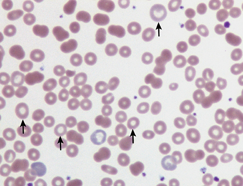
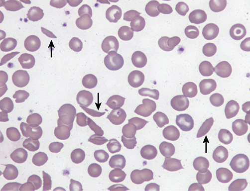
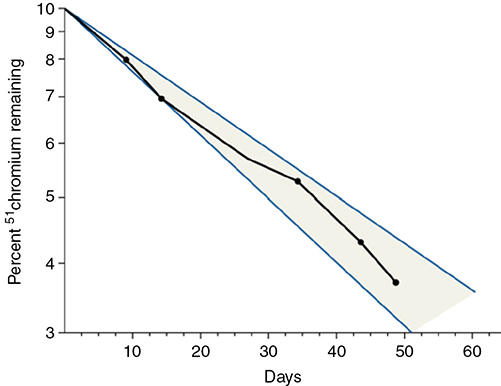

# Chapter 59: Hematological Disorders — Revision Notes

> Williams Obstetrics 26e, pp. 2724–2778 of the PDF. High-yield numbers are in **bold**.
> The seven tables are transcribed from the PDF images (they are missing from the extracted chapter text). All 3 figures are included from the PDF.

**Big picture:** Pregnancy's physiological hemodilution, falling platelets and rising clotting factors can both hide and mimic disease. **Iron deficiency and acute blood loss** cause most anemia; **gestational thrombocytopenia** causes most low platelets. The dangerous conditions to recognize are **sickle-cell disease**, **thrombotic microangiopathies (vs HELLP)**, and inherited bleeding disorders (**vWD, hemophilia carriers**).

---

## 1. Anemias — Definition and Evaluation

- **CDC definition** (iron-supplemented women, 5th percentile): **Hb <11 g/dL in the 1st and 3rd trimesters; <10.5 g/dL in the 2nd trimester.** (Not derived from a US population.)
- **Parkland data (480 iron-sufficient women): Hct <30% is a reasonable definition of anemia.**
- Mechanism of the physiological fall: plasma volume expands more than red cell mass — **greatest disproportion in the 2nd trimester**; late in pregnancy plasma expansion stops while Hb mass keeps rising.
- US prevalence **3–38%**.
- **Initial workup (moderate anemia):** Hb, Hct, red cell indices, serum iron or ferritin, **peripheral smear**, and a **sickle-cell prep** if of African lineage.

### Table 59-1. Hematocrit Values in Pregnancy (percent)

| | 5th percentile | 50th percentile | 75th percentile |
|---|---|---|---|
| 1st trimester | **33.0** | 37.5 | 41.2 |
| 2nd trimester | **30.5** | 35.7 | 39.2 |
| Predelivery | **30.7** | 36.5 | 40.5 |

*Data from 480 iron-sufficient women at Parkland Hospital (Zofkie, 2020).*

### Table 59-2. Causes of Anemia During Pregnancy

| Acquired | Hereditary |
|---|---|
| **Iron-deficiency anemia** | Thalassemias |
| **Acute blood-loss anemia** | Sickle-cell hemoglobinopathies |
| Anemia of chronic disease | Other hemoglobinopathies |
| Megaloblastic anemia | Hemolytic anemias |
| Hemolytic anemias | |
| Aplastic or hypoplastic anemia | |

### Effects on pregnancy outcome
- **Mild anemia (Hb 9.0–10.9 g/dL)** in 12% of >500,000 Canadian women → **2.5× transfusion risk**. **Moderate anemia** → ↑ FGR, low 5-min Apgar, perinatal mortality.
- Correcting iron deficiency ↓ transfusion at delivery.
- **Paradox: high Hb is also bad** — reflects poor plasma volume expansion. Hb **>3 SD above mean at 12 or 18 wk → 1.3–1.8× FGR**. Placental weight correlates negatively with Hb.
- ⚠️ This does **not** justify withholding iron.

---

## 2. Iron-Deficiency Anemia
- **Two most common causes of anemia in pregnancy/puerperium: iron deficiency and acute blood loss.**
- Singleton pregnancy needs **~1000 mg iron** (more with multiples) — exceeds most women's stores.
- **Fetus gets its iron regardless** → newborn of a severely anemic mother is **not** iron-deficient anemic. Neonatal stores depend on maternal status and **timing of cord clamping**.
- **Diagnosis:**
  - Hypochromia + microcytosis (less prominent in pregnancy); **MCV <80 fL**
  - **Serum ferritin <10–15 confirms** (ferritin normally falls in pregnancy)
  - Hepcidin falls in pregnancy (hepcidin blocks ferroportin iron export)
- **Prophylaxis (WHO): 30–60 mg elemental iron + 400 µg folic acid daily.**
- **Treatment: ~200 mg elemental iron daily** (ferrous sulfate, fumarate or gluconate).
  - Can't take oral iron → **IV iron**; **iron sucrose is safer than iron dextran**.
  - Response = **↑ reticulocytes**; Hb rises more slowly than in nonpregnant women (larger plasma volume).
  - Oral and parenteral iron give **equivalent** Hb and ferritin rises.

*The extracted text gives ferritin as "10 to 15 mg/L" (should be µg/L, i.e., ng/mL) and says "ferrous sucrose" (should be iron sucrose).*

*Figure 59-1. Iron-deficiency anemia smear: scattered microcytic, hypochromic red cells with central pallor (arrows).*

### Anemia from acute blood loss
- Early pregnancy: **abortion, ectopic, molar pregnancy**. Postpartum: obstetric hemorrhage (massive hemorrhage → Ch 44).
- **Hb ~7 g/dL, hemodynamically stable, ambulating without symptoms, not septic → NO transfusion**; give **oral iron for ≥3 months**.

### Anemia of chronic disease
- Inflammatory cytokines restrict erythropoiesis and shorten RBC life; **hepcidin ↑** blocks enterocyte iron export.
- **Slightly hypochromic/microcytic, low transferrin saturation, HIGH ferritin.**
- With iron deficiency, the most common anemia worldwide. May appear or worsen in pregnancy as plasma expands.
- Causes: **chronic renal insufficiency (most common at Parkland)**, IBD, connective tissue disease, granulomatous infection, malignancy.
- Renal disease: red cell mass expansion is inversely related to renal impairment while plasma expansion is normal → worse anemia; some EPO deficiency.
- **Treatment:** ensure iron stores; **recombinant erythropoietin** (± IV iron), considered when **Hct ~20%** in renal insufficiency. Side effects: **hypertension**, red cell aplasia, anti-EPO antibodies.

| | Iron deficiency | Anemia of chronic disease |
|---|---|---|
| MCV / color | Microcytic, hypochromic | Slightly microcytic/hypochromic |
| **Ferritin** | **Low (<10–15)** | **High** |
| Transferrin saturation | Low | Low |
| Hepcidin | ↓ | **↑** |

---

## 3. Megaloblastic Anemia

### Folic acid deficiency
- Impaired DNA synthesis → large cells with **nuclear maturation arrested** while cytoplasm matures.
- **In pregnancy almost always folate deficiency** (formerly "pernicious anemia of pregnancy"): diets lacking **green leafy vegetables, legumes, animal protein**; anorexia worsens it.
- Other causes: malabsorption (tropical sprue, jejunal resection, gastrectomy, Crohn), hemolytic anemias, malignancy, antifolate drugs.
- **Requirement: 50–100 µg/d nonpregnant → 400 µg/d in pregnancy.**
- **Sequence of findings:** low plasma folate (earliest) → **hypersegmented neutrophils + macrocytes** → nucleated RBCs, megaloblastic marrow → severe anemia ± thrombocytopenia/leukopenia.
- **Fetus is not anemic** despite severe maternal anemia.
- **Treatment: oral folic acid 5–15 mg/d + iron** + nutritious diet → **reticulocytosis and correction of WBC/platelets by 4–7 days**.
- Folate also prevents neural-tube defects (Ch 15).

### Vitamin B12 deficiency
- B12 levels fall in pregnancy (↓ **transcobalamins**), but B12-deficient megaloblastic anemia is **rare**.
- Most likely after **gastric resection**: **total gastrectomy → cyanocobalamin 1000 µg IM monthly**; partial gastrectomy — check levels.
- Other causes: Crohn, ileal resection, drugs, bacterial overgrowth.
- **Addisonian pernicious anemia** (no intrinsic factor, autoimmune) usually starts **after 40** → uncommon in pregnancy.

---

## 4. Hemolytic Anemias

### Autoimmune hemolysis
- **Direct and indirect Coombs positive.** **Warm antibodies 80–90%**, cold, or mixed.
- Primary (idiopathic) or secondary: lymphoma/leukemia, connective tissue disease, infection, chronic inflammation, drugs. **Cold agglutinins:** *Mycoplasma pneumoniae*, EBV.
- IgM or IgG anti-RBC antibodies. **With thrombocytopenia = Evans syndrome.**
- Hemolysis can accelerate markedly in pregnancy.
- **First line: low-dose rituximab 100 mg weekly × 4 + prednisone.** Transfusion is difficult; **warm donor cells** to body temperature (cold agglutinins). Fetus rarely involved.

### Drug-induced hemolysis
- Usually mild; resolves on withdrawal.
- **High-affinity hapten** (drug on RBC protein; IgM antibodies): **penicillin, cephalosporins** — severe Coombs+ hemolysis from **cefotetan** prophylaxis in 7 women; **α-methyldopa** similar.
- **Low-affinity haptens:** probenecid, quinidine, rifampin.
- Common mechanism: **G6PD deficiency**.

### Pregnancy-associated hemolysis
- Unexplained severe hemolysis in **early pregnancy**, resolves months postpartum; no immune mechanism or RBC defect found; fetus may have transient hemolysis. **Corticosteroids often effective.** Can recur each pregnancy.
- Pregnancy-specific: **HELLP** (mild microangiopathic hemolysis), **AFLP** (moderate–severe hemolysis).

### Paroxysmal nocturnal hemoglobinuria (PNH)
- Acquired **hemopoietic stem cell clonal** disorder; mutated X-linked **PIG-A** gene → defective GPI anchor proteins → RBCs/granulocytes **susceptible to complement lysis**.
- Hemoglobinuria irregular, **not necessarily nocturnal**; triggered by transfusion, infection, surgery.
- **VTE in ~40%**; renal failure, hypertension, **Budd-Chiari**. → **Prophylactic anticoagulation**.
- **Treatment: eculizumab** (complement inhibitor; apparently safe in pregnancy). Definitive: **bone marrow transplant**. Median survival **10 years**.
- **Pregnancy:** complications in up to **¾**; past maternal mortality **10–20%**; mostly **postpartum**; **half develop VTE**. On eculizumab (75 pregnancies): no maternal deaths, **stillbirth 4%**.

### Bacterial toxins
- **Most fulminant acquired hemolysis in pregnancy: *Clostridium perfringens* exotoxin or group A β-hemolytic streptococcus.**
- Gram-negative endotoxin (e.g., **pyelonephritis**) → mild–moderate hemolysis; recovers after infection.

### Inherited red cell membrane defects
- **Hereditary spherocytosis**, pyropoikilocytosis, ovalocytosis — among the most common hemolytic anemias in pregnancy.
- Usually **autosomal dominant, variably penetrant α- and β-spectrin deficiency**; also ankyrin, band 3, 4.1, 4.2 defects.
- **Diagnosis: abnormal cells on smear + ↑ osmotic fragility.**
- Crises: accelerated hemolysis (enlarged spleen); **parvovirus B19** suppresses erythropoiesis (aplastic crisis). Splenectomy for severe disease.
- **Pregnancy:** generally good. **Folic acid 4 mg/d.** Parkland: Hct 23–41% (mean 31), reticulocytes 1–23%; 8 of 23 women miscarried; 4 of 42 preterm, none FGR; infection worsened hemolysis (3 transfused).
- Newborn may have **hyperbilirubinemia and anemia**; fetal anemia uncommon.

### Red cell enzyme deficiencies
- Hereditary **nonspherocytic** anemia; mostly **autosomal recessive**; crises triggered by drugs or infection.
- **Pyruvate kinase deficiency:** **1 in 10,000**; transfusion → iron overload (watch myocardium); homozygous fetus → **hydrops**.
- **G6PD deficiency:** >200 variants; **X-linked**.
  - **~2% of African-American women homozygous (A variant); 10–15% heterozygous.** Lyonization → variable enzyme activity.
  - Hemolysis usually episodic; young RBCs have more enzyme, so anemia self-corrects once the trigger is removed.
  - Triggers: **pyelonephritis, pneumonia**, drugs — e.g., **nitrofurantoin (Macrodantin)** used for pyelonephritis suppression.
  - Offer preconception and genetic counseling ± partner testing.

---

## 5. Aplastic and Hypoplastic Anemia
- **Pancytopenia + markedly hypocellular marrow** (↓ committed stem cells). Cause found in **~⅓**: immune, drugs, chemicals, infection, irradiation, leukemia, inherited (**Fanconi, Diamond-Blackfan**).
- Treatment: immunosuppression; **eltrombopag** in some nonresponders. **Definitive = bone marrow transplant** (~¾ good response/long-term survival); cord blood stem cells are a source.
- **Pregnancy:** rare; **half diagnosed during pregnancy**; complication rate **79%** (19 pregnancies, no deaths). Pregnancy-induced hypoplasia improves after delivery/termination and may recur.
- **Diamond-Blackfan** (pure red cell hypoplasia): **40% familial, autosomal dominant**; responds to glucocorticoids; ⅔ of pregnancies had placental-vascular problems (miscarriage, preeclampsia, preterm, FGR, stillbirth).
- **Gaucher disease:** autosomal recessive **acid β-glucosidase** deficiency; anemia + thrombocytopenia worsen in pregnancy; **enzyme replacement (alglucerase, imiglucerase)**.
- **Main risks: hemorrhage and infection.** ↑ Preterm labor, preeclampsia, FGR, stillbirth.
- **Management:** infection surveillance + prompt antibiotics; granulocyte transfusion only during infection; **transfuse RBCs to keep Hct >20%**; platelets for hemorrhage. Mortality historically **~50%**, now lower.

### After bone marrow transplantation
- Fertility ↓, but outcomes generally good; ~half of live births complicated by preterm delivery or hypertension; 20% had ↓ hemopoiesis needing transfusion.
- Normal pregnancy erythropoiesis and volume expansion. **Cell-free DNA results must account for donor DNA.**

---

## 6. Polycythemias
- **Secondary** (usual): chronic hypoxia — **cyanotic heart disease, chronic lung disease**; heavy smokers with bronchitis (Hct **55–60%**). Severe polycythemia → poor pregnancy outcome.
- **Polycythemia vera:** clonal myeloproliferative disorder; **virtually all JAK2 mutation**; hyperviscosity, **thrombosis**.
  - Nonpregnant: hydroxyurea or ruxolitinib.
  - **Pregnancy: high fetal loss → aspirin improves outcome**; **LMWH if prior VTE**; **interferon-α** if cytoreduction needed.

---

## 7. Hemoglobinopathies

### Sickle-cell pathophysiology
- HbA = α₂β₂ (HBA1, HBA2 code α; **HBB codes β**).
- **HbS = glutamic acid → valine** at β-globin (A-for-T). **HbC = glutamic acid → lysine** (T-for-C).
- **Sickle-cell syndromes:** **SS, SC, S/β⁰ or S/β⁺ thalassemia, SE** — all ↑ pregnancy morbidity.
- Deoxygenation → sickling → membrane damage → irreversibly sickled cells; slowed microvascular transit (endothelial adhesion, dehydration, vasomotor dysregulation).
- **Clinical:** ischemia/infarction, **painful crises**; aplastic, megaloblastic, sequestration and hemolytic crises; avascular necrosis of femoral/humeral heads, renal medullary damage, **autosplenectomy (SS)** but splenomegaly in variants, cardiomegaly/ventricular hypertrophy, pulmonary infarction, **stroke**, leg ulcers, **infection/sepsis**. **Pulmonary hypertension in 20%** of adults with SS.
- **Treatment:** supportive care; **HbF induction with hydroxyurea** (↓ crises; teratogenic in animals, reassuring 17-yr follow-up); biologics, L-glutamine; stem cell transplant and **gene therapy** emerging as cures.

*Figure 59-2. Sickle-cell anemia smear: elongated, crescent-shaped sickle cells (arrows).*

### Sickle-cell syndromes in pregnancy
- Serious burden, **especially SS**. Maternal mortality has improved; **perinatal morbidity/mortality remain formidable**.
- **Folic acid 4 mg/d.**

### Table 59-3. Pregnancy Morbidity with Hemoglobin SS and SC Disease

| Outcome | Hb SS (odds ratio) | Hb SC (odds ratio) |
|---|---|---|
| Preeclampsia | 2–3.1 | 2.0 |
| Stillbirth | **6.5** | 3.2 |
| Preterm delivery | 2–2.7 | 1.5 |
| Growth restriction | 2.8–3.9 | 1.5 |
| Maternal mortality | **11–23** | **11** |

*From Boafor, 2016; Oteng-Ntim, 2015.*

**Pain crisis**
- ⚠️ **Diagnose crisis only after excluding other causes** — ectopic, **abruption**, pyelonephritis, appendicitis.
- Crises occur especially **late pregnancy, labor/delivery, early puerperium**.
- **IV fluids + prompt opioids**; nasal O₂; epidural may help.
- **Transfusion after pain begins does not dramatically relieve it**; prophylactic transfusions do prevent further crises.
- Narcotic habituation → ↑ neonatal abstinence syndrome.

**Infection**
- ↑ **Bacteriuria and pyelonephritis → screen and treat**. Endotoxin → rapid hemolysis + marrow suppression.
- Pneumonia (*S pneumoniae*) common. **Vaccinate: pneumococcal, *H influenzae* type B, meningococcal.**

**Acute chest syndrome**
- **Pleuritic chest pain, fever, cough, lung infiltrate, hypoxia**, ± bone/joint pain. **~6%** of pregnant women.
- **Four precipitants: infection (~half), marrow emboli, thromboembolism, atelectasis.**
- Mean stay **10.5 days**; **ventilation ~15%**; **mortality ~3%**.
- Transfusion: simple vs exchange (exchange no better in one study and used 4× blood); **ASH conditionally suggests exchange transfusion**.

**Cardiac**
- Ventricular hypertrophy, worsened by chronic hypertension; preeclampsia or infection may precipitate **heart failure**; consider pulmonary hypertension.
- 4352 pregnancies: **nondelivery admissions 63%**, hypertensive disorders **19% (1.8×)**, FGR **6% (2.9×)**, **cesarean 45% (1.7×)**.
- **Hb SC:** much lower morbidity; < half symptomatic before pregnancy; but bone pain and **pulmonary infarction/embolization** more common in pregnancy.

**Prophylactic red cell transfusion**
- **Most dramatic benefit on maternal morbidity.** Parkland protocol: keep **Hct >25% and HbS <60%**.
  - ↓ Maternal morbidity and admissions, but perinatal outcomes still poor (preterm birth, FGR).
- RCT (72 women): ↓ painful crises, no perinatal difference. Meta-analysis (12 studies): ↓ maternal mortality, pulmonary complications, perinatal mortality.
- Risks: **delayed hemolytic reaction up to 10%**, **alloimmunization ~¼**, infection. No iron overload found on liver biopsy.
- **Consensus: individualize** → ~**60%** will need transfusion.

**Fetal assessment**
- Serial growth scans from the **mid-2nd trimester**; **weekly BPP/NST from 32–34 wk**.
- NSTs may be nonreactive during a crisis, recovering afterward. **Placental abnormalities in 69%.**

**Labor and delivery**
- Manage like **cardiac disease**; comfortable, not oversedated. **Conduction analgesia is ideal.**
- Crossmatched blood available; **transfuse if Hct <20%** and a difficult vaginal or cesarean delivery is expected.
- **Vaginal delivery; cesarean for obstetric indications.**
- **Contraception:** CDC rates combined hormonal methods, IUDs, implants and progestin-only methods as acceptable (benefits outweigh risks).

### Sickle-cell trait
- **~8% of African Americans (1 in 12).** Hematuria, renal papillary necrosis, **hyposthenuria**; may speed ESRD progression.
- **Not** linked to ↑ abortion, perinatal mortality, LBW or preeclampsia (gestational hypertension ↑ in one study).
- **Definite: 2× asymptomatic bacteriuria and UTI.**
- Not a deterrent to pregnancy or hormonal contraception.

### Hemoglobin C, CC, C-β-thalassemia
- **~2%** of African Americans heterozygous for HbC; **even homozygous CC is innocuous** — problematic only as **SC**.
- CC and C-β-thal: mild–moderate anemia, otherwise normal outcomes; give folate and iron.

### Hemoglobin E
- **2nd most frequent Hb variant worldwide**; SE Asia (E-related genotypes in **36% of Cambodians, 25% of Laotians**).
- Homozygous EE: little/no anemia, **marked microcytosis**, target cells. **E trait:** only ↑ bacteriuria.
- **E-β-thalassemia:** common severe childhood anemia; **3× preterm birth and FGR** in pregnancy.

### Newborn screening and prenatal diagnosis
- SS, SC, CC detectable by **cord blood electrophoresis**; **all newborns screened** (mandated in most states).
- **Risk arithmetic (African Americans):**
  - SS: 1/12 × 1/12 × 1/4 = **1 in 576**
  - SC: 1/12 × 1/40 × 1/4 = **1 in 2000** (HbC gene 1 in 40)
  - S-β-thal: 1/12 × 1/40 × 1/4 = **1 in 2000** (β-thal minor 1 in 40)
- Prenatal diagnosis is **DNA-based on CVS or amniocytes** (targeted mutation analysis, PCR).

---

## 8. Thalassemia Syndromes
- Impaired synthesis/instability of a globin → ineffective erythropoiesis, hemolysis, anemia. Classified clinically as **transfusion dependent** or **nontransfusion dependent**.

### α-Thalassemias
- **HBA1 and HBA2 on chromosome 16** → **4 α-genes** (αα/αα); γ genes also duplicated.
- **α⁰ = both genes on one chromosome deleted (––/αα)**; **α⁺ = one gene deleted (–α/αα or –α/–α)**.

### Table 59-4. Genotypes and Phenotypes of α-Thalassemia Syndromes

| Syndrome | Genotype | Phenotype |
|---|---|---|
| Normal | αα/αα | Normal |
| α⁺-Thalassemia heterozygote | –α/αα or αα/–α | Normal; **silent carrier** |
| α⁺-Thalassemia homozygoteᵃ | –α/–α | **α-Thalassemia minor**—mild hypochromic, microcytic anemia |
| α⁰-Thalassemia heterozygoteᵇ | ––/αα | **α-Thalassemia minor**—mild hypochromic, microcytic anemia |
| Compound heterozygous α⁰/α⁺ | ––/–α | **Hb H (β₄) disease** with moderate to severe hemolytic anemia |
| Homozygous α-thalassemia | ––/–– | **Hb Bart (γ₄) disease, hydrops fetalis** |

*ᵃMore common in African Americans. ᵇMore common in Asian Americans. The printed first column is headed "Genotype" (duplicating the second column); it lists the syndrome.*

- **Why Hb Bart hydrops occurs in Asians but not in those of African descent:** Asians carry **cis deletions (––/αα)** → two carriers can produce ––/––. People of African descent carry **trans deletions (–α/–α)** → cannot produce ––/––. α-thal minor ~2% in African descent; HbH rare, Hb Bart disease unreported.
- **Pregnancy by number of deletions:**
  - **1 deletion (silent carrier):** ± mild microcytic anemia
  - **2 deletions (α-thal minor):** minimal–moderate hypochromic microcytic anemia; usually unrecognized, **no maternal consequence**; distinguishing ––/αα from –α/–α **needs DNA analysis**. Newborn has Hb Bart at birth, not replaced by HbH.
  - **3 deletions (HbH disease, ––/–α):** newborn has Hb Bart + HbH + HbA, then develops hemolytic anemia; adults have moderate–severe anemia that **worsens in pregnancy**.
  - **4 deletions (Hb Bart disease, α-thal major):** Hb Bart (γ₄) has **very high O₂ affinity** → **stillbirth or hydrops**, death soon after birth.
- **Fetal screening for Hb Bart:** **cardiothoracic ratio at 12–13 wk**; myocardial performance (**Tei index**) changes precede hydrops.

### β-Thalassemias
- **β-globin cluster (δγβ) on chromosome 11**; >150 point mutations. ↓ β-globin → excess α-globin precipitates → membrane damage.
- **β-thal minor (heterozygote):** **HbA₂ (α₂δ₂) >3.5%**; **HbF (α₂γ₂) >2%**; no or mild–moderate hypochromic microcytic anemia.
- **β-thal major (Cooley anemia, homozygous):** intense hemolysis, transfusion dependence → **hemochromatosis** (often fatal). **Thalassemia intermedia** = moderate anemia.
- Treatments: stem cell transplant; thalidomide + hydroxyurea (**both contraindicated in pregnancy**); lentiviral gene therapy; **luspatercept**.
- **Pregnancy:**
  - **Iron and folate for all affected women.**
  - β-thal minor: mild anemia from **ineffective erythropoiesis, not hemolysis** (red cell survival normal, Fig 59-3); FGR association.
  - **β-thal major** (transfused + chelated): 63 pregnancies without serious complications; reasonably safe **if cardiac function normal**. **Transfuse to keep Hb ~10 g/dL** + fetal growth surveillance.

*Figure 59-3. ⁵¹Cr red cell survival in β-thalassemia minor (black line) lies within the normal pregnant range (shaded): the anemia is from ineffective erythropoiesis, not hemolysis.*

### Prenatal diagnosis of thalassemia
- **α-thal major:** DNA analysis; Hb Bart by capillary electrophoresis or HPLC. HBA1/HBA2 testing identifies **90% of deletions, 10% of point mutations**.
- **β-thal major:** many mutations → **familial mutation must be known first**; CVS; cell-free DNA methods described; **preimplantation genetic testing** possible.

---

## 9. Platelet Disorders

### Thrombocytopenia
- **Platelets <150,000/µL in ~10% of gravidas.** **75% gestational thrombocytopenia**; HELLP is a common other cause. COVID-19 also causes it.

### Table 59-5. Some Causes of Thrombocytopenia in Pregnancy

| Cause |
|---|
| **Gestational thrombocytopenia: 75 percent** |
| **Preeclampsia and HELLP syndromes: 20 percent** |
| Obstetrical coagulopathies: DIC, MTP |
| Immune thrombocytopenic purpura |
| Systemic lupus erythematosus and APS |
| Infections: viral and bacterial |
| Drugs |
| Hemolytic anemias |
| Thrombotic microangiopathies |
| Malignancies |
| Pseudothrombocytopenia |
| Renal or liver diseases |
| Aplastic anemia |
| Genetic causes |
| COVID-19 |

*APS = antiphospholipid syndrome; DIC = disseminated intravascular coagulopathy; HELLP = hemolysis, elevated liver enzyme levels, low platelet count; MTP = massive transfusion protocol. From ACOG, 2019c; Cooper, 2019; Tang, 2020.*

### Gestational thrombocytopenia
- 2.5th percentile **116,000–123,000/µL**; **~1% <100,000/µL**. Bleeding only with far lower counts.
- **Platelets <80,000/µL → look for another cause**; gestational thrombocytopenia is unlikely to be **<50,000/µL**.
- Nadir in the **3rd trimester**; hemodilution ± ↑ splenic mass.

### Inherited thrombocytopenias
- **Bernard-Soulier syndrome, Glanzmann thrombasthenia:** missing platelet membrane glycoprotein → severe dysfunction. Mother can make antibodies to fetal **GPIb/IX** → **alloimmune fetal thrombocytopenia**.
  - 30 pregnancies: **primary PPH 33%** (half transfused); 6 neonatal alloimmune thrombocytopenias, 2 perinatal deaths. **Monitor through 6 wk postpartum.**
- **May-Hegglin anomaly:** autosomal dominant; thrombocytopenia, **giant platelets, leukocyte inclusions**; 75 pregnancies: 4 PPH, 34 neonatal thrombocytopenia, 2 fetal deaths.

### Immune thrombocytopenic purpura (ITP)
- **IgG antibodies against platelet glycoproteins** → destruction in the reticuloendothelial system (**spleen**). Platelets **10,000–100,000/µL**.
- In adults usually **chronic**, rarely remits spontaneously.
- **Secondary:** SLE, lymphoma, leukemia, systemic disease; ~2% have positive lupus serology (± anticardiolipin); **~10% of HIV patients** are thrombocytopenic.

### Table 59-6. Classification of Immune Thrombocytopenia (ITP)

| Category | Definition |
|---|---|
| ***Etiology*** | |
| Primary ITP | Acquired immune-mediated disorder characterized by **isolated thrombocytopenia** in the absence of obvious initiating or underlying cause |
| Secondary ITP | Thrombocytopenia due to underlying cause/drug exposure |
| ***Duration*** | |
| Newly diagnosed | Persistent **3–12 months** |
| Chronic | **12 months or more** |

*From Rodeghiero, 2009.*

**ITP in pregnancy**
- **~1 in 10,000 births.** Pregnancy does **not** ↑ relapse or worsen active disease, though remitted women may recur (closer surveillance, hyperestrogenemia).
- **Treat if symptomatic bleeding and platelets <30,000/µL; target 50,000/µL.**
- **First line: corticosteroids and/or IVIG.**
  - **Prednisone 1 mg/kg/d** (suppresses splenic macrophages).
  - **IVIG 2 g/kg total over 2–5 days.**
  - Also used: azathioprine, rituximab; **TPO-receptor agonists (romiplostim, eltrombopag)**.
- **Refractory → splenectomy** (open or laparoscopic; cesarean may be needed for exposure late in pregnancy); improvement in **1–3 days, peak ~8 days**.
- UKOSS (107 pregnancies): **PPH in half (20% severe)**; no neonate needed treatment; no ICH. Another series: ⅓ were overtreated.
- **Fetal/neonatal:**
  - ↑ Stillbirth, fetal loss, preterm birth. **IgG crosses the placenta**.
  - **Neonatal ICH <1%** (>800 neonates); **not related to route of delivery**.
  - **Maternal and fetal platelet counts correlate poorly**; antibody levels don't predict either.
  - **Fetal platelet sampling is NOT recommended.**
- **Alloimmune thrombocytopenia** (maternal antibodies to fetal platelet antigens) → Ch 18.

### Thrombocytosis
- **>450,000/µL persistently.**
- **Reactive:** infection, iron deficiency, trauma, inflammation, malignancy — **seldom >1 million/µL**.
- **Essential thrombocythemia:** most cases **>1 million/µL**; clonal, often **JAK2**; arterial and venous thromboses.
  - First line: **aspirin** ± hydroxyurea.
  - Pregnancy: ~half had abortion, fetal death or preeclampsia (40 pregnancies); Mayo: ⅓ miscarried; **aspirin → abortion 1% vs 75% untreated**.
  - Pregnancy options: **aspirin, LMWH, interferon-α**.

---

## 10. Thrombotic Microangiopathies (TTP and HUS)

### Etiopathogenesis
- **Thrombocytopenia + microangiopathic hemolysis + microvascular thrombosis.**
- **TTP:** antibodies to, or deficiency of, **ADAMTS13** (endothelial metalloprotease that cleaves vWF) → **ultralarge vWF multimers** → platelet aggregation → hyaline platelet–fibrin microthrombi in arterioles/capillaries → ischemia.
- **HUS:** endothelial damage from viral/bacterial infection; mainly **children**.
- **Secondary TMAs = 94%** — many pregnancy-related; also malignancy, drugs, transplant, autoimmune disease, COVID-19.

### Manifestations
- **TTP pentad: thrombocytopenia, hemolytic anemia, fever, renal impairment, neurological abnormalities.**
- **HUS: more renal, fewer neurological** features.
- Severe thrombocytopenia but **spontaneous severe bleeding uncommon**.
- Hemolysis: moderate–marked anemia; **schizocytes/fragmented RBCs**, ↑ reticulocytes and nucleated RBCs, **↑ LDH, ↓ haptoglobin**. Consumptive coagulopathy usually subtle.

### Treatment
- **TTP: plasmapheresis with FFP replacement + glucocorticoids** (removes inhibitor, replaces ADAMTS13).
- **Caplacizumab** (anti-vWF) blocks ultralarge vWF–platelet interaction.
- RBC transfusion for life-threatening anemia. **Continue until platelets normal for 2 days.** Relapses common; renal sequelae.
- **Pregnancy-associated (complement-mediated) HUS: eculizumab** (anti-C5).

### TMA in pregnancy
- **ADAMTS13 activity ↓ up to 50%** across pregnancy; lower still with preeclampsia and especially HELLP.
- **Parkland frequency 1 in 25,000** (11 in ~275,000); higher reported rates probably include severe preeclampsia.
- **Plasmapheresis is NOT for preeclampsia/HELLP.** ⚠️ **Delivery reverses preeclampsia but does NOT improve TMA.** Be sure of the diagnosis before treating.
- ADAMTS13 is hard to interpret with HELLP.
- Mortality was up to half; much better with plasma exchange. TTP = **1%** of UK maternal deaths (2003–08); 2 deaths in 60 pregnancy-associated HUS.

### Table 59-7. Some Differential Factors between HELLP Syndrome and Thrombotic Microangiopathiesᵃ

| Factor | HELLP Syndrome | Thrombotic Microangiopathies |
|---|---|---|
| Thrombocytopenia | Mild/mod. | **Mod./severe** |
| Microangiopathic hemolysis (schizocytosis) | Mild | **Severe** |
| ADAMTS13 deficiency | Mild/mod. | **Severe** |
| DIC | Mild | Mild |
| Transaminitis (AST, ALT) | **Mod./severe** | None/mild |
| Treatment | **Delivery** | **Plasmapheresis** |

*ᵃIncludes thrombotic thrombocytopenic purpura (TTP) and hemolytic uremic syndrome (HUS). ADAMTS13 = ADAM metallopeptidase with thrombospondin type 1 motif, 13; AST = aspartate transaminase; ALT = alanine transaminase; DIC = disseminated intravascular coagulopathy; HELLP = hemolysis, elevated liver enzyme levels, low platelet count; Mod. = moderate.*

> **Memory hook:** "HELLP hits the Liver, TMA hits the Red cells." Big transaminases → HELLP (deliver); big hemolysis with little liver injury → TMA (plasmapheresis).

### Recurrence and long-term prognosis
- Usually **recurrent** and often unrelated to pregnancy: 7 of 11 Parkland women recurred (nonpregnant or next 1st trimester). TTP recurred in 5 of 36 later pregnancies; atypical HUS in 5 of 32.
- **Relapse up to 40%** (nonpregnant). Long-term: recurrences, **dialysis/transplant**, severe chronic hypertension, transfusion-acquired infection. **Atypical HUS: 15% long-term renal failure**; 8 of 19 with primary aHUS reached ESRD.

---

## 11. Inherited Coagulation Defects

### Hemophilias A and B
- **Hemophilia A = factor VIII deficiency; B (Christmas disease) = factor IX.** **X-linked recessive.**
- **Severity by factor level: mild 6–30%; moderate 2–5%; severe <1%.**
- Women: usually **carriers** with ↓ levels; true disease almost needs homozygosity (or new mutation). **Acquired hemophilia A** (antibodies) in pregnancy → severe bleeding.
- **Pregnancy:**
  - Bleeding risk ∝ factor level. Carrier levels average **~50%** (lyonization); **<10–20% → hemorrhage risk**.
  - Factor VIII and IX **rise in pregnancy** (protective).
  - **Desmopressin** releases factor VIII; avoid lacerations, minimize episiotomy, maximize uterine contraction; operative and cesarean delivery carry bleeding risk.
  - Carriers: **PPH 20%**. Hemophilia B: **give factor IX if <10%**.
  - Affected male neonate: bleeding risk — especially **circumcision**.
- **Inheritance (carrier mother):** **half of sons affected, half of daughters carriers.** (Two abnormal alleles: all sons affected, all daughters carriers.) Prenatal diagnosis by CVS; PGT.

*The chapter text says a one-allele carrier "will have all sons affected ... and half of her daughters will be carriers"; for X-linked recessive inheritance with an unaffected father this should be **half of her sons** affected.*

### Factor VIII or IX inhibitors
- Rare acquired antibodies; in nonhemophiliacs **extraordinary**, but reported in the **puerperium**.
- **Severe, protracted, repetitive genital-tract bleeding starting ~1 week after an uncomplicated delivery**; **aPTT markedly prolonged**.
- Treatment: blood components, immunosuppression, surgery (curettage, hysterectomy); **recombinant factor VIIa (NovoSeven) stops bleeding in up to 75%**.

### Von Willebrand disease (vWD)
- **Most common inherited bleeding disorder: up to 1–2%.** ≥20 variants; **mostly autosomal dominant**; **type I = 75%**; **type III most severe, recessive**.
- **vWF:** large multimeric glycoprotein from **endothelium and megakaryocytes**; mediates **platelet adhesion to subendothelial collagen** and **stabilizes factor VIII** (factor VIII is made in the liver).
- **Symptoms:** easy bruising, epistaxis, mucosal bleeding, **heavy menses**, bleeding with surgery/trauma.
- **Labs:** prolonged bleeding time and PTT; ↓ vWF antigen; ↓ factor VIII activity; abnormal platelet responses.
- Some advise **cesarean with severe maternal disease** to protect a possibly affected fetus.
- **Pregnancy:**
  - **Factor VIII and vWF rise** → often normalize (bleeding time may stay prolonged).
  - Treat if factor VIII very low or bleeding: **desmopressin** (transient ↑ VIII and vWF); significant bleeding → **cryoprecipitate 15–20 units every 12 h** or **vWF-containing factor VIII concentrates (Alphanate, Humate-P)**.
  - **Neuraxial analgesia safe once coagulation corrected** or with prophylactic hemostatic agents.
  - **PPH common:** 33% (systematic review, >800 deliveries) vs ~5% (database, >2200); may be **primary or delayed**.

### Other factor deficiencies

| Deficiency | Inheritance | Key pregnancy points |
|---|---|---|
| **Factor VII** | Autosomal recessive (rare) | Rises only mildly in pregnancy; rFVIIa prophylaxis did not change PPH (94 births) |
| **Factor X** (Stuart-Prower) | Autosomal recessive (rare) | Rises ~50% in pregnancy yet ↑ preterm birth, perinatal death, PPH; treat with plasma-derived factor X, FFP or PCC |
| **Factor XI** | Autosomal recessive; **Ashkenazi Jews** | 70% uneventful; **factor XI concentrate for cesarean**; **avoid epidural unless factor XI given**; levels correlate poorly with bleeding; **PPH 18%** |
| **Factor XII** | Autosomal recessive | Rare in pregnancy; ↑ **thromboembolism** (not bleeding) |
| **Factor XIII** | Autosomal recessive | Maternal ICH, **recurrent miscarriage, abruption**, umbilical cord bleeding; FFP; weekly **factor XIII concentrate** prophylaxis → successful pregnancies |
| **Fibrinogen** | Dysfibrinogenemia (autosomal); hypo-/afibrinogenemia (recessive; Parkland view: hypofibrinogenemia = heterozygous dominant) | Clottable protein **80–110 mg/dL** nonpregnant; fibrinogen or plasma infusions through pregnancy |

### Thrombophilias
- Inherited deficiencies of coagulation inhibitors → recurrent thromboembolism → see **Ch 55**.

---

## Quick-Recall: Differential Table

| Condition | Key lab clue | Key management |
|---|---|---|
| Iron deficiency | MCV <80, **ferritin <10–15** | Elemental iron **200 mg/d**; IV iron sucrose if intolerant |
| Anemia of chronic disease | Microcytic, **ferritin high**, hepcidin ↑ | Treat cause; EPO at Hct ~20% in renal disease |
| Folate deficiency | Hypersegmented neutrophils, macrocytes | **Folic acid 5–15 mg/d** + iron; retics ↑ by 4–7 d |
| B12 deficiency | Megaloblastic; after gastrectomy | **1000 µg IM monthly** |
| Autoimmune hemolysis | **Coombs +** (warm 80–90%) | **Rituximab 100 mg weekly × 4 + prednisone** |
| PNH | Complement-mediated hemolysis, **VTE 40%** | **Eculizumab**, anticoagulation |
| Hereditary spherocytosis | Spherocytes, **↑ osmotic fragility** | Folic acid 4 mg/d; watch for parvovirus |
| G6PD deficiency | Episodic hemolysis with infection/drugs | Avoid triggers (e.g., nitrofurantoin) |
| Sickle-cell disease (SS) | Sickle cells; maternal mortality OR 11–23 | Folate 4 mg, exclude other causes of pain, individualized transfusion (Hct >25%, HbS <60%) |
| α-thal minor vs β-thal minor | Normal HbA₂ (DNA needed) vs **HbA₂ >3.5%**, HbF >2% | Iron + folate; partner testing |
| Hb Bart disease | ––/––; cardiothoracic ratio at 12–13 wk | Hydrops; prenatal DNA diagnosis |
| Gestational thrombocytopenia | Mild, 3rd trimester, rarely <50,000 | None; investigate if **<80,000** |
| ITP | Isolated thrombocytopenia, chronic | Treat if bleeding and **<30,000**; prednisone 1 mg/kg or IVIG 2 g/kg |
| TTP/HUS | Severe hemolysis, low ADAMTS13, mild liver | **Plasmapheresis** (TTP); **eculizumab** (aHUS); delivery doesn't help |
| HELLP | High transaminases, mild hemolysis | **Delivery** |
| vWD | ↓ vWF, ↓ VIII, prolonged bleeding time | Desmopressin; cryo or Humate-P; watch for **delayed PPH** |
| Acquired factor VIII inhibitor | Bleeding ~1 wk postpartum, **aPTT very long** | **rFVIIa** (75% response), immunosuppression |

## Key Numbers to Memorize
- Anemia: Hb **<11 (1st/3rd) / <10.5 (2nd) g/dL**; Parkland Hct **<30%**; prevalence **3–38%**
- Iron need **~1000 mg**; prophylaxis **30–60 mg** iron + **400 µg** folate; treatment **200 mg/d**; ferritin **<10–15** diagnostic
- Stable woman with Hb **~7 g/dL** → oral iron **≥3 months**, not transfusion
- Folate need **400 µg/d**; treatment **5–15 mg/d**; response in **4–7 d**; B12 **1000 µg IM monthly** after total gastrectomy
- Warm AIHA **80–90%**; PNH VTE **40%**, stillbirth on eculizumab **4%**
- G6PD: **2%** homozygous, **10–15%** heterozygous African-American women; pyruvate kinase deficiency **1 in 10,000**
- Sickle trait **1 in 12 (8%)**; SS **1 in 576**; SC and S-β-thal **1 in 2000**; HbC gene **1 in 40**
- SS odds ratios: stillbirth **6.5**, maternal mortality **11–23**; acute chest **6%** (ventilation **15%**, mortality **3%**); pulmonary hypertension **20%**
- Transfusion targets: Hct **>25%**, HbS **<60%**; transfuse before difficult delivery if Hct **<20%**; alloimmunization **~25%**; ~**60%** need transfusion
- β-thal minor: HbA₂ **>3.5%**, HbF **>2%**; β-thal major: keep Hb **~10 g/dL**
- Thrombocytopenia **<150,000** in **10%** (75% gestational, 20% preeclampsia/HELLP); investigate **<80,000**
- ITP: **1 in 10,000**; treat **<30,000** + bleeding; target **50,000**; prednisone **1 mg/kg**, IVIG **2 g/kg**; neonatal ICH **<1%**
- Thrombocytosis **>450,000**; essential **>1 million**; aspirin → abortion **1% vs 75%**
- TMA: **1 in 25,000**; ADAMTS13 ↓ **50%** in pregnancy; secondary TMA **94%**; relapse **40%**
- Hemophilia severity: mild **6–30%**, moderate **2–5%**, severe **<1%**; carriers PPH **20%**; factor IX if **<10%**
- vWD prevalence **1–2%**, type I **75%**; cryo **15–20 units q12h**; PPH **5–33%**; rFVIIa for inhibitors **75%**
