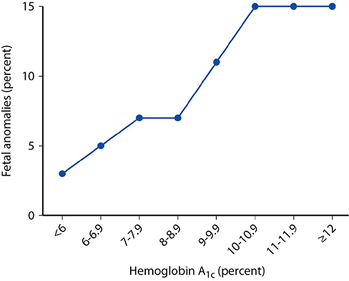
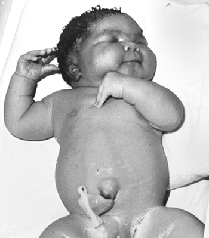
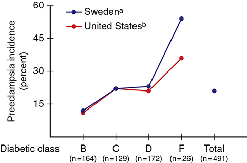
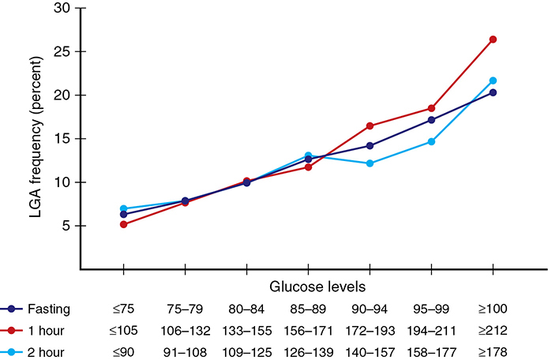

# Chapter 60: Diabetes Mellitus — Revision Notes

> Williams Obstetrics 26e, pp. 2779–2833 of the PDF. High-yield numbers are in **bold**.
> The 14 tables are transcribed from the PDF images (they are missing from the extracted chapter text). All 4 figures are included from the PDF.

**Big picture:** Diabetes is the **most common medical complication of pregnancy** (**7.6%** of US pregnancies in 2018). Pregestational (overt) diabetes harms embryo, fetus and mother — anomalies, stillbirth, preeclampsia — in proportion to glycemic control and vascular disease. Gestational diabetes (GDM) mainly causes **fetal overgrowth**, and flags a woman at high lifetime risk of type 2 diabetes.

---

## 1. Types of Diabetes

- **Type 1:** absolute insulin deficiency, usually **autoimmune** β-cell destruction; usually clinically apparent **before age 30**.
- **Type 2:** insulin resistance, relative insulin deficiency or ↑ glucose production; with advancing age, but increasingly in **obese adolescents**.
- Both are usually preceded by **prediabetes**.
- **MODY:** the more common type is in obese adolescents; the less common is **autosomal dominant**, mild diabetes in adolescence/young adulthood.

### Table 60-1. Etiological Classification of Diabetes Mellitus

| Type | Features |
|---|---|
| **Type 1** | β-Cell destruction, usually absolute insulin deficiency: immune-mediated; idiopathic |
| **Type 2** | Ranges from predominantly insulin resistance to predominantly an insulin secretory defect with insulin resistance |
| **Other types** | Genetic mutations of β-cell function: MODY 1–6, others · Genetic defects in insulin action · Genetic syndromes: Down, Klinefelter, Turner, others · Diseases of the exocrine pancreas: pancreatitis, cystic fibrosis · Endocrinopathies: Cushing syndrome, pheochromocytoma, others · Drug or chemical induced: glucocorticosteroids, thiazides, β-adrenergic agonists, others · Congenital infections: rubella, cytomegalovirus, coxsackievirus |
| **Gestational diabetes (GDM)** | |

*MODY = maturity-onset diabetes of the young.*

### Classification during pregnancy
- **Pregestational (overt)** = diagnosed before pregnancy; **gestational** = diagnosed during pregnancy.
- Rates more than doubled 1994–2008, then leveled. Highest in non-Hispanic Black, Mexican-American, Puerto Rican-American and Native American women.
- **White classification:** no longer recommended by ACOG (2019), but still gives useful risk and prognosis information. Current focus = does diabetes **antedate pregnancy** or not (ADA system, Table 60-3).

### Table 60-2. Modified White Classification Scheme Used from 1986 Through 1994 for Diabetes Complicating Pregnancy

| Class | Onset | Fasting plasma glucose | 2-Hour postprandial | Therapy |
|---|---|---|---|---|
| **A₁** | Gestational | <105 mg/dL | <120 mg/dL | Diet |
| **A₂** | Gestational | >105 mg/dL | >120 mg/dL | Insulin |

| Class | Age of onset (yr) | Duration (yr) | Vascular disease | Therapy |
|---|---|---|---|---|
| **B** | Over 20 | <10 | None | Insulin |
| **C** | 10 to 19 | 10 to 19 | None | Insulin |
| **D** | Before 10 | >20 | Benign retinopathy | Insulin |
| **F** | Any | Any | Nephropathyᵃ | Insulin |
| **R** | Any | Any | Proliferative retinopathy | Insulin |
| **H** | Any | Any | Heart | Insulin |

*ᵃWhen diagnosed during pregnancy: proteinuria ≥500 mg/24 hr before 20 weeks' gestation.*

> **Memory hook:** "**F**ilter = kidney (**F**), **R**etina = **R**, **H**eart = **H**." B → C → D = onset younger / duration longer.

### Table 60-3. Proposed Classification System for Diabetes in Pregnancy

| Category | Definition |
|---|---|
| **Gestational diabetes** | Diabetes diagnosed during pregnancy that is not clearly overt (type 1 or type 2) diabetes |
| **Type 1 diabetes** | Diabetes resulting from β-cell destruction, usually leading to absolute insulin deficiency: (a) without vascular complications; (b) with vascular complications (specify which) |
| **Type 2 diabetes** | Diabetes from inadequate insulin secretion in the face of increased insulin resistance: (a) without vascular complications; (b) with vascular complications (specify which) |
| **Other types of diabetes** | Genetic in origin, associated with pancreatic disease, drug-induced, or chemically induced |

*Data from American Diabetes Association, 2017a; Powers, 2018.*

---

## 2. Pregestational Diabetes

- **5–10%** of women with GDM are diagnosed with overt diabetes immediately after pregnancy (many "GDM" = unrecognized type 2).

### Diagnosis — overt diabetes first detected in pregnancy (ADA/WHO)
- Random plasma glucose **>200 mg/dL** + classic symptoms (polydipsia, polyuria, unexplained weight loss), **or**
- Fasting glucose **>125 mg/dL**, **or**
- First-trimester **HbA1c ≥6.5%**, **or**
- 2-hr value **>200 mg/dL** after a **75-g** load (ADA 2020 / WHO 2019).
- A presumed diagnosis must be **confirmed postpartum**. Universal vs high-risk testing: no consensus.
- **Risk factors** for impaired carbohydrate metabolism: strong family history, prior large newborn, persistent glucosuria, unexplained fetal losses.

### Table 60-4. Diagnosis of Overt Diabetes in Pregnancyᵃ

| Measure of glycemia | Threshold |
|---|---|
| Fasting plasma glucose | At least **7.0 mmol/L (126 mg/dL)** |
| Hemoglobin A1c | At least **6.5%** |
| Random plasma glucose | At least **11.1 mmol/L (200 mg/dL)** plus confirmation |

*ᵃApply to women without known diabetes antedating pregnancy. Whether to test all pregnant women or only those at high risk depends on the background frequency of abnormal glucose metabolism in the population and on local circumstances. Data from IADPSG Consensus Panel, 2010.*

### Harm in pregnancy
- Late-pregnancy **HbA1c <6.5%** + good control throughout → fewer adverse outcomes.
- Outcome is not just glucose control: **underlying cardiovascular/renal disease** may matter more → advancing White class = worse outcome.

### Table 60-5. Selected Maternal and Perinatal Outcomes in Percent in Women with Gestational and Overt Diabetes Compared with Nondiabetic Womenᵃ

| Factor | Normal (n = 182,464) % | GDM (n = 10,549) % | Overt DM (n = 2993) % |
|---|---|---|---|
| ***Maternal*** | | | |
| Chronic HTN | 1.5 | 5.0 | **11.5** |
| Renal disease | 0.5 | 0.6 | 2.7 |
| Gestational HTN | 8.0 | 12.9 | **22.9** |
| Chorioamnionitis | 4.1 | 4.0 | 5.2 |
| Cesarean birth | 42 | 59 | **69** |
| ***Neonatal*** | | | |
| RDS | 3.8 | 4.7 | 11.0 |
| Ventilation | 2.8 | 3.1 | 7.0 |
| NICU admit | 12.8 | 19.8 | **41.9** |
| Macrosomia | 7.7 | 18.1 | **29.9** |
| Deathᶜ | 0.2 | 0.1 | 0.4 |

*ᵃUnless specified, all comparisons p <0.001. ᶜp <0.05. HTN = hypertension; NICU = neonatal intensive care unit; RDS = respiratory distress syndrome.*

---

## 3. Fetal Effects (Pregestational Diabetes)

### Spontaneous abortion
- **Up to 25%** of overtly diabetic mothers miscarry; linked to poor control (**HbA1c >12%** or preprandial glucose persistently **>120 mg/dL**).
- Risk ↑ **8% per 20-mg/dL rise in fasting glucose**.
- MODY: only the **GCK (glucokinase) mutation** was linked to ↑ miscarriage in one study (another found background rates).

### Preterm delivery
- ~**20%** of diabetic women deliver preterm vs 5.6% of controls (Ontario); **>60% indicated**. With diabetes + chronic hypertension, **>37%** preterm.
- California: **19% vs 9%** before 37 wk.

### Malformations
- Major malformations with type 1 diabetes ≈ **11%** — **at least double** the background rate; the risk also applies to **type 2**.
- Anomalies = **almost half of perinatal deaths** in diabetic pregnancies. **Cardiovascular** malformations are **>half** of the anomalies; isolated cardiac defect risk **5-fold** with type 1.
- **Caudal regression (sacral agenesis): 80× more likely** — the classic diabetic embryopathy.
- Cause: poor control **preconceptionally and early**. HbA1c **>9%** → **6-fold** risk of major cardiac defect; HbA1c >10% → **4-fold** risk of malformations (vs nondiabetic); no clear excess risk with HbA1c <6.9%.
- Mechanisms: toxic **superoxide radicals** (oxidative stress), altered cell signaling, hyperglycemia-upregulated genes, **apoptosis**.

### Table 60-6. Selected Congenital Malformations in Pregnancies Complicated by Overt Diabetes

| Birth defect | OR (95% CI) |
|---|---|
| ***Cardiovascular*** | |
| Fallot tetralogy | 5.3 (3.5–8.0) |
| AV septal defect | **10.5** (6.2–17.9) |
| Aortic coarctation | 4.5 (2.8–7.1) |
| ***Neural-tube defect*** | |
| Anencephaly | 3.5 (1.9–6.4) |
| Encephalocele | 5.4 (2.5–11.7) |
| Hydrocephaly | 8.2 (5.0–13.5) |
| Cleft palate | 4.3 (2.9–6.5) |
| Esophageal | 3.4 (1.9–6.1) |
| Hypospadias | 2.8 (1.7–4.8) |
| Renal | 8.1 (3.9–16.9) |
| **Sacral agenesis** | **80.2** (46.1–139.3) |

*CI = confidence interval; OR = odds ratio.*

*Figure 60-1. Fetal anomaly rate climbs with HbA1c at the start of prenatal care: ~3% at <6% → ~15% at ≥10% (Parkland, 1573 pregnancies).*

### Altered fetal growth
- **Growth restriction:** from malformations or substrate deprivation (advanced maternal **vascular disease**).
- **Overgrowth is more typical:** maternal hyperglycemia → **fetal hyperinsulinemia** → excessive somatic growth (all organs **except the brain**).
- Diabetic macrosomia is **anthropometrically different**: excess fat on **shoulders and trunk** → **shoulder dystocia** / fetopelvic disproportion.
- Macrosomia ↑ significantly when mean maternal glucose chronically **>130 mg/dL**.
- Macrosomia rates (Nordic): **type 1 35%, type 2 28%, GDM 24%**. The **abdominal circumference** grows disproportionately (↓ HC/AC ratio).

*Figure 60-2. A 6050-g macrosomic neonate of a mother with GDM: fat deposition on the shoulders and trunk.*

### Unexplained fetal demise
- Fetal death **3–4× higher** with pregestational diabetes; stillbirth type 1 vs type 2: **10.4 vs 13.5 per 1000**.
- **"Unexplained" stillbirth** is relatively **unique to overt diabetes**: no placental insufficiency, abruption, FGR or oligohydramnios. Fetus is typically **LGA**, dies **before labor, late in the 3rd trimester**; usually **poor glycemic control** (2/3 of cases).
- Mechanism: hyperglycemia-mediated chronic aberrations in O₂ and metabolite transport → ↑ **lactic acid**, lower umbilical venous pH (related to fetal insulin levels).
- Also: **maternal DKA**; placental insufficiency with **severe preeclampsia**; vascular disease.
- Hypertension + pregestational diabetes → **7-fold** fetal death risk (vs 3-fold with diabetes alone).

### Hydramnios
- **18%** of pregestational diabetics in the 3rd trimester (AFI **>24 cm**); linked to ↑ HbA1c.
- Likely cause: **fetal hyperglycemia → fetal polyuria**. AFI parallels amnionic fluid glucose.

### Neonatal effects
- Preterm birth persists (mostly **indicated** for diabetes + superimposed preeclampsia).
- Extremely preterm neonates of insulin-treated mothers: ↑ **NEC and late-onset sepsis**.
- **RDS:** gestational age, not diabetes, is the main factor; diabetes does **not** blunt the benefit of **antenatal corticosteroids**.
- **Hypoglycemia** (**<45 mg/dL**): rapid fall after delivery from **fetal β-islet cell hyperplasia**; worse with unstable labor glucose and after antenatal steroids at early term → frequent glucose checks + **early feeding**.
- **Hypocalcemia** (total Ca **<8 mg/dL** in term newborns): cause unclear (Mg–Ca economy, asphyxia, preterm birth). Strict control ↓ it (18% vs ~1/3).
- **Polycythemia → hyperbilirubinemia:** relative fetal hypoxia (↑ maternal O₂ affinity + ↑ fetal O₂ consumption) + IGFs → ↑ **erythropoietin**.
- **Hypertrophic cardiomyopathy** (pregestational and GDM): attributed to **insulin excess**; thick interventricular septum and RV wall; can cause **obstructive** failure; usually asymptomatic and **resolves within months**.
- **Long-term:** IQ 1–2 points lower; ↑ autism spectrum/developmental delay; memory impairment at 1 yr — confounded, **unconfirmed**.

### Inheritance
| Parent(s) affected | Offspring risk |
|---|---|
| Either parent with **type 1** | **3–5%** |
| **Both** parents with **type 2** | **~40%** |

- Type 1 is triggered by environment (infection, diet, toxins) and heralded by **islet-cell autoantibodies**.

---

## 4. Maternal Effects (Pregestational Diabetes)

- Pregnancy does not change the long-term course of diabetes — **except possibly retinopathy**.
- Maternal mortality (type 1) **0.5%**: DKA, hypoglycemia, hypertension, infection.

### Preeclampsia
- The complication that **most often forces preterm delivery**.
- Pregestational diabetes → **~4-fold** RR of preeclampsia; with **chronic hypertension ~12×**.
- Risk rises with **White class** (vasculopathy, nephropathy) — see Fig. 60-3.
- Antioxidants (vitamins C and E, DAPIT) **did not** help.
- **Low-dose aspirin 81 mg/d**, start **12–28 wk**, continue until delivery (type 1 **or** type 2 diabetes = high risk).

*Figure 60-3. Preeclampsia incidence by White class in type 1 diabetes: ~11–12% in class B → ~36–54% in class F (nephropathy).*

### Diabetic nephropathy
- Diabetes = **leading cause of ESRD** in the US.
- **Microalbuminuria = 30–300 mg/24 h** (may appear **5 yr** after onset) → **macroalbuminuria >300 mg/24 h** → hypertension → renal failure in **5–10 yr**.
- Overt proteinuria: **~30% of type 1**, 4–20% of type 2.
- **~5%** of pregnant overt diabetics have renal involvement → up to **40% develop preeclampsia**.
- Proteinuria **>300 mg/d** → ↑ preterm delivery, preeclampsia and FGR.
- Pregnancy generally does **not** worsen **mild** nephropathy; **moderate–severe** impairment may progress faster. Hypertension or heavy proteinuria predict progression to renal failure.

### Diabetic retinopathy
| Stage | Findings |
|---|---|
| Background (nonproliferative) | **Microaneurysms** (first and most common) → blot hemorrhages → **hard exudates** |
| Preproliferative | Vessel occlusion → ischemia/infarcts → **cotton wool** exudates |
| Proliferative | **Neovascularization** on retina/into vitreous → bleeding obscures vision |

- **Laser photocoagulation** before hemorrhage halves visual loss/blindness; **can be done in pregnancy**.
- Type 1: 1/3 had prepregnancy retinopathy, 16% of these worsened; ~25% without it developed some; sight-threatening disease rare.
- Progression risk factors: **hypertension**, ↑ IGF-1, PlGF, early macular edema.
- **Retinal exam after the first prenatal visit** (AAO); follow-up by severity.
- ⚠️ **Acute rigorous control** can cause **acute worsening** (~30% progression), though long-term progression is slowed.

### Diabetic neuropathy
- Peripheral neuropathy uncommon. **Diabetic gastropathy** → nausea/vomiting, poor nutrition, unstable glucose, poor perinatal outcome.
- Rx: **metoclopramide**, D2 antagonists; gastric neurostimulators. Hyperemesis in diabetics → **continuous IV insulin** initially.

### Diabetic ketoacidosis (DKA)
- **~1%** of diabetic pregnancies; mostly **type 1**, but also type 2 and even GDM.
- **Triggers:** hyperemesis, infection, insulin noncompliance, **pump failure**, **β-mimetic tocolytics**, **antenatal corticosteroids**.
- Insulin deficiency + ↑ counterregulatory hormones (glucagon) → gluconeogenesis + ketones.
- **β-Hydroxybutyrate** is made much faster than acetoacetate (which routine tests detect) → **serum β-hydroxybutyrate** better reflects ketosis.
- **Maternal mortality <1%**, but **perinatal mortality up to 35%** with a single episode.
- ⚠️ DKA occurs at **lower glucose** in pregnancy (Parkland mean **380 mg/dL**, HbA1c 10%). **Euglycemic DKA** is possible but rare.
- Cornerstone: **vigorous rehydration** (normal saline or Ringer lactate).

### Table 60-7. Management of Diabetic Ketoacidosis During Pregnancy

| Step | Management |
|---|---|
| **Laboratory assessment** | Arterial blood gases to document the degree of acidosis; measure glucose, creatinine, ketones and electrolytes at **1- to 2-hour** intervals |
| **Insulin** | Low-dose, intravenous. Loading dose **0.2–0.4 U/kg**; maintenance **2–10 U/hr** |
| **Fluids** | Isotonic NaCl for **3 L**, then 0.45% saline. Total replacement in first 12 hours of **4–6 L**: **1 L in first hour**; 500–1000 mL/hr for 2–4 hours; 250 mL/hr until 80% replaced |
| **Glucose** | Begin **5% dextrose in 0.45% saline** when plasma glucose reaches **250 mg/dL (14 mmol/L)** |
| **Potassium** | If initially normal or reduced, up to **15–20 mEq/hr** may be required; if elevated, wait until normal, then add **20–30 mEq/L** to IV fluid |
| **Bicarbonate** | Add one ampule (**44 mEq**) to 1 L of 0.45 normal saline if **pH <7.1** |

*Data from Bryant, 2017; Powers, 2018; Sibai, 2014.*

### Infections
- ↑ Candidal vulvovaginitis, UTI, respiratory infection, **puerperal pelvic sepsis**.
- **Asymptomatic bacteriuria 2×**; **pyelonephritis 5% vs 1.3%** → screen and treat ASB.
- Cesarean **wound complications 16.5%**.

---

## 5. Management of Pregestational Diabetes

### Preconceptional care
- ~Half of pregnancies are unplanned.
- **Target HbA1c <6.5%** before conception.
- ADA preconception targets (insulin users): preprandial **70–100 mg/dL**, peak 2-hr postprandial **100–120 mg/dL**, mean daily **<110 mg/dL**.
- Malformation risk not clearly ↑ with **HbA1c <6.9%**; **4-fold with >10%**.
- Evaluate/treat retinopathy and nephropathy **before** pregnancy.
- **Folate 400 µg/d** periconceptionally.

### First trimester
- Parkland: **hospitalize** early for individualized glucose program, education, assessment of vascular complications and dating.
- Baseline: **24-hr urine protein + serum creatinine**, **retinal exam**, **echocardiogram** if chronic hypertension.
- Aneuploidy screening: PAPP-A and β-hCG medians are **lower** in insulin-treated women (NT unchanged) → adjust risk. cfDNA suitable.

### Insulin treatment
- **Insulin is best** for overt diabetes; oral agents not recommended.
- **Adjunctive metformin** in type 2 (MiTy): better control, less weight gain, fewer cesareans, less neonatal adiposity, but **more SGA** newborns (no ↑ serious composite).
- Multiple daily injections = **pump** in outcomes; pump is a safe option (start **prepregnancy**). Closed-loop / CGM-augmented systems now possible.
- Pump users: dose falls in the 1st trimester, then rises **>3-fold**, mostly for **postprandial** glucose.

### Table 60-8. Action Profiles of Commonly Used Insulins

| Insulin type | Onset | Peak (hr) | Duration (hr) |
|---|---|---|---|
| ***Short-acting (SC)*** | | | |
| Lispro | <15 min | 0.5–1.5 | 2–4 |
| Glulisine | <15 min | 0.5–1.5 | 2–4 |
| Aspart | <15 min | 0.5–1.5 | 2–4 |
| Regular (SC) | 30–60 min | 2–3 | 3–6 |
| Regular inhaled | 30–60 min | 2–3 | 3 |
| ***Long-acting (SC)*** | | | |
| Degludec | 1–9 hr | — | <12 |
| Detemir | 1–4 hr | Minimalᵃ | 12–24 |
| Glargine | 1–4 hr | Minimalᵃ | 20–24 |
| NPH | 1–4 hr | 4–10 | 10–16 |

*ᵃMinimal peak activity. NPH = neutral protamine Hagedorn; SC = subcutaneous.*

### Monitoring
- **Self-monitored capillary glucose**, fasting + postprandial. CGM reveals undetected **daytime hyperglycemia and nocturnal hypoglycemia**.

### Table 60-9. Self-Monitored Capillary Blood Glucose Goals

| Specimen | Level (mg/dL) |
|---|---|
| Fasting | **≤95** |
| Premeal | ≤100 |
| 1-hr postprandial | **≤140** |
| 2-hr postprandial | **≤120** |
| 0200–0600 | ≥60 |
| Mean (average) | 100 |
| Hemoglobin A1c | **≤6%** |

### Diet
- Minimum **175 g/d carbohydrate**; 3 small–moderate meals + **2–4 snacks**.
- Ideal: **55% carbohydrate, 20% protein, 25% fat** (<10% saturated). No weight loss; modest calorie restriction if obese.

### Hypoglycemia
- Control is unstable in the first half; **hypoglycemia peaks in the 1st trimester** (<40 mg/dL in 37/60 type 1 women; 1/4 severe).
- **Loose control** (fasting **>120 mg/dL**) → ↑ preeclampsia, cesarean, birthweight >90th %ile.
- **Very tight control** (fasting **<90 mg/dL**) → no benefit, more hypoglycemia.

### Second trimester
- **MSAFP at 16–20 wk** + targeted sonography (MSAFP may be **lower** in diabetics). Anomaly detection is harder in **obese** diabetics.
- **Fetal echocardiography** (cardiac anomalies ↑ **5-fold**).
- Stable period, then ↑ insulin needs (pregnancy insulin resistance).
- **Falling insulin requirements (FIR)** = **≥15% drop** from peak dose after 20 wk → **4-fold** ↑ placental-insufficiency composite (preeclampsia, growth disorders, delivery <30 wk, abruption, fetal death). More common in type 1.

### Third trimester and delivery
- Fetal surveillance (kick counts, FHR testing, BPP, CST) — valued for **low false-negative rate**; start at **32–34 wk** (ACOG).
- Reassuring and uncomplicated → deliver **39⁰/₇–39⁶/₇ wk** (ACOG).
  - Parkland: clinic every 2 wk; kick counts; **admission offered at 34 wk** to insulin-treated women (FHR testing 3×/wk); delivery at **38 wk**.
  - UAB: weekly testing by **34 wk** (twice weekly if poorly controlled); delivery at **39 wk**; earlier if poor control/comorbidity.
- Induce if fetus not excessively large and cervix favorable.
- Cesarean and preeclampsia rates rise with **White class**. HbA1c **>6.4%** at delivery → urgent cesarean. Parkland cesarean rate for overt diabetes ~**80%** for 40 yr.
- **Day of delivery:** reduce/withhold **long-acting** insulin; use **regular** insulin; **IV insulin infusion** in labor; IV hydration + glucose to maintain euglycemia; glucose checked **hourly** in active labor.

### Table 60-10. Insulin Management for Labor Induction or Scheduled Cesarean Delivery

| Step |
|---|
| Give **evening dose** insulin |
| **Withhold morning dose** |
| Infuse IV normal saline at **100–125 mL/hr** |
| **Regular insulin** infused at **1–1.25 units/hr** if glucose **>100 mg/dL** |
| Measure glucose **hourly** |
| With active labor or if glucose **>70 mg/dL**, change from IV saline to **5% dextrose at 100–150 mL/hr**, target glucose **~100 mg/dL** |

### Puerperium
- Often **virtually no insulin for the first 24 h** postpartum, then fluctuating needs.
- Detect and treat **infection** promptly. Type 2 → oral agents from **postoperative day 1**.
- **Effective contraception** to allow optimal control before the next conception.

---

## 6. Gestational Diabetes

- **Definition:** carbohydrate intolerance of variable severity with **onset or first recognition during pregnancy** — whether or not insulin is used (includes some unrecognized overt diabetes).
- **~6%** of US pregnancies (2016).
- Most important perinatal correlate: **excessive fetal growth** → maternal and fetal **birth trauma**.
- **Fetal death risk with treated GDM = general population.**
- **>Half develop overt diabetes within 20 yr**; offspring at risk of obesity and diabetes.

### Screening and diagnosis
- **Two-step (ACOG, NIH 2013):** **50-g, 1-hr glucose challenge**, then diagnostic **100-g, 3-hr OGTT** if abnormal.
- **One-step (IADPSG, ADA):** **75-g, 2-hr OGTT** (Table 60-11) — driven by the HAPO study.
- ACOG: **universal** screening at **24–28 wk** (risk-based selection adds complexity). USPSTF: universal screening **after 24 wk**; insufficient evidence before 24 wk. Early screening in obese women did not improve outcomes.
- **50-g screen:** any time of day, regardless of last meal. Thresholds **130, 135 or 140 mg/dL** (all acceptable to ACOG). Parkland uses **140**, UAB **135**.
  - 140 mg/dL: sensitivity 74–83%, specificity 72–85%. 135 mg/dL: sensitivity 78–85%, specificity 65–81%.
- **Evidence for treatment:**
  - **ACHOIS (Crowther 2005, 75-g):** treatment ↓ composite (death, shoulder dystocia, fracture, nerve palsy); macrosomia ≥4000 g **10% vs 21%**; cesarean rate unchanged.
  - **MFMU (Landon 2009, mild GDM, two-step):** no difference in primary composite, but **macrosomia ↓ 50%**, fewer cesareans, **shoulder dystocia 1.5% vs 4%**.
- **100-g OGTT criteria:** Parkland uses **NDDG**; UAB uses **Carpenter–Coustan**. Both groups benefit from treatment; NNT to prevent one shoulder dystocia is higher with Carpenter–Coustan.

### Table 60-11. Threshold Values for Diagnosis of Gestational Diabetes with 75-g OGTT

| Plasma glucose | Thresholdᵃ (mmol/L) | Thresholdᵃ (mg/dL) | Above threshold, cumulative (%) |
|---|---|---|---|
| Fasting | 5.1 | **92** | 8.3 |
| 1-hr OGTT | 10.0 | **180** | 14.0 |
| 2-hr OGTT | 8.5 | **153** | 16.1ᵇ |

*ᵃ**One or more** of these values from a 75-g OGTT must be equaled or exceeded for the diagnosis. ᵇIn addition, 1.7% of the initial cohort were unblinded because of fasting plasma glucose >5.8 mmol/L (105 mg/dL) or 2-hr values >11.1 mmol/L (200 mg/dL), bringing the total to 17.8%.*

### Table 60-12. Risk-Based Recommended Screening Strategy for Detecting GDMᵃ

| Risk category | Recommendation |
|---|---|
| **GDM risk assessment** | Should be ascertained at the **first prenatal visit** |
| **Low risk** | Blood glucose testing not routinely required if **all** are present: member of an ethnic group with low GDM prevalence; no known diabetes in first-degree relatives; **age <25 yr**; weight normal before pregnancy; weight normal at birth; no history of abnormal glucose metabolism; no history of poor obstetrical outcome |
| **Average risk** | Test at **24–28 wk** using either: **two-step** (50-g GCT, then diagnostic 100-g OGTT if the GCT threshold is met) or **one-step** (diagnostic 100-g OGTT on all) |
| **High risk** | Test **as soon as feasible** if one or more: **severe obesity**; strong family history of type 2 diabetes; previous GDM, impaired glucose metabolism or glucosuria. If GDM is not diagnosed, **repeat at 24–28 wk** or whenever symptoms/signs suggest hyperglycemia |

*ᵃCriteria of the Fifth International Workshop-Conference on Gestational Diabetes. GCT = glucose challenge test; OGTT = oral glucose tolerance test.*

### Table 60-13. Diagnosis of Gestational Diabetes Mellitus Using Threshold Glucose Values from 100-g Oral Glucose Tolerance Testᵃ,ᵇ

| Time | NDDGᶜ (mg/dL) | NDDG (mmol/L) | Carpenter–Coustanᵈ (mg/dL) | Carpenter–Coustan (mmol/L) |
|---|---|---|---|---|
| Fasting | **105** | 5.8 | **95** | 5.3 |
| 1-hr | **190** | 10.6 | **180** | 10.0 |
| 2-hr | **165** | 9.2 | **155** | 8.6 |
| 3-hr | **145** | 8.0 | **140** | 7.8 |

*ᵃTest performed fasting. ᵇ**Two or more** values met or exceeded = positive. ᶜSerum glucose. ᵈSerum or plasma glucose. NDDG = National Diabetes Data Group.*

> **Memory hook:** Carpenter–Coustan = **95 / 180 / 155 / 140**; NDDG = **105 / 190 / 165 / 145**. 100-g test needs **two** abnormal values; 75-g test needs only **one** (**92 / 180 / 153**).

### Controversies: HAPO, IADPSG and NIH
- **HAPO:** 23,325 women, 15 centers, 9 countries; 75-g OGTT in the 3rd trimester in **7 glucose categories**. Rising glucose → ↑ birthweight >90th %ile, primary cesarean, neonatal hypoglycemia and **cord C-peptide >90th %ile** (C-peptide reflects fetal β-cell function) — a **continuous** relationship, no clear threshold.
- **IADPSG (2008/2010):** single-step 75-g OGTT; thresholds set at an arbitrary **odds ratio 1.75** for outcomes; **one** abnormal value is enough.
  - Predicted US GDM prevalence **17.8%** (~3× more mild GDM, with no proven benefit).
  - Before–after study: more GDM, **no ↓ macrosomia**, **more primary cesareans**.
- **NIH Consensus (2013):** insufficient evidence → keep **two-step**.
- **Hillier (2021), ~24,000 women:** one-step **16.5% vs 8.5%** GDM, but **no difference** in hypertensive disorders, primary cesarean, LGA or perinatal composite → broadening the diagnosis is **not justified**.

*Figure 60-4. HAPO: LGA frequency rises continuously (~5–7% → ~20–26%) with fasting, 1-hr and 2-hr glucose after a 75-g OGTT — no clear threshold.*

---

## 7. Maternal and Fetal Effects of GDM

- Like overt diabetes: ↑ **hypertension** and **cesarean delivery**.
- Unlike overt diabetes: **no substantial ↑ in anomalies** (2.3% vs 1.8%) and **no ↑ stillbirth** — **but** women with **elevated fasting glucose** have unexplained stillbirth rates like overt diabetics → identify preexisting diabetes early.

### Fetal macrosomia
- The **primary effect** of GDM. Goal = avoid difficult delivery and **shoulder dystocia** birth trauma.
- Birthweight **≥4200 g → 76× shoulder dystocia** vs <3500 g, but diabetes itself has OR **<2** → GDM accounts for only a small share of shoulder dystocia.
- Shoulder dystocia **~4%** with mild GDM vs **<1%** with a 50-g screen <120 mg/dL.
- Drivers: **fetal hyperinsulinemia** (cord C-peptide >90th %ile in almost 1/3 at the highest glucose categories), IGFs, EGF, FGF, PDGF, leptin, adiponectin.
- ⚠️ **Maternal BMI is an independent and stronger risk factor** for macrosomia than glucose intolerance. **Obesity + excessive weight gain** contribute most to LGA; GDM contributes least.
- **Truncal obesity** ↑ GDM risk (abdominal subcutaneous fat at 18–22 wk predicts GDM).

### Neonatal hypoglycemia
- May be severe within **minutes** of birth; only **3/4** of episodes occur in the **first 6 h**.
- Thresholds debated: **35–45 mg/dL** (NIH: 35 mg/dL at term). Treating at <47 vs <36 mg/dL: no difference in outcomes.
- HAPO: 1–2% overall, up to **4.6%** with maternal fasting **≥100 mg/dL**. 50-g screen **≥200 mg/dL** → **84×** risk vs <140.
- Correlates with **cord C-peptide** and birthweight.

---

## 8. Management of GDM

- Two functional classes by **fasting glucose**. **Pharmacological treatment** if diet fails to keep fasting **<95 mg/dL** or 2-hr postprandial **<120 mg/dL** (ACOG). Fifth Workshop: fasting capillary **≤95 mg/dL**.
- Treating GDM ↓ **preeclampsia, shoulder dystocia and macrosomia** (RR **0.50** for >4000 g). No proven effect on neonatal hypoglycemia or long-term offspring metabolism.

### Diet
- **30–35 kcal/kg/d**, carbohydrate-controlled, avoid ketosis.
- ACOG: carbohydrate **33–40%** of calories, **protein 20%, fat 40%**. (40% vs 55% carbohydrate trial: no difference.)
- **Low-glycemic-index** diets (complex carbohydrate, fiber) ↓ macrosomia and insulin use.
- Diet alone has limits: insulin ↓ excessive birthweight in obese GDM; diet did not ↓ neonatal fat mass in morbidly obese women.

### Exercise
- Aerobic + strength conditioning recommended; structured exercise ↓ weight gain, ↓ **risk of developing GDM**, and ↓ glucose.

### Glucose monitoring
- **Self-monitoring** → fewer macrosomic newborns and less weight gain.
- **Postprandial > preprandial** surveillance.
- ACOG/ADA: **4 times daily** — **fasting + 1 or 2 hr after each meal**.

### Insulin
- **Preferred first-line** agent (ACOG, ADA); **does not cross the placenta**.
- Start if fasting persistently **>95 mg/dL**, **1-hr postprandial >140** or **2-hr >120 mg/dL**.
- **Starting dose 0.7–1.0 U/kg/d**, divided.

| Regimen | Split |
|---|---|
| **Parkland (NPH + regular)** | **2/3 in the morning** (before breakfast): 1/3 regular + 2/3 NPH. **1/3 in the evening** (before dinner): 1/2 regular + 1/2 NPH |
| **UAB (basal-bolus)** | **1/2 as glargine at bedtime**; 1/2 as rapid-acting insulin split into 3 premeal doses |

- Rapid analogues (lispro, aspart) act faster → consider timing for postprandial control.

### Oral hypoglycemic agents
- **Second-line** (ACOG); **not FDA-approved** for GDM; disclose limited long-term safety data.

| | **Glyburide (glibenclamide)** | **Metformin** |
|---|---|---|
| Placental transfer | **Crosses**: fetal levels **>2/3** of maternal | Fetal levels **≈ maternal** |
| vs insulin | **Higher birthweight, more macrosomia, more neonatal hypoglycemia**; ↑ NICU admission and respiratory distress | **Less maternal weight gain**, **more preterm birth**, less severe neonatal hypoglycemia |
| Treatment failure (needed insulin) | **~6%** | **~34%** |
| Other | Adjunctive glyburide in mild GDM: no benefit | MiG trial: no ↑ short-term perinatal harm; offspring fat distribution more favorable; slightly heavier at 18 mo, development unchanged |

### Obstetrical management
- Not on insulin → early delivery/interventions seldom needed; antepartum testing mainly for **pregestational** diabetes and for GDM with **poor control**.
- Parkland: daily kick counts in the 3rd trimester; insulin-treated women offered admission **after 34 wk**, FHR testing 3×/wk.
- **Induction for GDM:** GINEXMAL (38–39 wk vs expectant to 41 wk): cesarean **12.6% vs 11.8%**, ↑ hyperbilirubinemia with early induction. Delivery at 38–39 wk: fewer cesareans, more NICU admissions.
- **ACOG: diet-treated GDM — no routine induction before 39 wk.** Insulin-treated: Parkland **38 wk**, UAB after **39 wk**.
- **EFW ≥4500 g:** data insufficient for mandatory cesarean; ACOG says **prophylactic cesarean may be considered**. **588 cesareans** to prevent one permanent brachial plexus palsy. Sonography **overdiagnoses** LGA (only **22%** of suspected LGA truly are).

### Postpartum evaluation
- **50–75%** develop overt diabetes within **15–25 yr**.
- **ACOG: fasting glucose or 75-g, 2-hr OGTT at 4–12 wk postpartum.** Only **24%** actually get screened within 1 yr.
- **ADA:** if normal, test every **1–3 yr**.
- Prior GDM → metabolic syndrome, **2.6×** cardiovascular hospitalization. GDM in a subsequent pregnancy → ~**4×** later diabetes.

### Table 60-14. Fifth International Workshop-Conference: Metabolic Assessments Recommended After Pregnancy with Gestational Diabetes

| Time | Test | Purpose |
|---|---|---|
| Postdelivery (1–3 d) | Fasting or random plasma glucose | Detect persistent, overt diabetes |
| Early postpartum (**6–12 wk**) | **75-g, 2-hr OGTT** | Postpartum classification of glucose metabolism |
| 1-yr postpartum | 75-g, 2-hr OGTT | Assess glucose metabolism |
| Annually | Fasting plasma glucose | Assess glucose metabolism |
| Triennially | 75-g, 2-hr OGTT | Assess glucose metabolism |
| Prepregnancy | 75-g, 2-hr OGTT | Classify glucose metabolism |

**Classification of the American Diabetes Association (2013)**

| | Normal values | Impaired fasting glucose or impaired glucose tolerance | Diabetes mellitus |
|---|---|---|---|
| Fasting | <100 mg/dL | 100–125 mg/dL | **≥126 mg/dL** |
| 2-hr | <140 mg/dL | ≥140–199 mg/dL | **≥200 mg/dL** |
| Hemoglobin A1c | <5.7% | 5.7–6.4% | **≥6.5%** |

*OGTT = oral glucose tolerance test.*

### Recurrent GDM
- Pooled recurrence **48%**. Risk factors: ↑ BMI, insulin use, macrosomia, **interpregnancy weight gain**.
- Exercise program starting <14 wk in the next pregnancy did **not** ↓ recurrence; **prepregnancy loss of ≥2 BMI units** did.

---

## Quick-Recall: Overt Diabetes vs GDM

| Feature | Pregestational (overt) diabetes | Gestational diabetes |
|---|---|---|
| Congenital anomalies | **↑ (≈11% type 1; ≥2×)**; cardiac, **caudal regression 80×** | Not substantially ↑ |
| Miscarriage | Up to **25%** | Not ↑ |
| Unexplained stillbirth | **↑ 3–4×** (LGA, late 3rd trimester) | Not ↑ if treated (except with high fasting glucose) |
| Macrosomia | ↑ (type 1 35%, type 2 28%) | ↑ (**24%**) — main effect |
| Preeclampsia | **~4×**; ~12× with chronic HTN; ↑ with White class | ↑ hypertension |
| Hydramnios | **18%** | — |
| Fetal testing | Start **32–34 wk** | Only if poor control / insulin |
| First-line drug | **Insulin** (± metformin adjunct in type 2) | Diet/exercise → **insulin**; metformin/glyburide 2nd line |
| Delivery timing | **39⁰/₇–39⁶/₇ wk** if well controlled | Diet-treated: **not before 39 wk** |
| Aspirin 81 mg | **Yes** (12–28 wk to delivery) | — |
| Postpartum | Insulin needs drop sharply (~none for 24 h) | **4–12 wk OGTT**; 50–75% overt DM in 15–25 yr |

## Key Numbers to Memorize
- Overt DM in pregnancy: fasting **≥126**, random **≥200** + confirmation, **HbA1c ≥6.5%**
- Preconception **HbA1c <6.5%**; folate **400 µg/d**; anomalies **~3% (HbA1c <6%) → ~15% (≥10%)**
- Anomalies **~11%** type 1; sacral agenesis OR **80**; AVSD OR **10.5**
- Macrosomia when mean glucose **>130 mg/dL**; hydramnios **18%**; stillbirth **3–4×**
- Neonatal hypoglycemia **<45 mg/dL** (threshold range 35–45); hypocalcemia **<8 mg/dL**
- Microalbuminuria **30–300 mg/24 h**; nephropathy → up to **40%** preeclampsia; aspirin **81 mg** from **12–28 wk**
- DKA: **~1%**, perinatal mortality **up to 35%**; insulin load **0.2–0.4 U/kg**, then **2–10 U/hr**; dextrose at glucose **250 mg/dL**; bicarbonate if **pH <7.1**
- Glucose goals: fasting **≤95**, 1-hr **≤140**, 2-hr **≤120**, HbA1c **≤6%**
- Labor: insulin **1–1.25 U/hr** if glucose **>100**; target **~100 mg/dL**
- GDM screen: **50 g, 1 hr, 130/135/140 mg/dL** at **24–28 wk**; 75-g IADPSG **92/180/153** (one value); C-C **95/180/155/140** (two values)
- GDM insulin start **0.7–1.0 U/kg/d**; diet **30–35 kcal/kg/d**; metformin failure **34%**, glyburide **6%**
- Prophylactic cesarean may be considered at EFW **≥4500 g** (588 cesareans per palsy averted)
- Postpartum OGTT **4–12 wk**; overt DM in **50–75%** within 15–25 yr; GDM recurrence **48%**
