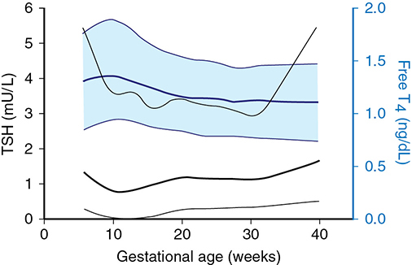
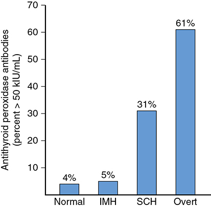
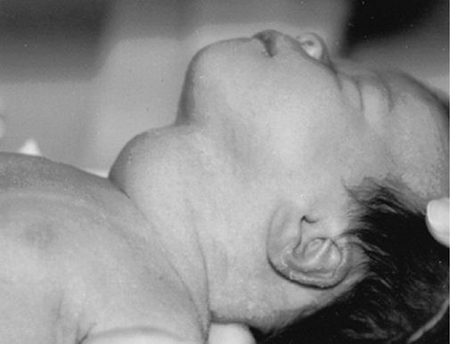
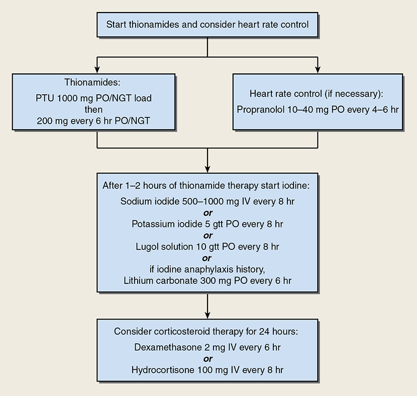
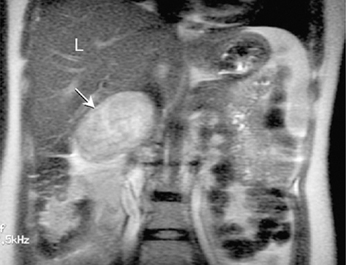
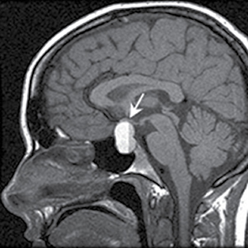

# Chapter 61: Endocrine Disorders — Revision Notes

> Williams Obstetrics 26e, pp. 2834–2887 of the PDF. High-yield numbers are in **bold**.
> The six tables are transcribed from the PDF images (they are missing from the extracted chapter text). All 6 figures are included from the PDF.

**Big picture:** Many endocrinopathies are **autoimmune** and may ease in pregnancy only to flare postpartum. Pregnancy changes normal values (TBG, total T4, cortisol, aldosterone, prolactin all ↑; TSH ↓ in the 1st trimester), so **use pregnancy-specific ranges**. Key exam areas: **Graves disease treatment (PTU vs methimazole), thyroid storm, overt vs subclinical hypothyroidism (treat overt only), postpartum thyroiditis, pheochromocytoma vs preeclampsia, prolactinoma surveillance, and Sheehan syndrome**. (Diabetes, the most common endocrinopathy, is covered in its own chapter.)

---

## 1. Thyroid Physiology and Pregnancy

- **TBG ↑** → total (bound) T4 and T3 ↑.
- **hCG weakly stimulates the TSH receptor** → during the first **12 wk** (peak hCG) free T4 rises and **TSH falls**; maternal TRH becomes undetectable.
- **TSH does not cross the placenta.** Fetal TRH becomes detectable from midpregnancy (static levels).
- **Maternal T4 crosses to the fetus throughout pregnancy** and is vital for fetal brain development, especially before the fetal thyroid works.
  - Fetal thyroid concentrates iodine and makes hormone **after 12 wk**.
  - **Maternal T4 = 30% of fetal serum T4 at term.**
  - Both high and low maternal thyroid function in the 1st trimester are linked to smaller childhood cortical gray matter.

*Figure 61-1. Gestational-age-specific TSH (black) and free T4 (blue) in 17,298 women: TSH dips to its nadir near 10–12 wk as hCG peaks; free T4 peaks at the same time then drifts down (median and 2.5th–97.5th percentiles).*

### Autoimmunity
- Autoantibodies against ~200 thyrocyte components may **stimulate, block or inflame** the gland.
- **Thyroid-stimulating immunoglobulins (TSIs)** activate the TSH receptor → Graves hyperthyroidism and goiter; blocking antibodies may blunt this.
- **Anti-TPO antibodies in 5–15% of gravidas.** Linked in some studies to early pregnancy loss and preterm birth; in >1000 women, **not** preterm birth but **↑ abruption**. High risk of **postpartum thyroid dysfunction** and lifelong permanent hypothyroidism.

*Figure 61-2. Anti-TPO antibody prevalence: normal 4%, isolated hypothyroxinemia 5%, subclinical hypothyroidism 31%, overt hypothyroidism 61%.*

### Fetal microchimerism
- Fetal cells enter the maternal circulation; fetal lymphocytes can survive **>20 years** and engraft in maternal tissues, including the thyroid.
- **Y-chromosome-positive cells in the thyroid: 60% with Hashimoto, 40% with Graves.** May explain female predominance of autoimmune thyroid disease (and may be protective in some).

---

## 2. Hyperthyroidism

### Diagnosis
- **Incidence 0.4–1.7%** with gestational-age-appropriate TSH thresholds.
- Clues: **tachycardia beyond normal pregnancy**, thyromegaly, **exophthalmos**, **failure to gain weight despite adequate intake**.
- **Labs: TSH markedly ↓, free T4 ↑.** Rarely T3-toxicosis.

### Table 61-1. Incidence of Overt Hyperthyroidism in Pregnancy

| Study | Country | Incidence |
|---|---|---|
| Wang (2011)ᵃ | China | 1% |
| Vaidya (2007)ᵃ | United Kingdom | 0.7% |
| Lazarus (2007)ᵇ | United Kingdom | 1.7% |
| Casey (2006)ᶜ | United States | 0.4% |
| Andersen (2016)ᶜ,ᵈ | Denmark | 0.4–0.7% |
| Dong (2019)ᵉ | International | 0.64–0.91% |

*ᵃScreened in the first trimester. ᵇScreened at 9–15 weeks. ᶜScreened before 20 weeks. ᵈDiagnosed in early versus later pregnancy. ᵉSystematic review.*

### Graves disease in pregnancy
- **Overwhelmingly the most common cause** of thyrotoxicosis in pregnancy; **TSH-receptor antibodies (TRAb)** are specific.
- Course: may **worsen in the 1st trimester (hCG)**, then **improve in the 2nd half** as receptor-antibody titers fall.

### Thionamide treatment
| | Propylthiouracil (PTU) | Methimazole |
|---|---|---|
| Advantages | Partly blocks **T4 → T3**; crosses placenta **less** | Once-daily; less liver toxicity |
| Main fetal risk | Rare PTU embryopathy described | **Methimazole embryopathy: esophageal or choanal atresia, aplasia cutis** (2× major malformations vs PTU/KI in Japanese data) |
| Main maternal risk | **Hepatotoxicity (~0.1%)**; FDA warning 2009; ANCA in ~20% (vasculitis rare) | — |
| Usual pregnancy dosing | Parkland: **300 or 450 mg/d in 3 doses** (occasionally ≥600 mg); nonpregnant start 50–150 mg tid | Nonpregnant: **10–20 mg/d** start, then **5–10 mg** maintenance |

- **ATA: PTU through 16 wk**; no recommendation on switching (both have risks, and the switch may worsen control). **Parkland switches to methimazole after the 1st trimester.** **Conversion ratio PTU:methimazole = 20:1.**
- **Goal:** lowest dose keeping free T4 **slightly above or at the high-normal range** with TSH still suppressed. **Check free T4 every 4–6 wk.**
- **Side effects of thionamides:**
  - **Transient leukopenia up to 10%** — no need to stop.
  - **Agranulocytosis ~0.3%** — sudden, not dose related → serial WBCs useless; **stop the drug and get a CBC if fever or sore throat**.
  - Hepatotoxicity ~0.1% (serial LFTs don't prevent it); rash **3–5%**.
  - Thionamides may **treat a thyrotoxic fetus** (TRAb crosses the placenta).
- **Subtotal thyroidectomy:** after medical control; for nonadherence or drug toxicity; **best in the 2nd trimester**. Risks: parathyroid removal, recurrent laryngeal nerve injury.
- **Radioactive iodine is contraindicated** (destroys the fetal thyroid). Inadvertent periconceptional exposure has been reported without obvious harm.
  - **Avoid pregnancy for 6 months** after ablation.
  - Lactating breast concentrates iodine → delay ¹³¹I until **3 months after breastfeeding stops**.

### Table 61-2. Pregnancy Outcomes in Women with Overt Thyrotoxicosis

| Outcome | Treated and Euthyroidᵃ (n = 380) | Uncontrolled Thyrotoxicosisᵃ (n = 90) |
|---|---|---|
| ***Maternal*** | | |
| Preeclampsia | 40 (10%) | 15 (**17%**) |
| Heart failure | 1 | 7 (**8%**) |
| Death | 0 | 1 |
| ***Perinatal*** | | |
| Preterm delivery | 51 (16%) | 29 (**32%**) |
| Growth restriction | 37 (11%) | 15 (17%) |
| Stillbirth | 0/59 | 6/33 (**18%**) |
| Thyrotoxicosis | 1 | 2 |
| Hypothyroidism | 4 | 0 |
| Goiter | 2 | 0 |

*ᵃData presented as n (%). From Davis, 1989; Kriplani, 1994; Luewan, 2011; Medici, 2014; Millar, 1994.*

- Outcome depends on **metabolic control**; excess T4 → miscarriage, preterm birth. Maternal hyperthyroidism also linked to child epilepsy and autism.

### Fetal and neonatal effects
- Most perinates are euthyroid. **Neonatal hyperthyroidism in up to 1%** of infants of women with Graves.
- **Four fetal presentations:**
  1. **Goitrous thyrotoxicosis** — **TSIs cross the placenta**; can cause **nonimmune hydrops and fetal death**. Best predictor = maternal **TRAb, especially >3× upper normal**.
  2. **Goitrous hypothyroidism** — from **maternal thionamides** (only 4 of 239 newborns hypothyroid; no long-term IQ effects). Remote if maternal free T4 kept upper-therapeutic/mildly thyrotoxic.
  3. **Nongoitrous hypothyroidism** — transplacental **TSH-receptor blocking antibodies**.
  4. **Fetal thyrotoxicosis after maternal ablation** (surgery or ¹³¹I) — TSIs persist and cross.
- Low-risk mothers (no 3rd-trimester antithyroid drugs or no antibodies): no goiters (31 women). Higher-risk (41): **27% fetal goiter at 32 wk** (7 of 11 hypothyroid).
- **ATA: check TRAb in early pregnancy** in women on antithyroid drugs; **repeat at 18–22 wk** if elevated or still on therapy. **ACOG does not recommend this.**
- **Thyrotoxic fetus → increase maternal thionamide** even if mother is at target. **Hypothyroid fetus → reduce dose ± intraamnionic thyroxine.**
- **Fetal diagnosis:** thyroid volume nomograms exist but routine scans are not recommended. Signs: hydrops, FGR, goiter, tachycardia. **Cord blood sampling only if fetal goiter and fetal thyroid status unclear** (ATA).

*Figure 61-3. Term hypothyroid neonate with a large goiter after maternal methimazole 30 mg/d (mother euthyroid at delivery): thionamide-induced goitrous hypothyroidism.*

### Thyroid storm and thyrotoxic heart failure
- **Thyroid storm** (hypermetabolic state) is **rare**; **thyrotoxic cardiomyopathy with pulmonary hypertension and heart failure is common** in pregnancy — **8%** of uncontrolled thyrotoxicosis.
- Minimal cardiac reserve; decompensation precipitated by **preeclampsia, anemia, sepsis**. Cardiomyopathy is **often reversible**.
- **Management (ICU or L&D special care):**
  1. **Thionamide first** (PTU load)
  2. **Iodide 1–2 h later** (blocks release of T3/T4): IV sodium iodide, SSKI or Lugol; **lithium 300 mg q6h if iodine anaphylaxis**
  3. **Dexamethasone 2 mg IV q6h × 4 doses** (blocks peripheral T4 → T3)
  4. **β-blocker** for tachycardia (propranolol, labetalol, esmolol) — caution in heart failure
  5. Treat **preeclampsia, infection, anemia aggressively before considering delivery**

*Figure 61-4. Parkland protocol: PTU 1000 mg load then 200 mg q6h ± propranolol 10–40 mg q4–6h → after 1–2 h iodine (NaI 500–1000 mg IV q8h, SSKI 5 gtt q8h or Lugol 10 gtt q8h; lithium if iodine allergy) → dexamethasone 2 mg IV q6h or hydrocortisone 100 mg IV q8h for 24 h.*

### Gestational transient thyrotoxicosis and hyperemesis
- Biochemical hyperthyroidism in **2–15%** in early pregnancy; common with **hyperemesis** (high T4, low TSH from hCG).
- **Antithyroid drugs are NOT warranted.** Values normalize by **midpregnancy**; hCG levels don't correlate with T4/TSH.

### Gestational trophoblastic disease
- **↑ T4 in 25–65%** of molar pregnancies (very high hCG). Early diagnosis → overt hyperthyroidism is less common. **Free T4 normalizes rapidly after evacuation**, parallel with hCG.

### Subclinical hyperthyroidism
- **Low TSH + normal T4**; prevalence **1.77%** in pregnancy.
- Long term: osteoporosis, cardiovascular morbidity, progression.
- **Not associated with adverse pregnancy outcomes** (no link with preeclampsia or GDM).
- **Do not treat in pregnancy** (fetal drug effects); surveillance — **~half normalize**.

---

## 3. Hypothyroidism

### Overt hypothyroidism
- **0.2–1.2%** of pregnancies. Fatigue, constipation, cold intolerance, cramps, weight gain, edema, dry skin, hair loss, **prolonged relaxation phase of reflexes**.
- **Overt = ↑ TSH + ↓ T4. Subclinical = ↑ TSH + normal T4.**
- **Most common cause: Hashimoto thyroiditis** (anti-TPO); also post-ablative Graves.
- **Test** symptomatic women, those with personal/family thyroid history, or **type 1 diabetes**.
- Severe hypothyroidism is uncommon in pregnancy (linked to infertility and miscarriage).

**Treatment (ACOG)**
- **Levothyroxine 1–2 µg/kg/d (~100 µg/d)**; more if athyreotic (thyroidectomy, radioiodine).
- **TSH every 4 wk in the first half and at least once in the 3rd trimester**; adjust by **25–50 µg** to a **TSH ~2.5 mU/L**.
- **Dose requirement ↑ in ~⅓** (estrogen), starting as early as **5 wk** — especially with no thyroid reserve or ART.
- An anticipatory **25% dose increase** at confirmation of pregnancy is equivalent to TSH-guided adjustment in an RCT (but more TSH suppression). Parkland: TSH at first visit and **each trimester**.

### Table 61-3. Pregnancy Complications in 440 Women with Hypothyroidism

| Complications (%) | Overt (n = 112) | Subclinical (n = 328) |
|---|---|---|
| Preeclampsia | **32** | 8 |
| Placental abruption | 8 | 1 |
| Cardiac dysfunction | 3 | 2 |
| Birthweight <2000 gᵃ,ᵇ | 33 | 32 |
| Stillbirthsᶜ | 9 | 3ᶜ |

*ᵃPreterm or term deliveries were the only outcomes reported by Abalovich, 2002. ᵇLow birthweight and stillbirth were outcomes reported by Su, 2011. ᶜOne infant died from syphilis. Data from Abalovich, 2002; Davis, 1988; Leung, 1993; Männistö, 2009; Su, 2011.*

- Untreated overt disease → ↑ adverse outcomes and preterm birth; **adequate replacement minimizes risk**.

### Fetal and neonatal effects
- Iodine deficiency causes both maternal and fetal hypothyroidism.
- TSH-receptor **blocking** antibodies cross the placenta. Neonates of mothers with autoimmune thyroiditis: 28% had ↑ TSH on day 3–4, but antibodies were gone by 6 months; **maternal TPO antibodies have no clinically relevant effect** on offspring thyroid function.
- **Fetal hypothyroidism with maternal Hashimoto ≈ 1 in 180,000.**

---

## 4. Subclinical Hypothyroidism and Related States

### Subclinical hypothyroidism
- **2.3%** of >25,000 women screened in the first half of pregnancy (3.3% in the MFMU screen of >97,000).
- Progression depends on TSH, age, diabetes, antibodies. Nonpregnant: ⅓ normalize; **TSH 10–15 → 19/100 patient-years overt**; **TSH <10 → 2/100 patient-years**. Nearly all who become overt within 5 yr started with **TSH >10**.
- **Progression during pregnancy is remote**; 17% developed thyroid disease over 20 years (mostly antibody-positive).
- **Associations (observational):** ↑ preterm birth, abruption, NICU admission (Casey), **~2× severe preeclampsia**, GDM (↑ with rising TSH), diabetes and stillbirth — not seen in all studies.
- **Treatment trials — no benefit:**
  - **CATS:** treating subclinical hypothyroidism/hypothyroxinemia did not improve child IQ at 3 or 9 years.
  - **MFMU RCT (677 women):** levothyroxine vs placebo — **no difference in pregnancy outcomes or IQ at 5 years** (Table 61-4); no improvement in maternal depression.
- ⚠️ **Screen only high-risk women** (ACOG, Endocrine Society, ATA, AACE). **No universal screening.**

### Table 61-4. Maternal-Fetal Medicine Units Network: Pregnancy Outcomes According to Diagnosis and Treatment of Thyroid Disordersᵃ

| Outcome | Subclinical Hypothyroidism — Thyroxine | Subclinical Hypothyroidism — Placebo | Isolated Hypothyroxinemia — Thyroxine | Isolated Hypothyroxinemia — Placebo |
|---|---|---|---|---|
| ***Maternal*** | | | | |
| EGA at delivery (weeks) | 39.1 ± 2.5 | 38.9 ± 3.1 | 39.0 ± 2.4 | 38.8 ± 3.1 |
| Preterm birth <34 weeks | 9.1% | 10.9% | 3.8% | 2.7% |
| Placental abruption | 0.3% | 1.5% | 1.1% | 0.8% |
| Preeclampsia | 6.5% | 5.9% | 3.4% | 4.2% |
| Diabetes | 7.4% | 6.5% | 8.0% | 9.2% |
| ***Perinatal and Childhood*** | | | | |
| Stillbirth | 12/1000 | 21/1000 | 8/1000 | 19/1000 |
| Neonatal death | 0 | 3/1000 | 4/1000 | 4/1000 |
| NICU admission | 8.6% | 6.2% | 11.8% | 11.9% |
| Birthweight <10th centile | 9.8% | 8.1% | 8.8% | 7.8% |
| IQ median (25th, 75th percentile) | 97 (85, 105) | 94 (85, 107) | 94 (83, 101) | 91 (82, 101) |

*ᵃ**For all comparisons, p >0.05.** EGA = estimated gestational age; IQ = intelligence quotient; NICU = neonatal intensive care unit. The printed title reads "Maternal-Fetal Medicine Unites Network" (typo for Units).*

### Isolated maternal hypothyroxinemia
- **Low free T4 with normal TSH**; **1.3–2.1%**. **Low antibody prevalence (5%)** unlike subclinical hypothyroidism.
- Early reports of neurodevelopmental problems; Casey: no ↑ adverse outcomes; one large IPD analysis: ↑ preterm birth.
- **CATS and MFMU: treatment gives no benefit** → **ATA recommends against routine treatment.**

### Euthyroid autoimmune thyroid disease
- TPO/thyroglobulin antibodies in **2–17%** of pregnant women; most are euthyroid.
- **2–5× early pregnancy loss.** Preterm birth: early RCT showed levothyroxine ↓ **22% → 7%**, but not confirmed when TSH <2.5; >1000 untreated women: no ↑ preterm birth but **3× abruption**; meta-analysis **1.3×** preterm.
- ↑ Later thyroid disease and **postpartum thyroiditis**.
- **No organization recommends universal antibody screening.**

---

## 5. Iodine Deficiency
- US population remains iodine sufficient overall, but urinary iodine in pregnant women is declining — monitor vulnerable groups.
- Needs ↑ in pregnancy: more hormone production, **↑ renal losses**, fetal needs. Iodine is needed for fetal neurodevelopment from soon after conception; **~19 million babies/year** at risk globally.
- **Mild deficiency:** intellectual impairment doubtful, but **supplementation prevents fetal goiter**; RCT (>800 women): no effect on child development at 5–6 yr.
- Moderate deficiency: mixed data; early supplementation (200–300 µg) improved scores in some studies; >150 µg/d linked to lower psychomotor scores in another.
- **Severe deficiency → endemic cretinism**; salt iodization/supplementation clearly beneficial.
- **Recommended intake:**
  - **IOM: 220 µg/d pregnancy, 290 µg/d lactation**
  - **ATA: 250 µg/d; add 150 µg iodine to prenatal vitamins** (only half of US prenatal vitamins contain iodine)
  - **Do not exceed 500 µg/d** (excess → subclinical thyroid dysfunction, autoimmunity)

---

## 6. Congenital Hypothyroidism
- **Universal newborn screening** (since 1974, required in all states). **~1 in 2000 newborns** (rising — preterm survival, screening changes).
- **Agenesis/hypoplasia 80–90%**; the rest are hereditary hormone-synthesis defects; **up to 15% transient**.
- **Early, aggressive thyroxine** → IQ at 18 yr equal to siblings if initial dose adequate.

---

## 7. Postpartum Thyroiditis
- Transient **autoimmune** thyroiditis in **5–10%** within the first **12 months** postpartum.
- Risk rises with antibody titers: **up to 50% of women with 1st-trimester thyroid antibodies** develop it. Antibody screening still not recommended.
- Often missed (months after delivery, vague symptoms).

| Phase | Timing | Features | Treatment |
|---|---|---|---|
| **Thyrotoxic** (destructive) | Early; abrupt; lasts a few months | Small **painless goiter**; only **fatigue and palpitations** more common than controls | **Thionamides ineffective**; **β-blocker** if severe |
| **Hypothyroid** | Usually **4–8 months** postpartum | Thyromegaly and symptoms more prominent | **Levothyroxine 25–75 µg/d for 6–12 months** |

- Italian cohort (4562): **3.9%** developed it — **⅔ hypothyroid only, ⅓ hyperthyroid only; only 14% classic biphasic**.
- **Permanent hypothyroidism 20–30%** eventually (**3.6%/yr**); higher with high antibody titers and TSH. **Half of TPO-positive women become permanently hypothyroid by 6–7 yr.**
- Link with postpartum depression unresolved; levothyroxine didn't reduce depression in TPO-positive women.

> **Memory hook:** "Hyper first, hypo later, most never both" — biphasic pattern only 14%; thyrotoxic phase = β-blocker, never thionamides.

---

## 8. Nodular Thyroid Disease
- Palpable nodules in up to **5%** of reproductive-age women; sonographic nodules >2 mm in 15% of Chinese gravidas (often multiple, enlarge slightly, none malignant).
- **90–95% of solitary nodules are benign.**
- Evaluate as in nonpregnant women, but **no radioiodine scanning**.
- Sonography detects nodules **>5 mm**; malignant features: **hypoechoic, irregular margins, microcalcifications**.
- **Ultrasound-guided FNA** — cytology unaffected by pregnancy. **Follicular lesion → defer surgery until postpartum.**
- **Thyroid cancer:** usually well differentiated and indolent (may persist/recur more in pregnancy). Diagnosed in 1st–2nd trimester → **thyroidectomy before the 3rd trimester**; non-aggressive or 3rd-trimester diagnosis → **defer to early puerperium**.

---

## 9. Parathyroid Disease

### Calcium physiology
- **PTH** (84 amino acids) ↑ serum calcium via bone, kidney, and (indirectly) gut; regulated by ionized Ca²⁺. **Calcitonin antagonizes PTH.**
- Fetal needs: **300 mg/d late pregnancy, 30 g total**; plus ↑ renal loss from ↑ GFR.
- **Total Ca ↓ with albumin; ionized Ca unchanged.** **1,25-dihydroxyvitamin D doubles** (probably placental/decidual); maternal PTH low-normal or ↓.
- Calcium is **actively transported** across the placenta; fetal homeostasis via PTH-rP, PTH and receptors.

*The extracted text calls calcitonin "a potent parathyroid hormone"; calcitonin is a thyroid (C-cell) hormone that antagonizes PTH.*

### Hyperparathyroidism
- **Hyperparathyroidism or cancer cause 90% of hypercalcemia.** Prevalence **2–3/1000 women** (up to 14/1000 including asymptomatic).
- **Solitary adenoma ~80%**; four-gland hyperplasia 15%; malignancy the rest (tumor PTH may not register on assays).
- Calcium usually only **1–1.5 mg/dL above normal** → only **20% symptomatic** (¼ become symptomatic as Ca rises).
- **Hypercalcemic crisis:** stupor, nausea, vomiting, weakness, fatigue, dehydration.
- **Parathyroidectomy indications (nonpregnant):** symptomatic; Ca **≥1.0 mg/dL above upper normal**; CrCl **<60 mL/min**; ↓ bone density; age **>50**. Otherwise annual Ca/creatinine and bone density every 1–2 yr.

**Hyperparathyroidism in pregnancy**
- <200 reported cases; **adenoma most common**; rare ectopic PTH or carcinoma.
- Symptoms: **hyperemesis**, weakness, **renal calculi**, psychiatric disorders; sometimes **pancreatitis** presents it.
- **Pregnancy "protects"** (calcium shunted to fetus, ↑ renal excretion) → ⚠️ **postpartum hypercalcemic crisis** (Ca **>14 mg/dL**: nausea, vomiting, tremor, dehydration, altered mental status).
- Fetal: miscarriage, FGR, LBW; historically stillbirth/preterm; **preeclampsia 30%** in one series.
- **Management:**
  - **Surgery preferred for symptomatic adenoma** — prevents fetal/neonatal morbidity and postpartum crisis. Medical care → **preterm 66%** vs **all term** after surgery (Australian series). Neck exploration tolerated **even in the 3rd trimester**.
  - Asymptomatic mild hypercalcemia → medical management; watch for postpartum crisis. Options: **calcitonin**, **oral phosphate 1–1.5 g/d**.
  - **Hypercalcemic crisis:** **IV normal saline (urine >150 mL/h) + furosemide**; prevent hypokalemia and hypomagnesemia; adjunct mithramycin.
- **Neonatal effects:** fetal hypercalcemia suppresses fetal parathyroids → **15–25% of newborns get severe hypocalcemia ± tetany** (transient; treat with calcium + calcitriol — ineffective in preterm infants). **Neonatal tetany/seizures → evaluate the mother for hyperparathyroidism.**

### Hypoparathyroidism
- **Most common cause of hypocalcemia**; **~80% follow anterior neck surgery**.
- Facial spasm, cramps, perioral/digital paresthesias → tetany, seizures. Fetal skeletal demineralization → neonatal fractures.
- **Treatment:** **calcitriol**, dihydrotachysterol, or vitamin D **50,000–150,000 U/d**; **calcium gluconate or lactate 3–5 g/d**; **low-phosphate diet**.
- **Goal: corrected calcium in the low-normal range** (requirements may rise or fall).

### Pregnancy- and lactation-associated osteoporosis
- Average **BMD ↓ 3–4%** in pregnancy; more with breastfeeding, twins, low BMI. Parity/breastfeeding **not** linked to postmenopausal hip fracture.
- Rare disorder: **back pain late in pregnancy or postpartum**, hip pain, difficulty weight bearing.
- No cause in **>½**; known causes: **unfractionated heparin**, bed rest, corticosteroids; occasionally hyperparathyroidism or thyrotoxicosis.
- **Treatment:** calcium, vitamin D, analgesia; some advise stopping breastfeeding. Chronic osteopenia may persist.

---

## 10. Adrenal Gland Disorders

### Pheochromocytoma
- Catecholamine-secreting chromaffin tumors, usually adrenal medulla. **"10% tumor": 10% bilateral, 10% extraadrenal, 10% malignant.**
- Associations: **MEN syndromes** (medullary thyroid carcinoma, hyperparathyroidism), **neurofibromatosis, von Hippel-Lindau**.
- **~1 in 50,000 pregnancies**; **0.2–0.6%** of hypertensive patients.
- **Symptoms (paroxysmal):** hypertensive crisis, seizures, anxiety attacks, **headache, sweating, palpitations**, chest pain, nausea, vomiting, pallor or flushing. **Sustained hypertension in 60%** (half of these also have paroxysms).
- **Diagnosis:**
  - Screening: **24-h urine metanephrines and catecholamine metabolites**; diagnosis needs ≥2 of 3 (free catecholamines, metanephrines, VMA).
  - **Plasma catecholamine metabolites = most sensitive; normal levels exclude it.**
  - **MR imaging is preferred for localization in pregnancy.**
  - ⚠️ **Must differentiate from preeclampsia.**
- **Outcome:** old series **43 of 89 mothers died**; mortality **58% if undiagnosed antepartum vs 18%** if diagnosed. **Antepartum diagnosis is the key determinant of maternal survival.**

### Table 61-5. Outcomes of Pregnancies Complicated by Pheochromocytoma and Reported in Four Contiguous Epochs

| Factor (incidence %) | 1980–87 Harper (1989), n = 48 | 1988–97 Ahlawat (1999), n = 42 | 1998–2008 Sarathi (2010), n = 60 | 2000–2011 Biggar (2013), n = 78 |
|---|---|---|---|---|
| ***Diagnosis*** | | | | |
| Antepartum | 51 | 83 | 70 | 73 |
| Postpartum | 36 | 14 | 23 | 28 |
| Autopsy | 12 | 2 | 7 | — |
| **Maternal death** | **16** | **4** | **12** | **8** |
| Fetal wastage | 26 | 11 | 17 | 17 |

*The Biggar epoch is printed as "2000–2001"; 2000–2011 appears intended given the "contiguous epochs" design.*

- **Treatment:**
  1. **α-blockade first: phenoxybenzamine 10–30 mg, 2–4 times daily**
  2. **Then β-blocker** (propranolol) for tachycardia — never before α-blockade
  3. **Surgery during pregnancy, preferably 2nd trimester**; **laparoscopic adrenalectomy** is the norm. Bilateral tumors: remove the largest during pregnancy, the other after delivery (avoids adrenal insufficiency).
  4. Diagnosed late → **planned cesarean with tumor excision** or postpartum resection.
- Recurrent tumors can cause dangerous peripartum hypertension even when controlled.

*Figure 61-5. Coronal MR at 32 wk: right adrenal pheochromocytoma (arrow) beneath the liver (L) — MR is the preferred localization method in pregnancy.*

> **Pearl:** giving a β-blocker before α-blockade in pheochromocytoma leaves α-mediated vasoconstriction unopposed and can precipitate a hypertensive crisis.

### Cushing syndrome
- Rare; **F:M = 3:1**. **Most cases iatrogenic** (long-term steroids).
- **Cushing disease** = ACTH-producing **pituitary adenoma** (mostly microadenomas <1 cm; half <5 mm) → bilateral adrenal hyperplasia. Ectopic CRF/ACTH from nonendocrine tumors.
- Features: moon facies, buffalo hump, truncal obesity; **fatigue/weakness, hypertension, hirsutism, amenorrhea in 75–85%**; bruising, striae; **impaired glucose tolerance up to 60%**.
- **Diagnosis:** nonsuppressible cortisol on dexamethasone, or ↑ **24-h urinary free cortisol (3 collections)**; ACTH + CT/MR to localize. **In pregnancy, use 24-h urinary free cortisol** (allowing for the normal pregnancy rise).
- Pregnancy is rare (androgen excess → anovulation). **In pregnancy, >½ are ACTH-independent adrenal adenomas**; ~30% pituitary; 10% adrenal carcinoma.

### Table 61-6. Complications in Pregnancies of Women with Active and Cured Cushing Syndrome

| Complication (incidence %) | Active Disease (n = 214) | Cured (n = 49) |
|---|---|---|
| ***Maternal*** | | |
| Diabetes | **37** | 2 |
| Gestational hypertension | **40** | 2 |
| Preeclampsia | **26** | 2 |
| Cesarean delivery | **52** | 22 |
| Mortality | 1 | 0 |
| ***Perinatal*** | | |
| Preterm birth | **66** | 3 |
| Fetal-growth restriction | 15 | 5 |
| Spontaneous abortion | 11 | 6 |
| Stillbirth | 6 | 2 |
| Neonatal death | 5 | 0 |

*From Caimari, 2017 (systematic review of 263 pregnancies in 220 women).*

- **Treatment:** definitive = resection of pituitary/adrenal adenoma or bilateral adrenalectomy. In pregnancy:
  - Mild cases: control hypertension until delivery.
  - **Metyrapone** = interim medical therapy until postpartum surgery. **Ketoconazole** worrisome with a male fetus (blocks testicular steroidogenesis). **Mifepristone is contraindicated.**
  - **Transsphenoidal resection or laparoscopic adrenalectomy in the 2nd trimester = first line**; unilateral adrenalectomy done safely in early 3rd trimester.

### Adrenal insufficiency (Addison disease)
- Needs **>90% gland destruction**. **Autoimmune adrenalitis** most common in developed countries; **TB** in resource-poor settings. **1 in 10,000–20,000 births.**
- Polyglandular autoimmune associations: Hashimoto, primary ovarian insufficiency, type 1 DM, Graves, pernicious anemia, vitiligo, alopecia, celiac sprue, myasthenia gravis.
- Untreated → infertility; weakness, nausea, vomiting, weight loss.
- **Diagnosis:** low cortisol + high ACTH. In pregnancy, **short ACTH stimulation test with <2-fold cortisol rise confirms** it.
- Diagnosis within 3 yr of delivery → ↑ preterm birth, LBW, cesarean.
- **Management:**
  - Continue glucocorticoid + mineralocorticoid replacement; **↑ dose 20–40% after midpregnancy**.
  - **Stress dose for labor, delivery, postpartum or surgery: hydrocortisone 100 mg IV q8h × 48 h.**
  - Recognize shock from other causes (hemorrhage, sepsis) promptly.

### Primary aldosteronism
- **Adrenal adenoma (Conn syndrome) ~75%**; rest bilateral hyperplasia; rarely carcinoma.
- **Hypertension, hypokalemia, muscle weakness**; high aldosterone confirms.
- Pregnancy: progesterone blocks aldosterone → very high normal levels → diagnosis hard. **Renin is suppressed** with hyperaldosteronism → **aldosterone:renin ratio** helps.
- Hypertension worsens with gestation → **K⁺ supplements + antihypertensives**. Spironolactone works but has **fetal antiandrogenic** potential → **β-blockers or calcium-channel blockers preferred**; amiloride and eplerenone reported.
- **Laparoscopic resection curative**; optimal timing in pregnancy unclear.

---

## 11. Pituitary Disorders

### Prolactinomas
- Pituitary enlarges in pregnancy (**estrogen-driven lactotroph hyperplasia**). **Prolactinomas = 75% of pituitary adenomas in women.**
- Normal nonpregnant prolactin **<25 ng/mL**. Features: **amenorrhea, galactorrhea, hyperprolactinemia**.
- **Microadenoma ≤10 mm; macroadenoma >10 mm.**
- Treatment: **bromocriptine** (dopamine agonist) restores ovulation; **suprasellar macroadenoma → surgery before pregnancy**.
- **Symptomatic enlargement in pregnancy: microadenoma 2.4% vs macroadenoma ~21%** (~20% in another series).
- **Surveillance:**
  - Micro: ask about **headache and visual symptoms** regularly.
  - Macro: **visual field testing each trimester**.
  - **CT/MR only if symptoms.** **Serial prolactin levels are useless** (normal rise).
- **Symptomatic enlargement → dopamine agonist immediately** (bromocriptine safety well established; cabergoline generally considered safe). **Surgery if no response or pituitary apoplexy.**
- Nonfunctioning adenomas can also enlarge.

*The extracted text gives prolactin units as pg/mL (should be ng/mL) and says enlargement is treated with a "dopamine antagonist"; bromocriptine and cabergoline are dopamine agonists.*

*Figure 61-6. Sagittal T1 MR of a pituitary adenoma with a fluid–fluid level (arrow) = intratumoral hemorrhage (apoplexy).*

### Acromegaly
- Excess GH from an acidophilic or chromophobic adenoma. Suggested by **↑ IGF-1** — reliable mainly in the **first half** (IGF-1 rises after midpregnancy); definitive diagnosis may wait until after delivery.
- Pregnancy rare (**half are hyperprolactinemic and anovulatory**); <100 cases.
- Marginally ↑ **GDM and hypertension**. Monitor for tumor enlargement; dopamine agonists less effective; **transsphenoidal resection** for symptomatic enlargement; octreotide and pegvisomant have been used.

### Diabetes insipidus
- True central DI (neurohypophysis destruction/agenesis) is rare in pregnancy.

| Type | Mechanism |
|---|---|
| Primary polydipsia | **Suppressed** vasopressin secretion |
| Gestational DI | **↑ Degradation** (placental vasopressinase) — **2–4 per 100,000 pregnancies** |
| Nephrogenic DI | **Renal insensitivity** to vasopressin |

- **Transient DI with AFLP** (hepatic dysfunction ↓ vasopressinase clearance).
- **Treatment: intranasal desmopressin (DDAVP)** — safe; **higher doses needed** in pregnancy (placental vasopressinase ↑ clearance).

### Sheehan syndrome
- **Pituitary ischemia/necrosis after obstetric hemorrhage** → hypopituitarism; declining with modern shock care.
- **Persistent hypotension, tachycardia, hypoglycemia, lactation failure**; deficiencies may evolve — **mean time to diagnosis 13 years**.
- ⚠️ **Adrenal insufficiency is the most life-threatening** → assess adrenal function **immediately**; replace glucocorticoids first, then thyroid, gonadal and GH.
- Later pregnancies usually result in a live birth.

### Lymphocytic hypophysitis
- Rare autoimmune lymphocyte/plasma-cell infiltration and destruction of the pituitary; **>½ of cases in women arise in pregnancy or the puerperium**.
- Hypopituitarism and/or mass effect (headache, visual field defects); sellar mass on imaging.
- **Prolactin modestly ↑, usually <100** (vs **>200 with prolactinoma**).
- **~30% have other autoimmune disease** (Hashimoto, Addison, type 1 DM, pernicious anemia).
- **Treatment: glucocorticoids + hormone replacement**; may be self-limited, but **>⅔ need long-term replacement**.

---

## Quick-Recall: Thyroid Test Patterns in Pregnancy

| Condition | TSH | Free T4 | Treat in pregnancy? |
|---|---|---|---|
| Normal 1st trimester | ↓ (hCG) | High-normal | — |
| Overt hyperthyroidism (Graves) | **↓↓** | **↑** | **Yes — PTU (to 16 wk) / methimazole** |
| Gestational transient thyrotoxicosis / hyperemesis | ↓ | ↑ | **No** — resolves by midpregnancy |
| Subclinical hyperthyroidism | ↓ | Normal | **No** |
| Overt hypothyroidism | **↑** | **↓** | **Yes — levothyroxine 1–2 µg/kg/d**, TSH ~2.5 |
| Subclinical hypothyroidism | ↑ | Normal | **No benefit shown** (MFMU, CATS) |
| Isolated hypothyroxinemia | Normal | ↓ | **No** (ATA) |
| Euthyroid TPO-antibody positive | Normal | Normal | No; watch for postpartum thyroiditis |
| Postpartum thyroiditis, thyrotoxic phase | ↓ | ↑ | β-blocker only |
| Postpartum thyroiditis, hypothyroid phase | ↑ | ↓/normal | Levothyroxine 25–75 µg × 6–12 mo |

## Key Numbers to Memorize
- Maternal T4 = **30%** of fetal T4 at term; fetal thyroid active **>12 wk**; anti-TPO **5–15%** of gravidas
- Hyperthyroidism **0.4–1.7%**; PTU to **16 wk**; PTU:methimazole **20:1**; free T4 every **4–6 wk**
- Leukopenia **10%** (continue), agranulocytosis **0.3%** (stop), PTU hepatotoxicity **0.1%**, rash **3–5%**
- Uncontrolled thyrotoxicosis: heart failure **8%**, preterm **32%**, stillbirth **18%**; neonatal hyperthyroidism **≤1%**; TRAb **>3×** normal predicts it; retest TRAb **18–22 wk**
- No pregnancy for **6 months** after ¹³¹I; ¹³¹I **3 months** after stopping breastfeeding
- Thyroid storm: PTU **1000 mg** load then **200 mg q6h**; iodide **1–2 h** later; dexamethasone **2 mg q6h × 4**; lithium **300 mg q6h**
- Transient thyrotoxicosis **2–15%**; molar ↑ T4 **25–65%**; subclinical hyperthyroidism **1.77%**
- Overt hypothyroidism **0.2–1.2%**; levothyroxine **1–2 µg/kg (~100 µg)**; adjust **25–50 µg**; target TSH **~2.5**; ⅓ need more from **5 wk**
- Subclinical hypothyroidism **2.3%**; isolated hypothyroxinemia **1.3–2.1%**
- Iodine: **220 µg** pregnancy, **290 µg** lactation (IOM); ATA **250 µg**, **150 µg** in vitamins, max **500 µg**
- Congenital hypothyroidism **1 in 2000**; agenesis/hypoplasia **80–90%**
- Postpartum thyroiditis **5–10%**; hypothyroid phase **4–8 months**; biphasic only **14%**; permanent hypothyroidism **20–30%**
- Solitary nodules benign **90–95%**
- Fetal calcium **30 g** (300 mg/d late); hyperparathyroid adenoma **80%**; crisis Ca **>14 mg/dL**; neonatal hypocalcemia **15–25%**; saline to urine **>150 mL/h**
- Pheochromocytoma **1 in 50,000**; "10%" tumor; mortality **58% vs 18%** (undiagnosed vs diagnosed); phenoxybenzamine **10–30 mg 2–4×/d**
- Cushing in pregnancy: adrenal adenoma **>50%**; active disease preterm **66%**
- Addison **1 in 10,000–20,000**; dose ↑ **20–40%**; stress hydrocortisone **100 mg IV q8h × 48 h**
- Conn adenoma **75%**
- Prolactinoma: micro **≤10 mm**; enlargement **2.4%** (micro) vs **~21%** (macro); hypophysitis prolactin **<100** vs prolactinoma **>200**
- Gestational DI **2–4 per 100,000**; Sheehan diagnosis delay **13 years**
