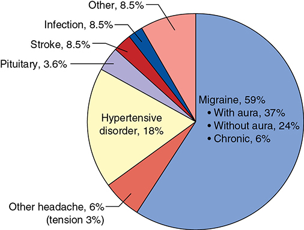
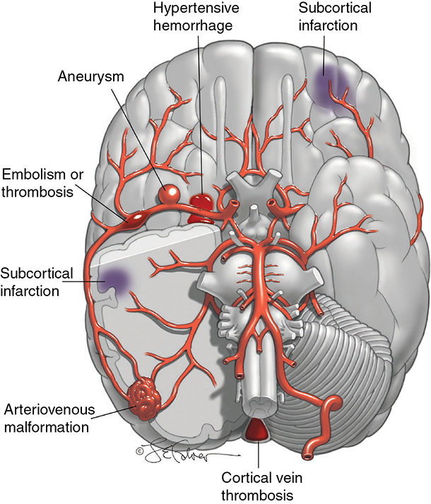
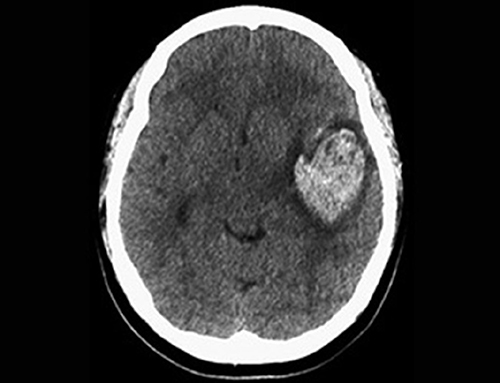
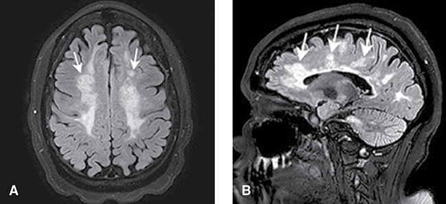
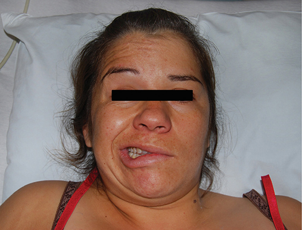

# Chapter 63: Neurological Disorders — Revision Notes

> Williams Obstetrics 26e, pp. 2933–2977 of the PDF. High-yield numbers are in **bold**.
> The four tables are transcribed from the PDF images (they are missing from the extracted chapter text). All 5 figures are included from the PDF.

**Big picture:** Most neurological disorders predate pregnancy and most women do well, but new neurological symptoms must be separated from pregnancy complications (especially **preeclampsia**). Neurovascular disorders caused **>7% of US maternal deaths** (2007–2016). Psychiatric disorders can present with cognitive and neuromuscular findings.

---

## 1. Central Nervous System Imaging
- **CT and MR imaging are safe in pregnancy** (Ch 49).
  - **CT:** rapid diagnosis; excellent for **recent hemorrhage**.
  - **MR imaging is often preferred:** demyelinating disease, **AVMs**, congenital/developmental anomalies, **posterior fossa** lesions, spinal cord disease.
- Advanced pregnancy: **lateral tilt with a wedge under one hip** (prevents hypotension; ↓ aortic pulsation artifact).
- **Cerebral angiography** (usually femoral) is a valuable adjunct for cerebrovascular disease. Fluoroscopy gives more radiation but can be shielded.
- PET and fMRI have not been evaluated in detail in gravidas.

---

## 2. Headache
- **17%** of US adults aged 18–44 reported a severe headache/migraine in the past 3 months (**24%** of nonpregnant women that age).
- In pregnant women given a neurology consult for headache:
  - **Two thirds primary** → **migraine in >90%** of these.
  - **One third secondary** → **more than half from hypertensive disorders**.
- **20% of postpartum ED visits** were for headache (Parkland/UTSW).
- Primary headaches are more common than secondary in pregnancy. **Migraine** is the type most affected by pregnancy hormones.

### Table 63-1. Headache Classification

| Primary | Secondary |
|---|---|
| Migraine | Trauma |
| Tension-type | Vascular disorders |
| Trigeminal cephalalgia | Substance abuse |
| Other | Infection |
| | Disorders of homeostasis |
| | Craniofacial disorders |
| | Psychiatric disorders |

*International Headache Society (2018).*

*Figure 63-1. Causes of headache in 140 pregnant women seen by neurology: migraine 59%, hypertensive disorder 18%, stroke/infection/other 8.5% each.*

### Tension headache
- **Most frequent cause of all headaches**; episodic or chronic.
- Muscle tightness, mild–moderate pain in the **back of the neck and head**, lasting hours.
- **No neurological disturbance or nausea** → distinguishes it from migraine.
- Treatment: rest, massage, heat/ice, NSAIDs, mild tranquilizers. **Admission seldom needed.** Chronic → **amitriptyline**.

### Migraine
- Periodic, sometimes incapacitating: severe headache + **autonomic dysfunction**.
- **IHS three types:**
  1. **Without aura** (formerly "common"): unilateral throbbing headache, nausea/vomiting or photophobia.
  2. **With aura** (formerly "classic"): same, preceded by visual scotoma or hallucinations. **One third** of patients. May be averted by taking medication at the first premonitory sign.
  3. **Chronic:** migraine on **≥15 days/month for >3 months**.
- Annual prevalence **15% women vs 6% men**; another 5% of women have "probable migraine" (all criteria but one).
- Begins in childhood, peaks in adolescence, wanes with age. Linked to hormone levels.
- Pathophysiology: neuronal dysfunction → ↓ cortical blood flow, activation of vascular/meningeal nociceptors and **trigeminal sensory neurons**. **Not primarily a vascular disorder.**
- **Migraine with aura in young women → ↑ ischemic stroke.** Also linked to asthma, anxiety/depression, other pain disorders.

**Migraine in pregnancy**
- **Most migraineurs improve** in pregnancy. New-onset migraine (usually **with aura**) can appear in pregnancy. New neurological symptoms → **full evaluation**.
- Incidence **185 per 100,000 deliveries**.
- Associated risks in gravid migraineurs:

| Outcome | Risk |
|---|---|
| **Stroke** | **16-fold** |
| Myocardial infarction | 5-fold |
| Heart disease, VTE, preeclampsia/gestational hypertension | 2-fold each |

- Also ↑ preeclampsia, gestational hypertension, preterm birth and **low birthweight**.

**Management**
- Mild headaches respond to oral therapy in **50–70%**.
- First line: **acetaminophen or an NSAID + antiemetic**.
- Severe → **parenteral therapy**: IV hydration, parenteral antiemetics, **triptans**. **Opioids only for the most recalcitrant.** Multitargeted therapy is usually needed.
- **Magnesium sulfate 2 g** has gained favor, but a metaanalysis showed **no benefit**.
- ⚠️ **Ergotamine derivatives are avoided** (potent vasoconstrictors, **uterotonic**).
- **Triptans** (5-HT1B/1D agonists): relieve headache, nausea and vomiting; oral, injection, rectal or nasal. Best **combined with NSAIDs**.
  - **Sumatriptan** has the most experience; **not a major teratogen**. One study found neurodevelopmental differences (emotionality, activity) at 36 months.
  - ⚠️ **Avoid chronic NSAIDs, especially late** → **ductus arteriosus constriction** and ↓ fetal urine output.
- Peripheral nerve blocks help some women.
- **Prophylaxis** (frequent migraines):

| Drug | Daily dose |
|---|---|
| **Amitriptyline** | **10–175 mg** |
| **Propranolol** | **40–120 mg** |
| **Metoprolol** | **25–100 mg** |

- **CGRP-receptor monoclonal antibodies** (approved since 2018): **not evaluated in pregnancy**. Botulinum toxin A ↓ chronic migraine by ~2 days/month.

### Table 63-2. Medications for Treatment of Acute Migraine in Pregnancy

| Class | Agents |
|---|---|
| Simple analgesics | Acetaminophen; NSAIDs: naproxen, ibuprofen |
| 5-HT receptor agonists | Triptans: oral, nasal, parenteral |
| Dopamine-receptor antagonists | Metoclopramide, prochlorperazine, chlorpromazine |
| Antiemetics | Ondansetron, metoclopramide |
| Other | Opioids; transcranial magnetic stimulation |

*5-HT = 5-hydroxytryptamine (serotonin); NSAIDs = nonsteroidal antiinflammatory drugs.*

*The text calls triptans "5-HT1B/2D" agonists; the correct receptor subtypes are 5-HT1B/1D.*

### Cluster headache
- Rare. Severe **unilateral lancinating pain to face and orbit**, lasting **15–180 min**, with autonomic symptoms and agitation.
- **Pregnancy does not change severity.** Avoid tobacco and alcohol.
- Acute: **100% oxygen** + **sumatriptan 6 mg SC**. Recurrent → **verapamil** prophylaxis.

> **Pearl:** A "new" or "worst" headache in pregnancy, or one with focal signs, is secondary until proven otherwise; check the blood pressure first.

---

## 3. Seizure Disorders
- **Second most common** neurological condition in pregnancy (after headache).
- 3 million US adults had active epilepsy (2015); fewer than half were seizure-free in the past year.
- **Epilepsy caused 5% of UK maternal deaths** (2011–2013).

### Pathophysiology
- Seizure = transient signs/symptoms from abnormal excessive or synchronous neuronal activity.
- Causes in young adults: head trauma, **alcohol/drug withdrawal**, infection, tumors, biochemical abnormalities, **AVMs**. Search for these with a new-onset seizure in pregnancy.
- **Idiopathic epilepsy is a diagnosis of exclusion.**

### Classification (ILAE 2017)
| Onset | Features |
|---|---|
| **Focal** | One localized area. Trauma, abscess, tumor, perinatal factors (lesion rarely shown). **Awareness intact or impaired.** |
| — without dyscognitive features | Start in one body region and spread ipsilaterally; tonic → clonic; sensory, autonomic or psychological change. **Cognition intact, rapid recovery.** |
| — with dyscognitive features | Often preceded by **aura**; then behavioral arrest or motionless stare; **automatisms** (picking, lip smacking). |
| **Generalized** | **Both hemispheres**; ± aura, then abrupt loss of consciousness; motor or nonmotor. **Strong hereditary component.** |
| — tonic-clonic | LOC → tonic rigidity → clonic jerking. **Gradual recovery; confusion for hours.** |
| — absence (petit mal) | Brief LOC **without muscle activity**; **immediate recovery**. |
| **Unknown** | Unwitnessed onset; subgrouped motor/nonmotor/unclassified. |

### Preconceptional counseling
- **Folic acid 0.4 mg/d**, starting **≥1 month before conception** → **increase to 4 mg/d** when a woman taking antiepileptic drugs becomes pregnant.
- Goal: **monotherapy with the least teratogenic drug** at the **lowest effective dose**.
- Consider **withdrawal if seizure-free ≥2 years**.

### Pregnancy complications
- Main risks: **fetal malformations and convulsions**.
- **Seizures ↑ in only 20–30%** of gravidas today. **Seizure-free ≥9 months before conception** → likely to stay seizure-free.
- Causes of subtherapeutic levels:
  - Nausea/vomiting, slower GI motility, **antacids** ↓ absorption
  - Hypervolemia (offset by ↓ protein binding)
  - **Hepatic enzyme induction**, placental drug metabolism
  - **↑ GFR** → faster clearance
  - **Stopping medication** out of teratogenicity fear
- ↓ Seizure threshold: sleep deprivation, **hyperventilation and pain in labor**.
- **Status epilepticus = medical emergency** (more likely with refractory epilepsy). In benzodiazepine-refractory status, IV **levetiracetam, fosphenytoin or valproate** worked equally; only **half** stopped seizing by 60 min.
- Small ↑ in: miscarriage, hemorrhage, hypertensive disorders, abruption, preterm birth, FGR, cesarean.
- **Maternal death rate 10-fold higher.** ↑ Postpartum depression.
- **Children of epileptic mothers: 10% risk of seizure disorder.**

**Malformations**
- **Untreated epilepsy is not linked to ↑ malformations**; the risk comes from certain **anticonvulsants**.
- **Monotherapy < polytherapy**; risk rises with **each drug added**.
- **Phenytoin, phenobarbital:** major malformations **2–3×** baseline.
- **Valproate:** most potent, **dose-dependent**, **4–8×** risk; also **lower cognitive performance**.
- **Lamotrigine and levetiracetam carry the lowest malformation risk** (metaanalysis of 31 studies).

### Table 63-3. Teratogenic Effects of Common Anticonvulsant Medications

| Drug (Brand Name) | Abnormalities Described | Affected | Embryofetal Risksᵃ |
|---|---|---|---|
| **Valproate** (Depakote) | **Neural-tube defects**, clefts, cardiac anomalies; associated developmental delay; ADHD | **7–10%** with monotherapy; higher with polytherapy | *(blank in print)* |
| Phenytoin (Dilantin) | **Fetal hydantoin syndrome:** craniofacial anomalies, fingernail hypoplasia, growth deficiency, developmental delay, cardiac anomalies, clefts | 5–11% | Yes |
| Carbamazepine; oxcarbazepine (Tegretol; Trileptal) | Fetal hydantoin syndrome, as above, **spina bifida** | 2–5% | Yes |
| Phenobarbital | Clefts, cardiac anomalies, urinary tract malformations | 6–20% | Suggested |
| Lamotrigine (Lamictal) | Increased risk for clefts (registry data) | Up to 2% (4- to 10-fold higher than expected) | Suggested |
| Topiramate (Topamax) | **Clefts** | 2–3% (15- to 20-fold higher than expected) | Suggested |
| Levetiracetam (Keppra) | Theoretical: skeletal abnormalities; impaired growth in animals | 1–3% | Suggested |

*ADHD = attention deficit hyperactivity disorder. ᵃRisk categories from Briggs, 2022, and others. The printed table leaves the valproate risk cell empty; the text calls valproate a "particularly potent teratogen".*

> **Memory hook:** "**V**alproate = **V**ery bad (NTDs, IQ ↓); **L**amotrigine/**L**evetiracetam = **L**east risk."

### Management in pregnancy
- Goal = **seizure prevention**: treat nausea/vomiting, avoid triggers, **stress compliance**, fewest drugs at lowest dose.
- **Serum drug levels are unreliable** (altered protein binding); free levels aren't widely available; **monitoring does not improve control**. Check levels **after a seizure or if noncompliance is suspected**.
- **Targeted midpregnancy sonography** for anomalies in women on anticonvulsants.
- **Fetal well-being testing is not indicated** for uncomplicated epilepsy.
- **Breastfeeding:** limited data, but no obvious harm (e.g., no long-term cognitive effects).
- **Contraception:** COC failure ↑ with some anticonvulsants; **COCs substantially lower lamotrigine efficacy** → use more reliable methods.

---

## 4. Cerebrovascular Diseases
- Ischemic stroke = ↓ flow lasting longer than several seconds → infarction within minutes. Hemorrhagic stroke = bleeding into/around the brain (mass effect, blood toxicity, ↑ ICP).
- **Nonpregnant women: mostly ischemic. Pregnant women: ~half ischemic, half hemorrhagic.**
- Incidence **10–40 per 100,000 births**, rising; contributes disproportionately to maternal mortality.
- US pregnancy-related deaths 2007–2016: **7.2% cerebrovascular accidents**, 7.8% hypertension. **9.8%** of deaths after 42 days postpartum were from stroke.
- Most events are associated with **hypertensive disorders or heart disease**.

### Risk factors
- **Timing:** most occur **intrapartum or postpartum**.

| Series | Antepartum | Intrapartum | Postpartum |
|---|---|---|---|
| 2850 pregnancy-related strokes (James, 2005) | ~10% | ~40% | ~50% |
| 145 ischemic strokes (Leffert, 2016) | 45% | 3% | 53% |

- **Not pregnancy-related:** age, migraine, hypertension, obesity, diabetes, cardiac disease (endocarditis, prosthetic valves, **PFO**), smoking.
- **Pregnancy-related:** hypertensive disorders, GDM, hemorrhage, cesarean.
  - **Hypertensive disorders are by far the most common:** **one third** of strokes are associated with gestational hypertension; risk **3–8×**.
  - **Stroke is the major cause of maternal death in preeclampsia.** General anesthesia may carry more risk than neuraxial.
  - **Cesarean → 1.5× stroke risk** vs vaginal delivery. **Sepsis** ↑ postpartum stroke.
- Cerebral autoregulation is enhanced. **Cerebral blood flow ↓ 20%** from midpregnancy to term, but ↑ significantly with gestational hypertension (hyperperfusion is dangerous with vascular anomalies).

### Table 63-4. Some Associated Disorders or Causes of Ischemic and Hemorrhagic Strokes During Pregnancy or the Puerperium

| Ischemic Stroke | Hemorrhagic Stroke |
|---|---|
| Preeclampsia syndrome | Chronic hypertension |
| Arterial thrombosis | Preeclampsia syndrome |
| Venous thrombosis | Arteriovenous malformation |
| Lupus anticoagulant | Saccular aneurysm |
| Antiphospholipid antibodies | Angioma |
| Thrombophilias | Cocaine, methamphetamines |
| Migraine | Vasculopathy |
| Paradoxical embolus | |
| Cardioembolic | |
| Sickle hemoglobinopathy | |
| Arterial dissection | |
| Vasculitis | |
| Moyamoya disease | |
| Cocaine, amphetamines | |

*Figure 63-2. Stroke types in pregnancy: subcortical infarction (preeclampsia), hypertensive hemorrhage, aneurysm, MCA embolism/thrombosis, AVM, cortical vein thrombosis.*

### Ischemic stroke
- Acute occlusion or embolism of an intracranial vessel.
- **TIA:** reversible ischemia, symptoms **<24 h**; **~10% have a stroke within 1 year**.
- Presentation: **sudden severe headache, hemiplegia** or other deficits; occasionally seizures.
- **Workup:**
  - **Immediate assessment and CT**
  - Echocardiography; more cranial imaging (CT, MR, angiography)
  - Lipids (distorted by pregnancy)
  - **Antiphospholipid antibodies, lupus anticoagulant, other thrombophilias**, sickle-cell syndromes if indicated → these underlie **up to one third** of ischemic strokes in healthy young women
- Embolic stroke outcomes are favorable, similar to nonpregnant women. Thrombolysis and **mechanical thrombectomy** can be considered (experience sparse).

| Type | Key points |
|---|---|
| **Preeclampsia syndrome** | A significant share of pregnancy ischemic strokes. **Subcortical edema and petechial hemorrhage** → infarction; usually shows as an **eclamptic convulsion**, occasionally a larger cortical infarct. Mimics: thrombotic microangiopathies and **reversible cerebral vasoconstriction syndrome (postpartum angiopathy)** → edema, necrosis, infarction, hemorrhage. |
| **Cerebral embolism** | Usually the **middle cerebral artery**. Diagnose only after excluding thrombosis and hemorrhage. **Paradoxical embolism** is uncommon although **>¼ of adults have a PFO** (closure done in pregnancy, may not help). Cardioembolic causes: **atrial fibrillation**, valve lesions, MVP, mural thrombus, endocarditis, **peripartum cardiomyopathy**. Management: **supportive + antiplatelet**; thrombolysis/anticoagulation controversial. |
| **Cerebral artery thrombosis** | Older patients, atherosclerosis (internal carotid); often preceded by TIAs. **rtPA (alteplase) IV within 3 h** if deficits and **hemorrhage excluded** on imaging. Main risk: hemorrhagic transformation. Can be used in pregnancy (few reports). |
| **Cerebral venous thrombosis** | 6% of CVTs are pregnancy-associated; only **2% of pregnancy strokes**. Greatest risk **late pregnancy and puerperium**. Lateral or **superior sagittal sinus**, usually **puerperal**, with preeclampsia, sepsis or thrombophilia/APA. **Headache** most common; deficits common; **seizures in up to ⅓**. Can be misdiagnosed as **postdural puncture headache**. **Dx: MR venography.** Rx: anticonvulsants + **heparin**; antimicrobials if septic; fibrinolysis only if anticoagulation fails. **Mortality <10%** (better than nonpregnant). |

**Recurrence**
- Prior ischemic stroke → **low recurrence risk** unless a persistent cause exists; **not a contraindication to pregnancy** (441 women: 13 recurrences, only 2 pregnancy-associated).
- Prior CVT: 1 recurrence in 217 pregnancies; 5 noncerebral VTEs in 186. On prophylactic anticoagulation, no recurrence or bleeding, but **24%** had late obstetrical complications.
- **RCVS recurs in 9%** of subsequent pregnancies.
- No firm prophylaxis guidelines. Control hypertension and diabetes. **APS or certain cardiac conditions → prophylactic anticoagulation.** For most, **low-dose aspirin** throughout pregnancy is reasonable.

### Hemorrhagic stroke
- Only **CT or MR** can separate it from ischemic stroke.
- Two categories: **intracerebral** and **subarachnoid** hemorrhage.

**Intracerebral hemorrhage**
- Bleeding into the parenchyma, usually from rupture of **Charcot-Bouchard aneurysms** (small vessels damaged by **chronic hypertension**).
- In pregnancy: **chronic hypertension with superimposed preeclampsia**.
- **Higher morbidity and mortality than SAH.** Sites: putamen, thalamus, white matter, pons, cerebellum.
- 28 women: **half died**, most survivors permanently disabled → **control gestational hypertension, especially systolic**.

*Figure 63-3. Noncontrast CT: large intraparenchymal hemorrhage in a woman with preeclampsia.*

**Subarachnoid hemorrhage**
- Incidence **8.5 per 100,000 pregnancies**.
- Usually from an underlying **cerebrovascular malformation** in an otherwise normal woman.
- **Ruptured saccular ("berry") aneurysms cause 80% of all SAH.** Others: AVM, coagulopathy, angiopathy, venous thrombosis, infection, drugs, tumor, trauma.
- **Mortality lower in pregnancy: 8% vs 17%.**

**Intracranial aneurysm**
- Present in **1–2% of adults**. Rupture rate **~0.1% if <10 mm, ~1% if >10 mm**.
- Mostly **circle of Willis**; **multiple in 20%**.
- **Pregnancy does not ↑ rupture risk**, but high prevalence makes it the commonest SAH cause.
- Systematic review (50 aneurysms): **72% ruptured in pregnancy, 78% of these in the 3rd trimester**.
- **Symptoms:** **sudden severe headache** + visual change, cranial nerve palsy, focal deficit, altered consciousness. Also meningism, N/V, tachycardia, transient hypertension, low-grade fever, leukocytosis, proteinuria.
- **First test: noncontrast CT** (AHA), although MR may be superior.
- **Treatment:** bed rest, analgesia, neuro monitoring, **strict BP control**.
- Conservative treatment → rebleed **20–30% in the first month, then 3%/yr**. **Highest in the first 24 h**; rebleeding kills **70%**.
- Early repair after the sentinel bleed: craniotomy or **endovascular coiling** (coiling had **fewer complications than clipping** in pregnancy). Unruptured aneurysms: surgery → one third fewer complications than no treatment.
- **Remote from term:** repair without hypotensive anesthesia. **Near term:** **cesarean, then aneurysm repair**.
- Repaired aneurysm → vaginal delivery allowed if labor is "remote" from repair (some say **2 months**).
- **SAH survivor with no repair → no bearing down; favor cesarean.**

**Arteriovenous malformations**
- Congenital tangles of dilated arteries and veins **without capillaries** → AV shunting. Prevalence **0.01%**.
- Bleeds: **half subarachnoid, half intraparenchymal** with subarachnoid extension.
- In pregnancy: **83% ruptured during pregnancy or postpartum**, **>80% of these in the 2nd–3rd trimesters**. Bleeding may rise with GA but **not clearly more likely in pregnancy**; poor maternal outcome.
- **17%** of hemorrhagic strokes in one study. Parkland: 62 strokes in ~500,000 births over 35 years; **5 from AVMs**.
- **Associated aneurysm in up to 60%.**
- Rebleed if unrepaired: **6–20% in year 1, then 2–4%/yr**. **Mortality 10–20%.**
- Surgery decision is neurosurgical. **Unresected or inoperable AVM → favor cesarean.**

> **Memory hook:** "**B**erry = **B**ulk of SAH (80%); **C**harcot-**B**ouchard = **C**hronic **B**P → intracerebral bleed."

---

## 5. Demyelinating or Degenerative Diseases
- **Demyelinating:** immune-mediated focal/patchy myelin destruction + inflammation. **Degenerative:** multifactorial, progressive neuronal death.

### Multiple sclerosis
- Autoimmune demyelination; **second only to trauma** as a cause of neurological disability in mid-adulthood.
- **T-cell–mediated destruction of oligodendrocytes.** Familial with an environmental trigger. **Women 2:1**; onset in the **20s–30s**. **0.03%** of California deliveries.

| Type | Features |
|---|---|
| **Relapsing (RMS)** | Initial presentation in **90%**. Unpredictable relapses, usually with full recovery; deficits accumulate over time. |
| **Secondary progressive (SPMS)** | Relapsing disease that then progresses after each relapse; probably all patients eventually. |
| **Primary progressive (PPMS)** | **10%**. Progressive disability from diagnosis. |

- Classic findings: sensory loss, **optic neuritis**, weakness, paresthesias.
- Diagnosis: **MR imaging (multifocal white-matter plaques in >95%)** + CSF analysis. Plaque appearance does not predict treatment response.
- **Neuromyelitis optica spectrum disorder (NMOSD):** now a distinct disease; **antibodies to astrocytes** → spinal cord and optic nerve inflammation. **Pregnancy may worsen it.**

*Figure 63-4. MS on MR imaging: (A) T2 bright white-matter lesions; (B) sagittal FLAIR periventricular lesions ("Dawson fingers").*

**MS in pregnancy**
- **Fewer relapses in pregnancy, more postpartum** (↑ T-helper cells, ↑ T2/T1 ratio).

| Period | Relapse rate (per year) |
|---|---|
| Before pregnancy | **0.4** |
| During pregnancy | **0.26** |
| After delivery | **0.7** |

- Postpartum relapse predictors: high relapse rate before pregnancy, relapses during pregnancy, **high disability score**.
- **Breastfeeding has no effect** on postpartum relapse.
- Outcomes usually not affected. But: fatigue, **UTI with bladder dysfunction**, **autonomic dysreflexia if lesions at or above T6**.
- ↑ Induction, **longer second stage**, ↑ cesarean (inductions and elective surgery). Lower mean birthweight, but perinatal mortality similar. ↑ Infections and preterm delivery.

**Management**
- **Acute attack:** **IV methylprednisolone 500–1000 mg/d for 3–5 days** → oral prednisone for 2 weeks. **Plasma exchange** for fulminant steroid-resistant attacks.
- Symptomatic:

| Symptom | Drug |
|---|---|
| Neurogenic pain | Carbamazepine, phenytoin or amitriptyline (**after 1st trimester**) |
| Spasticity | Baclofen |
| Bladder neck relaxation | α1-adrenergic blockers |
| Bladder contraction | Cholinergic (stimulate) / anticholinergic (inhibit) |

- **Disease-modifying therapy:** interferons, glatiramer, fingolimod, dimethyl fumarate, natalizumab, ocrelizumab. Limited pregnancy data.
  - **Glatiramer:** not teratogenic (246 women).
  - **Natalizumab** in the 1st trimester → ↑ miscarriage.
  - **Fingolimod:** 6 malformations + 9 losses in 89 exposures and animal teratogenicity → **not recommended**; **contraception for 2 months after stopping**.
- **Postpartum relapse prevention: IVIG 0.4 g/kg/d × 5 days in weeks 1, 6 and 12.**

### Myasthenia gravis
- Autoimmune neuromuscular disorder; **more common in women**, peaks in the **20s–30s**.
- **Anti-acetylcholine receptor antibodies in 80–90%**; seronegative patients often have **anti-MuSK** antibodies.
- **Weakness and fatigability** of facial, oropharyngeal, extraocular and limb muscles. **Deep-tendon reflexes preserved.**
- Early cranial involvement: **diplopia, ptosis**; trouble smiling, chewing, speaking. **Generalizes in 85%.**
- Exclude **hypothyroidism** (other autoimmune diseases coexist).

| Crisis | Cause | Features |
|---|---|---|
| **Myasthenic** | Disease exacerbation | Severe weakness, can't swallow, **respiratory muscle paralysis** |
| **Cholinergic** | **Excess anticholinesterase** | Nausea, vomiting, weakness, abdominal pain, diarrhea |

**Management**
- Manageable, not curable. **Pyridostigmine (Mestinon) is first line.**
- **Thymectomy** recommended but **postponed until after pregnancy** (done successfully in pregnancy for refractory cases).
- Refractory → glucocorticoids, azathioprine, cyclosporine.
- Rapid short-term improvement (surgery, crisis) → **high-dose IVIG or plasma exchange**.

**Myasthenia and pregnancy**
- **Highest risk in the first year after diagnosis** → postpone pregnancy until improvement is sustained.
- Close observation, rest, **treat infection promptly**. Continue corticosteroids/azathioprine if in remission.
- Course unpredictable; frequent admissions. **Up to one third worsen**, equally in all trimesters. Stable disease usually stays stable but **worsens in the first months postpartum**.
- Avoid **hypotension/hypovolemia** (can trigger crisis). The enlarging uterus can compromise breathing.
- **No significant adverse effect on pregnancy outcome.**
- ⚠️ **Preeclampsia: magnesium sulfate may precipitate a severe myasthenic crisis.** Phenytoin is also problematic but less so.
- **Labor:** smooth muscle unaffected → **normal labor**; oxytocin as usual; **cesarean for obstetrical indications only**.
  - Narcotics → respiratory depression; close observation.
  - ⚠️ **Avoid curariform drugs:** **magnesium sulfate**, general-anesthesia muscle relaxants, **aminoglycosides**.
  - **Neuraxial analgesia with amide-type local anesthetics**; regional preferred unless there is significant bulbar or respiratory involvement.
  - Weak pushing may need **operative vaginal delivery**.

**Neonatal effects**
- Maternal IgG anti-AChR and anti-MuSK antibodies **cross the placenta**.
- Poor fetal swallowing → **hydramnios**.
- **10–20% of neonates** have transient myasthenia: feeble cry, poor suckling, respiratory distress. Responds to anticholinesterases; **resolves in a few weeks**.

---

## 6. Neuropathies
- **Mononeuropathies** (single nerve; trauma, compression, entrapment) are relatively common in pregnancy. Childbirth can injure the **pudendal, obturator, femoral and common fibular** nerves (Ch 36).
- **Polyneuropathies:** axonal or demyelinating; linked to diabetes, toxins, drugs, genetic disease, rarely late syphilis.

### Guillain–Barré syndrome
- Acute demyelinating polyradiculoneuropathy; **75% have evidence of recent infection**: **Campylobacter jejuni**, CMV, **Zika**, EBV; also surgery, immunizations.
- **Areflexic ascending paralysis** ± sensory loss; **autonomic dysfunction common**. Develops over **1–3 weeks**.
- Chronic inflammatory demyelinating polyneuropathy may be relatively common in young women.
- **Not more common in pregnancy**; same course.
- Management: **supportive** (VTE prophylaxis, pressure-ulcer prevention, enteral feeding). **One fourth need ventilation.**
- **IVIG or plasmapheresis** help if started **within 1–2 weeks** of motor symptoms, but **don't ↓ mortality**. Up to 10% relapse after improving → re-treat with **IVIG 2 g/kg over 5 days**.
- Most recover in months to a year. **Mortality 5%** (pulmonary complications, arrhythmias).

### Bell palsy
- Acute facial nerve (mononeuropathic) paralysis; **female predominance**, possibly ↑ in pregnancy.
- Facial nerve inflammation, often **HSV or herpes zoster reactivation**; also Lyme disease/borreliosis.
- **Abrupt, painful onset; maximum weakness by 48 h**; ± hyperacusis and loss of taste.
- **Management:** facial massage, **eye protection**; **prednisone 1 mg/kg/d orally × 5 days** improves outcome. Adding valacyclovir/acyclovir is controversial.
- **Prognosis may be worse in pregnancy:** only **half** of pregnant women recovered satisfactorily at 1 year (vs **90%** nonpregnant).
- Poor prognostic markers: **bilateral**, recurrence in a later pregnancy, greater % nerve loss, faster loss.
- **5× ↑ gestational hypertension/preeclampsia**; no other adverse outcomes.

*Figure 63-5. Bell palsy on the day of cesarean for twins; treated with prednisone + antiviral, almost resolved by 3 weeks.*

### Carpal tunnel syndrome
- **Median nerve compression**; **most frequent mononeuropathy in pregnancy**.
- Burning, numbness, tingling of the inner half of the hand(s); wrist pain, may extend to forearm and shoulder.
- **Bilateral in 80%**; **10% severe denervation**. Incidence **7–43%**.
- Differential: **C6–C7 radiculopathy**, **de Quervain tendonitis**. Nerve conduction studies help.
- **Treatment: splint on a slightly flexed wrist at night.** Occasionally surgery or steroid injection.
- Symptoms persist in **>50% at 1 year, ⅓ at 3 years**.
- **Meralgia paresthetica:** **lateral femoral cutaneous nerve** compression → pain/burning/numbness of the **outer thigh**. Rx: corticosteroid injection where the nerve crosses the groin crease; oral **gabapentin**.

---

## 7. Spinal Cord Injury
- ~18,000 new US injuries/yr; mean age 42; 80% male. Women often have altered sexual function and transient hypogonadism, but **2%** reported pregnancy in the past year.
- **Two life-threatening problems:**
  1. **Lesion above T10** → impaired cough, respiratory compromise, **aspiration pneumonitis**. Consider PFTs; ventilation may be needed late in pregnancy/labor.
  2. **Lesion above T5–T6** → **autonomic dysreflexia**: stimuli below the lesion (reproductive/urinary tract or bowel distention/manipulation) → massive sympathetic discharge → **severe hypertension**, throbbing headache, flushing, sweating, **bradycardia or tachycardia**, arrhythmias, respiratory distress. **12 of 15** at-risk women had ≥1 episode in pregnancy; one case caused cerebral hemorrhage.
- Other complications: **pyelonephritis 30%**, lower UTI 32%, **pressure sores 9%**; constipation in >half; anemia.
- **Labor:** contractions are unaffected → often easy, painless, even precipitous.
  - **Lesion below T12** → contractions felt normally.
  - **Lesion above T12** → risk of out-of-hospital delivery; **teach uterine palpation**. **Up to 20% deliver preterm.**
  - Options: tocodynamometry + weekly cervical exams from **28–30 wk**, or **elective admission at 36–37 wk** (Parkland).
- **Vaginal delivery usually successful**; operative vaginal delivery often needed.
- **Spinal/epidural analgesia to T10 at the start of labor prevents autonomic dysreflexia.**
- Severe dysreflexia before epidural → remove the stimulus + **IV hydralazine or labetalol**.

---

## 8. Idiopathic Intracranial Hypertension (Pseudotumor Cerebri)
- **↑ ICP without hydrocephalus**; CSF overproduction and/or underabsorption.
- Young, **obese** women or recent weight gain.
- Symptoms: **headache ≥90%**, **visual disturbance 70%**, papilledema (sight-threatening), stiff neck, back pain, **pulsatile tinnitus**, cranial nerve palsies.
- **Diagnostic criteria:**
  - **Opening pressure >25 cm H₂O**
  - **Normal CSF composition**
  - **Normal CT/MR imaging**
  - **Papilledema** (other criteria needed if absent)
  - No systemic disease
- Self-limited but **long-term vision loss is common**.
- **Treatment:** lower CSF pressure with **acetazolamide**, furosemide or topiramate. **Corticosteroids now rarely used.** Surgery: lumboperitoneal shunt, **optic nerve sheath fenestration**, venous sinus stenting.
- **In pregnancy:** unclear if pregnancy is a risk factor. Symptoms appear by midpregnancy and usually resolve postpartum.
  - **Pregnancy does not alter management.** Serial visual fields (16 women: field loss in 4, permanent in 1).
  - **Acetazolamide** for papilledema (12 treated successfully). **Repeated lumbar punctures** give temporary relief in pregnancy.
  - Complications stem from **obesity**, not IIH. **Delivery route by obstetrical indication; conduction analgesia is safe.**

---

## 9. Maternal Ventricular Shunts
- Ventriculoperitoneal, ventriculoatrial or ventriculopleural; outcomes usually satisfactory.
- **Partial obstruction common, especially late in pregnancy.** 17 pregnancies: neurological complications in 13. Headache 60%, N/V 35%, lethargy 30%, ataxia/gaze paresis 20% each.
- Most respond to conservative care. **CT shows acute hydrocephalus → tap or pump the shunt several times daily**; surgical revision if needed (may be emergent).
- **Endoscopic third ventriculostomy:** hole in the third-ventricle floor; successful in 5 gravidas.
- **Vaginal delivery preferred.** Conduction analgesia allowed **unless meningomyelocele**.
- **Antibiotic prophylaxis if the peritoneum is entered** (cesarean or puerperal sterilization).

---

## 10. Maternal Brain Death
- Rare; few hospital policies address pregnancy.
- Life support and parenteral nutrition for **up to 20 weeks** awaiting delivery have been described (± tocolysis and antimicrobials).
- 17 women in persistent vegetative state: 5 died after delivery; most others stayed vegetative.
- Profound ethical, financial and legal issues. **Perimortem cesarean** in some.

---

## Quick-Recall: Disorder → Pregnancy Effect → Key Management

| Disorder | Effect of pregnancy | Key management / pitfall |
|---|---|---|
| Migraine | **Most improve**; new cases usually with aura | Acetaminophen/NSAID + antiemetic; triptans; **no ergots**; no chronic NSAIDs late |
| Cluster headache | Unchanged | 100% O₂, sumatriptan 6 mg SC; verapamil |
| Epilepsy | Seizures ↑ in **20–30%** | Folic acid **4 mg**; monotherapy; avoid **valproate**; midpregnancy anatomy scan |
| Ischemic stroke | Risk ↑, mostly **peri/postpartum** | CT; thrombophilia/APA workup; antiplatelet; rtPA ≤3 h if no bleed |
| Cerebral venous thrombosis | Puerperium | **MR venography**; heparin |
| Aneurysmal SAH | Rupture risk **not ↑**; mostly 3rd trimester | Noncontrast CT; early coiling; near term → cesarean then repair |
| AVM | Not clearly ↑ | Unresected → **cesarean** |
| Multiple sclerosis | **Relapses ↓ in pregnancy, ↑ postpartum** | Methylprednisolone; avoid **fingolimod**; IVIG postpartum |
| Myasthenia gravis | ⅓ worsen; worsen postpartum | Pyridostigmine; **no MgSO₄**, no aminoglycosides; neonatal MG 10–20% |
| Guillain–Barré | Not ↑; same course | Supportive; IVIG/plasmapheresis within 1–2 wk |
| Bell palsy | Possibly ↑; **worse recovery** | Prednisone 1 mg/kg × 5 d; eye protection |
| Carpal tunnel | Common (7–43%) | Night wrist splint |
| Spinal cord injury | Painless, preterm labor | **Epidural to T10** vs autonomic dysreflexia |
| IIH | Onset by midpregnancy | Acetazolamide; visual fields; LP |
| VP shunt | Obstruction late | Vaginal delivery; antibiotics if peritoneum entered |

## Key Numbers to Memorize
- Neurovascular disorders **>7%** of US maternal deaths; epilepsy **5%** of UK maternal deaths
- Pregnancy headache: **⅔ primary** (migraine >90%); **⅓ secondary** (>half hypertensive)
- Migraine: **15% women**; chronic = **≥15 d/mo for >3 mo**; stroke risk **16×** in pregnancy
- Prophylaxis: amitriptyline **10–175 mg**, propranolol **40–120 mg**, metoprolol **25–100 mg**; cluster: sumatriptan **6 mg SC**
- Folic acid **0.4 → 4 mg/d**; stop AEDs if seizure-free **≥2 yr**; seizure-free **9 mo** → stable; seizures ↑ **20–30%**
- Valproate **4–8×** (7–10% affected); phenytoin/phenobarbital **2–3×**; child's epilepsy risk **10%**; maternal death **10×**
- Stroke **10–40/100,000**; **½ ischemic / ½ hemorrhagic**; cesarean **1.5×**; hypertensive women **3–8×**
- TIA → stroke **10% in 1 yr**; rtPA within **3 h**; CVT mortality **<10%**; RCVS recurrence **9%**
- SAH **8.5/100,000**; berry aneurysm **80%**; mortality **8% vs 17%**; aneurysm rupture **0.1% (<10 mm) vs 1% (>10 mm)**; rebleed kills **70%**
- AVM rebleed **6–20%** yr 1, then **2–4%/yr**; mortality **10–20%**; aneurysm in **60%**
- MS relapses **0.4 → 0.26 → 0.7**/yr; methylprednisolone **500–1000 mg × 3–5 d**; IVIG **0.4 g/kg × 5 d** at wk 1, 6, 12
- Myasthenia: anti-AChR **80–90%**; generalizes **85%**; neonatal MG **10–20%**
- GBS: infection **75%**; ventilation **25%**; mortality **5%**; re-treat IVIG **2 g/kg**
- Bell palsy: prednisone **1 mg/kg × 5 d**; recovery **50% vs 90%**; preeclampsia **5×**
- Carpal tunnel: bilateral **80%**; incidence **7–43%**
- Spinal cord: **T10** (respiratory; epidural level), **T5–T6** (dysreflexia), **T12** (labor sensation); preterm **20%**
- IIH: opening pressure **>25 cm H₂O**; headache **≥90%**; visual symptoms **70%**
