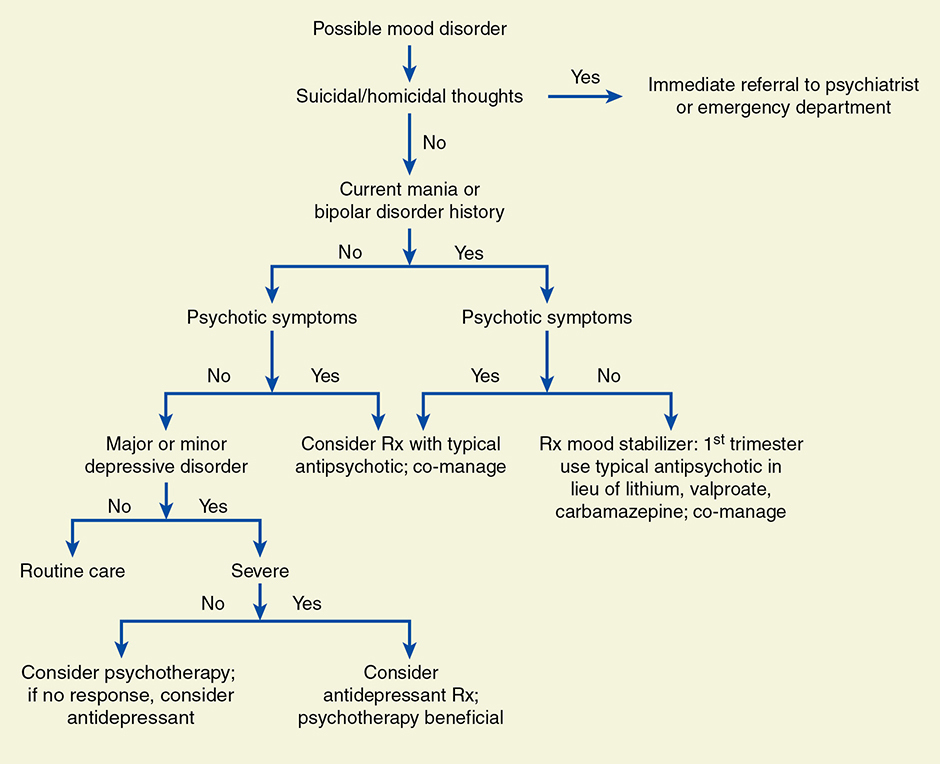

# Chapter 64: Psychiatric Disorders — Revision Notes

> Williams Obstetrics 26e, pp. 2978–3007 of the PDF. High-yield numbers are in **bold**.
> The three tables are transcribed from the PDF images (they are missing from the extracted chapter text). The single figure is included from the PDF.

**Big picture:** Pregnancy and the puerperium can trigger new mental illness or a relapse. **Depressive and anxiety disorders** are the most prevalent. They are linked to less prenatal care, substance use, preterm birth and a higher postpartum psychiatric illness rate, and they harm the mother–child bond. They are often missed: depression was **not documented in nearly half** of affected women's records.

---

## 1. Psychological Adjustments to Pregnancy
- Higher mood-disorder risk is linked to shifts in **sex steroids and monoamine neurotransmitters**, **HPA-axis dysfunction**, **thyroid dysfunction** and immune changes. Familial clustering suggests a high-risk subgroup for unipolar depression.
- Common: worries about fetal health, child care, lifestyle, fear of labor pain; anxiety, sleep disorders, functional impairment.
- **Perceived stress ↑** with a fetus at high risk of malformation, preterm labor/delivery, or medical complications. Example: **half** of women at ↑ risk for aneuploidy screened positive for depression vs **2.4%** of normal pregnancies.
- After **stillbirth**: encourage contact with the newborn, photographs and memorabilia. Address sleep disorders.

### The puerperium
- **Up to 15%** develop a **nonpsychotic postpartum depressive disorder within 6 months**.
- More likely with obstetrical complications (**severe preeclampsia, FGR**, especially with early delivery), prior psychiatric disorder or **childhood trauma**. Other stressors, e.g., **spouse military deployment**.
- Some develop **postpartum psychosis**; **half of these are bipolar disorder**.

### Maternity (postpartum) blues
- Time-limited heightened emotional reactivity in **about half of women** in the **first week** (range **26–84%** by criteria).
- **Peaks day 4–5; normal by day 10.**
- Predominant mood is still happiness, but labile: insomnia, weepiness, depression, anxiety, poor concentration, irritability; tearful for hours, then fine, then tearful again.
- **Supportive care + reassurance** that it is transient (biochemical). **Monitor for depression** and other severe disturbance.

### Perinatal evaluation and screening
- **ACOG and USPSTF: screen at least once in the perinatal period for depression and anxiety.** Full mood assessment at the **comprehensive postpartum visit**.
- Mood/behavior changes are often blamed on pregnancy. Clues to real disorder: **cognitive symptoms** (loss of concentration), **excessive anxiety, insomnia even while the infant sleeps**.
- **Risk factors for depression:**
  - Prior personal or **family history** of depression
  - **Sexual, physical or verbal abuse**; illicit substance use; personality disorders
  - **Smoking/nicotine dependence and obesity** (↑ all mental disorders)
- Eating disorders may be exacerbated → follow closely.
- Parkland: risk-based query at the **first prenatal visit** and a validated tool **postpartum**.
- **Use a validated instrument** (Table 64-1): ob-gyns **missed 60%** of depressed women in practice.
  - Parkland EPDS at the first postpartum visit (17,000 women): **6%** had minor/major depressive scores; **12** had thoughts of self-harm.
  - In >22,000 women, puerperal depression rates reached **3.4%**; few with self-harm thoughts had a credible plan, intent and means.

### Table 64-1. Depression Screening Tools

| Screening Tool | Items | Time to Complete (min) |
|---|---|---|
| **Edinburgh Postnatal Depression Scale (EPDS)** | **10** | **<5** |
| Patient Health Questionnaire 9 (PHQ-9) | 9 | <5 |
| Center for Epidemiologic Studies Depression Scale (CES-D) | 20 | 5–10 |

*These screening tools are also available in Spanish. (The "Available Resources Online" URL column is omitted.)*

**Does screening help?**
- Screening alone now appears to have clinical benefit: absolute ↓ in depression of **2.1–9.1%** (6 RCTs). **Maximum benefit comes with treatment or referral.**
- Follow-up is the weak link: **>¾ of 1106 women with high EPDS scores missed** their psychiatric appointment (access, perception, stigma).
- **Co-located behavioral health** → **4× more likely** to access treatment. Parkland places counselors in postpartum clinics.
- Other helpful interventions: **home visits, telephone peer support, interpersonal psychotherapy**.

### Treatment considerations
- Positive screen → **stage-based response protocol**. First priority: **maternal and infant safety**, ideally on-site assessment (on-site access **quadruples** later attendance).
- **Suicidal or homicidal ideation:**
  1. Working diagnosis
  2. **Emergency psychiatric consultation**; ambulance transport if needed
  3. Close communication between perinatal and psychiatric teams
  4. Emotional support for patient, family and staff
- **Pregnancy-associated homicide and suicide** are significant contributors to maternal mortality.
- Counseling/psychotherapy helps many; medication when needed. **Shared decision making**; inform women of side effects.

### Pregnancy outcomes
- Maternal psychiatric illness → **preterm birth, low birthweight, perinatal mortality**.
- **PTSD ↔ spontaneous preterm delivery** (16,334 deliveries). **Domestic abuse** also → adverse perinatal outcomes.

---

## 2. Classification of Psychiatric Disorders
- **DSM-5** (American Psychiatric Association, 2013) sets criteria for each diagnosis; correct diagnosis → specific treatment.

---

## 3. Mood Disorders
- **Major depression** (unipolar), **manic-depression** (bipolar: manic + depressive episodes) and **dysthymia** (chronic mild depression).

### Major depression
- Most common depressive disorder. **12-month prevalence 8.2%** in adult women; **16%** of women used an antidepressant in the prior month (2011–2014).
- Diagnosis from Table 64-2 symptoms (few patients have all).
- Multifactorial (genes + environment). Families often have alcohol abuse and anxiety disorders. Triggers: substance abuse, medications, medical disorders, grief.

### Table 64-2. Symptoms of Depressive Illnessᵃ

| Symptoms |
|---|
| Hopelessness and/or pessimism |
| Persistent sad, anxious, or "empty" feelings |
| Guilt, worthlessness, and/or helplessness |
| Irritability, restlessness |
| Loss of interest in activities once pleasurable, including sex |
| Fatigue and decreased energy |
| Difficulty concentrating, remembering details, and making decisions |
| Insomnia, early-morning wakefulness, or excessive sleeping |
| Overeating or appetite loss |
| Thoughts of suicide, suicide attempts |
| Persistent aches, or pains, headaches, cramps, or digestive problems that do not ease with treatment |

*ᵃNot all patients experience the same symptoms. From National Institute of Mental Health, 2019.*

### Pregnancy and depression
- Pregnancy is a major stressor. **Estrogen** ↑ serotonin synthesis, ↓ breakdown, modulates receptors.
- Women with postpartum depression often have **higher predelivery estrogen and progesterone** and a **greater postpartum fall**.
- **Antenatal depression prevalence ~11%** (Cochrane); ~10% in >1800 clinic patients; higher after antepartum complications.

### Postpartum depression
- **Major or minor depression in 10–20%** postpartum.
- **Risk factors:** young age, **antenatal depression**, unmarried, smoking, **NICU newborn**, pregnancy stressors, **physical or verbal abuse** (potent), **serious adverse obstetrical events** (especially involving the neonate).
- **Frequently recurrent: up to 70%** with prior postpartum depression have another episode. **Prior puerperal depression + current "blues"** → inordinately high risk of major depression.
- 4th most common challenge 2–9 months postpartum (PRAMS). **Under-recognized and undertreated.**
- **Suicide** is one of the largest contributors to mortality in new mothers (most with mental illness).
- **Untreated → up to 25% still depressed at 1 year.** Longer duration → more sequelae. Child: **insecure attachment**, later behavioral problems.

### Depression treatment
- **Mild / mild–moderate:** psychological therapy first (**CBT**); light–moderate exercise may help.
- **Moderate–severe:** **antidepressant + psychotherapy** (ACOG).
- **Severe:** start an **SSRI**. If it helps during a **6-week trial**, continue **≥6 months** to prevent relapse. Poor response/relapse → switch SSRI or refer.
- **≥60%** of women on antidepressants before pregnancy have symptoms in pregnancy. **~¾ stop** before or in early pregnancy.
- **Stopping → ~70% relapse vs ~25%** who continue.
- Antidepressants linked to ↑ preterm birth and LBW in a metaanalysis (confounded by the illness itself). Safety data are **reassuring**; antidepressants remain reasonable.
- After an initial postpartum episode, recurrence after stopping medication: **50–85%**.
- Watch for **suicidal or infanticidal thoughts, psychosis**, response; hospitalize if severe.

*Figure 64-1. Mood-disorder algorithm: suicidal/homicidal → immediate referral; bipolar ± psychosis → typical antipsychotic or mood stabilizer (typical antipsychotic in the 1st trimester instead of lithium/valproate/carbamazepine); severe depression → antidepressant.*

### Table 64-3. Drugs Used for Treatment of Major Mood Disorders in Pregnant Women

| Indication | Examples | Comments |
|---|---|---|
| **Antidepressants** | | |
| SSRIsᵃ | Citalopram, sertraline, fluoxetine, paroxetine | Some have possible link with **heart defects, neonatal withdrawal syndrome, and pulmonary hypertension** |
| Others | Bupropion, duloxetine, nefazodone, venlafaxine | |
| Tricyclics | Amitriptyline, desipramine, doxepin, imipramine, nortriptyline | **No evidence of teratogenicity**, not commonly used |
| **Antipsychotics** | | |
| Typical | Chlorpromazine, fluphenazine, haloperidol, thiothixene | |
| Atypical | Aripiprazole, clozapine, olanzapine, risperidone, ziprasidone | |
| **Bipolar Disorders** | | |
| Lithiumᵃ | Lithium carbonate | Manic episodes; teratogenic for cardiac defects (**Ebstein anomaly**) |
| Valproic acidᵇ | | Teratogenic for **neural-tube defects** |
| Carbamazepineᵇ | | Antiepileptic; **hydantoin syndrome** |

*ᵃChapter 8 (p. 150). ᵇChapter 63 (p. 1130). SSRI = selective serotonin-reuptake inhibitor.*

### Fetal and neonatal effects of therapy
| Effect | Key facts |
|---|---|
| **Cardiac defects (paroxetine)** | Mainly **VSD**; risk **≤1 in 200** exposed. **ACOG: avoid paroxetine** if pregnant or planning pregnancy. First-trimester exposure → consider **fetal echocardiography**. |
| Perinatal mortality | Not linked to SSRIs |
| Miscarriage | Small ↑ after stopping SSRIs early, but the same as stopping months before → **don't stop SSRIs for fear of miscarriage** |
| **PPHN** | **6× ↑ with SSRI exposure after 20 wk** → absolute risk **<1 in 100**. Other cohorts: 2× (attributable **2 per 1000**) and **1 per 1000**. |
| **Neonatal withdrawal** | **Up to 30%** of exposed neonates; like opioid withdrawal but milder; self-limited, rarely **>5 days** in nursery |
| Brain / neurodevelopment | MR shows fetal brain volume differences, but **no convincing long-term neurobehavioral effect** |
| Breast milk | Levels very low/undetectable; transient irritability, sleep disturbance, colic |

- Mothers who stop SSRIs/SNRIs abruptly usually get withdrawal symptoms. Weigh maternal relapse risk against marginal neonatal risk.

### Newer and other treatments
- **Brexanolone** (allopregnanolone analogue; FDA-approved for **postpartum depression**). Allopregnanolone rises with progesterone and **falls abruptly after birth**; failure of **GABA-A receptors** to adapt may precede PPD. **IV infusion** ↓ Hamilton scores vs placebo. **Prohibitively expensive.**
- **Ketamine (IV) and esketamine (nasal):** not studied in pregnant/postpartum women.

**Electroconvulsive therapy (ECT)**
- For major mood disorders **unresponsive to drugs**.
- **Preparation:**
  - **Fast ≥6 h**; **rapid-acting antacid**; protect the airway (aspiration)
  - **After midpregnancy: wedge under the right hip** (aortocaval compression)
  - Assess the cervix; stop nonessential **anticholinergics**
  - **Uterine and FHR monitoring**; IV hydration
  - **Avoid excessive hyperventilation**
- Relatively safe in the 1st trimester. Case of fetal brain damage from sustained maternal hypotension (ECT-triggered status epilepticus).

| Review | Cases | Findings |
|---|---|---|
| Miller, 1994 | 300 | Complications **10%**: fetal arrhythmias, vaginal bleeding, abdominal pain, self-limited contractions. Poor preparation → aspiration, aortocaval compression, respiratory alkalosis. |
| Anderson & Reti, 2009 | 339 | **78% effective**; maternal complications **5%**; perinatal complications **3%** (2 fetal deaths) |

- **ECT is not "low risk"** → reserve for severe depression **resistant to intensive pharmacotherapy**.

### Suicide
- **Self-harm is a primary cause of perinatal death**; major depression is one of the strongest predictors.
- Colorado 2004–2012: self-harm/suicide/overdose was the **leading cause of maternal death**. Ontario: perinatal suicide = **5.3%** of maternal deaths.
- **Fetal loss → 3–5× suicide risk.** **54%** of pregnancy-associated suicides involved **intimate-partner conflict**.

---

## 4. Bipolar and Related Disorders
- **Lifetime prevalence 4.4%**; same in pregnant and nonpregnant women.
- Strongly genetic (chromosomes 16 and 8). **MZ twins 40–70%** concordance; first-degree relatives **5–10%**.
- Depression lasts **≥2 weeks**; mania = abnormally raised, expansive or irritable mood.
- Exclude organic mania: **substance abuse, hyperthyroidism, CNS tumors**.
- ⚠️ **Pregnancy often prompts stopping medication → markedly ↑ relapse.**
- **About ⅓ attempt suicide** in their lifetime.

### Bipolar disorder in pregnancy
- ↑ Preterm birth. Pregnancy complications → more mania/depression. **Symptomatic in pregnancy → more (and severe) postpartum relapse.** Manic women relapse **earlier** postpartum.
- Therapy: **mood stabilizers (lithium, valproic acid, carbamazepine) and antipsychotics**; co-manage with a psychiatrist.
- **Lithium → Ebstein anomaly**, but recent data show a **lower cardiac risk than thought**. Many still advise **fetal echocardiography**.
- Lithium in breast milk can harm the infant if elimination is impaired (dehydration, prematurity), but is **moderately safe** with a healthy term infant.
- Children of bipolar women: no apparent long-term harm.

### Postpartum psychosis
- Usually **bipolar disorder**, sometimes major depression.
- Incidence **1 per 1000 deliveries**; more common in **nulliparas**, especially with obstetrical complications.
- Onset **within 2 weeks** of delivery; lasts **2–3 months**. With a bipolar history: **within 1–2 days**.
- Underlying psychiatric disease → **10–15× recurrence risk** postpartum → monitor closely.
- Manic symptoms: excited/elated, energetic, "chatty", **insomnia**; confusion and disorientation with lucid intervals.
- **Recurrence in the next pregnancy: 50%** → **start lithium immediately after delivery** in women with prior postpartum psychosis.
- Needs hospitalization, drugs, long-term psychiatric care.
- ⚠️ Delusions → self-harm or harm to the infant; **unlike nonpsychotic depression, these women (uncommonly) commit infanticide**.
- Most eventually develop **relapsing, chronic psychotic manic-depression**.

> **Memory hook:** "**Blues** = **B**rief (peaks day 4–5, gone by day 10); **Depression** = **D**uration (≥2 wk, 10–20%); **Psychosis** = **P**er thousand (1/1000), **P**otential infanticide."

---

## 5. Anxiety Disorders
- **Prior-year prevalence 23%** in US women.
- Includes panic attack, panic disorder, social anxiety, specific phobia, separation anxiety, **generalized anxiety disorder**.
- Irrational fear, tension and worry + physical symptoms (trembling, nausea, flashes, dizziness, dyspnea, insomnia, frequent urination).

### Anxiety in pregnancy
- **Rates not different** from nonpregnant women. In **GAD, symptoms and severity decline across pregnancy.**
- Possibly linked to **preterm birth, FGR**, poor neurobehavioral development (not all studies). In utero exposure → ↑ childhood neuropsychiatric conditions such as **ADHD**.

### Treatment
- Psychotherapy, **CBT** or medication.
- Mood and anxiety disorders **coexist in more than half** → **SSRIs are first-line** drugs. **Single agent, lowest effective dose.**
- **Benzodiazepines:** early case–control studies suggested **cleft lip/palate**, but a metaanalysis of >1 million exposures found **no teratogenic risk**.
  - **3rd-trimester use → neonatal withdrawal** lasting days to weeks.
  - ⚠️ **Avoid with current or past substance misuse.**

---

## 6. Schizophrenia Spectrum Disorders
- Affects **1.1%** of adults.
- Domains: **delusions, hallucinations, disorganized thinking, grossly disorganized/abnormal motor behavior, negative symptoms**.
- **Degenerative brain disorder** (PET/fMRI); subtle anomalies early in life that worsen.
- Genetics: **MZ concordance 33%**; **one affected parent → 5–10%** risk to offspring. Link with **velocardiofacial syndrome (22q11)**, but not a single gene.
- Maternal influenza A as a fetal risk remains unproven.
- Onset **~20 years**; women slightly later (estrogen may protect). Function deteriorates over time.
- **Within 5 years:** **60%** social recovery, **50%** employed, **30%** mentally handicapped, **10%** need continued hospitalization.

### Schizophrenia in pregnancy
- Most studies: no adverse maternal outcome (older studies: LBW, FGR, preterm).
- In more than 3000 pregnancies: **placental abruption 3×**, "fetal distress" 1.4×.
- **High recurrence if medication stopped → continue therapy.**
- **Typical antipsychotics:** adverse sequelae in some studies but not all.
- **Atypical antipsychotics:** less known → **ACOG recommends against routine use** in pregnancy and breastfeeding.
- **FDA:** 3rd-trimester antipsychotic exposure → risk of **abnormal muscle movements (EPS) and withdrawal** in newborns.

---

## 7. Eating Disorders
- **Anorexia nervosa:** refuses to maintain normal weight. **Bulimia nervosa:** binge eating then purging/fasting to keep normal weight.
- Mostly adolescent and young women. Lifetime prevalence **2–3% each**.
- Norwegian cohort (~36,000): **anorexia 0.1%, bulimia 0.85%, binge-eating 5.1%** (total ~6%, like nonpregnant 6-month prevalence). **Binge-eating → LGA and ↑ cesarean.**
- All begin with the desire to be slim; women may migrate between subtypes.

### Eating disorders in pregnancy
- ↑ Early pregnancy complications, **especially bulimia**.
- **Symptoms usually improve; remission up to 75%.**
- ⚠️ **"Hyperemesis gravidarum" may actually be new or relapsing bulimia** or binge–purge anorexia.
- **Anorexia → LBW, smaller head circumference, SGA.** Children more likely to have psychopathology at 7 years.
- Maternal: poor wound healing, breastfeeding difficulty.
- **Monitor gestational weight gain.** Multidisciplinary team: obstetrician, mental health provider, dietician.
- **Psychological treatment (CBT) is the cornerstone.** Anorexia → motivational interaction + meal planning.
- Postpartum: **↑ postpartum depression**; **bulimia rebounds** (body-image concerns).

---

## 8. Substance Use Disorders
- DSM-5: **10 drug classes** (caffeine, tobacco, cannabis, hallucinogens, opioids, anxiolytics, stimulants, etc.). Continued use despite problems; brain-circuit changes persist beyond detox → relapses.
- **~10% of fetuses are exposed to ≥1 illicit drug** (heroin/opiates, cocaine, amphetamines, barbiturates, marijuana).
- Sequelae: **FGR, LBW, neonatal withdrawal**. Lack of prenatal care adds preterm/LBW risk.
- **Marijuana:** harm mostly with **heavy use**; later childhood neurobehavioral effects → **advise abstinence in pregnancy and lactation**.

### Opioid use disorder
- Epidemic. In 2017: maternal opioid diagnoses **0.8%** at delivery; **neonatal abstinence syndrome 0.7%** (both ↑ vs 2010).
- **ACOG/ASAM: universal questionnaire screening at the first prenatal visit.** **Urine drug testing only with consent** and per state law.

**Medication-assisted treatment**
- **Methadone maintenance** (registered program): ↓ opioid complications and withdrawal, encourages prenatal care, avoids drug-culture risks. **Start 10–30 mg/d** and titrate.
- **Buprenorphine** by credentialed physicians.
- ⚠️ **Avoid chronic naloxone + buprenorphine** (may precipitate neonatal withdrawal).

**Medically supervised withdrawal**
- Controversial (high relapse); **discouraged by ACOG/ASAM**, though one review (>600 women) called it reasonable.
- Parkland: women declining maintenance are offered **inpatient controlled methadone taper** to ↓ neonatal opioid withdrawal.
- Parkland 2017: 69 women in the program; **37 (54%)** opioid-free at delivery → neonatal stay **4.5 vs 23.5 days**.
- **Neonatal opioid withdrawal syndrome:** see Ch 33.

---

## 9. Posttraumatic Stress Disorder
- A trauma- and stressor-related disorder: symptoms after ≥1 traumatic event (obstetric example: **PTSD after hyperemesis gravidarum**).
- Symptoms: anxiety, fear, anhedonia, dysphoria, dissociation.
- **8% of pregnant women** have features.
- **Psychotherapy first-line**; also benzodiazepines or antidepressants.
- **PTSD + major depression → high preterm birth risk.**

---

## 10. Personality Disorders
- Chronic, rigid, maladaptive coping traits. Prior-year prevalence **~9%**.

| DSM-5 cluster | Disorders | Characteristic |
|---|---|---|
| **A** | Paranoid, schizoid, schizotypal | **Odd, eccentric** |
| **B** | Histrionic, narcissistic, antisocial, borderline | **Dramatic**, self-centered, erratic |
| **C** | Avoidant, dependent, compulsive, passive-aggressive | **Fear and anxiety** |

- Treatment: psychotherapy, but most don't recognize the problem → **only 20% seek help**.
- **Borderline:** pregnancy during the most severe phase; ↑ adolescent and unintended pregnancy.
- Newborn care is impaired **only when a personality disorder coexists with depression**.

> **Memory hook:** Clusters A-B-C = "**W**eird, **W**ild, **W**orried."

---

## Quick-Recall: Postpartum Mood Disorders and Key Drug Risks

| Condition | Frequency | Onset / course | Management |
|---|---|---|---|
| **Maternity blues** | **~50%** (26–84%) | First week; **peak day 4–5, resolves by day 10** | Support, reassurance, watch for depression |
| **Postpartum depression** | **10–20%** (up to 15% nonpsychotic within 6 mo) | ≥2 wk; recurs in **up to 70%** | CBT; SSRI + psychotherapy if moderate–severe (≥6 mo); brexanolone |
| **Postpartum psychosis** | **1/1000** | **≤2 wk** (1–2 d if bipolar); 2–3 mo | Hospitalize; lithium right after next delivery (**50%** recurrence) |

| Drug | Key pregnancy risk |
|---|---|
| **Paroxetine** | Cardiac defects (**VSD**), ≤1/200 → **avoid**; fetal echo if exposed |
| SSRIs after 20 wk | **PPHN** (6×; <1/100 absolute); neonatal withdrawal **up to 30%** |
| Tricyclics | No evidence of teratogenicity |
| **Lithium** | **Ebstein anomaly** (lower than once thought) → fetal echo |
| Valproic acid | **Neural-tube defects** |
| Carbamazepine | Hydantoin syndrome |
| Benzodiazepines | Not teratogenic (metaanalysis); **3rd-trimester neonatal withdrawal** |
| Atypical antipsychotics | Little data → **not routine** (ACOG) |
| Antipsychotics in 3rd tri | Neonatal abnormal movements, withdrawal (FDA) |

## Key Numbers to Memorize
- Depression undocumented in **~½** of affected women; ob-gyns miss **60%**
- Blues **~50%** (26–84%), peak **day 4–5**, gone by **day 10**
- Nonpsychotic PPD **up to 15%** within 6 mo; PPD **10–20%**; recurrence **up to 70%**; untreated → **25%** still depressed at 1 yr
- Antenatal depression **~11%**; 12-mo major depression **8.2%** in women
- EPDS **10 items, <5 min**; PHQ-9 **9 items**; CES-D **20 items, 5–10 min**
- Screening ↓ depression **2.1–9.1%**; **>¾** miss referral; co-location **4×** uptake
- SSRI trial **6 wk** → continue **≥6 mo**; stopping antidepressants → **70% vs 25%** relapse; postpartum recurrence after stopping **50–85%**
- Paroxetine VSD **≤1/200**; PPHN **6×** (<1/100; 1–2/1000 attributable); neonatal SSRI withdrawal **30%**, **≤5 d**
- ECT: fast **6 h**, right-hip wedge; complications **10%** (Miller); **78%** effective, maternal **5%**, perinatal **3%**
- Suicide: fetal loss **3–5×**; partner conflict **54%**; Ontario **5.3%** of maternal deaths
- Bipolar **4.4%**; MZ **40–70%**; first-degree **5–10%**; lifetime suicide attempt **⅓**
- Postpartum psychosis **1/1000**; onset **≤2 wk**; recurrence **10–15×** / **50%** next pregnancy
- Anxiety **23%**; mood + anxiety coexist **>50%**
- Schizophrenia **1.1%**; MZ **33%**; one parent **5–10%**; abruption **3×**; 5-yr: **60/50/30/10%**
- Eating disorders: remission **up to 75%**; anorexia 0.1%, bulimia 0.85%, binge 5.1%
- Illicit drug exposure **10%** of fetuses; opioid diagnosis **0.8%**, NAS **0.7%**; methadone start **10–30 mg/d**; Parkland neonatal stay **4.5 vs 23.5 d**
- PTSD **8%**; personality disorder **9%**, only **20%** seek help
