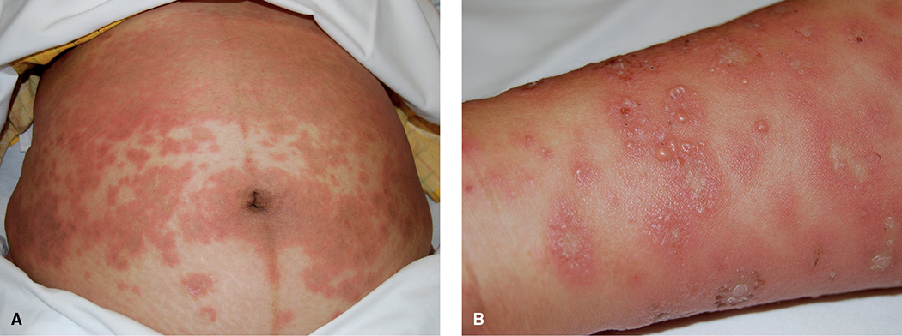
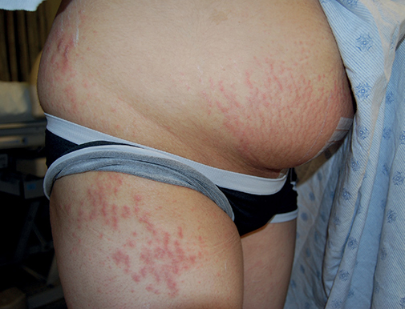
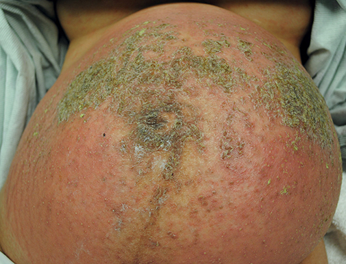
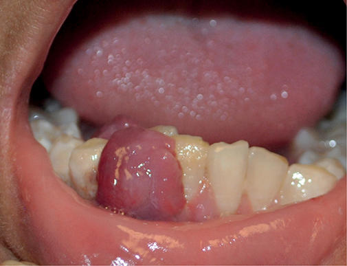

# Chapter 65: Dermatological Disorders — Revision Notes

> Williams Obstetrics 26e, pp. 3008–3024 of the PDF. High-yield numbers are in **bold**.
> The three tables are transcribed from the PDF images (they are missing from the extracted chapter text). All 4 figures are included from the PDF.

**Big picture:** Four dermatoses are unique to pregnancy and all itch. Only **pemphigoid gestationis** and **intrahepatic cholestasis** harm the fetus. Most other skin disease is treated with emollients, antihistamines and low/moderate-potency topical steroids.

---

## 1. Pregnancy-Specific Dermatoses

- The four: **pemphigoid gestationis (PG)**, **PUPPP**, **atopic eruption of pregnancy (AEP)** and **intrahepatic cholestasis of pregnancy**.
- They look alike and **pruritus is common** to all.
- **Adverse fetal outcomes only with PG and cholestasis.**
- Cholestasis (Ch 58): **no primary skin lesions**; pruritus with **↑ serum bile acids** and mildly ↑ transaminases.

### Table 65-1. Pregnancy-specific Dermatoses

| Disorder | Frequency | Characteristic Lesion | Adverse Pregnancy Effects | Treatment |
|---|---|---|---|---|
| **PUPPP** | Common | Erythematous pruritic papules or plaques; patchy or generalized on abdomen, thighs, buttocks, especially within striae, but with umbilical sparing | None | Oral antipruritics, emollients, topical corticosteroids, and if severe, oral steroids |
| **AEP** | | | None | (as above) |
| – Eczema in pregnancy | Common | Dry, red scaly patches on extremity flexures, neck, face | | (as above) |
| – Prurigo of pregnancy | Common | 1–5 mm pruritic red papules on extensor surfaces, trunk | | (as above) |
| – Pruritic folliculitis of pregnancy | Rare | Small red papules, sterile pustules on trunk | | (as above) |
| **Pemphigoid gestationis** | Rare | Erythematous pruritic papules, plaques, vesicles, and bullae; abdomen often with umbilical involvement, extremities | Preterm birth, fetal-growth restriction, transient neonatal lesions | (as above) |
| **Cholestasis of pregnancy** | Common | No primary lesions, secondary excoriations from scratching | Increased perinatal morbidity | Oral antipruritics, cholestyramine, ursodeoxycholic acid |

*AEP = atopic eruptions of pregnancy; PUPPP = pruritic urticarial papules and plaques of pregnancy. The table gives prurigo papules as 1–5 mm; the chapter text says 5–10 mm.*

### Pemphigoid gestationis (PG)
- **Rare autoimmune bullous disease.** Formerly "herpes gestationis", but **not related to herpesvirus**.
- **Lesions:** pruritic papules and urticarial plaques → **vesicles/bullae after 1–2 wk**.
  - **Involves the umbilicus**; **spares mucous membranes, scalp and face**.
- **Pathogenesis:** maternal **IgG against collagen XVII (= BP180)** in the basement membrane of skin and amnion → complement activation → eosinophil chemotaxis and degranulation → dermal–epidermal junction damage → blisters.
- **Course:**
  - Usually starts in a **first pregnancy**, in the **2nd or 3rd trimester**. **Postpartum onset or flare is common**; antepartum flares and remissions.
  - **Recurs** in most later pregnancies, **earlier and more severely**.
  - Associated with other autoimmune disease, especially **Graves disease**.
  - Early onset + blistering → **preterm birth, oligohydramnios, FGR** (mild placental insufficiency from IgG/complement on the amnionic basement membrane) → surveillance is reasonable.
  - **Neonatal lesions in 5–10%** (passive IgG): wound care only, clear in a few weeks.
  - Maternal lesions heal **without scarring**; most are disease-free **by 6 months**. May flare with **menses or oral contraceptives**.
- **Differential:** PUPPP (before bullae form), bullous pemphigoid, pustular psoriasis, erythema multiforme, linear IgA dermatosis, urticaria, dermatitis herpetiformis, contact dermatitis, AEP. **Exclude SJS/TEN.**
- **Diagnosis:**
  - **Most accurate: immunofluorescence of a skin punch biopsy** → **C3** (± IgG) along the basement membrane zone.
  - Serum **anti-BP180 IgG by ELISA**.
- **Treatment:**
  - Early: **high-potency topical steroids + oral antihistamines**.
  - Refractory: **oral prednisone/prednisolone** (inactivated by placental 11β-hydroxysteroid dehydrogenase → low fetal exposure), e.g., **0.5–1 mg/kg/d**, then taper.
  - Rare intractable cases: IVIG, cyclosporine, plasmapheresis. **Rituximab** early only; later use risks transient newborn immunosuppression.

*Figure 65-1. Pemphigoid gestationis: (A) abdominal plaques involving the umbilicus; (B) blisters on the wrist and forearm.*

### Pruritic urticarial papules and plaques of pregnancy (PUPPP)
- Also called **polymorphic eruption of pregnancy**. **Common.** Appears **late in pregnancy** (rarely postpartum).
- Intensely pruritic **1–2-mm erythematous papules** → coalesce into urticarial plaques.
- **Abdomen and proximal thighs in 97%.** Starts **within striae** and **spares the periumbilical skin**. Face, palms and soles are rarely involved.
- **Risk factors:** white race, **nulliparity**, **multifetal gestation**, **male fetus**.
- **Seldom recurs.** Cause unknown; **not autoimmune**.
- **Differential:** contact dermatitis, drug eruption, viral exanthem, insect bites, scabies, pityriasis rosea, other pregnancy dermatoses — especially **pre-bullous PG** (skin biopsy + **negative BP180 antibodies** separate them).
- **Treatment:** oral antihistamines, emollients, topical steroids; a few need short-course systemic steroids.
- **No adverse pregnancy effects.** Resolves within days of delivery without scarring; persists **2–4 wk postpartum in 15–20%**.

*Figure 65-2. PUPPP: small papules on the buttock and thigh and within abdominal striae (umbilicus spared).*

> **Memory hook:** PG goes **for** the umbilicus; PUPPP **P**asses over it.

### Atopic eruption of pregnancy (AEP)
- Umbrella term for three conditions: **eczema in pregnancy**, **prurigo of pregnancy** (prurigo gestationis) and **pruritic folliculitis of pregnancy**.
- **⅔ eczematous changes, ⅓ papular lesions.** History of prior **atopy** helps diagnosis. **No fetal risk.**

| Subtype | Features |
|---|---|
| **Eczema in pregnancy** | **Most common pregnancy-specific dermatosis.** Dry, thickened, scaly red patches on flexures, nipples, neck, face. Often **↑ serum IgE**. |
| **Prurigo of pregnancy** | Itchy erythematous papules/nodules (5–10 mm in text) on **extensor surfaces** and trunk |
| **Pruritic folliculitis** | **Rare.** Small erythematous follicular papules and **sterile pustules**, mainly on the trunk |

- **75% start in the 1st or 2nd trimester.** Resolve with delivery but can persist **up to 3 months** postpartum. Recurrence variable but common.
- **Diagnosis of exclusion:** PG biopsy/serology negative; **bile acids** exclude cholestasis.
- **Treatment:**
  - Chronic **emollients**, as-needed oral antihistamines, **low/moderate-potency topical steroid twice daily** for several weeks.
  - Maintenance: moisturizer alone or topical steroid once or twice **weekly**.
  - Severe eczema: short-course ultrapotent topical steroid; sometimes topical tacrolimus, **narrow-band UVB**, oral steroid or cyclosporine.

---

## 2. Other Dermatological Conditions

### Acne vulgaris
- May worsen, improve or stay stable.
- **Topical first line:** **benzoyl peroxide 2.5–5%** or **azelaic acid 15–20%**.
  - Or **5% benzoyl peroxide + topical erythromycin or clindamycin** (benzoyl peroxide limits *P. acnes* resistance).
- **Topical retinoids** (tretinoin, adapalene): no ↑ major defects in large studies, but **best avoided**, especially in the 1st trimester. **Tazarotene is contraindicated.**
- **Severe:** oral **erythromycin, azithromycin, cephalexin or amoxicillin** + benzoyl peroxide. Ideally **delay to the 2nd trimester** and limit to **4–6 wk**.
- Oral steroid short course or intralesional injection for severe cases; **oral agents after the 1st trimester** (small **facial cleft** risk).

> **Pearl:** Oral tetracyclines (doxycycline, minocycline) and oral isotretinoin — the usual non-pregnant acne mainstays — are not used in pregnancy.

### Psoriasis
- Variable course; **postpartum flares are common**.
- **Stepwise treatment:**
  1. **Emollients** → add **low/moderate-potency topical steroids**.
  2. Resistant: restrained **high-potency/ultrapotent** topical steroids (2nd–3rd trimesters).
  3. **UVB phototherapy** = second line.
  4. Third tier: **cyclosporine, oral steroids, TNF-α antagonists** (adalimumab, etanercept, infliximab).
- Psoriasis itself does **not** raise adverse outcomes. **Severe disease:** small ↑ low birthweight, GDM, preeclampsia.

### Pustular psoriasis of pregnancy
- Formerly **impetigo herpetiformis**. **Rare**; can cause **severe systemic symptoms that mimic sepsis**.
- **Lesions:** erythematous, pruritic plaques ringed by **sterile pustules** that enlarge, coalesce and crust. Start in **intertriginous areas** → torso, extremities, oral mucosa.
- **Complications:** massive **fluid loss → hypovolemia**, placental insufficiency, fetal compromise; secondary infection.
- **Labs:** **leukocytosis, ↑ ESR, hypocalcemia, hypoalbuminemia**.
- **Workup:** blood and skin cultures (**sterile**) + skin biopsy (**epidermal neutrophilic pustules**).
- **First-line treatment** (choice by severity):
  - **Prednisone 15–80 mg/d**
  - **Cyclosporine 2–3 mg/kg/d**
  - Infliximab
  - Topical steroids or topical calcipotriene
- **Adjuncts:** fluids, electrolyte correction, IV antibiotics for secondary infection.
- Resolves quickly postpartum → **early delivery can be considered**. Recurs in later pregnancies and with menses or OCs.

*Figure 65-3. Generalized pustular psoriasis of pregnancy: erythematous plaques ringed by sterile pustules that crust.*

### Erythema nodosum
- **Inflammation of subcutaneous fat.** Triggers: **pregnancy**, infections, sarcoidosis, drugs, Behçet, IBD, malignancy.
- Tender, red, warm **1–6-cm nodules** on **extensor surfaces**; they flatten and change color like a bruise (red/purple → yellow-green).
- Treat the **underlying cause**. Resolves in **1–6 wk without scarring** (may leave hyperpigmentation).

### Pyogenic granuloma
- Actually a **lobular capillary hemangioma**; common in pregnancy (↑ **VEGF**).
- Sites: **gingiva**, other oral/nasal surfaces, hand, after minor irritation or trauma. **Grows fast and bleeds easily.**
- **Bleeding:** pressure + **silver nitrate** or **Monsel (ferric subsulfate) paste**.
- Often **regresses within months postpartum** → may observe antepartum.
- **Excise** if symptomatic, persistent postpartum or diagnosis unclear (scalpel + suture, electrosurgical curettage, laser, cryotherapy). Oral lesions → specialist.

*Figure 65-4. Pyogenic granuloma on the gingiva: lobulated red vascular growth that bleeds easily.*

### Miscellaneous conditions
- **Hidradenitis suppurativa:** keratin-plugged follicles → painful nodules, abscesses, **sinus tracts** (Hurley stages I–III). Usually unchanged or better in pregnancy.
  - **Stage I/II:** topical **1% clindamycin twice daily for 12 wk** (alternatives: 0.75% metronidazole, 2% erythromycin gel).
  - **Stage II/III:** oral **clindamycin 300 mg + rifampin 300 mg twice daily for 10 wk**.
  - Second line for advanced disease: **adalimumab** (anti-TNF-α).
- **Neurofibromatosis:** neurofibromas, café-au-lait spots, axillary/inguinal freckling, **Lisch nodules**, optic gliomas.
  - Neurofibromas may **grow in size and number** in pregnancy.
  - **NF1 → ↑ preeclampsia and preterm birth**; NF2 → possible preeclampsia risk. Prenatal genetic diagnosis is available for both.
- **Rosacea fulminans (pyoderma faciale):** facial pustules and draining sinuses, **no comedones**. Topical/oral antibiotics ± topical steroids; sometimes short oral steroids or drainage.

---

## 3. Dermatological Treatment

### Oral antihistamines (for pruritus)
| Generation | Drug | Dose |
|---|---|---|
| First | **Diphenhydramine** | **25–50 mg q6h** |
| First | **Chlorpheniramine** | **4 mg q6h** |
| Second (less sedating) | **Loratadine** | **10 mg daily** |
| Second (less sedating) | **Cetirizine** | **5 or 10 mg daily** |

### Topical corticosteroids
- **Start with low- or moderate-potency** agents.
- **Ultrapotent** agents (e.g., **clobetasol 0.05%**): only for refractory disease, **2–4 wk, small areas**.
- Mild/moderate strength: **no adverse pregnancy outcomes**. High/ultrapotent: **small FGR risk with large cumulative doses** (still less than oral steroids).
- **Systemic absorption ↑ with:** large surface area, broken epidermal barrier, **occlusive dressing**, long duration, other absorption-enhancing topicals.

### Table 65-2. Commonly Used Topical Corticosteroids in Pregnancy

| Low-Potency Agents | Moderate-Potency Agents | High-Potency Agents | Ultrapotency Agents |
|---|---|---|---|
| Hydrocortisone 0.5–1% *cream, ointment* | Triamcinolone acetonide 0.1% *cream, ointment* | Triamcinolone acetonide 0.5% *cream, ointment* | Clobetasol propionate 0.05% *cream, ointment* |
| Dexamethasone 0.1% *cream* | Mometasone furoate 0.1% *cream* | Mometasone furoate 0.1% *ointment* | |
| Desonide 0.05% *foam, cream, ointment* | Betamethasone valerate 0.1% *cream, ointment* | Betamethasone dipropionate 0.05% *cream, ointment* | |

> **Pearl:** The same drug and strength can change potency class with the vehicle: mometasone 0.1% is moderate as a cream but high as an ointment.

### Table 65-3. Some Dermatological Agents and Their Suitability for Pregnancy

| Group | Action | Pregnancy Recommendation |
|---|---|---|
| **Topical Agents** | | |
| Corticosteroids | Antiinflammatory | Suitable |
| Benzoyl peroxide | Antiinflammatory, comedolytic, antibacterial | Suitable |
| Azelaic acid | Antiinflammatory, comedolytic, antibacterial | Suitable |
| Antibiotics: clindamycin, erythromycin | Antibacterial | Suitable |
| Calcineurin inhibitors: tacrolimus, pimecrolimus | Antiinflammatory | Suitable |
| Calcipotriene | Antiinflammatory, vitamin D analogue | Possible poor ossification in animals; no human data. Probably suitable in dermatological dosages |
| Coal tar | Antiinflammatory; keratinocyte regulation | Possible animal mutagen/carcinogen; no human data. If used, delay until 2nd trimester |
| Retinoids: tretinoin, adapalene | Antiinflammatory, comedolytic | Large studies show no harm, but experts suggest avoiding |
| Retinoids: tazarotene | Antiinflammatory, comedolytic | **Teratogenic; contraindicated** |
| Crisaborole | Antiinflammatory | Limited pregnancy data; avoidance currently suggested |
| **Systemic Agents** | | |
| Oral antibiotics: azithromycin, amoxicillin, cephalexin, erythromycin | Antibacterial | Suitable |
| Oral corticosteroids | Antiinflammatory | 1st-trimester use linked to small risk of oral clefts |
| Cyclosporine | Immunomodulator | Low birthweight, preterm birth; nonteratogenic |
| TNF-α inhibitors: infliximab, adalimumab, etanercept | TNF-α inhibition | Suitable |

*From Bae, 2012; Briggs, 2017; Murase, 2014; Park-Wyllie, 2000; Rademaker, 2018; Robinson, 2012; Sekhon, 2018; Vestergaard, 2019.*

- **Avoid in pregnancy (teratogens, Ch 8):** **methotrexate, PUVA (psoralen + UVA), mycophenolate mofetil, podophyllin, systemic retinoids**.
- Secondary bacterial skin infection → prompt oral antibiotics with **gram-positive coverage**.

---

## Quick-Recall: Pregnancy-Specific Dermatoses at a Glance

| Feature | Pemphigoid gestationis | PUPPP | AEP | Cholestasis |
|---|---|---|---|---|
| Frequency | Rare | Common | Common (eczema = **most common**) | Common |
| Timing | 2nd–3rd tri; **postpartum flare** | **Late** 3rd tri | **75% in 1st–2nd tri** | Late (Ch 58) |
| Parity | **1st pregnancy** | **Nulliparas**, multifetal, male fetus | Prior atopy | — |
| Umbilicus | **Involved** | **Spared** | — | No primary lesion |
| Blisters | **Yes (bullae)** | No | Sterile pustules (folliculitis) | Excoriations only |
| Test | **DIF: C3 at BMZ; anti-BP180 ELISA** | Negative BP180 | IgE ↑; exclusion | **↑ Bile acids** |
| Fetal risk | **Preterm, FGR, neonatal lesions (5–10%)** | None | None | **↑ Perinatal morbidity** |
| Recurrence | **Yes, earlier and worse** | Seldom | Common | — |

## Key Numbers to Memorize
- PG: bullae **1–2 wk** after plaques; neonatal lesions **5–10%**; disease-free by **6 months**; prednisone **0.5–1 mg/kg/d**
- PUPPP: papules **1–2 mm**; abdomen/thighs in **97%**; persists **2–4 wk** postpartum in **15–20%**
- AEP: **⅔ eczematous / ⅓ papular**; **75%** begin in 1st–2nd trimester; may last **3 months** postpartum
- Acne: benzoyl peroxide **2.5–5%**, azelaic acid **15–20%**; oral antibiotics for **4–6 wk**, from the 2nd trimester
- Pustular psoriasis: prednisone **15–80 mg/d**; cyclosporine **2–3 mg/kg/d**
- Erythema nodosum: nodules **1–6 cm**, resolve in **1–6 wk**
- Hidradenitis: clindamycin 1% topical **12 wk**; clindamycin + rifampin **300 mg each twice daily × 10 wk**
- Antihistamines: diphenhydramine **25–50 mg q6h**; chlorpheniramine **4 mg q6h**; loratadine **10 mg**; cetirizine **5–10 mg**
- Ultrapotent topical steroid: **2–4 wk**, small areas only (clobetasol **0.05%**)
