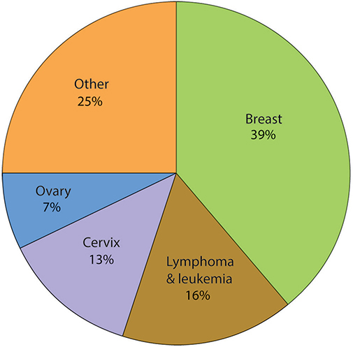
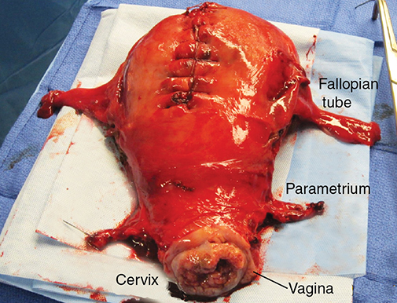
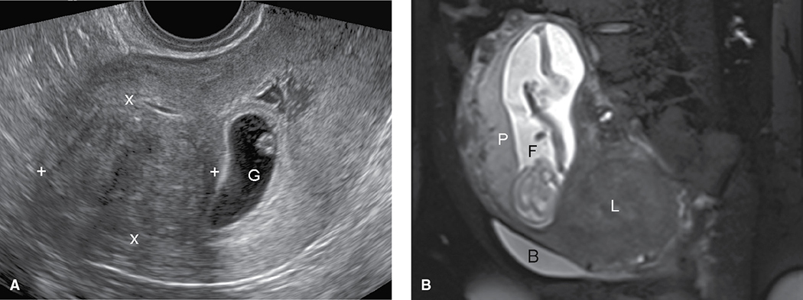
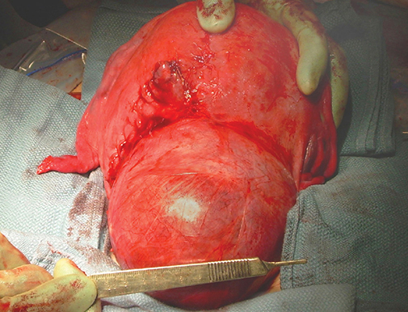
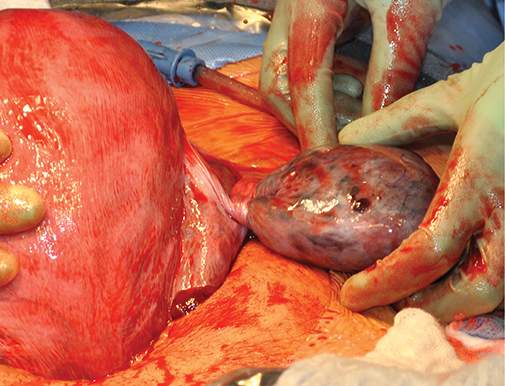
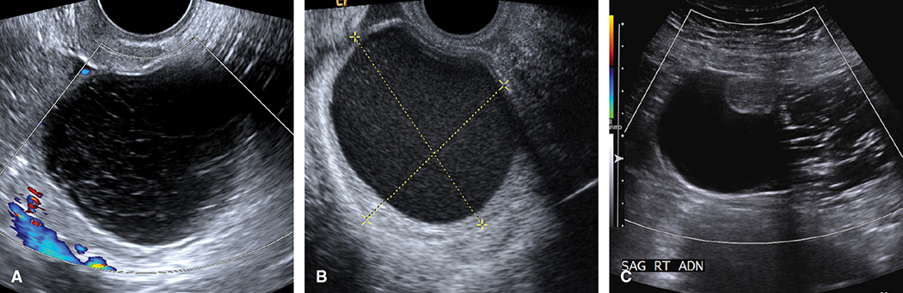

# Chapter 66: Neoplastic Disorders — Revision Notes

> Williams Obstetrics 26e, pp. 3025–3076 of the PDF. High-yield numbers are in **bold**.
> The three tables are transcribed from the PDF images (they are missing from the extracted chapter text). All 6 figures are included from the PDF.

**Big picture:** Most neoplasms in pregnancy are **benign** (leiomyomas and ovarian cysts are the most frequent). Malignancy complicates **~1 in 1000–2000 pregnancies**; **one third** are diagnosed prenatally and the rest within 12 months of delivery. Treatment is individualized: cancer type and stage, desire to continue the pregnancy, and the risk of delaying or modifying treatment.

- Cancer Research Network: **breast 25%, thyroid 20%**; melanoma, hematological and cervical ~10% each.
- Cancer in pregnancy is associated with adverse pregnancy outcomes in general.

*Figure 66-1. Cancers in 1170 pregnant women (INCIP): breast 39%, lymphoma/leukemia 16%, cervix 13%, ovary 7%, other 25%.*

---

## 1. Cancer Therapy in Pregnancy

### Surgery
- Nonreproductive-tract surgery is **well tolerated** by mother and fetus.
- Deferring surgery until **12–14 wk** (miscarriage fear) is probably unnecessary. **Operate at any GA if maternal well-being is imperiled.**
- **Pregnancy + cancer = ↑ VTE** (antepartum and postpartum). No specific guidelines → consider **prophylactic LMWH + stockings and/or pneumatic compression**, depending on the procedure.

### Diagnostic imaging
- **Sonography preferred.** Most diagnostic x-rays give very low doses and **should not be delayed** if they would change therapy (ACOG).
- **MR imaging: safe in any trimester** (delaying past the 1st trimester may ↓ risk).
- ⚠️ **Gadolinium: not in the 1st trimester**; later only if benefit overwhelmingly outweighs risk.
- **CT** (ionizing): mainly for acute problems (PE, bowel/renal obstruction, acute neurological events). Oral and IV contrast have no known fetal harm; **no need to interrupt breastfeeding**.

### Radiation therapy
- Fetal risk depends on **dose, tumor location, field size and GA**. Effects: malformation, **intellectual disability**, FGR, sterility, carcinogenesis.

| Gestational period | Main effect | Threshold |
|---|---|---|
| **First 2 wk after fertilization** | Chromosomal damage, **embryonic death** ("all or none") | — |
| **Wk 2–8 (organogenesis)** | **Malformations** | **0.1–0.2 Gy** |
| **Wk 8–15** | CNS: **intellectual disability** | **~0.06 Gy** |
| **Wk 16–25** | CNS: intellectual disability | **~0.25 Gy** |
| **>25 wk** | Less susceptible, but **no GA is safe** for therapeutic doses | — |

- ⚠️ **Radiotherapy to the maternal abdomen is contraindicated.** Supradiaphragmatic fields (some head and neck cancers) are relatively safe **with abdominal shielding**.

### Chemotherapy
- Fetal concerns: malformations, FGR, intellectual disability, future childhood cancer. Risk depends mostly on **GA at exposure**.
- **1st trimester (organogenesis) = most harmful**: **14%** of major malformations were attributable to 1st-trimester cytotoxic exposure.
- **After the 1st trimester, most agents have no immediate obvious fetal harm**; late mutagenic effects appear limited.
- **Withhold chemotherapy in the 3 weeks before expected delivery** (maternal neutropenia/pancytopenia → infection, hemorrhage; limited neonatal drug clearance).
- **Most cytotoxic drugs are contraindicated with breastfeeding.**

### Molecular and targeted therapy
| Agent | Pregnancy data |
|---|---|
| **G-CSF** (filgrastim, pegfilgrastim) | Limited data support safety |
| **Erythropoietin alfa** | Appears safe; risk of **maternal hypertension** |
| **Romiplostim, eltrombopag** (TPO-receptor agonists) | Appear safe |
| **Tyrosine kinase inhibitors** (most are FDA class D) | **Embryotoxic/teratogenic in the 1st trimester** → balance benefit and risk |
| **Trastuzumab** (anti-HER2) | Not teratogenic, but **2nd–3rd trimester use → oligohydramnios** (reversible on stopping) |
| Other HER2 inhibitors | Sparse data → **avoid** |

- Targeted therapy = **monoclonal antibodies** and **small-molecule inhibitors**; also **nanotherapy** (drugs in encapsulated nanoparticles).

### Fertility and pregnancy after cancer therapy
- **Oncofertility:** counsel **before** treatment (ASRM guidelines).
  - **Embryo or oocyte cryopreservation** = recognized option. **Ovarian tissue cryopreservation** in research settings.
  - Many conceive with **ART** (which has its own obstetrical risks).
- **Ovarian transposition** before pelvic radiation: ovary moved on its blood supply and fixed to the lateral abdominal wall **3–4 cm above the umbilicus**, marked with clips → function preserved in **65–94%**.
- Offspring of survivors: most chemo/radiation does **not** ↑ congenital anomalies or genetic disease.
- **Childhood chemotherapy:** no consistent link with adverse obstetrical outcome. Adult cancer: slightly ↑ preterm birth and cesarean.
- **Prior abdominopelvic radiation** → ↑ **abortion, LBW, stillbirth, preterm birth** (↓ uterine volume, thin endometrium, ↓ uterine blood flow). Worse if the uterus was irradiated at a **younger age**.

### Placental metastases
- Rare. Commonest: **melanoma**, leukemias, lymphomas, **breast cancer**.
- **Send every placenta from a woman with cancer for histology.** Tumor cells usually stay in the **intervillous space**; **fetal metastases are rare**.

> **Memory hook:** Placental metastasis = "**M**y **L**ittle **L**ovely **B**aby" (Melanoma, Leukemia, Lymphoma, Breast).

---

## 2. Reproductive Tract Neoplasms
- Benign: leiomyomas, ovarian tumors, endocervical polyps. Of reproductive-tract cancers in pregnancy, **cervical neoplasia is the most common**.

### Cervix

**Endocervical polyp**
- Overgrowth of endocervical stroma; single red, elongated, fleshy mass from the canal. Can bleed; can cause **AGUS** on Pap.
- On histology: **dysplasia up to 0.5%**, **cancer ~0.1%**.
- Small asymptomatic polyps can be left to slough at delivery. Remove if **malignancy suspected or bleeding troublesome**: grasp with ring forceps and **twist repeatedly** until the base avulses; **Monsel paste** (ferric subsulfate) for hemostasis. Thick pedicle → ligation and excision.

**Cervical neoplasia screening**
- Pregnancy = good time to screen. **Note pregnancy on the requisition** (decidual cells, **Arias-Stella reaction** can mimic atypical glandular cells).
- **Same screening guidelines as nonpregnant (average risk):**

| Age | Screening |
|---|---|
| **<21** | **None** |
| **21–29** | **Cytology alone every 3 yr** |
| **≥30** | **Co-testing (HPV + cytology) every 5 yr**, **primary HPV every 5 yr**, or **cytology every 3 yr** |

- **Higher risk** (screen earlier and more often, per HIV guidelines): **HIV**, SLE, transplant, immunosuppressants, prior CIN or early cervical cancer, **in utero DES**.
  - HIV, **≤30 yr:** Pap at diagnosis, then **yearly**; after **3 consecutive normal** → every 3 yr. **No co-testing.**
  - HIV, **>30 yr:** same Pap schedule; co-testing allowed; if negative, repeat in **3 yr**.

**Human papillomavirus**
- Prevalence in pregnancy **~15%**. Usually clears.
- **HPV 16 and 18** → HSIL and cancer; detection prompts **colposcopy**. HPV testing targets **high-risk types only**; **no role for low-risk testing**.
- **HPV 6 and 11** → **genital warts**. Neonatal conjunctival, **laryngeal**, vulvar or perianal warts at birth or within **1–3 yr** are probably from perinatal exposure.
- ⚠️ **Cesarean does not ↓ neonatal laryngeal papillomatosis.**
- **Gardasil 9 (9vHPV):** types **6, 11, 16, 18, 31, 33, 45, 52, 58**. **Not given in pregnancy; compatible with breastfeeding.**

*The extracted chapter text lists HPV type "35" in Gardasil 9; the vaccine covers type 33.*

**Abnormal cytology and histology**
- Incidence and management are the same as in nonpregnant women. **ASCCP 2019** guidelines are **risk-based** (risk of CIN 3+), using online algorithms.
- **Goal in pregnancy = exclude invasive cancer.** Biopsy lesions suspicious for high-grade disease or cancer.
- ⚠️ **Unacceptable in pregnancy:** **endocervical sampling (ECC), endometrial biopsy, treatment of preinvasive lesions.**
- **CIN on biopsy → vaginal delivery allowed**; re-evaluate **≥4 weeks postpartum**. Higher-risk findings → repeat colposcopy + cytology/HPV **no more often than every 12 weeks**; rebiopsy only if worse or invasion suspected.
- **Regression is common:**

| Study | Finding |
|---|---|
| 1079 dysplasias | **61%** normal postpartum |
| CIN 2–3 | **70%** regressed; **7% of CIN 2 → CIN 3**; **none → invasive** |
| 77 CIS | ⅓ regressed, ⅔ persisted; only 2 microinvasive on postpartum cone |

- **AIS** is managed like CIN 3: **no treatment until 6 weeks postpartum** unless invasive; refer to an expert colposcopist.

**Cervical conization**
- **Only if invasion is suspected** (LEEP or cold knife). Can't excise deeply into the canal (membrane rupture) → **residual disease in 43%**; **~10%** needed transfusion.
- ⚠️ **Avoid in pregnancy** if possible: abortion, membrane rupture, **hemorrhage**, preterm delivery.
- **Prior treatment complications:**
  - **Cervical stenosis** (after cone, LEEP, laser): almost always yields in labor. **"Conglutinated cervix"** effaces without dilating → **fingertip pressure**; rarely instrument dilation or cruciate incisions.
  - **Preconceptional cold-knife cone → cervical insufficiency and preterm birth.** LEEP–preterm link debated; risk ∝ **size of tissue excised**.

**Invasive cervical cancer**
- **1 in 1200–10,000 pregnancies.** **Squamous 75%**, adenocarcinoma the rest.
- Exophytic/endophytic, polyp, papillary, **barrel-shaped cervix**, ulceration/necrosis; watery, purulent, foul or bloody discharge.
- **Single Pap has poor sensitivity** → **biopsy suspicious lesions** (Tischler forceps). Bleeding → Monsel paste + pressure.
- **Staging** now includes **imaging, surgical findings and lymph nodes**. Clinical components: cold-knife cone, EUA, cystoscopy, IVP (or MR), proctoscopy, CXR.
- ⚠️ Pregnancy softening of the parametria/broad ligament base → **extent is underestimated**. Use **MR without gadolinium** (urinary tract, parametrium, nodes).

**Management and prognosis**

| Situation | Management |
|---|---|
| **Stage IA1 (microinvasive, <3 mm)** on cone | Like intraepithelial disease; **continue pregnancy, vaginal delivery**, definitive therapy **6 wk postpartum** |
| Deeper invasion, **first half of pregnancy** | **Immediate treatment** (with the decision about continuing pregnancy) |
| **After 20 wk**, stage I–IIA, **non-bulky** | **Delayed treatment reasonable** |
| Option | Laparoscopic lymphadenectomy; delay if nodes negative. **Neoadjuvant platinum chemotherapy** promising |
| **Stage I and early IIA (young women)** | **Radical hysterectomy + pelvic lymphadenectomy preferred** (surgery = radiation in efficacy) |
| — before 20 wk | Radical hysterectomy **with fetus in situ** |
| — later pregnancy | **Hysterotomy/delivery first**, then radical hysterectomy |
| Advanced stage | **Radiotherapy**: early → spontaneous abortion (curettage if not); 2nd trimester → **hysterotomy in up to ¼** (induction/D&E risk hemorrhage) |

- **Radiation vs surgery (stage IB): severe complications 30% vs 7%.** Radiation destroys ovarian and possibly sexual function; bowel/urinary injury.
- Rare options: **abdominal radical trachelectomy <20 wk** (IB1); **laser conization** for IA1 adenocarcinoma.
- **Pregnancy does not worsen prognosis**; **5-yr survival ~80%** (pregnant = nonpregnant).
- **Delivery:** effect of vaginal birth through a cancerous cervix unknown; hemorrhage from bulky/friable tumors and **recurrence in the episiotomy scar** → **most favor cesarean**.

*Figure 66-2. Radical hysterectomy specimen: parametrium and 2–3 cm of vagina are removed for a tumor-free margin.*

**Pregnancy after radical trachelectomy**
- Fertility-sparing for **stage IB1–IB2**: cervix amputated at the internal os, **permanent isthmic cerclage**, isthmus joined to the vagina.
- ⚠️ **Classical cesarean required** (permanent cerclage).
- **Cervical length <13 mm at 20 wk → preterm birth <34 wk.**
- 2566 women: **5-yr survival 97%**; pregnancy rate **24%**; live-birth rate **75%**.

### Uterus

**Leiomyomas**
- Benign smooth-muscle tumors; **~2% of pregnancies**. 1st-trimester prevalence **18% in Black vs 8% in White** women.
- Submucosal, subserosal, intramural; less often cervical or broad ligament. Rare: **parasitic** (omental blood supply), **leiomyomatosis peritonealis disseminata** (mimics carcinomatosis; often regresses after pregnancy).
- **Progesterone is the critical mitogen**; estrogen maintains progesterone receptors. In pregnancy, growth is **unpredictable** (grow, shrink or stay the same).
- **Sonography is indispensable**; no routine surveillance unless complications are expected. MR (after the 1st trimester) if unclear.

*Figure 66-3. Leiomyoma imaging: (A) TVS fundal myoma beside an early sac; (B) MR at 16 wk, large posterior lower-segment/cervical myoma filling the pelvis (hydronephrosis; planned cesarean).*

**Symptoms**
- Mostly asymptomatic; pain/pressure with large masses. Chronic pain → non-narcotic analgesics.
- **Red (carneous) degeneration:** myoma outgrows its blood supply → hemorrhagic infarction → **acute focal pain and tenderness**, ± leukocytosis, low-grade fever. **Diagnosis of exclusion**; observe closely. Can trigger preterm labor. **Settles within a few days.**
- **Myomectomy in pregnancy** only in highly selected cases (23 cases, 14–20 wk, half for pain; mostly term cesarean). **Torsed pedunculated subserosal myoma** → ligate the stalk (limit surgery to a **discrete pedicle**).

**Pregnancy complications (2065 women)**

| Complication | Risk vs no myoma |
|---|---|
| **Placental abruption** | **4×** |
| **Breech presentation** | **4×** |
| 1st-trimester bleeding | 2× |
| Dysfunctional labor | 2× |
| **Cesarean delivery** | **6×** |
| Preterm birth (301 women) | 2.5× |
| 2nd-trimester abortion | 8× |

- Key determinants: **number, size and location**. **Placenta over/adjacent to a myoma** → ↑ abortion, preterm labor, abruption, PPH; **retroplacental → FGR**.
- **Prolapsed submucous myoma** → ligate the stalk vaginally near term.
- Cervical/lower-segment myomas can **obstruct labor**. Yet **70% delivered vaginally** even with myomas **≥10 cm** → **trial of labor unless the birth canal is clearly obstructed**.
- **At cesarean:** palpate the fundus to exclude **uterine malrotation**. ⚠️ **Avoid myomectomy at cesarean** (hemorrhage) unless there is intractable bleeding or the myoma prevents closure. Cesarean hysterectomy is difficult (**lateral ureteral displacement**).
- **Infection** is rare: usually postpartum (near the implantation site), septic abortion, or perforation by an instrument.

*Figure 66-4. Large lower-segment leiomyoma at cesarean: a classical vertical incision (left of the myoma) was needed.*

**Fertility considerations**
- Effect on fertility unclear. Myomectomy for intramural/subserosal myomas: evidence inconclusive. **Hysteroscopic resection of submucous myomas** improves pregnancy rates (ASRM, fair evidence).
- Myomas **not linked to ↑ miscarriage** (≈1400 pregnancies).
- **After myomectomy: uterine rupture before or during labor** → read the operative note. **Cavity entered or defect adjacent to it → cesarean before labor**, at **37 0/7–38 6/7 wk** (ACOG).
- **Uterine artery embolization:** ↑ miscarriage, cesarean, PPH; **relatively contraindicated** if future pregnancy is planned (SIR). Does not harm ovarian reserve.

**Endometrial lesions**
- **Endometriosis:** most consistent association is **placenta previa**.
- **Scar endometrioma** after laparotomy or episiotomy (more with **Pfannenstiel** than vertical): palpable mass with **cyclical pain**.
- **Adenomyosis:** partly linked to curettage disrupting the endometrial–myometrial border. Associated with miscarriage, FGR, **preeclampsia**, previa, preterm birth.
- **Endometrial carcinoma:** estrogen-dependent, usually >40 yr → rare. Of 27 cases, most found in **1st-trimester curettage**. Usually **early, well-differentiated adenocarcinoma** → **TAH-BSO**.
  - Fertility-sparing (well-counseled, early, well-differentiated endometrioid): **oral or intrauterine progestin**. Live-birth rates low, often need ART; recurrences and deaths reported.

### Ovary
- Adnexal masses: **1 in 100 to 1 in 2000 pregnancies**. Ovarian malignancy **1 in 19,000** (California).
- **Commonest:** **corpus luteum cysts, endometriomas, benign cystadenomas, mature cystic teratomas (dermoids)**.
  - Endometriomas in the 1st trimester: ¼ stable, ¼ grow, ⅓ shrink. Dermoids rarely enlarge.
  - Rare: teratoma neural tissue with **NMDA receptors → anti-NMDA-receptor encephalitis**.
- Malignancy uncommon: **1% malignant + 1% low malignant potential** (9375 masses). **4–13%** of surgically excised masses.

**Diagnosis**
- Mostly asymptomatic; pressure/chronic pain; acute pain from **torsion, rupture, hemorrhage**.
- Found on routine sonography. **MR without contrast** for complex anatomy.
- **CA125:** normally **↑ in early pregnancy and the early puerperium** (decidua); **2nd trimester to term not higher than nonpregnant**. Abnormally ↑ in **severe preeclampsia**.
- Other markers: hCG, AFP, inhibin A/B, CEA, OVA1.

**Torsion**
- Acute constant or episodic lower pain, tenderness, **nausea and vomiting**; usually with an adnexal mass.
- **TVS + color Doppler:** **absent flow strongly correlates** with torsion, but early twisting may block **only venous flow** (arterial flow present).
- Other signs: **stromal edema, peripheral follicles, free fluid, whirlpool sign** (twisted pedicle vessels), **follicular ring sign** (1–2 mm echogenic rim around antral follicles).
- **Suspected torsion → laparoscopy or laparotomy.** **Untwist to save the ovary** (PE fear unfounded). Remove a **grossly necrotic** adnexum. A salvageable ovary is decongested within minutes but often **stays blue-black**.
- Viable adnexum: resect any neoplasm (cystectomy may be hard in an edematous ovary → adnexectomy; or delay cystectomy for low-risk lesions). **Oophoropexy** (especially for a second torsion): shorten or fix the utero-ovarian ligament to the posterior uterus, pelvic sidewall or round ligament.

*Figure 66-5. Ovarian torsion at term, found at cesarean; the utero-ovarian pedicle was untwisted.*

**Hemorrhage: ruptured corpus luteum cyst**
- Most common cause of ovarian hemorrhage → hemoperitoneum, diffuse lower pain. TVS: blood in the cul-de-sac, collapsed cyst.
- Certain diagnosis + settling symptoms → observe. Ongoing bleeding → surgery.
- ⚠️ **Corpus luteum removed before 10 wk → progesterone support:**

| Regimen | Dose | Duration |
|---|---|---|
| **Micronized progesterone** (Prometrium) | **200 or 300 mg orally daily** | Until **10 completed wk** |
| **8% vaginal progesterone gel** (Crinone) | 1 applicator daily **+ oral micronized progesterone 100–200 mg daily** | Until 10 completed wk |
| **17-OHP caproate IM** | **150 mg** | **8–10 wk:** one dose right after surgery. **6–8 wk:** two more doses at **1 and 2 wk** later |

**Asymptomatic adnexal mass**

| Size / features | Management |
|---|---|
| **Cystic, benign-looking, <5 cm** | Usually **no further surveillance** (likely corpus luteum; resolves by early 2nd trimester) |
| **5–10 cm** | TVS + color Doppler ± MR. **Simple → expectant** with sonographic surveillance; resect if it **grows, looks malignant or causes symptoms** |
| **≥10 cm** | Substantial risk of **malignancy, torsion, labor obstruction** → **surgical removal reasonable** |
| Classic **endometrioma or dermoid** | Resect **postpartum** or at cesarean |
| **Suspicious for cancer** | **Prompt resection** |

- **Malignant features:** **nodules, papillary excrescences, solid components, thick vascular septa, ascites**.
- 563 masses: half simple (**1% malignant**), half complex (**9% malignant**).
- **~1 in 1000** pregnant women have adnexal surgery. Plan resection at **14–20 wk** (most that will regress have done so). **Laparoscopy is ideal.**
- **Refer to a gynecologic oncologist (ACOG):** very high CA125, **nodular or fixed mass, ascites, metastases**, or malignant sonographic findings.

*Figure 66-6. Adnexal masses: (A) corpus luteum with reticular pattern; (B) homogeneous low-level echoes = endometrioma or hemorrhagic corpus luteum; (C) dermoid with hair lines/dots, Rokitansky nodule and fat–fluid level.*

**Pregnancy-related ovarian tumors**

| Feature | Pregnancy luteoma | Hyperreactio luteinalis | Ovarian hyperstimulation syndrome |
|---|---|---|---|
| Nature | Rare benign tumor of **luteinized stromal cells** | Multiple large **theca-lutein cysts**, uni- or bilateral, usually after the 1st trimester | Multiple follicular cysts + **↑ capillary permeability** |
| Cause | Classically ↑ **testosterone** | **Very high hCG**: **GTD, twins, hydrops**, ↑ placental mass | **Ovulation induction** (rarely spontaneous); **hCG → VEGF** |
| Imaging | **Solid**, may be multiple/bilateral, complex if hemorrhagic | **"Spoke-wheel"** pattern | — |
| **Maternal virilization** | **Up to 25%** | Possible | **Absent** |
| **Fetal virilization** | **~Half of female fetuses** of virilized mothers (placental aromatization protects most) | **No** | No |
| Management | **No surgery** unless torsion, rupture, hemorrhage; **regresses postpartum**; lactation delayed ~1 wk; rarely recurs | **No surgery** if confident and uncomplicated; **resolves after delivery** | **Supportive**: maintain volume, **prevent VTE**; paracentesis if severe |

- **Luteoma differential:** granulosa cell tumor, thecoma, Sertoli-Leydig, Leydig cell tumor, stromal hyperthecosis, hyperreactio luteinalis. Normal pregnancy testosterone can be quite high.
- Hyperreactio: **testosterone does not predict** maternal virilization.
- **OHSS complications:** ascites, pleural/pericardial effusion, **hypovolemia with AKI**, **hypercoagulability**, ARDS, ovarian rupture, VTE.

**Ovarian cancer**
- **Leading cause of death from genital-tract cancer** in all women, but in pregnancy only **1 in 20,000–50,000 births**.
- **75% early stage** → **5-yr survival 70–90%**.
- **Types in pregnancy (decreasing order): germ cell and sex cord–stromal > low malignant potential > epithelial.**
- Pregnancy does **not** alter prognosis. Manage as in nonpregnant women, modified for GA.
- **Frozen section confirms malignancy → surgical staging:** washings, diaphragm and peritoneal biopsies, **omentectomy**, pelvic and infrarenal para-aortic nodes if accessible.
- Advanced disease: bilateral adnexectomy + omentectomy (debulking). Early pregnancy: hysterectomy and aggressive debulking may be chosen. **Chemotherapy in pregnancy** while awaiting lung maturity for aggressive disease.
- ⚠️ **CA125 is not accurate for monitoring chemotherapy in pregnancy.**
- **Protective:** **parity**, prior miscarriage/abortion, **COCs, breastfeeding**, tubal interruption/salpingectomy.

### Adnexal (paratubal/paraovarian) cysts
- Paramesonephric remnants or mesothelial inclusion cysts; **5%** at autopsy.
- **Hydatid of Morgagni** = commonest; pedunculated, hangs from the fimbria. Can twist. Usually found at cesarean or sterilization → **excise or window-drain**.
- Neoplastic paraovarian cysts are rare, rarely borderline/malignant.

### Vulva and vagina
- **VIN and VAIN** (HPV-related) are more common than invasive disease → **treat after delivery**.
- Vulvar/vaginal cancer is rare in pregnancy; **biopsy any suspicious lesion**. Mostly **squamous**.
- **Radical surgery for stage I is feasible even in the 3rd trimester.** Vaginal delivery OK if incisions are well healed. Late pregnancy: definitive therapy can often wait (slow growth).

---

## 3. Breast Carcinoma
- **Most frequent cancer complicating pregnancy**; ~**1 in 15,000 births**. Rising with **delayed childbearing**.

### Diagnosis
- **>90% have a palpable mass**; **>80% self-detected**. Diagnosis often **delayed** (pregnancy breast growth obscures masses).
- **Evaluation = same as nonpregnant.** Pursue any suspicious mass to diagnosis; biopsy or excise a discrete palpable mass.
- **Sonography:** high sensitivity/specificity for solid vs cystic.
- **Mammography** allowed: fetal dose **0.04 mGy** with shielding, but **false-negative 35–40%** (dense breasts).
- **MR imaging** if the decision to biopsy is uncertain.

### Table 66-1. American College of Radiology: Breast Imaging Reporting and Data System — BI-RADSᵃ

| BI-RADS Category | Interpretation | Examples |
|---|---|---|
| **0** | Additional mammography views or sonography required | Focal asymmetry, microcalcifications, or a mass identified on a screening mammogram |
| **1** | No abnormalities identified | Normal fat and fibroglandular tissue |
| **2** | Not entirely normal, but definitely benign | Fat necrosis from a prior excision, stable biopsy-proven fibroadenoma, stable cyst |
| **3** | Probably benign, **<2%** probability of malignancy | Circumscribed mass that has been followed for <2 years |
| **4A** | Low suspicion for malignancy (**2–9%**), but intervention required | Probable fibroadenoma, complicated cyst |
| **4B** | Moderate suspicion for malignancy (**10–49%**), intervention required | Partially indistinctly marginated mass otherwise consistent with a fibroadenoma |
| **4C** | High suspicion (**50–94%**), but not classical for carcinoma | New cluster of fine pleomorphic calcifications, ill-defined irregular solid mass |
| **5** | Almost certainly malignant (**>95%** probability) | Spiculated mass, fine linear and branching calcifications |
| **6** | Biopsy-proven carcinoma | Biopsy-proven carcinoma |

*ᵃMammography, sonography, or magnetic resonance imaging. The printed third column has no heading; "Examples" is added here. Category 0 is printed as "Addition mammography views", corrected to "Additional".*

**Cysts and solid masses**

| Lesion | Features | Management |
|---|---|---|
| **Simple cyst** | — | **No special management**; aspirate if symptomatic |
| **Complicated cyst** | Internal echoes; may look solid | **Aspirate**; incomplete resolution → **core-needle biopsy** |
| **Complex cyst** | Septa or intracystic mass | **Excise** |
| **Solid mass** | **Triple test**: clinical exam + imaging + **core-needle biopsy** | **Concordant benign (≥99% accurate) → follow clinically.** **Any one suspicious → excise** |

### Management
- **Metastatic workup (limited):** **CXR, liver sonography, skeletal MR**; MR can also image abdomen, pelvis, brain.
- Team: obstetrician, breast surgeon, medical oncologist.
- **Terminating the pregnancy does not change prognosis.**
- Treatment mirrors nonpregnant care, **except:**
  - **Chemotherapy and surgery → postponed to the 2nd trimester**
  - **Adjuvant radiotherapy → after delivery**
- ⚠️ **Avoid delay:** metastasis risk ↑ **5–10% every few months**.
- **Surgery may be definitive:** wide excision or modified/total mastectomy, each **with axillary staging**. **Sentinel node biopsy with Tc-99m is safe.** Reconstruction usually after delivery (immediate reconstruction reported in 10 women).
- **Chemotherapy** for node-positive and node-negative disease (improves premenopausal survival). Multiagent if delivery is not within several weeks: **cyclophosphamide, doxorubicin, cisplatin**. **Anthracycline → pretreatment maternal echocardiography** (cardiotoxicity).
- ⚠️ **Trastuzumab is not recommended:** HER2/neu (in **~⅓** of invasive cancers) is strongly expressed in **fetal renal epithelium** → miscarriage, **fetal renal failure/oligohydramnios**, preterm birth.

**Prognosis**
- More aggressive in young women; whether more aggressive in pregnancy is debatable.
- **Stage for stage, 5-yr survival is comparable**, but pregnant women present **later** (**up to 60% node-positive** at diagnosis) → overall worse prognosis.

### Pregnancy following breast cancer
- Survival **not adversely affected**; pregnancy **≥10 months after diagnosis** of early cancer may even confer a survival benefit. Breastfeeding does not alter the course.
- **Delay conception 2–3 years** (recurrences cluster early).
- ⚠️ **Hormonal contraception is contraindicated** → **copper IUD** is excellent.
- Breast cancer within 10 years of delivery → ↑ metastasis risk.
- ⚠️ **Tamoxifen is teratogenic** → **stop 2 months before conception**.

### BRCA1/2 mutations — hereditary breast and ovarian cancer (HBOC)

### Table 66-2. Some Genes Associated with Hereditary Cancers

| Cancer | Genes with established association |
|---|---|
| **Breast** | BRCA1, BRCA2, STK11, CDH1, PALB2, CHEK2, ATM, TP53, PTEN, NF1, NBN |
| **Epithelial ovarian**ᵃ | BRCA1, BRCA2, BRIP1, MSH2, MSH6, MLH1, RAD51C, RAD51D |
| **Uterine** | MSH2, MSH6, MLH1, PMS2 |

*ᵃSTK11 mutation is associated with ovarian sex-cord stromal tumors but not epithelial types. The printed table reads "BR1P1"; the gene is BRIP1.*

- **Autosomal dominant.**
- **Ovarian screening (TVS/CA125): not routinely recommended.**
- **Breast surveillance:**
  - **25–29 yr:** clinical breast exam **1–2×/yr** + **annual breast MR**
  - **Older:** annual MR and annual mammography, **alternating every 6 months**
- **Chemoprevention:** **COCs ↓ ovarian cancer** (breast effect conflicting: none or modest ↑). **Tamoxifen ↓ breast cancer in BRCA2.**
- **Risk-reducing BSO after childbearing:** **BRCA1 at 35–40 yr; BRCA2 at 40–45 yr.** BSO or mastectomy also ↓ breast cancer.
- **Preimplantation genetic testing** of blastocysts is an option. **Prenatal testing** for adult-onset conditions is **discouraged by ACOG** (ethical concerns).

| Factor | BRCA1 | BRCA2 |
|---|---|---|
| Parity → breast cancer | Conflicting | Conflicting |
| **Parity → ovarian cancer** | **↓** | No effect |
| **Breastfeeding → breast cancer** | **↓** | No effect |
| **Breastfeeding → ovarian cancer** | **↓** | **↓** |
| Induced abortion → breast cancer | Not ↑ | Not ↑ |

- Breast cancer diagnosed in pregnancy does not lower survival in BRCA carriers. Pregnancy after treatment → no ↑ complications or worse survival.

> **Memory hook:** "**B**RCA**1** = **1**st to BSO (35–40); BRCA**2** = **2**nd (40–45)."

---

## 4. Thyroid Cancer
- Palpable nodules in **4–7%**; **~10% malignant**. Thyroid cancer in pregnancy **~10 per 100,000 births**.
- **Termination not necessary.**
- **Primary therapy: partial or subtotal thyroidectomy, ideally in the 2nd trimester.** Most are well differentiated → **delay is acceptable**; aggressive tumors → prompt surgery. Then **thyroxine** replacement. ↑ VTE risk.
- ⚠️ **Radioiodine (I-131) contraindicated in pregnancy and lactation:**
  - Crosses the placenta → **fetal thyroid traps it → hypothyroidism**
  - Breast concentrates iodide → contaminated milk + maternal breast irradiation
- **Wait 3 months after stopping lactation** before ablation (breast involution).
- After I-131: **avoid pregnancy for 6 months to 1 year**.

---

## 5. Lymphomas

### Hodgkin disease
- Probably B-cell derived; **Reed–Sternberg cells**. Common cancer in pregnancy (rising with delayed childbearing); **~1 in 12,400 births**.
- **>70%: painless supradiaphragmatic nodes** (axillary, cervical, submandibular). **~⅓ have B symptoms** (fever, night sweats, malaise, weight loss, pruritus).
- Diagnosis: **node histology**. Staging (Lugano) in pregnancy at minimum: **CXR, abdominal sonography or MR, bone marrow biopsy**. MR is excellent for thoracic and para-aortic nodes.

### Table 66-3. Lugano Classification Staging System for Hodgkin and Other Lymphomas

| Stage | Findings |
|---|---|
| **I** | Involvement in a single lymph node region or lymphoid site—e.g., spleen or thymus |
| **II** | Involvement of two or more lymph node groups on the **same side of the diaphragm** or cancer extends from one node group to a nearby organ |
| **III** | Involvement of lymph nodes on **both sides of the diaphragm**: (1) limited to spleen or splenic hilar, celiac, or portal nodes; (2) includes paraaortic, iliac, or mesenteric nodes plus those in II |
| **IV** | **Extralymphatic involvement**—e.g., liver, bone marrow, or lungs |

*Substage A = no symptoms; substage B = fever, sweats, or weight loss; substage E = extralymphatic involvement excluding liver and bone marrow; X = bulky disease.*

**Treatment**
- Nonpregnant trend: chemotherapy for all stages.
- **Early-stage, 1st trimester:** termination, **or observe until >12 wk then multiagent chemotherapy**.
- **Advanced stage after the 1st trimester:** **ABVD** (doxorubicin, bleomycin, vinblastine, dacarbazine).
- Delaying therapy until fetal maturity is justified **only if diagnosed late** in pregnancy.
- ↑ **VTE**; ⚠️ **inordinate susceptibility to infection and sepsis**, even after "cure".
- **5-yr survival >90%** (same as nonpregnant). Pregnancy does not worsen the course or **trigger relapse**.

### Non-Hodgkin lymphomas
- Usually B-cell (also T or NK cell). Linked to viruses: **HIV (5–10% develop lymphoma)**, EBV, hepatitis C, HHV-8.
- Infrequent in pregnancy; Lugano staging.
- **1st trimester:** **termination then multiagent chemotherapy**, except indolent or very early disease (observe, treat in the 2nd trimester).
- **R-CHOP** (rituximab + cyclophosphamide, doxorubicin, vincristine, prednisone): **3-yr survival 73–96%** (80 women).
- **Burkitt lymphoma** (aggressive B-cell, **EBV**): poor prognosis; **17 of 19 died within a year**.

### Leukemias
- Lymphoid or myeloid; acute or chronic. **~1 in 40,000–50,000 births.**
- 72 pregnancies: **AML 44**, ALL 20, chronic 8 → **AML most common**.
- Acute leukemia: marked blood-count abnormalities, often ↑ WBC with **circulating blasts**; **diagnosis by bone marrow biopsy**.
- **Remission during pregnancy is common; termination does not improve prognosis** (may simplify care before viability; consider in early pregnancy to avoid teratogens).
- ⚠️ Teratogens: **all-trans-retinoic acid (tretinoin) → retinoic acid syndrome**; **tyrosine kinase inhibitors**.
- Otherwise treat as nonpregnant. **AML is treated without delay.** Post-remission maintenance is mandatory; relapse → stem-cell transplant; **allogeneic transplant → consider early delivery**. Some chronic leukemias can wait until after delivery.
- Anticipate **infection and hemorrhage**.
- 58 cases: **75% diagnosed after the 1st trimester**; half AML with **75% remission**; only **40% live births**. APL (92 women): **91% complete remission**.

---

## 6. Malignant Melanoma
- From melanocytes, often in a **preexisting nevus**; fair-skinned women of childbearing age.
- **Biopsy** pigmented lesions that change contour/height, discolor, bleed or ulcerate.
- In some populations **the most frequent cancer in pregnancy**; **<1 to 3 per 1000 births** (under-registered, outpatient care).
- **Clinical staging:** **I** = no palpable nodes; **II** = palpable nodes; **III** = distant metastases.
- **Stage I: tumor thickness is the single most important predictor of survival.** **Clark** = 5 levels of depth; **Breslow** = thickness/size + depth.
- **Treatment:** wide local excision ± regional node dissection. **Sentinel node mapping with Tc-99m sulfur colloid** (fetal dose **0.014 mGy**) is recommended (AAD). Proposed pregnancy algorithm: **excise the primary under local anesthesia; postpone sentinel node biopsy until postpartum**.
- Chemotherapy/immunotherapy usually avoided; given if stage and prognosis demand. Distant metastases → palliative.
- **Stage for stage, survival equals nonpregnant**; but **half present at an advanced stage**.
- **Send the placenta for histology** (melanoma is the commonest placental metastasis).
- **Therapeutic abortion does not improve survival.**
- Recurrence: **60% within 2 yr, 90% by 5 yr** → **avoid pregnancy for 3–5 years**. **COCs are acceptable** contraception.

---

## 7. Gastrointestinal Tract Cancer
- **Colorectal cancer = 3rd most frequent cancer in US women**; uncommon before 40. In pregnancy **1 in 13,000 to 150,000**; rising (delayed childbearing).
- **80% arise in the rectum.**
- Symptoms: pain, distention, nausea, constipation, **rectal bleeding** → DRE, fecal occult blood, **colonoscopy** if persistent.
- **Krukenberg tumors** = ovarian metastases, often GI primary → **bleak prognosis**.
- Treatment mirrors nonpregnant: **resection** if no metastases (most are advanced). **First half: hysterectomy not needed for resection; abortion not mandated.** Later: may delay until fetal maturity unless **hemorrhage, obstruction or perforation**.
- Gastric/esophageal cancer rare; persistent unexplained upper-GI symptoms → **upper abdominal sonography ± endoscopy**.

---

## Quick-Recall: Cancer in Pregnancy — Key Management Rules

| Cancer | Frequency | Key pregnancy rule |
|---|---|---|
| **Breast** | **Most common**; 1/15,000 | Surgery + chemo in **2nd tri**; RT **after delivery**; **no trastuzumab**; delay pregnancy **2–3 yr**; tamoxifen off **2 mo** before conception |
| Cervix (invasive) | 1/1200–10,000 | IA1 → deliver, treat 6 wk postpartum; >20 wk non-bulky I–IIA → may delay; radical hysterectomy preferred; **cesarean** favored |
| CIN / AIS | Common | **No ECC, no treatment in pregnancy**; vaginal delivery; re-evaluate **≥4–6 wk** postpartum |
| Ovary | 1/20,000–50,000 | **Germ cell** most common; 75% early; stage surgically; CA125 unreliable |
| Thyroid | 10/100,000 | Thyroidectomy in **2nd tri** or postpartum; **no I-131** |
| Hodgkin | 1/12,400 | 1st tri early → wait until >12 wk; ABVD; survival >90% |
| Non-Hodgkin | Infrequent | 1st tri → termination + chemo (except indolent); R-CHOP |
| Leukemia | 1/40,000–50,000 | **AML treated without delay**; avoid ATRA/TKIs in 1st tri |
| Melanoma | <1–3/1000 | Excise under local; SLNB postpartum; send placenta; delay pregnancy **3–5 yr** |
| Colorectal | 1/13,000–150,000 | 80% rectal; resection without hysterectomy in first half |

| Adnexal mass | Action |
|---|---|
| Simple <5 cm | No follow-up |
| 5–10 cm | Surveillance if simple; resect if growing/suspicious/symptomatic |
| ≥10 cm | Resect (14–20 wk, laparoscopic) |
| Suspected torsion | Surgery; **untwist and conserve** |
| Corpus luteum removed <10 wk | **Progesterone** support |

## Key Numbers to Memorize
- Cancer **1/1000–2000** pregnancies; ⅓ found prenatally; breast **39%** (INCIP)
- Radiation thresholds: malformation **0.1–0.2 Gy** (wk 2–8); intellectual disability **0.06 Gy** (8–15 wk), **0.25 Gy** (16–25 wk)
- 1st-trimester cytotoxics → **14%** of major malformations; stop chemo **3 wk** before delivery
- Ovarian transposition **3–4 cm above umbilicus**; function kept **65–94%**
- Screening: none <21; cytology q**3 yr** 21–29; co-test/primary HPV q**5 yr** ≥30. HPV prevalence **15%**
- CIN regression **61–70%**; CIN 2 → CIN 3 **7%**; residual disease after cone **43%**; transfusion **10%**
- Cervical cancer: squamous **75%**; IA1 **<3 mm**; RT vs surgery complications **30% vs 7%**; 5-yr survival **~80%**
- Trachelectomy: CL **<13 mm** at 20 wk → preterm <34 wk; survival **97%**, pregnancy **24%**, live birth **75%**
- Myomas **~2%**; abruption & breech **4×**, cesarean **6×**; vaginal birth **70%** even ≥10 cm; post-myomectomy cesarean **37 0/7–38 6/7 wk**
- Adnexal masses **1/100–2000**; malignant **1% + 1% LMP**; simple **1%** vs complex **9%** malignant
- Progesterone support if CL removed **<10 wk**: Prometrium **200–300 mg/d**; 17-OHPC **150 mg**
- Luteoma: maternal virilization **25%**, female fetus **~½** of these
- Ovarian cancer: **75%** early; 5-yr survival **70–90%**
- Breast: palpable **>90%**; mammogram fetal dose **0.04 mGy**, false-negative **35–40%**; node-positive **up to 60%**; metastasis ↑ **5–10%** every few months; HER2 in **⅓**
- BI-RADS 3 **<2%**; 4A **2–9%**; 4B **10–49%**; 4C **50–94%**; 5 **>95%**
- BRCA BSO: **BRCA1 35–40 yr, BRCA2 40–45 yr**
- Thyroid nodules **4–7%**, **10%** malignant; wait **3 mo** after lactation for I-131; avoid pregnancy **6–12 mo** after I-131
- Hodgkin **>70%** supradiaphragmatic; survival **>90%**. Burkitt **17/19** died
- Leukemia: AML **remission 75%**, live births **40%**; APL remission **91%**
- Melanoma: recurrence **60%** by 2 yr, **90%** by 5 yr → wait **3–5 yr**; Tc-99m fetal dose **0.014 mGy**
- Colorectal: **80%** rectal
