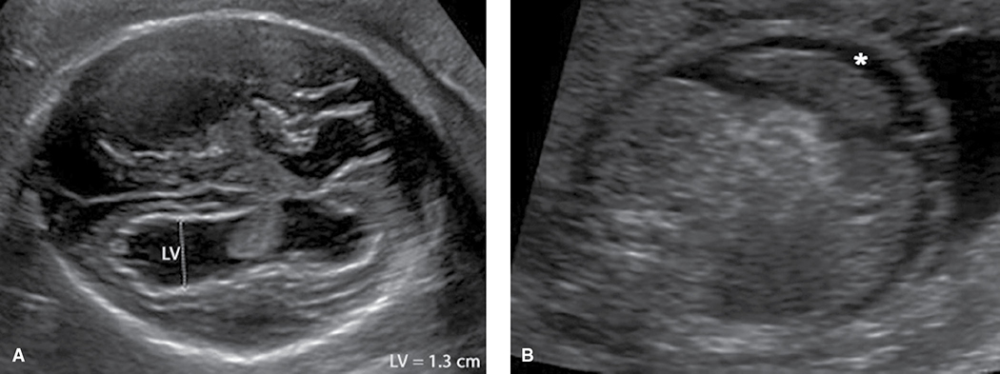
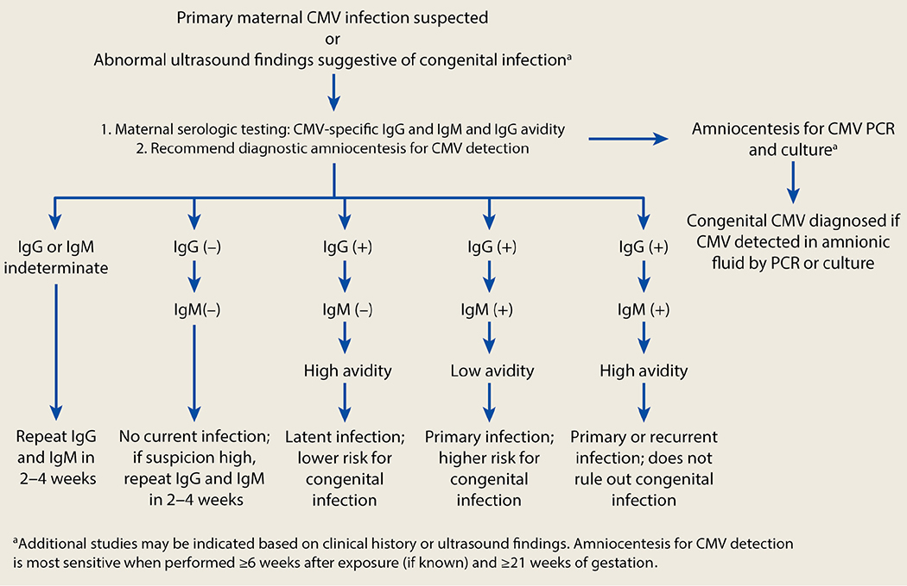
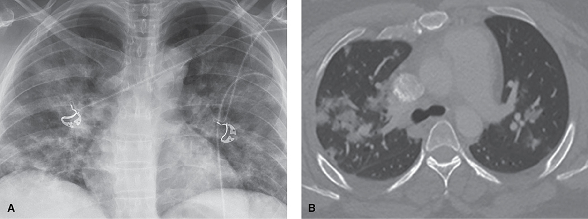
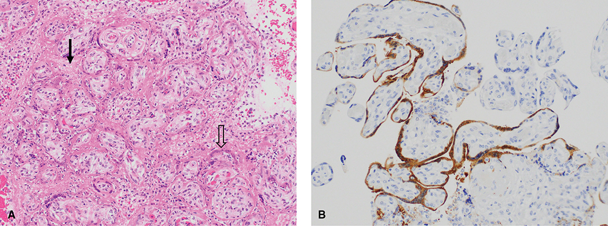
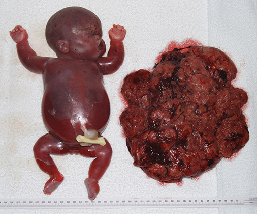
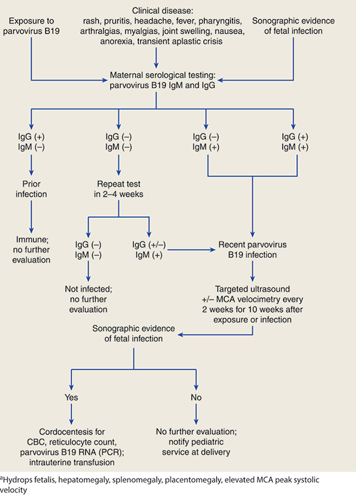
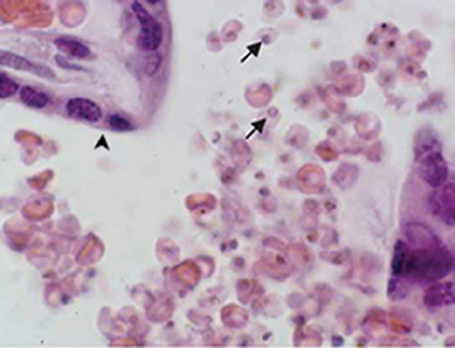

# Chapter 67: Infectious Diseases — Revision Notes

> Williams Obstetrics 26e, pp. 3077–3138 of the PDF. High-yield numbers are in **bold**.
> The three tables are transcribed from the PDF images (they are missing from the extracted chapter text). All 7 figures are included from the PDF.

**Big picture:** Outcome of infection in pregnancy depends on **maternal serological status, route of acquisition, gestational age at infection and immune status** of mother and fetus. **TORCH** = **T**oxoplasmosis, **O**thers (e.g., parvovirus B19), **R**ubella, **C**MV and **H**erpesvirus; these cross the placenta and cause major neonatal sequelae. Herpes and syphilis are in Ch 68.

---

## 1. Maternal and Fetal Immunology

### Maternal immunological changes
- Fetal tolerance = interplay of **innate and adaptive** immunity.
  - **Decidual NK (dNK) cells** aid extravillous trophoblast invasion via **HLA-G**; viral cytokines activate dNK cytotoxicity.
  - **Regulatory T cells (Tregs; CD4⁺, FOXP3⁺)** induce maternal tolerance of the fetus, **but weaken defense against bacteria**.
  - Noncoding microRNAs regulate innate and adaptive immune cells.
- **Horizontal transmission** = person to person. **Vertical transmission** = mother to fetus via **placenta, labor/delivery or breastfeeding**. PROM or prolonged labor ↑ some neonatal infections.
- **Secondary attack rate** = probability that a susceptible contact becomes infected after known exposure.

### Table 67-1. Specific Causes of Some Fetal and Neonatal Infections

| Timing / route | Agents |
|---|---|
| **Intrauterine — transplacental** | **Viruses:** varicella-zoster, coxsackie, rubella, CMV, human parvovirus B19, HIV, Zika, SARS-CoV-2. **Bacteria:** *Listeria*, syphilis, *Borrelia*. **Protozoa:** toxoplasmosis, malaria |
| **Intrauterine — ascending infection** | **Bacteria:** GBS, coliforms. **Viruses:** HIV |
| **Intrapartum — maternal exposure** | **Bacteria:** gonorrhea, chlamydia, GBS, tuberculosis, mycoplasmas. **Viruses:** HSV, HPV, HIV, hepatitis B, hepatitis C, Zika |
| **Intrapartum — external contamination** | **Bacteria:** staphylococcus, coliforms. **Viruses:** HSV, varicella zoster |
| **Neonatal — human transmission** | Staphylococcus, HSV, influenza, SARS-CoV-2 |
| **Neonatal — respirators and catheters** | Staphylococcus, coliforms |

*CMV = cytomegalovirus; GBS = group B Streptococcus; HIV = human immunodeficiency virus; HPV = human papillomavirus; HSV = herpes simplex virus; SARS-CoV-2 = severe acute respiratory syndrome coronavirus-2.*

### Fetal and newborn immunology
- Fetal innate and adaptive immunity develop by **9–15 wk**; the fetal response is mainly **innate** (macrophages, dendritic cells).
- **Passive immunity = maternal IgG** across the placenta: rises rapidly from **16 wk**; **fetal = maternal levels by 26 wk**. Maternal vaccination also primes fetal cell-mediated immunity.
- **Neonatal sepsis is subtle:** depressed and acidotic at birth, poor sucking, vomiting, abdominal distention, respiratory insufficiency (mimics RDS), lethargy or jitteriness, **hypothermia rather than fever**, **low WBC and neutrophil counts**.

---

## 2. Viral Infections

### Cytomegalovirus (CMV)
- **Most common perinatal infection in the developed world.** Ubiquitous **DNA herpesvirus**; fetal infection evidence in **0.2–2.2%** of all neonates.
- Spread by all body fluids (saliva, semen, urine, blood, nasopharyngeal and cervical secretions). **Day-care centers** are a frequent source. Neonate infected at delivery or by breastfeeding.
- **Amniocentesis does not cause iatrogenic fetal infection.**
- Seropositive by pregnancy: **up to 85%** (lower income) vs **~50%** (higher income).
- Latent with periodic **reactivation and shedding** despite high IgG. **IgG does not prevent recurrence, reactivation or reinfection**, nor fully prevent fetal infection.

**Maternal infection**
- Pregnancy does **not** ↑ risk or severity.
- Mostly **asymptomatic**; **10–15%** get a **mononucleosis-like illness** (fever, pharyngitis, lymphadenopathy, polyarthritis). Often ↑ aminotransferases or lymphocytosis.
- Immunocompromised: myocarditis, pneumonitis, hepatitis, retinitis, gastroenteritis, meningoencephalitis.
- Detected by **IgG seroconversion** (up to **20%** in pregnancy).
- **Highest fetal risk = primary infection in a previously seronegative woman.**

| Maternal infection | Vertical transmission |
|---|---|
| **Primary, 1st trimester** | **30–36%** |
| **Primary, 2nd trimester** | **34–40%** |
| **Primary, 3rd trimester** | **40–72%** |
| **Recurrent / reactivated** | **0.15–2%** |

- **~23%** of US congenital CMV follows primary infection, but in high-prevalence areas **up to 90%** of infected neonates are born to women with **recurrent** infection.

**Congenital infection**
- **Symptomatic congenital CMV:** FGR, **microcephaly**, **intracranial (periventricular) calcifications**, **chorioretinitis**, mental and motor delay, **sensorineural hearing loss**, hepatosplenomegaly, jaundice, hemolytic anemia, **thrombocytopenic purpura**.
- Only **5–10%** of ~40,000 infected neonates/yr have the syndrome. Most are asymptomatic but some develop **late sequelae** (hearing loss, neurological deficits, chorioretinitis, psychomotor delay, learning disability).
- Dichorionic twins: usually **nonconcordant**.

*Figure 67-1. Congenital CMV on sonography: (A) ventriculomegaly with periventricular calcifications; (B) fetal ascites and echogenic bowel.*

**Prenatal diagnosis**
- ⚠️ **Routine CMV screening is not recommended.** Test if **mononucleosis-like illness** or **sonographic findings** suggest infection.
- **IgM alone is unreliable** (persists >1 yr; rises with reactivation/reinfection).
- **IgG avidity:** low avidity matures to high over **2–4 months**.
  - **Low avidity → primary infection within 3–4 months.**
  - **High avidity → excludes primary infection within 3 months** (so avidity done in the 2nd–3rd trimester can't exclude 1st-trimester infection).
- Very recent infection may be IgM-negative → **repeat in 2–4 wk** if suspicion is high.
- **Sonographic findings:** microcephaly, ventriculomegaly, cerebral calcifications; ascites, hepatosplenomegaly, **hyperechoic bowel**; hydrops; **early FGR**; oligohydramnios.
- **Amnionic fluid CMV PCR = gold standard** (sensitivity **70–99%**). Best **≥6 wk after maternal infection and after 21 wk**. Negative PCR doesn't exclude infection; repeat if suspicion is high. Culture is somewhat less sensitive (shell vial: result in 24 h).
- **Abnormal sonography + positive amnionic fluid → ~75% risk of symptomatic congenital infection.**

*Figure 67-2. CMV algorithm: IgG+/IgM+ with low avidity = primary infection (highest risk); high avidity = latent or recurrent; amniocentesis PCR ≥6 wk after exposure and ≥21 wk.*

**Management and prevention**
- Immunocompetent women: **symptomatic treatment** only. Offer **amniocentesis** for primary infection or suggestive sonography.
- **Counseling by GA:** hearing loss or neurodevelopmental delay in **15–25%** after 1st-trimester primary infection vs **2–16%** after 2nd-trimester infection. Most fetuses develop normally; termination is an option for some.
- **No curative treatment:**
  - **High-dose valacyclovir 8 g/d** → better outcome in 80% of moderately affected fetuses (vs historical controls).
  - **Neonatal oral valganciclovir × 6 wk** for symptomatic CNS disease → prevents hearing deterioration.
  - ⚠️ **CMV hyperimmune globulin was ineffective** (RCT).
- Affected fetus: detailed anatomy scan, **MFM referral**, serial sonography (**FGR, oligohydramnios, hydrops = worse prognosis**). **Aim for term delivery.**
- **Prevention:** avoid primary infection early in pregnancy → **hand washing, no sharing food/utensils** (toddlers in day care). Vaccines in trials.

### Varicella-zoster virus (VZV)

**Maternal infection**
- **dsDNA herpesvirus**; **90% of adults immune**. Vaccination ↓ incidence **~95%**. Maternal varicella **1.21 per 10,000** pregnancy admissions.
- Spread by **respiratory droplets** or direct contact. **Incubation 10–21 days**; nonimmune attack rate **70–90%**.
- 1–2-day prodrome → pruritic vesicles that **crust in 3–7 days**. **Contagious from 1 day before the rash until all lesions crust.**
- **VZV pneumonia** in **2.5%** of gravidas; appears **3–5 days** into illness: fever, tachypnea, dry cough, dyspnea, pleuritic pain, nodular infiltrates. Risk factors: immunosuppression, early bacterial coinfection. Pulmonary function may stay impaired for weeks.
- **Herpes zoster (shingles)** = reactivation; unilateral dermatomal painful rash. **Not more frequent or severe in pregnancy**; rarely causes congenital varicella. Contagious via broken blisters.

**Fetal and neonatal infection**
- **Congenital varicella syndrome** (primary infection in the **first half** of pregnancy): **chorioretinitis, microphthalmia, cortical atrophy, FGR, hydronephrosis, limb hypoplasia, cicatricial skin lesions**.

| Maternal rash timing | Congenital varicella |
|---|---|
| **<13 wk** | **0.4%** |
| **13–20 wk** (highest risk) | **2%** |
| **>20 wk** | **No clinical evidence** (rare 3rd-trimester CNS/skin cases) |

- ⚠️ **Peripartum exposure** (before maternal antibody forms): neonatal attack rate **25–50%**, **mortality ~30%** (disseminated visceral/CNS disease).
  - → **Give VariZIG to neonates of mothers with varicella from 5 days before to 2 days after delivery.**

**Diagnosis**
- Prior immunity: history of illness or vaccination.
- Active infection: **PCR of vesicular fluid or a lifted crust**.
- Amnionic fluid PCR: positive result correlates poorly with congenital disease. Detailed sonography **≥5 wk after infection** (low sensitivity).

**Management**
- Isolate varicella/zoster patients from pregnant women.
- **Exposed gravida with no history of chickenpox or vaccination → VZV serology** (**≥70%** are immune).
- **Seronegative → VariZIG IM 125 units/10 kg, max 625 units (5 vials)**; best **within 96 h**, approved **up to 10 days**. Highly effective.
- History of chickenpox or vaccination → **VariZIG not indicated**.

| Situation | Treatment |
|---|---|
| **Hospitalized (esp. pneumonia)** | **Acyclovir 10–15 mg/kg IV q8h until afebrile**, then **oral 800 mg 5×/d** to complete **7 days** and until lesions crust |
| **Uncomplicated varicella (outpatient) or zoster** | **Oral acyclovir 800 mg 5×/d × 7 days** |

- **Chest radiograph** for primary varicella is recommended by many (pneumonia may be subtle).
- Affected fetus: more surveillance, serial growth scans; **term delivery** is usual.

**Vaccination**
- **Live attenuated**; **2 doses 4–8 wk apart** for nonimmune nonpregnant adolescents/adults.
- ⚠️ **Not in pregnancy**; avoid pregnancy for **1 month after each dose**. Registry (>1000 exposures): **no congenital varicella** or malformations.
- **Not secreted in breast milk** → **vaccinate postpartum even if breastfeeding**.

### Influenza
- Influenza A and B (Orthomyxoviridae, RNA). Influenza A subtyped by **hemagglutinin (H) and neuraminidase (N)**.
- Fever, dry cough, systemic symptoms. **Pregnant women are more prone to serious (pulmonary) complications.**
- **2009–2010 pandemic: maternal mortality 1%**, **12% of pregnancy-related deaths**.
- **No firm link with malformations**; ↑ NTDs may reflect **hyperthermia**. Viremia infrequent; transplacental passage rare. Stillbirth, preterm birth, abortion correlate with **illness severity**.
- **Diagnosis:** nasopharyngeal swab. **Molecular tests** (incl. multiplex influenza/SARS-CoV-2) are more accurate than **RIDTs (sensitivity 50–70%)**.
- ⚠️ **Don't delay antivirals awaiting test results.**

**Treatment**

| Agent | Route / use |
|---|---|
| **Oseltamivir** | Oral; treatment and prophylaxis. **Most experience in pregnancy** |
| Zanamivir | Inhaled; treatment |
| Peramivir | IV |
| Baloxavir marboxil | Approved 2018; limited pregnancy data |

- **Treatment: oseltamivir 75 mg orally twice daily × 5 days**, ideally **within 48 h** of symptom onset (↓ hospital stay).
- **Postexposure prophylaxis: oseltamivir 75 mg once daily × 7 days.**
- Add antibacterials if secondary bacterial pneumonia is suspected.

**Vaccination**
- **All women pregnant during flu season (October–March)**; ideally **before the end of October**. Especially with diabetes, heart disease, asthma, HIV.
- **↓ Influenza hospitalizations by 40%** in pregnant women. **No teratogenicity.** Infants protected from lower respiratory infection for **3 months**.
- **Inactivated or recombinant** vaccines are fine; ⚠️ **live attenuated intranasal vaccine is not recommended**.
- Can be given with **COVID-19 and Tdap** vaccines.

### Coronaviruses
- ssRNA; 7 infect humans (4 cause colds). Three zoonotic: **SARS-CoV, MERS-CoV, SARS-CoV-2**.

| Virus | Pregnancy data |
|---|---|
| **SARS-CoV (2003)** | 12 gravidas: all atypical pneumonia, **33% ventilated**, **80% preterm** if diagnosed >24 wk, **maternal fatality 25%**, no vertical transmission |
| **MERS-CoV (2012)** | Respiratory, AKI, GI illness; **mortality 40%** in a small series |

### SARS-CoV-2 (COVID-19)
- Pandemic from late 2019; adult mortality **1–2%** (rises steeply with age). More infectious but less deadly than SARS/MERS. **Delta variant** → possibly more severe disease in gravidas.
- Mainly **respiratory droplets**; **asymptomatic/presymptomatic people cause 40–50%** of transmissions → masking, distancing.

**Maternal infection**
- Symptoms **same as nonpregnant**. **Incubation ~5–14 days** → fever, cough, myalgia. **Anosmia/ageusia in >half.** GI symptoms less common.
- Lower respiratory disease ~**8 days** after onset. Worsening: dyspnea, tachypnea, ↓ SpO₂, rarely ARDS.
- Imaging: **multifocal peripheral opacities; ground-glass on CT**.
- Pregnancy may ↑ risk of **ICU admission, invasive ventilation and death**. Parkland: **5%** of infected gravidas had severe/critical illness (**diabetes** a possible risk factor).
- Not linked to adverse outcomes overall, but **severe illness → more preterm birth** (**13% vs 10%** population).

*Figure 67-3. Critical COVID-19 at 26 wk: (A) bilateral peripheral opacities; (B) CT peripheral consolidations and ground-glass opacities.*

**Fetal infection**
- **Placental infection occurs but fetal transmission is rare.** Placenta: ↑ perivillous fibrin, **trophoblast necrosis**, histiocytic inflammation.
- Neonatal infection in **3%** tested at 24 and 48 h. **No transmission via breast milk.**
- Infected newborns **need not be separated from the mother**, but are isolated from the general nursery.

*Figure 67-4. Placental SARS-CoV-2: (A) perivillous fibrin and trophoblast necrosis; (B) viral nucleocapsid staining in villous trophoblast.*

**Diagnosis**
- **RT-PCR** (viral RNA) or **rapid antigen** (less sensitive if asymptomatic) on nasopharyngeal, nasal or saliva specimens. **IgG serology** is for epidemiology, not acute diagnosis.

**Management**
- **Mild–moderate:** supportive; **deliver for obstetric indications**.
- Mild illness + high risk (pregnancy counts): **monoclonal antibodies within 10 days** of onset (variant-dependent), with specialists.
- **Moderate:** consider admission (**up to 40% worsen**).
- **Severe/critical:** respiratory support to keep **SpO₂ ≥95%**; **prone positioning** described; manage comorbidities; coordinate delivery.
- **Dexamethasone 6 mg daily for up to 10 days** if on oxygen or ventilation (↓ 28-day mortality, RECOVERY).
- **Remdesivir** (IV) shortens recovery on low-flow oxygen; in gravidas, no serious adverse events but **↑ aminotransferases** common.
- Antibiotics only for suspected bacterial coinfection.

**Prevention**
- Masking, **≥6 feet** distance, hand hygiene; airborne and contact precautions for procedures.
- **ACOG/SMFM: vaccinate pregnant and lactating women.** mRNA vaccine ↓ COVID-19 in pregnancy. Expected reactions: injection-site pain, headache, fatigue, myalgia, low-grade fever. **No ↑ miscarriage.**

### Mumps
- RNA paramyxovirus: salivary glands ± gonads, meninges, pancreas. Contact with secretions, saliva, fomites. Most transmission **before and within 5 days of parotitis** → droplet isolation.
- **Not more severe in pregnancy.** 1st-trimester infection → **↑ spontaneous abortion**; **no malformations**; fetal infection rare.
- **MMR (live) is contraindicated in pregnancy** (fetal risk theoretical); **avoid pregnancy 30 days** after. Third MMR dose in outbreaks (nonpregnant). **Vaccinate postpartum**; breastfeeding OK.

### Measles (rubeola)
- Highly contagious RNA paramyxovirus; humans only. **Secondary attack rate >90%.** Outbreaks late winter–spring; epidemics every 2–5 yr.
- Fever, **coryza, conjunctivitis, cough**; **Koplik spots** (white lesions with red halo on buccal mucosa); maculopapular rash **face and neck → trunk → extremities**.
- **Diagnosis:** serum **measles IgM**; RT-PCR of throat/NP swab or urine.
- Treatment supportive; look for secondary infection.
- **Nonimmune exposed gravida → IVIG 400 mg/kg within 6 days.**
- ↑ **Pregnancy loss, pneumonia and death**. Measles shortly before delivery → **neonatal prophylaxis**.
- MMR not given in pregnancy, but **inadvertent MMR is not an indication for termination**. Vaccinate postpartum.

### Rubella (German measles)
- RNA **togavirus**; minor illness outside pregnancy. Nasopharyngeal spread; **80%** transmission to nonimmune people.
- US endemic transmission **eliminated in 2004**, but **up to 10%** of women are susceptible; imported cases occur.
- **Incubation 12–23 days**; mild fever; maculopapular rash **face → trunk and limbs**; arthralgia/arthritis, **head and neck lymphadenopathy**, conjunctivitis.
- **25–50% asymptomatic.** Viremia precedes signs by ~1 wk; **infectious during viremia and for 7 days after the rash**.

**Diagnosis**
- Virus isolated from urine, blood, nasopharynx, CSF up to 2 wk after rash; usually **serology**.
- **IgM (ELISA)** from **4–5 days** after onset, persists **up to 6 wk** after rash. ⚠️ **Reinfection → transient low IgM** (no fetal harm described); false-positive IgM in low-prevalence populations.
- **IgG peaks 1–2 wk** after rash. **High-avidity IgG → infection ≥2 months earlier.**

**Fetal effects** — rubella is **one of the most complete teratogens**

| GA at maternal rash | Fetus affected |
|---|---|
| **First 12 wk** | **Up to 90%** |
| **13–14 wk** | **50%** |
| **End of 2nd trimester** | **25%** |
| **>20 wk** | Defects **rare** |

- **Congenital rubella syndrome:** **cardiac septal defects, pulmonary stenosis**, microcephaly, **cataracts**, microphthalmia, hepatosplenomegaly; also **sensorineural deafness**, intellectual disability, neonatal purpura, **radiolucent bone disease**.
- Infected newborns **shed virus for months** (a risk to other infants and susceptible adults).

> **Memory hook:** Congenital rubella = "**C**ataracts, **C**ardiac (septal defects, pulmonary stenosis), **C**ochlear (deafness)."

**Management and prevention**
- No specific treatment. **Droplet precautions for 7 days** after rash onset. **IVIG within 5 days** of exposure may help.
- Maternal rubella → **targeted sonography**, **MFM referral**; anomalies or FGR → **amniocentesis for rubella PCR** (and other infections).
- **Prenatal rubella serology for all pregnant women**; nonimmune → **MMR postpartum**.
- Vaccinate nonimmune nonpregnant women and **susceptible hospital staff**. **Avoid MMR 1 month before and during pregnancy** (theoretical risk); **inadvertent vaccination is not an indication for termination**.

### Parvovirus B19
- **Erythema infectiosum (fifth disease).** Small **ssDNA** virus replicating in **erythroid precursors** → **fetal anemia** (main fetal effect). **Aplastic crisis** with ↑ RBC turnover (e.g., sickle cell).
- Spread by **respiratory secretions** (also transfusion, organ donation); late winter–spring. Highest risk: **mothers of school-aged children, day-care workers**.
- Viremia **4–14 days** after exposure; rash a few days later. ⚠️ **No longer infectious once the rash appears.**
- **~40% of adult women susceptible**; annual seroconversion **1–2%**; secondary attack rate **~50%**.

**Maternal infection**
- **20–30% asymptomatic.** Others: fever, headache, flu-like symptoms late in viremia → **"slapped-cheek" facial rash** → lacy rash on trunk and limbs. Adults: milder rash, **symmetrical polyarthralgia** for weeks. Pregnancy does not alter the illness.
- **IgM** from **7–10 days**, lasts **3–4 months**; **IgG** a few days later, **lifelong**.

**Fetal infection**
- **Vertical transmission in up to ⅓.** Abortion, **nonimmune hydrops**, stillbirth.
- **Fetal loss: 8–17% before 20 wk; 2–6% after midpregnancy.**
- **Hydrops in ~4%** of infected gravidas, yet parvovirus is the **most frequent infectious cause of nonimmune hydrops** at autopsy.
  - Usually after infection in the **first half** of pregnancy; **>80% within 10 wk** of maternal infection (mean **6–7 wk**).
  - **Critical window 13–16 wk** (peak fetal **hepatic hemopoiesis**).
- ⚠️ **No screening of asymptomatic mothers** or routine testing of stillborns.

*Figure 67-5. Parvovirus B19: stillborn hydropic fetus with a characteristically large placenta.*

**Diagnosis and management**
- **Maternal IgG and IgM serology.** Maternal serum PCR can stay positive for months to years.
- **Fetal infection: B19 DNA by PCR in amnionic fluid.** Viral loads don't predict outcome.
- Recent infection → **sonography (± MCA Doppler) every 2 weeks for 10 weeks**.
- **MCA-PSV suggesting anemia → fetal blood sampling + intrauterine transfusion.**
  - Untransfused hydrops: mortality **up to 30%**.
  - **Transfused: 94% of hydrops resolves in 6–12 wk; mortality <10%.** Usually **one transfusion** suffices (marrow recovers).
- **Long-term:** abnormal neurodevelopment in **32%** (5/16 survivors) in one series, **11%** in another; possibly direct viral brain injury, not anemia severity.

*Figure 67-6. Parvovirus B19 algorithm: IgM+ = recent infection → sonography ± MCA Doppler every 2 wk for 10 wk; fetal signs → cordocentesis and transfusion.*

**Prevention and counseling**
- **No vaccine; no antiviral** recommended.
- **Infection risk after exposure:**

| Exposure | Risk |
|---|---|
| Casual, infrequent | **~5%** |
| Intense, prolonged work exposure (**teachers**) | **~20%** |
| **Close, frequent (household)** | **~50%** |

- Day-care/school workers **need not avoid infected children** (infectivity peaks before illness); infected children **need no isolation**.

> **Memory hook:** Parvovirus exposure risk "**5–20–50**": casual, classroom, close household.

### Other respiratory viruses
- More than 200 viruses. **Adenovirus (DNA)** → more cough and **pneumonia**. Rhinovirus, respiratory enterovirus, common coronavirus → trivial colds.
- **EV-D68** → outbreaks and **acute flaccid myelitis** in children.
- Low teratogenic risk. Amnionic fluid viral PCR positive in **6.5%** (adenovirus most common) → associated with FGR, **nonimmune hydrops**, hand/foot anomalies, NTDs. Adenovirus causes **fetal myocarditis** and hydrops.

### Other enteroviruses
- RNA **picornaviruses**: coxsackie, polio, echovirus (hepatitis A → Ch 58). Most maternal infections subclinical, but can be **fatal to the fetus–neonate**.
- **Coxsackie** (usually **group B** when symptomatic): aseptic meningitis, polio-like illness, **hand-foot-mouth disease**, rash, pleuritis, pericarditis, **myocarditis**. No treatment or vaccine.
  - Transmitted at delivery in **up to half** of mothers who seroconvert; transplacental → neonatal skin lesions, **myocarditis**, pneumonia, encephalitis. Possibly ↑ cardiac anomalies, LBW, preterm, FGR.
- **Polio:** gravidas are **more susceptible with higher mortality**; perinatal transmission mainly with 3rd-trimester infection. **Inactivated (SC) polio vaccine** for susceptible gravidas traveling to endemic areas. Oral live vaccine has been used in mass campaigns without fetal harm.

### Mosquito-borne viruses

**West Nile virus**
- RNA **flavivirus**; **most common arthropod-borne disease in the US**. Mosquito bite (rarely blood/organs). Incubation **2–14 days**; mostly mild or asymptomatic.
- **<1%** develop meningoencephalitis or **acute flaccid paralysis**.
- Dx: serum IgG/IgM and **CSF IgM**. Supportive care only.
- **Prevention: DEET repellent (safe in pregnancy)**, avoid outdoors/stagnant water, protective clothing.
- Registry: **no ↑ miscarriage, preterm birth or malformations** (one case of chorioretinitis and leukomalacia). Breastfeeding safe.

**Zika virus**
- RNA flavivirus; **first major mosquito-borne teratogen**. Also **sexual transmission**; persists in body fluids for months. No active transmission reported as of 2020.
- **~80% of adults asymptomatic**; mild rash, fever, headache, arthralgia, **conjunctivitis**.
- **Fetus can be severely affected whether or not the mother has symptoms.** Fetal mortality **7%**; birth defects **5–15%** after 1st-trimester exposure.
- **Congenital Zika syndrome:** **microcephaly**, lissencephaly, ventriculomegaly, **intracranial calcifications**, ocular anomalies, **congenital contractures**.
- **Testing only for symptomatic gravidas** with residence/travel in areas with dengue transmission and Zika risk. **Within 12 wk of symptoms → serum and urine PCR for dengue and Zika RNA.** Sonographic findings → Zika PCR + IgM on serum and urine; amnionic PCR of uncertain value.
- No treatment or vaccine. Prevention: nets, insecticide, **DEET**, **avoid sex with recently exposed partners**.

### Ebola virus
- RNA **filovirus**; direct person-to-person contact → hemorrhagic fever, immunosuppression, **DIC**. Supportive care.
- **~50% mortality** (pregnant = nonpregnant); **universally poor fetal/neonatal outcome**. Pregnancy does **not** ↑ susceptibility.
- Virus persists in **"sanctuary sites"** (eyes, gonads).
- **rVSV-ZEBOV** live vaccine (2019): 84 inadvertent early-pregnancy exposures → no ↑ loss or anomalies.

---

## 3. Bacterial Infections

### Group A Streptococcus (*S. pyogenes*)
- **Most frequent bacterial cause of acute pharyngitis**; also scarlet fever, erysipelas. **Penicillin**; same treatment as nonpregnant.
- Pyrogenic exotoxin–producing strains → severe disease.
- Infrequent puerperal infection in the US, but **the most common cause of severe postpartum infection and death worldwide**, and rising (Ch 37).

### Group B Streptococcus (*S. agalactiae*)
- Colonizes the GI and genitourinary tract in **10–25%** of gravidas; isolation is **transient, intermittent or chronic**.

**Maternal and perinatal infection**
- Maternal: **bacteriuria, pyelonephritis**, osteomyelitis, postpartum mastitis, puerperal infection. Can breach cervical mucus → **ascending infection**: preterm labor, PROM, chorioamnionitis, fetal infection, stillbirth.
- **Leading infectious cause of neonatal morbidity and mortality in the US.**

| | Early-onset disease | Late-onset disease |
|---|---|---|
| Definition | **<7 days** (many use **<72 h** = intrapartum acquisition) | **1 wk – 3 months** |
| Presentation | **Sepsis within 6–12 h**: respiratory distress, apnea, hypotension (must be distinguished from surfactant-deficient RDS) | **Meningitis** |
| Frequency | **3 → 0.25 per 1000** after widespread prophylaxis | **0.28 per 1000** |
| Mortality | **~4%**; preterm infants disproportionately affected | Lower than early-onset |

- Survivors of both often have **devastating neurological sequelae**.
- **Intrapartum antibiotics are the main prevention of early-onset (not late-onset) disease.**

### Table 67-2. Indications for Intrapartum Group B Streptococcal Infection Prophylaxisᵃ

| Intrapartum Prophylaxis Indicated | Intrapartum Prophylaxis Not Indicated |
|---|---|
| **GBS bacteriuria** | Negative vaginal–rectal culture obtained at **≥36 weeks'** gestation during current pregnancy |
| **Previous infant with invasive GBS disease** | **Cesarean delivery before labor onset or membrane rupture**, regardless of GBS status or gestational age |
| **Positive GBS screening culture** during current pregnancy (unless cesarean delivery is performed before labor onset and with intact membranes) | Negative vaginal–rectal GBS culture in late gestation during the current pregnancy, regardless of intrapartum risk factors |
| **Unknown GBS status at labor onset and any of the following:** | Unknown GBS status and intrapartum NAAT result negative and no intrapartum risk factors present |
| — Birth at **<37 0/7 weeks'** gestation | |
| — Membrane rupture **≥18 hr** | |
| — Intrapartum temperature **≥100.4°F (38.0°C)** | |
| — Intrapartum NAAT result positive for GBS | |
| — Positive GBS status in prior pregnancy | |

*ᵃPerform vaginal and rectal GBS culture at 36–38 weeks' gestation for all pregnant women, unless intrapartum antibiotic prophylaxis is indicated for the current pregnancy based on bacteriuria or prior infant with invasive GBS disease. GBS = group B Streptococcus; NAAT = nucleic acid amplification test.*

**Culture-based prevention (ACOG)**
- **Universal vaginal–rectal culture at 36–38 wk**, then intrapartum prophylaxis for carriers.
- **Selective enrichment broth** then subculture improves detection. Test for **inducible clindamycin resistance** if penicillin-allergic. Consider **antenatal penicillin-allergy testing** in colonized women at high risk of anaphylaxis.
- ⚠️ **53%** of neonates with early-onset GBS were born to mothers with **negative** antenatal screens.
- **GBS in urine:**
  - **≥10⁵ cfu/mL → treat as asymptomatic bacteriuria** (prevents pyelonephritis) **and give intrapartum prophylaxis**.
  - **<10⁵** → no antepartum antibiotics, but **still give intrapartum prophylaxis**.
  - Parkland treats **unspeciated gram-positive cocci** in urine as presumptive GBS.

**Risk-based prevention**
- For women in labor with **unknown GBS status** (Table 67-2 criteria).
- **Parkland uses the risk-based approach** + **aqueous penicillin G 50,000–60,000 units IM** in the delivery room to all term neonates whose mothers didn't get prophylaxis → early-onset sepsis rates similar to national data.

**Nucleic acid testing:** ~20% of labs offer GBS PCR; rapid intrapartum point-of-care PCR evaluated. Limits: **cost** and **no antibiotic sensitivities**.

**Vaccine:** capsular antibody correlates with protection, but serotype diversity and **serotype switching** → **none available**.

### Table 67-3. Regimens for Intrapartum Antimicrobial Prophylaxis for Perinatal GBS Disease

| Regimen | Treatmentᵃ |
|---|---|
| **Recommended** | **Penicillin G, 5 million units IV initial dose, then 2.5 to 3.0 million units IV every 4 hr** |
| **Alternative** | **Ampicillin, 2 g IV initial dose, then 1 g IV every 4 hr or 2 g every 6 hr** |
| **Penicillin allergic** | |
| Patients not at high risk for anaphylaxis | **Cefazolin, 2 g IV initial dose, then 1 g IV every 8 hr** |
| Patients at high risk for anaphylaxis and with GBS resistant to clindamycin or susceptibility unknown | **Vancomycin, 1 g IV every 12 hr or 20 mg/kg IV every 8 hr** with a maximum of 2 g per single dose |
| Patients at high risk for anaphylaxis and with GBS susceptible to clindamycin | **Clindamycin, 900 mg IV every 8 hr** until delivery |

*ᵃFollowing initial dose, subsequent doses are continued until delivery. GBS = group B Streptococcus; IV = intravenous.*

- **Penicillin first line**; ampicillin acceptable. **Erythromycin is no longer used.**
- High anaphylaxis risk (or Stevens-Johnson) → susceptibility testing for erythromycin and clindamycin; **clindamycin-sensitive but erythromycin-resistant → test for inducible clindamycin resistance**; resistance → **vancomycin**.
- **Preterm labor, threatened preterm delivery or PPROM → obtain GBS culture and start prophylaxis until results return.**
- ⚠️ **Planned cesarean before labor with intact membranes → no GBS prophylaxis**, regardless of colonization or GA.

> **Memory hook:** GBS risk factors if status unknown: "**37 – 18 – 38**" = <**37** wk, ROM ≥**18** h, temp ≥**38**.0°C.

### Methicillin-resistant *Staphylococcus aureus* (MRSA)
- *S. aureus* = most virulent staphylococcus; colonizes nares, skin, genitals, oropharynx. **~30%** of adults carry *S. aureus*; **MRSA colonizes 2%**. **Colonization is the greatest risk factor for infection.**
- **CA-MRSA:** diagnosed outpatient or **within 48 h** of admission in someone without health-care exposure in the past year. **Most pregnancy cases are CA-MRSA** (lower socioeconomic groups).
- **Presentations:** **skin and soft-tissue infection (most common)**; **mastitis/breast abscess in up to ¼**; perineal/episiotomy abscess, surgical-site infection; rare placental abscess, chorioamnionitis, osteomyelitis, spinal epidural abscess.
- **Vertical transmission is rare**; newborn colonization comes from mother/staff near delivery.

**Management**
- Superficial: **incision and drainage + wound care**; adding antibiotics helps even for small abscesses. Severe, refractory, or comorbid → MRSA-active antibiotics. **Purulent cellulitis → empiric MRSA cover.**

| Drug | Use in pregnancy |
|---|---|
| **TMP-SMX, clindamycin** | Most CA-MRSA strains sensitive |
| **Vancomycin** | **First line for serious inpatient infection** |
| Rifampin | ⚠️ Never monotherapy (rapid resistance) |
| Linezolid | Effective, expensive, little pregnancy data |
| **Doxycycline, minocycline, tetracyclines** | ⚠️ **Avoid in pregnancy** |

- Prevention: hand hygiene, avoid skin-to-skin contact. **Routine MRSA screening is not recommended.** Decolonization ineffective in the general obstetric population.
- Parkland: known MRSA colonization/infection → **add one dose of vancomycin** to β-lactam prophylaxis for **cesarean and deep perineal lacerations**.
- **Breastfeeding allowed** with good hygiene.

### Listeriosis
- *Listeria monocytogenes*: facultative **intracellular gram-positive bacillus**; 100–200 hospitalizations/yr in the US; **foodborne** (dairy, fruit/vegetables, undercooked/processed meats, **deli foods**).
- **Pregnancy: 10–20× more common** (↓ cell-mediated immunity).
- **Incubation 2–4 wk.** Febrile gastroenteritis, sepsis, CNS infection. In pregnancy may be asymptomatic or mimic **influenza, pyelonephritis, meningitis**; diagnosis usually from **positive blood cultures**. Can trigger **labor**.
- **Transplacental fetal infection** → stillbirth or illness like early-onset GBS sepsis. **Granulomatosis infantiseptica** = disseminated microabscesses and granulomas. Chorioamnionitis common; **placental macroabscesses**.

| Outcome | Rate |
|---|---|
| Abortion or stillbirth (222 cases) | **20%** |
| Neonatal sepsis in survivors | **68%** |
| Fetal loss (prospective cohort) | **24%** (none after 29 wk) |
| Neonatal case fatality | **21%** |

- **Treatment: ampicillin + gentamicin** (synergy). **Penicillin allergy → TMP-SMX.** Maternal treatment usually treats the fetus too.
- No vaccine. **Prevention:** wash raw vegetables, cook raw food, avoid implicated foods.

### Salmonellosis
- **Nontyphoid** (*typhimurium, enteritidis*): contaminated food → nonbloody diarrhea, pain, fever, N/V **6–48 h** after exposure. Stool studies.
  - **IV crystalloid rehydration.** ⚠️ **No antibiotics for uncomplicated cases** (no benefit; prolongs carrier state). Give them for **high fever or bacteremia**. Rare septic abortion.
- **Typhoid** (*S. typhi*): contaminated food, water, milk. Complications: GI bleeding 11%, **perforation 9%**, encephalopathy 8%, cardiovascular collapse 7%, renal failure 6%. In pregnancy: epidemics, recent travel; rare septic abortion.
  - **Fluoroquinolones or 3rd-generation cephalosporins** (empirical); tailor to susceptibility; **1–2 weeks**. Typhoid vaccine before travel: no adverse outcomes reported.

### Shigellosis
- **Fecal–oral**; day-care outbreaks, travelers. Mild diarrhea → **dysentery** (fever, bloody stools, cramps, tenesmus). Immunosuppressed: toxic megacolon, seizures, meningitis, **HUS**.
- **Rehydrate**; ⚠️ **avoid antimotility drugs**; meticulous hygiene.
- Antibiotics in pregnancy: **fluoroquinolones, ceftriaxone or azithromycin** (resistance rising → susceptibility testing).
- Can cause **uterine contractions and preterm birth**.

### Lyme disease
- *Borrelia burgdorferi* via **Ixodes ticks**; **most commonly reported US vector-borne illness**.

| Stage | Features |
|---|---|
| **1 — early** | **Erythema migrans** ± flu-like illness, regional adenopathy |
| **2 — early disseminated** (days–weeks) | Skin lesions, **neuropathies**, myalgia, **carditis**, **meningitis** |
| **3 — late/persistent** (months) | **Migratory arthritis** in ~half; chronic phase in ~10% |

- **Clinical diagnosis matters** (serology and PCR have pitfalls). Two-tier testing: IgM/IgG immunoassay → second immunoassay or **western blot**.
- **Treatment of erythema migrans:** **amoxicillin or cefuroxime axetil × 14 days** (doxycycline × 10 days is first line but **usually avoided in pregnancy**). **Azithromycin × 7 days** = second line. Other manifestations: **14–28 days** oral or IV.
- **Prevention:** avoid endemic areas, tick control, **remove unengorged ticks within 36 h**. Tick bite recognized **within 72 h → single 200-mg doxycycline** may prevent infection.
- **Transplacental transmission confirmed, but no proven congenital effects.** Prompt treatment prevents most adverse outcomes.
- **Babesia microti coinfection in 2–40%** (NE US); babesiosis can cause congenital infection.

### Tuberculosis
- See Ch 54.

---

## 4. Protozoal Infections

### Toxoplasmosis
- *Toxoplasma gondii*, obligate intracellular. **Cat = definitive host** (oocysts in feces). Humans (intermediate host) ingest **tissue cysts (bradyzoites)** in raw/undercooked meat or **oocysts** in soil/water → tachyzoites infect all cells → lifelong tissue cysts (chronic form).
- US congenital toxoplasmosis **0.23 per 10,000** live births.

**Maternal and fetal infection**
- Mostly **subclinical**; sometimes flu-like illness with **lymphadenopathy**.
- **Prepregnancy infection (immunocompetent) → virtually no risk of vertical transmission.** Immunocompromised: severe; reactivation → encephalitis, chorioretinitis, mass lesions.
- **Transmission rises with GA, but severity falls:**

| GA at maternal infection | Vertical transmission |
|---|---|
| **13 wk** | **15%** |
| **26 wk** | **44%** |
| **36 wk** | **71%** |

- Early infection → **more severe** congenital disease. ↑ Preterm delivery.
- Most infected newborns look normal. Affected: LBW, hepatosplenomegaly, jaundice, anemia; or neurological disease.
- **Classic triad: chorioretinitis, intracranial calcifications, hydrocephalus** (often with convulsions). Many later develop chorioretinitis and learning disability.

> **Pearl:** CMV calcifications are classically **periventricular**; toxoplasma calcifications are **diffuse** (often with **hydrocephalus**).

**Screening and diagnosis**
- ⚠️ **No routine prenatal screening in low-prevalence areas (US)** (ACOG). Screen **immunocompromised gravidas (incl. HIV)** and women with suspected infection.
- **IgG** appears **2–3 wk** after infection, peaks at **1–2 months**, persists for life. **IgM** appears by **10 days**, usually gone in **3–4 months** but can persist for **years** → **IgM alone doesn't diagnose acute infection**.
- Reference lab: **Toxoplasma Serologic Profile** (Remington Laboratory).
- **High-avidity IgG → excludes infection in the preceding 3–5 months.**
- **Sonographic findings:** hydrocephaly, **intracranial or hepatic calcifications**, ascites, **placental thickening**, hyperechoic bowel, FGR (similar to CMV) → **amniocentesis PCR for toxoplasma and CMV** + maternal serology for both. PCR sensitivity lowest **before 18 wk**.

**Management**

| Drug | Use |
|---|---|
| **Spiramycin** | Acute maternal infection **early in pregnancy** to ↓ vertical transmission. **Does not cross the placenta** → can't treat fetal infection |
| **Pyrimethamine + sulfadiazine + folinic acid** | Maternal infection **after 18 wk** or **suspected fetal infection** |

- Weak evidence that early treatment ↓ congenital toxoplasmosis; treatment linked to fewer serious neurological sequelae and neonatal deaths.

**Prevention** (no vaccine; effectiveness unproven)
1. Cook meat to safe temperatures
2. Peel or thoroughly wash fruit and vegetables
3. Clean surfaces and utensils that touched raw meat or unwashed produce
4. **Gloves for cat litter**, or delegate it
5. Don't feed cats raw meat; keep cats indoors

### Malaria
- 260,000 deaths in 2018, mostly children <5; sub-Saharan Africa and India. Imported cases in travelers, military, immigrants.
- *Anopheles* mosquito; **six Plasmodium species**. **Pregnant women are more susceptible.**
- Antibodies to **VAR2CSA** mediate **placental sequestration** of infected RBCs → **parity-related "pregnancy-specific antimalarial immunity"** (treatment dampens it).

**Maternal and fetal infection**
- Episodic fever, chills, flu-like symptoms; anemia, jaundice. **P. falciparum** → kidney failure, coma, death. Partial immunity in endemic areas → often asymptomatic.
- Symptomatic or not → **stillbirth, preterm birth, LBW, maternal anemia** (anemia and LBW most documented), correlating with **placental parasitemia**.
- **~16% of LBW in Africa** is attributable to malaria.
- **P. falciparum is worst**; early infection → abortion. Incidence ↑ in the **2nd–3rd trimesters and postpartum**.
- **Congenital malaria in <5%** of neonates of infected mothers.

*Figure 67-7. Placental malaria: parasitized erythrocytes (arrows) in the intervillous space beside a chorionic villus (arrowhead).*

**Diagnosis:** **blood smear microscopy = gold standard** (poor with low parasitemia); **rapid antigen tests** are now the diagnostic standard.

**Treatment** (most antimalarials are **not contraindicated** in pregnancy)

| Infection | Treatment |
|---|---|
| Uncomplicated falciparum (WHO, endemic areas) | **Artemisinin-based regimen** |
| *P. vivax, P. malariae, P. ovale*, **chloroquine-sensitive** *P. falciparum* | **Chloroquine or hydroxychloroquine** |
| **Multidrug-resistant** *P. falciparum*, **2nd–3rd trimester** | **Artemether–lumefantrine** |
| **Chloroquine-resistant** *P. vivax* | **Mefloquine** |
| Chloroquine-sensitive *P. vivax / P. ovale* | **Chloroquine throughout pregnancy → primaquine postpartum** |

- Artemisinin drugs in 3428 gravidas: no serious adverse effects. Resistance exists to all agents. CDC malaria hotline.

**Prevention and chemoprophylaxis**
- **Insecticide-treated nets, pyrethroids, DEET** (well tolerated in pregnancy).
- Travel → chemoprophylaxis: **chloroquine or hydroxychloroquine is safe**; **atovaquone–proguanil approved**. ⚠️ **Primaquine and doxycycline are contraindicated.**
- Dihydroartemisinin–piperaquine prevented placental infection better than sulfadoxine–pyrimethamine.
- **Endemic areas: intermittent preventive treatment with sulfadoxine–pyrimethamine** (resistance growing).

### Amebiasis
- *Entamoeba histolytica* infects **~10%** of the world, mostly asymptomatic. **Amebic dysentery may be fulminant in pregnancy** (fever, pain, bloody stools); worse with **hepatic abscess**.
- Dx: cysts or trophozoites in stool. Therapy as nonpregnant; **tinidazole may be preferred over metronidazole** for colitis/invasive disease.

---

## 5. Mycotic Infections
- Disseminated fungal disease (usually pneumonitis) is uncommon: coccidioidomycosis, blastomycosis, cryptococcosis, histoplasmosis (Ch 54). Vulvovaginal candidiasis: Ch 68.

---

## 6. Travel Precautions
- General medical, obstetrical and destination risks. Resources: International Federation for Tropical Medicine, International Society of Travel Medicine, **CDC Yellow Book** (pregnancy and breastfeeding).

---

## 7. Bioterrorism
- Deliberate release of (often modified) agents. Be alert to clusters of **febrile respiratory illness** or **unusual rashes**; contact the state health department or CDC.

| Agent | Key facts |
|---|---|
| **Smallpox (variola)** | Highly transmissible; case fatality **30%**, **61% in unvaccinated pregnant women**. ↑ Stillbirth, abortion, preterm, neonatal death. Last US case 1949, world 1977 (Somalia). **Live vaccine → delay pregnancy 4 weeks.** |
| **Anthrax** (*B. anthracis*, gram-positive spore former) | Inhalational, cutaneous, GI; meningitis usually fatal. Inhaled spores → macrophages → mediastinal nodes. Incubation usually **<1 wk** (up to 2 months). Then abrupt respiratory distress, high fever, **hemorrhagic mediastinitis**, **widened mediastinum** on CXR. High fatality. |
| Other category A | Tularemia, **botulism**, **plague**, viral hemorrhagic fevers (Ebola, Marburg, Lassa, Machupo) |

---

## Quick-Recall: Congenital Infections — Timing, Findings, Diagnosis, Action

| Infection | Highest fetal risk | Key fetal/neonatal findings | Diagnosis | Key management |
|---|---|---|---|---|
| **CMV** | Primary infection; transmission ↑ with GA (30→72%), severity ↓ | **Periventricular calcifications**, microcephaly, ventriculomegaly, echogenic bowel, FGR, **hearing loss** | IgG/IgM + **avidity**; **amnionic PCR ≥6 wk after infection and ≥21 wk** | Supportive; hygiene; no routine screening; hyperimmune globulin ineffective |
| **Varicella** | **13–20 wk (2%)**; peripartum (−5 to +2 d) | **Limb hypoplasia, cicatricial skin**, chorioretinitis, cortical atrophy | PCR of vesicle | **VariZIG ≤10 d** (best ≤96 h); acyclovir |
| **Rubella** | **<12 wk (90%)** | **Cataracts, heart defects, deafness**, microcephaly | IgM, IgG avidity | Universal screening; MMR postpartum |
| **Parvovirus B19** | **<20 wk**; critical **13–16 wk** | **Anemia, nonimmune hydrops**, stillbirth | IgM/IgG; amnionic PCR; **MCA Doppler** | Scan q2 wk × 10 wk; **intrauterine transfusion** |
| **Toxoplasmosis** | Transmission ↑ with GA (15→71%); severity worse early | **Chorioretinitis, calcifications, hydrocephalus** | IgG/IgM, **avidity**; amnionic PCR | **Spiramycin** early; **pyrimethamine–sulfadiazine–folinic acid** >18 wk or fetal infection |
| **Zika** | 1st trimester | **Microcephaly**, calcifications, contractures | Serum/urine PCR ≤12 wk | Mosquito and sexual precautions |
| **Listeria** | Any | Stillbirth, **granulomatosis infantiseptica** | Blood culture | **Ampicillin + gentamicin** |
| **GBS** | Intrapartum | **Early-onset sepsis <7 d**; late meningitis | Culture **36–38 wk** | **Penicillin G** intrapartum |
| **Malaria** | Any (falciparum worst) | LBW, stillbirth, preterm; congenital <5% | Smear / rapid antigen | Chloroquine or artemisinin-based by species |

## Key Numbers to Memorize
- Maternal IgG to fetus rises from **16 wk**; equals maternal by **26 wk**
- CMV: neonates infected **0.2–2.2%**; mononucleosis-like **10–15%**; transmission primary **30–36 / 34–40 / 40–72%**, recurrent **0.15–2%**; symptomatic at birth **5–10%**; abnormal US + positive AF → **75%** symptomatic; valacyclovir **8 g/d**
- Varicella: adults immune **90%**; incubation **10–21 d**; pneumonia **2.5%**; CVS **0.4%** (<13 wk), **2%** (13–20 wk); neonatal mortality **~30%**; VariZIG **125 U/10 kg (max 625)**, ≤**96 h**–**10 d**; acyclovir **800 mg 5×/d × 7 d** or **10–15 mg/kg IV q8h**
- Influenza: oseltamivir **75 mg bid × 5 d** (≤48 h); prophylaxis **75 mg daily × 7 d**; vaccine ↓ hospitalization **40%**; RIDT sensitivity **50–70%**
- COVID-19: asymptomatic transmission **40–50%**; severe **5%**; preterm **13% vs 10%**; neonatal infection **3%**; dexamethasone **6 mg × 10 d**; target SpO₂ **≥95%**
- SARS maternal fatality **25%**; MERS **40%**; Ebola **~50%**
- Measles: secondary attack **>90%**; IVIG **400 mg/kg within 6 d**
- Rubella: susceptible **10%**; fetus affected **90% (<12 wk), 50% (13–14 wk), 25% (end 2nd tri)**; infectious **7 d** after rash; MMR → avoid pregnancy **1 mo**
- Parvovirus: susceptible **40%**; transmission **⅓**; loss **8–17% (<20 wk), 2–6% (later)**; hydrops **4%**, mostly within **10 wk** (mean 6–7); window **13–16 wk**; transfusion → **94%** resolve, mortality **<10%**; exposure risk **5/20/50%**
- Zika asymptomatic **80%**; defects **5–15%**; West Nile neuroinvasive **<1%**
- GBS colonization **10–25%**; culture **36–38 wk**; early-onset **3 → 0.25/1000**, mortality **4%**; late-onset **0.28/1000**; **53%** of EOS cases screen-negative; bacteriuria **≥10⁵** treat
- Penicillin G **5 MU → 2.5–3 MU q4h**; ampicillin **2 g → 1 g q4h**; cefazolin **2 g → 1 g q8h**; clindamycin **900 mg q8h**; vancomycin **1 g q12h / 20 mg/kg q8h**; neonatal penicillin **50,000–60,000 U IM**
- MRSA colonization **2%** (*S. aureus* 30%); mastitis in **¼** of pregnancy MRSA
- Listeria: pregnancy **10–20×**; incubation **2–4 wk**; loss **20–24%**; neonatal sepsis **68%**, fatality **21%**
- Lyme: tick removal **<36 h**; doxycycline **200 mg** within **72 h**; Babesia coinfection **2–40%**
- Toxoplasma transmission **15 / 44 / 71%** (13 / 26 / 36 wk); IgG avidity excludes **3–5 mo**; US congenital **0.23/10,000**
- Malaria: LBW attributable **16%** (Africa); congenital **<5%**
- Smallpox fatality **30%** (**61%** unvaccinated pregnant); delay pregnancy **4 wk** after vaccine
