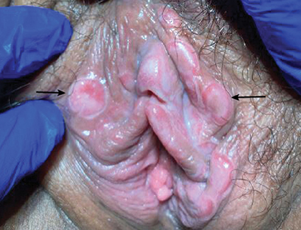
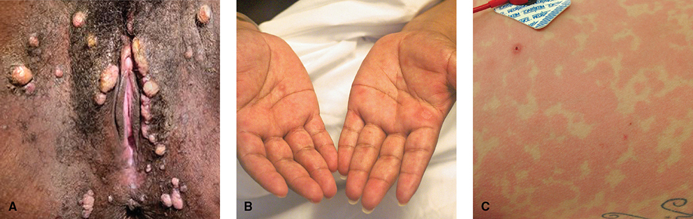
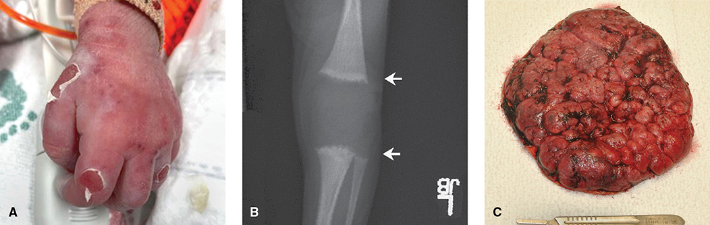
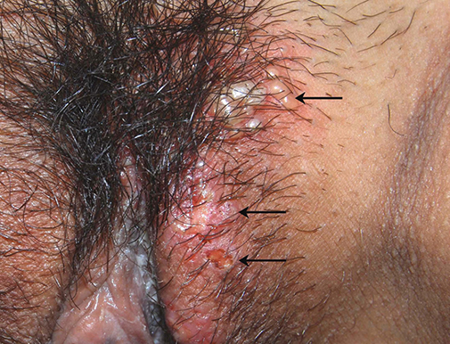
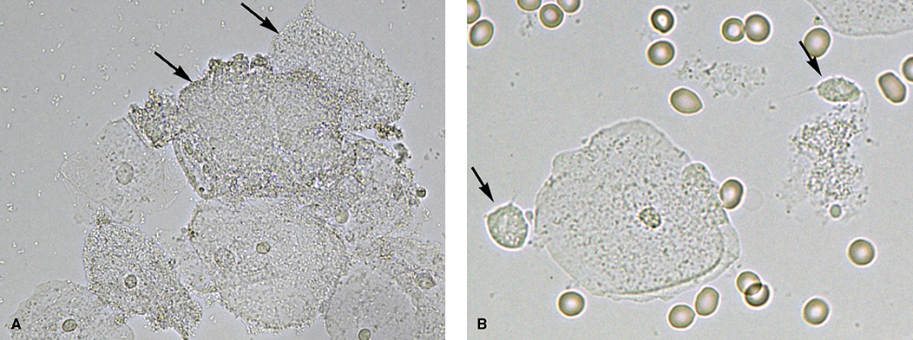
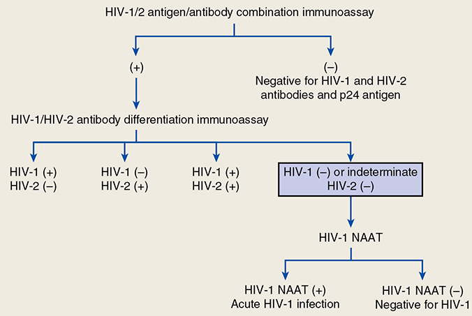

# Chapter 68: Sexually Transmitted Infections — Revision Notes

> Williams Obstetrics 26e, pp. 3139–3192 of the PDF. High-yield numbers are in **bold**.
> The ten tables are transcribed from the PDF images (they are missing from the extracted chapter text). All 6 figures are included from the PDF.

**Big picture:** STIs (syphilis, gonorrhea, chlamydia, trichomonas, HIV, HSV, HPV, hepatitis B and C) can harm mother and fetus, so they are sought by **screening** and **diagnostic testing** and treated (CDC guidelines). **One STI found → screen for all** (they coexist). Treatment improves pregnancy outcome.

- **Horizontal transmission** = to a contemporary; **vertical** = mother to fetus via placenta, labor/delivery or breastfeeding.
- **Serology** detects the patient's antibodies; **direct detection** = culture or **NAAT** (any molecular DNA/RNA test: PCR most common, TMA, others; qualitative or quantitative).

---

## 1. Syphilis
- Primary + secondary syphilis in women: **4 per 100,000** (2019), rising since 2001.
- **Congenital syphilis 48 per 100,000 live births** (2019): **~300% rise since 2015**.
- **Risk factors:** inadequate prenatal care, **substance use**, African American race, lack of screening/treatment, sex work, multiple/new partners, incarceration, homelessness.

### Pathogenesis
- *Treponema pallidum* (spirochete). Enters via minute vaginal abrasions; **cervical eversion, hyperemia and friability ↑ risk**. Spreads by lymphatics, then blood.
- **Vertical transmission: mainly transplacental** (spirochetes readily cross); also contact with lesions at delivery.
- **Fetal infection: >50% with untreated early syphilis; up to 10% with late latent.**

### Clinical stages
| Stage | Features |
|---|---|
| **Primary** | **Chancre** at inoculation: solitary, **painless**, raised firm border, red smooth base, no pus; nonsuppurative adenopathy. **Heals in 2–8 wk** untreated. Multiple lesions mostly with **HIV** |
| **Secondary** | Dissemination **4–10 wk after the chancre**. **Skin in up to 90%**: diffuse macular rash, **palmar/plantar lesions**, patchy alopecia, mucous patches, **condylomata lata** (flesh-colored flat perineal/perianal nodules; teeming with spirochetes, highly infectious). Fever, headache, myalgia; less often hepatitis, nephropathy, uveitis, periostitis. **Resolves in 1–6 months** untreated |
| **Early latent** | Asymptomatic, seropositive, acquired **within 12 months** (seroconversion, clear symptoms, or partner with early syphilis in the past 12 months) |
| **Latent, unknown duration or late** | Duration unclear or **>12 months** |
| **Tertiary** | Slowly progressive, any organ; rare in young women |

- **Early-stage** (primary, secondary, early latent): high spirochete load → partner transmission **30–60%**. **Late-stage**: lower transmission.

*Figure 68-1. Primary syphilis: painless chancres with raised firm borders; arrows show "kissing" lesions on apposed surfaces.*

*Figure 68-2. Secondary syphilis: (A) condylomata lata; (B) palmar target lesions; (C) diffuse maculopapular rash.*

### Congenital syphilis
- **Without screening and treatment, ~70%** of infected women have an adverse outcome: congenital infection, preterm labor, LBW, fetal/neonatal death.
- Fetus is immunoincompetent before midpregnancy (less inflammatory response), but **infection is presumed in all cases → treat**.
- **Fetal progression:** **hepatic abnormalities → anemia → thrombocytopenia → ascites and hydrops**; **stillbirth** is a major complication.
- **Newborn:** jaundice with petechiae/purpura, lymphadenopathy, **rhinitis**, pneumonia, myocarditis, nephrosis, **long-bone involvement**; **pemphigus syphiliticus** (desquamating rash).
- **Placenta: large and pale**; villi lose arborization; **endarteritis** obliterates vessels (**>60%** of untreated cases). Cord: **necrotizing funisitis**.

*Figure 68-3. Congenital syphilis: (A) desquamating pemphigus syphiliticus; (B) "moth-eaten" long bones; (C) large hydropic placenta.*

### Diagnosis
- **USPSTF: screen all pregnant women at the first prenatal visit.** High prevalence or risk factors → **repeat at 28 wk and at delivery**.
- *T. pallidum* **cannot be cultured**. Direct tests (darkfield, NAAT, immunostaining of lesion exudate) are not widely available.
- **Serology + clinical findings.** Sequential use of **two test types** ↓ false positives. Serology identifies infection; **stage** comes from titers, history and clinical definitions.

| | Nontreponemal (VDRL, RPR) | Treponemal (FTA-ABS, TP-PA, immunoassays) |
|---|---|---|
| Detects | IgM/IgG to **cardiolipin** | *T. pallidum*–specific antibody |
| Quantified | **Titers** reflect activity; often **>1:32 in secondary**; measured **on the day treatment starts** | Qualitative |
| After treatment | Fall (fourfold = response) | **Stay positive for life** |
| False positives | **Recent vaccination, febrile illness, pregnancy**, IV drug use, **SLE**, aging, leprosy, cancer | Pregnancy, endemic treponematoses |
| Other | **Prozone effect** (very high antibody → false negative). **Seroconversion ~3 wk (up to 6 wk)** | Positive a few weeks earlier than nontreponemal |

- **Traditional:** nontreponemal first → treponemal confirm. **Reverse sequence:** treponemal first (Table 68-1). Both fine if a follow-up program exists.
- **Point-of-care tests** (mostly treponemal): immediate treatment in hard-to-reach groups ↓ stillbirth, neonatal death and congenital syphilis, but may overtreat women already cured; newer **dual POC tests** help.

### Table 68-1. Interpretation of Serologic Tests Using Reverse Sequence Syphilis Screening

| Treponemal Test | VDRL or RPR | TP-PA | Possible Interpretations |
|---|---|---|---|
| **Nonreactive**ᵃ | — | — | 1. Absence of syphilis. 2. Very early syphilis before seroconversion |
| **Reactive**ᵇ | Nonreactive | Reactive | 1. Prior treated syphilisᶜ. 2. Untreated syphilisᶜ |
| **Reactive**ᵇ | Nonreactive | Nonreactive | 3. False-positive treponemal testᵈ |
| **Reactive** | Reactive | — | 1. Active syphilisᶜ. 2. Recently treated syphilis with nontreponemal titers that have not yet become nonreactiveᶜ. 3. Treated syphilis with persistent titers (serofast)ᵉ |
| **Nonreactive**ᵃ | Reactive | — | 1. False-positive nontreponemal test |

*ᵃNo further testing performed if the initial treponemal test is negative and if there is no clinical suspicion for early syphilis. ᵇVerified using a second, different treponemal test (TP-PA) if the nontreponemal test is nonreactive. ᶜIf prior treatment received, verify treatment adequacy for clinical stage and assess for reexposure. If inadequate, unverified, or no treatment received, perform full clinical staging evaluation and begin treatment course. ᵈMay be seen in pregnancy or among immigrants with previous exposure to endemic treponematoses. ᵉSuccessful treatment is usually considered verification of adequate treatment with a fourfold decline in titers (e.g., from 1:32 to 1:8). RPR = rapid plasma reagin; TP-PA = T pallidum particle agglutination assay; VDRL = Venereal Disease Research Laboratory.*

**Fetal evaluation**
- **Sonography if >20 wk**: **31%** of women diagnosed at ≥18 wk had abnormal fetal findings.
- **Signs:** **hepatomegaly, placental thickening, hydramnios, ascites, hydrops, ↑ MCA peak velocity** (anemia).
- **Before 20 wk:** treatment highly successful; abnormal sonography rare.
- **Viable fetus with sonographic signs → FHR monitoring before antibiotics.**
  - Reassuring → treat.
  - ⚠️ **Spontaneous late decelerations or nonreactive tracing** = very ill fetus that may not tolerate a **Jarisch-Herxheimer reaction** → consult neonatology; consider **delivery then treatment in the nursery**.
- After treatment, sonographic signs resolve over weeks to months; deliver for usual obstetrical indications.

### Treatment
- **Benzathine penicillin G = preferred for all stages.** **No proven alternative in pregnancy** (ceftriaxone 1 g IV daily × 10 days has some support). ⚠️ **Tetracyclines: not in pregnancy** (tooth discoloration).

### Table 68-2. Recommended Treatment for Pregnant Women with Syphilis

| Category | Treatment |
|---|---|
| **Early syphilis**ᵃ | **Benzathine penicillin G (Bicillin L-A)**ᵇ, **2.4 million units as a single intramuscular injection**; some recommend a **second dose 1 week later** to help prevent congenital syphilis |
| **>1-yr duration**ᶜ | **Benzathine penicillin G (Bicillin L-A)**ᵇ, **2.4 million units intramuscularly weekly for 3 doses**ᵈ |

*ᵃPrimary, secondary, and early latent syphilis of less than 1-year duration. ᵇBicillin C-R is not a suitable option. ᶜLatent syphilis of unknown or more than 1-year duration; tertiary syphilis. Missed doses are not acceptable for pregnant women, and those who miss any dose of therapy must repeat the full course of therapy. ᵈOptimal treatment interval is 7 days. If >9 days pass between doses, the entire treatment course is repeated.*

- Parkland gives the **second dose at 1 week** for early-stage syphilis or sonographic signs.
- **Risks for failure to prevent neonatal infection:** **high maternal titers, preterm delivery, delivery soon after treatment.**
- **Abstain for 7 days**, until lesions heal and partners are treated.

**Follow-up**
- Treated **<24 wk:** repeat nontreponemal test in the 3rd trimester or **≥8 wk after treatment**.
- Treated **>24 wk:** repeat at delivery (± 3rd trimester).
- **Adequate response = fourfold titer decline** + symptom resolution. No fourfold fall ≠ failure, especially if initial titer **<1:8**.
- Use the **same test** (VDRL titers ≠ RPR titers).
- **Serofast** = persistent low titers after cure (older patients, low initial titers, later stages).
- **Asymptomatic contact of a syphilis case:**
  - Contact **within 90 days → treat presumptively for early syphilis**, even if seronegative.
  - Contact **>90 days → treat according to serology**.

**Penicillin allergy**
- **Oral stepwise penicillin challenge or skin testing** to confirm IgE-mediated risk → if confirmed, **desensitize, then give benzathine penicillin G**.

### Table 68-3. Penicillin Allergy—Oral Desensitization Protocol for Patients with a Positive Skin Test

| Penicillin V Suspension Doseᵃ | Amountᵇ (units/mL) | mL | Units | Cumulative Dose (units) |
|---|---|---|---|---|
| 1 | 1000 | 0.1 | 100 | 100 |
| 2 | 1000 | 0.2 | 200 | 300 |
| 3 | 1000 | 0.4 | 400 | 700 |
| 4 | 1000 | 0.8 | 800 | 1500 |
| 5 | 1000 | 1.6 | 1600 | 3100 |
| 6 | 1000 | 3.2 | 3200 | 6300 |
| 7 | 1000 | 6.4 | 6400 | 12,700 |
| 8 | 10,000 | 1.2 | 12,000 | 24,700 |
| 9 | 10,000 | 2.4 | 24,000 | 48,700 |
| 10 | 10,000 | 4.8 | 48,000 | 96,700 |
| 11 | 80,000 | 1.0 | 80,000 | 176,700 |
| 12 | 80,000 | 2.0 | 160,000 | 336,700 |
| 13 | 80,000 | 4.0 | 320,000 | 656,700 |
| 14 | 80,000 | 8.0 | 640,000 | 1,296,700 |

*ᵃInterval between doses: **15 minutes**. Elapsed time: **3 hours and 45 minutes**. Cumulative dose: **1.3 million units**. Observation period: **30 minutes** before parenteral administration of penicillin. ᵇThe specific amount of drug was diluted in approximately 30 mL of water and administered orally. (Wendel, 1985.)*

**Jarisch-Herxheimer reaction** (not an allergy)
- After penicillin in **most women with primary** and **~half with secondary** syphilis.
- **Uterine contractions, mild fever, ↓ fetal movement, FHR decelerations.**
- 50 treated gravidas: reaction in **40%**; of 31 monitored, **42% contractions**, **39% variable decelerations**; all contractions **resolved within 24 h**.
- Treatment: **supportive** (antipyretics, hydration, oxygen).
- **Viable fetus with sonographic signs → give the first dose on labor and delivery with ≥24 h continuous fetal monitoring.** Counsel all women about symptoms.

---

## 2. Gonorrhea

### Infection rates and effects
- *Neisseria gonorrhoeae*: **second most common reportable bacterial STI**; rising since 2015; highest at **15–24 yr**. **310 per 100,000 live births** (2018).
- Usually limited to **cervix, urethra, periurethral and Bartholin glands**. **Acute salpingitis is rare in pregnancy**, but pregnant women account for a **disproportionate share of disseminated gonococcal infection**.
- Slightly ↑ preterm delivery, **PPROM**, LBW, perinatal mortality. **No ↑ miscarriage**, but untreated cervicitis → **septic abortion** and post-abortion uterine infection.
- **Vertical transmission (~40%)** mainly by contact at birth → **gonococcal ophthalmia neonatorum** (corneal scarring, perforation, **blindness**) → **ocular prophylaxis for all newborns**.

### Screening and treatment
- **Screen in the 1st trimester** if high-prevalence area or risk factors: **age ≤25**, prior/current STI, sex work, new or nonmonogamous partner, partner with STI, multiple partners, inconsistent condom use.
- **Gonorrhea is a marker for chlamydia** → if chlamydia testing unavailable, **treat chlamydia presumptively**.
- **NAAT** (vaginal, endocervical or urine). **Vaginal/cervical preferred** (urine misses **up to 10%**); use the **first-catch (initial stream) urine**.
- Consider **rectal testing** (anal intercourse, vaginal symptoms): ~**20%** of rectal infections missed with genital/urine samples alone. NAAT also valid for rectal and pharyngeal sites.
- **Ultrarapid POC NAAT** (gonorrhea + chlamydia): results in **~30 min** (not well studied in pregnancy).

### Table 68-4. Treatment of Gonorrhea in Pregnancyᵃ,ᵇ

| Regimen | Drug and Dosage |
|---|---|
| **Preferred** | Weight **<150 kg (<300 lb): ceftriaxone, single 500-mg IM injection**ᶜ. Weight **≥150 kg (≥300 lb)**: ceftriaxone, two simultaneous 500-mg IM injectionsᶜ |
| **Alternative** | **Cefixime, 800-mg single oral dose**. **Gentamicin, single 240-mg IM dose plus azithromycin, 2-g single oral dose** |

*ᵃIf Chlamydia trachomatis co-infection not excluded, then a 1-g oral azithromycin dose is added to regimens not already including azithromycin. ᵇRetesting is recommended at 3 months to exclude reinfection. ᶜ1 mL of 1% lidocaine may be added to reduce injection site pain. IM = intramuscular.*

- Chlamydia not excluded → add **azithromycin 1 g orally** (in pregnancy).
- Abstain for **7 days** after patient and partner(s) finish treatment.
- **Pharyngeal infection:** non-ceftriaxone regimens fail more often (ceftriaxone contraindicated → ID consult); **test of cure 1–2 wk** after treatment. Not needed for urogenital or rectal infection.
- **Retest at 3 months** (reinfection) for everyone. **Treated in the 1st trimester or high risk → retest in the 3rd trimester.**
- **Partners are treated.** Expedited partner therapy is less desirable now (injectable preferred); if used: **cefixime 800 mg orally once** (+ **doxycycline 100 mg bid × 7 d** for the partner if chlamydia not excluded).

### Disseminated gonococcal infection
- Bacteremia → **petechial or pustular skin lesions, arthralgias, septic arthritis**. Culture sites and request susceptibility testing.

| Presentation | Treatment |
|---|---|
| **DGI (skin/joint)** | **Ceftriaxone 1 g IV or IM every 24 h**, continued **24–48 h after improvement**, then an oral agent (by susceptibility) to complete **1 week** |
| **Endocarditis** | **Ceftriaxone 1–2 g IV every 12 h for ≥4 weeks** |
| **Meningitis** | Ceftriaxone 1–2 g IV every 12 h for **10–14 days** |
| All | **+ azithromycin 1 g orally once** (chlamydia) |

---

## 3. Chlamydial Infection

### Infection rates and effects
- *Chlamydia trachomatis*: **obligate intracellular** bacterium of columnar/transitional epithelium; **most common reportable STI in the US**. **694 per 100,000 women** (2019); highest at 15–24 yr. **1844 per 100,000 live births** (2018).
- **Most pregnant women are asymptomatic**; **one third** have urethral syndrome, urethritis or Bartholin infection. **Mucopurulent cervicitis** (chlamydia and/or gonorrhea).
- Uncommon in pregnancy: endometritis, salpingitis, reactive arthritis, **Reiter syndrome**.
- Role in preterm birth, PPROM, LBW, perinatal death is **disputed**. **Not linked to chorioamnionitis or peripartum pelvic infection.**
- **Delayed postpartum uterine infection** at **2–3 wk** (distinct from early metritis): bleeding/discharge, low-grade fever, uterine tenderness.
- **Higher risk to the newborn:** infection in **8–44%** of vaginally delivered neonates; **conjunctivitis most common**; also **pneumonia**.

### Screening and treatment
- **Screen all women at the first prenatal visit** (USPSTF, AAP/ACOG).
- **Retest in the 3rd trimester:** those treated in the 1st trimester, **all women ≤25 yr**, and older women with risk behaviors (same as gonorrhea). Reinfection before delivery **~10%**.
- **NAAT** (vaginal/cervical preferred; urine may miss up to 10%, though one pregnancy study found them equivalent). First-catch urine.

### Table 68-5. Oral Treatment of Chlamydia trachomatis Infection in Pregnancyᵃ

| Regimen | Drug and Dosage |
|---|---|
| **Preferred** | **Azithromycin, 1 g as a single dose** |
| **Alternative** | **Amoxicillin, 500 mg three times daily for 7 d** |

*ᵃTest of cure is recommended at 1 month. Retesting is performed at 3 months to exclude reinfection.*

- ⚠️ **Fluoroquinolones and doxycycline usually avoided; erythromycin estolate contraindicated (hepatotoxicity).**
- **Test of cure 4 weeks after treatment** (earlier NAAT may detect dead organisms). Positive → reinfection, false positive, failure or noncompliance; resistance is rare. Parkland **retreats** positive tests of cure.
- **Rescreen at 3 months** for reinfection.

### Expedited partner therapy (EPT)
- CDC guidelines, endorsed by ACOG: treat **sexual contacts from the prior 60 days** (prescription for the partner, simultaneous administration, or a medication packet delivered by the patient). Should not replace partner evaluation.

| Infection | EPT |
|---|---|
| **Chlamydia** | **Acceptable** |
| **Gonorrhea** | **Less desirable** (injectable ceftriaxone preferred) unless the partner won't seek care |
| Trichomoniasis | Few data |
| **Syphilis** | ⚠️ **Not recommended** |

- Legal or potentially allowable in all states; adverse reactions in partners are rare. At Parkland, EPT **did not ↓ chlamydia reinfection** before delivery.

---

## 4. Herpes Simplex Virus (HSV)

### Adult disease
- Shallow orogenital ulcers. **HSV-2**: almost exclusively genital, sexual. **HSV-1**: most nongenital infection, childhood acquisition, but now causes **>half of new genital herpes** in young people (oral sex; less childhood exposure).
- **DNA homology → prior infection with one type attenuates primary infection with the other.**
- ~19 million US adolescents and adults. Pregnant women: **HSV-2 seroprevalence 21%, HSV-1 59%**.
- **Acquisition in pregnancy: 4–5%** if seronegative for both; **~2% HSV-2** if already HSV-1 positive.
- Virus travels **retrograde along sensory nerves** → latent in cranial nerve or **dorsal root ganglia**; recurrences common.

| Category | Definition | Features |
|---|---|---|
| **First-episode primary** | HSV-1 or -2 isolated **with no HSV antibodies** | Incubation **6–8 d**; papules with itch/tingling → painful **vesicles → ulcers** (coalesce); severe **inguinal adenopathy**; cervix often involved; **systemic flu-like symptoms**/high fever (viremia); rarely hepatitis, encephalitis, pneumonia, dissemination. **Resolves in 2–4 wk.** Up to **90% of primary HSV-2 is asymptomatic** |
| **First-episode nonprimary** | One type isolated; antibodies **only to the other type** | Milder: fewer lesions, less pain, shorter shedding |
| **Recurrent** | Type isolated with antibodies **to the same type** | Fewer, less tender lesions; shorter shedding; **same sites**; most frequent in the **first year** |
| **Asymptomatic shedding** | No clinical findings | **Most partner transmission occurs during asymptomatic shedding** |

*Figure 68-4. First-episode primary genital HSV: vesicles, crusts and shallow ulcers (arrows).*

### Vertical transmission
- **Higher risk to newborn than mother.** No clear link with miscarriage.

| Route | Share |
|---|---|
| **Peripartum** (shedding from lower genital tract; ascends after ROM or contact at delivery) | **85%** |
| Postnatal (mother, family, staff) | 10% |
| Intrauterine | 5% |

| Neonatal disease | Frequency | Outcome |
|---|---|---|
| **SEM** (skin, eye, mouth) | **~40%** | Usually good |
| **CNS (encephalitis)** | **~30%** | 20–50% serious developmental/CNS morbidity in survivors |
| **Disseminated** | **~32%** | **Mortality ~30% even with acyclovir** |

- Neonatal HSV **1–5 per 10,000** births. **Most infected neonates are born to mothers with no known HSV history.**
- Risk depends on **HSV in the genital tract, HSV type, invasive procedures, and stage of maternal infection**.
- ⚠️ **Maternal acquisition near delivery → 30–50% neonatal infection** (high viral load, no protective antibody). **Recurrent HSV → <1%.**
- **Intrauterine HSV (TORCH):** skin (blisters, scarring), **CNS (hydranencephaly, microcephaly, intracranial calcification)**, eyes (chorioretinitis, microphthalmia), bone, viscera. Suspect with early/severe FGR, microcephaly, intracranial anomalies/calcifications, hepatomegaly → **amniocentesis (PCR + culture)** + maternal serology.

### Diagnosis
- ⚠️ **No routine HSV serological screening** in asymptomatic gravidas (ACOG, USPSTF). Serology for a **reported history** of genital or oral lesions.
- Suspicious ulcer or suggestive sonography → **direct virological test + serology**; also test for **syphilis and other STIs**.
- **PCR of the lesion is preferred** (more sensitive, 1–2 days, easier handling). Culture sensitivity falls as lesions ulcerate and crust; results in 7–14 days. **Always type the virus.** **Negative test doesn't exclude infection**; false positives are rare. Amnionic fluid: **both culture and PCR**.
- **Type-specific serology** detects antibodies to glycoproteins **G1 (HSV-1)** and **G2 (HSV-2)**: IgG develops **1–2 wk** after primary infection and persists; sensitivity/specificity **90–100%**. Can be falsely negative early. **IgM testing is not useful.**

### Management
- **Acyclovir and valacyclovir are safe** in pregnancy; famciclovir has fewer data.
- **Primary outbreak:** antivirals ↓ symptoms and shedding (longer with HIV).
- **Severe or disseminated HSV → IV acyclovir 5–10 mg/kg every 8 h for 2–7 days** until improved, then oral to complete **≥10 days**.
- Pain: oral analgesics, **topical lidocaine**. Urinary retention (rare) → brief catheter.
- **Recurrence:** antivirals mainly for symptoms. Acyclovir resistance mostly in immunocompromised patients.
- **Procedures:** amniocentesis, cordocentesis, transabdominal CVS **allowed even with active lesions**; **delay transcervical procedures** until lesions resolve.

### Table 68-6. Oral Antiviral Medications for Herpesvirus Infection in Pregnancyᵃ

| Indication | Pregnancy Recommendation |
|---|---|
| **Primary or first episode infection** | **Acyclovir, 400 mg three times daily for 7–10 d** *or* **Valacyclovir, 1 g twice daily for 7–10 d** |
| **Symptomatic recurrent infection (episodic therapy)** | Acyclovir, 800 mg twice daily for 5 d *or* Acyclovir, 800 mg three times daily for 2 d *or* Valacyclovir, 500 mg twice daily for 3 d *or* Valacyclovir, 1 g once daily for 5 d |
| **Daily suppression** | **Acyclovir, 400 mg three times daily from 36 weeks until delivery** *or* **Valacyclovir, 500 mg twice daily from 36 weeks until delivery** |

*ᵃFamciclovir not preferred during pregnancy due to fewer safety data.*

### Peripartum shedding prophylaxis
- **Cesarean delivery for active genital lesions or prodromal symptoms.**
- **Suppression from ≥36 wk** for women with a clinical history of genital herpes (ACOG) → ↓ clinical recurrence at term, ↓ **cesarean for HSV**, ↓ viral detection and asymptomatic shedding. **Continue until delivery.** (Atypical neonatal herpes can still occur.)
- **At admission:** ask about **prodrome**; **examine vulva, vagina and cervix**. No lesions → labor and delivery with **usual management, including invasive fetal monitoring**. Swab suspicious lesions.
- **No absolute duration of ROM** beyond which cesarean no longer helps when a recurrence is present.
- ⚠️ **History of HSV without active genital disease → cesarean NOT indicated.**
- **Nongenital lesion → cover with an occlusive dressing; vaginal delivery allowed.**
- **PPROM with active lesions:** external lesions don't cause ascending infection; **give antivirals during expectant care** (29 women <31 wk: no neonatal HSV; maximum risk **~10%**).
- **Breastfeeding allowed if no breast lesions**; strict hand washing. Acyclovir/valacyclovir compatible (low milk levels).

---

## 5. Human Papillomavirus (HPV)

### Maternal infection and prevention
- Very common: **prevalence 40%** in US females aged 14–59 (2005–2006). Usually acquired soon after sexual debut; mostly **asymptomatic and transient**.
- **High-risk HPV 16 and 18** → lower genital tract dysplasia (Ch 66). **HPV 6 and 11 → condyloma acuminata.**
- **Gardasil 9 (nonavalent):** types **6, 11, 16, 18, 31, 33, 45, 52, 58**.

*The printed text (and PDF text layer) lists type "35"; the Gardasil 9 type is 33, as in Ch 66.*

- ⚠️ **Not recommended in pregnancy**, but inadvertent exposure → **no adverse outcomes**. Pregnant mid-series → **finish after delivery**. **Breastfeeding women may be vaccinated.**

| Aspect | Detail |
|---|---|
| Licensed ages | **9–45 yr** |
| Target age | **11–12 yr** |
| Recommended | **9–26 yr** |
| 27–45 yr | After **shared decision-making** |
| Schedule | **3 doses at 0, 2, 6 months if >15 yr**; **2 doses** if younger |

### Condyloma acuminata treatment
- Warts often **grow in number and size in pregnancy**, then regress postpartum. Rarely fill the vagina or cover the perineum (difficult delivery/episiotomy).
- **Treat only if symptomatic** (debulk, minimize toxicity):
  - **Trichloroacetic or bichloroacetic acid 80–90%**, topically **weekly** (external warts)
  - **Cryotherapy, laser ablation, surgical excision**
- ⚠️ **Not recommended in pregnancy:** **podophyllin resin, podofilox, imiquimod, sinecatechins.**

### Neonatal infection
- Vertical transmission minimal. **Juvenile-onset recurrent respiratory papillomatosis (JoRRP):** rare benign laryngeal tumor (hoarseness, respiratory distress), usually **HPV 6/11**. Risks: maternal genital HPV and **longer labor**. **5 per 10,000 births** (2013), falling with vaccination.
- ⚠️ **Cesarean is not recommended to prevent HPV transmission** (benefit unknown).

---

## 6. Vaginitis
- ↑ Vaginal discharge is common in pregnancy; distinguish **physiological** discharge from symptomatic vaginitis. Normal flora protect against vaginitis.

### Bacterial vaginosis (BV)
- **Maldistribution of flora:** ↓ **lactobacilli**, ↑ anaerobes (*Gardnerella, Prevotella, Mobiluncus, Bacteroides, Atopobium vaginae*, BVAB1–3).
- **Community state types (CSTs):** I, II, III, V are **lactobacillus-rich**; **CST IV** (heterogeneous strict anaerobes) = BV-associated; CST IV is the commonest in healthy asymptomatic Black women.
- Prevalence **~30%** of US reproductive-age women; **~50% in Black women**. Mostly **asymptomatic**; otherwise **thin, foul discharge**. Risks: **douching**, multiple partners, smoking, altered immunity.

**Amsel criteria (≥3 of 4):**
1. **Vaginal pH >4.5**
2. **Thin, milky, noninflammatory discharge**
3. **>20% clue cells** on microscopy
4. **Fishy odor after 10% KOH ("whiff test")**

- Odor after intercourse and with menses (alkaline semen and blood).
- **Clue cells:** epithelial cells coated with bacteria → blurred, stippled borders. **No ↑ leukocytes.** ↑ pH from ↓ lactobacillary acid.
- ⚠️ **Exclude trichomoniasis** (also causes anaerobic overgrowth and amines).
- **Nugent score** (Gram stain) = research tool. BV NAATs are accurate but detect normal flora too, add cost, no proven outcome benefit.

*Figure 68-5. Wet prep: (A) BV clue cells with blurred borders (arrows); (B) motile trichomonads (arrows).*

**Treatment**
- BV is linked to **preterm birth, PPROM, postpartum endometritis** and ↑ STI/HIV susceptibility, but **treating low-risk women does not ↓ preterm birth**.
- ⚠️ **No routine screening** of asymptomatic low-risk gravidas (ACOG, USPSTF); evidence conflicting after prior preterm birth (Parkland doesn't screen).
- **Treat symptomatic women only.** Treating the male partner does **not** ↓ recurrence.

### Table 68-7. Treatment of Bacterial Vaginosis in Pregnancyᵃ

| Regimen | Drug and Dosage |
|---|---|
| **Preferred** | **Metronidazole, 500 mg orally twice daily for 7 d** *or* **Metronidazole 0.75-percent gel, one applicator intravaginally, daily for 5 d** |
| **Alternative** | **Clindamycin, 300 mg orally twice daily for 7 d** *or* **Clindamycin ovules, 100 mg intravaginally nightly for 3 d** |

*ᵃOther agents not listed here are ideally avoided due to insufficient pregnancy data.*

### Trichomoniasis
- *Trichomonas vaginalis*; US prevalence **~2%** of women (higher >30 yr). Risks: Black race, douching, more lifetime partners.
- Sites: urethra, endocervix, vagina. Symptoms: **purulent discharge, pruritus**, erythema, **colpitis macularis ("strawberry cervix")**.
- **Diagnosis:**

| Test | Sensitivity / notes |
|---|---|
| **Wet prep** (flagellated, pear-shaped, motile; larger than WBCs; examine promptly, slow with cooling) | **~60%** |
| Pap test | ~60%; false positives → confirm with wet prep or NAAT |
| Culture | 75–95%; expensive, slow |
| **NAAT** (vaginal, endocervical, urine) | **95–100%**; useful second-line if microscopy negative |
| OSOM rapid test (10 min) | 88–98% |

**Treatment**
- **Treat symptomatic women.** Old single 2-g metronidazole dose replaced: **500 mg bid × 7 d** was more effective (nonpregnant RCT); CDC recognizes it for pregnancy.

### Table 68-8. Oral Treatment of Trichomoniasis in Pregnancyᵃ,ᵇ

| Regimen | Drug and Dosage |
|---|---|
| **Preferred** | **Metronidazole, 500 mg orally twice daily for 7 d** |

*ᵃRetesting is encouraged at 3 months to exclude reinfection. ᵇTinidazole is not recommended in pregnancy.*

- **Reinfection common → retest within 3 months** (some advise 3 wk after treatment in pregnancy).
- **Metronidazole is not teratogenic or fetotoxic; usable in all trimesters** (manufacturer advises against in the 1st trimester). Allergy → **metronidazole desensitization**. Longer, lower-dose regimen is fine with breastfeeding.
- Perinatal transmission rare (neonatal respiratory/genital infection). Linked to preterm birth, PPROM, SGA, but **treatment didn't ↓ preterm birth** in two RCTs.
- **No screening of most asymptomatic gravidas**, but **screen and treat HIV-positive women at the first visit** (trichomonas may ↑ vertical HIV transmission).

### Candidiasis
- *Candida* cultured from the vagina in **~20%** of pregnant women. Link with preterm birth is weak → **asymptomatic colonization needs no treatment**.
- Symptomatic (profuse, irritating discharge): **CDC recommends 7-day regimens and topical rather than oral azoles** in pregnancy. Recurrences common; usually subside after pregnancy.
- **Single oral fluconazole 150 mg**: not preferred, but generally **not considered teratogenic** (conflicting cardiac data; recent evidence reassuring; FDA 2019: no conclusive ↑ miscarriage/stillbirth).

### Table 68-9. Daily, Intravaginal Agents in 7-Day Regimens for Vulvovaginal Candidiasis Treatment in Pregnancy

| Agent | Brand Name | Formulation |
|---|---|---|
| **Clotrimazole** | Clotrimazole | 1% cream, 1 applicator |
| **Miconazole** | Miconazole | 100-mg, 1 suppository |
| | Monistat 7, Miconazole 7 | 2% cream, 1 applicator |
| **Terconazole** | Terazolᵃ | 0.4% cream, 1 applicator |

*ᵃPrescription required.*

| Feature | BV | Trichomoniasis | Candidiasis |
|---|---|---|---|
| Discharge | Thin, milky, **fishy** | **Purulent**, pruritus | Profuse, irritating |
| Key finding | **pH >4.5, clue cells, whiff test +**, no ↑ WBCs | **Motile trichomonads**; **strawberry cervix** | Culture positive in ~20% (colonization) |
| Screen asymptomatic? | No | Only if **HIV+** | No |
| Pregnancy treatment | Metronidazole or clindamycin | **Metronidazole 500 mg bid × 7 d** | **Topical azole × 7 d** |

---

## 7. Human Immunodeficiency Virus (HIV)

### Pathogenesis
- HIV-1 and HIV-2: **sexual transmission** mainly; also blood; **vertical during labor/delivery or via breast milk**. **Maternal plasma viral load = main determinant of transmission.**
- Envelope binds **mucosal dendritic cells** → presented to **CD4 T cells** (CD4 = receptor) → progressive CD4 depletion.
- **Incubation 3–6 weeks.** **Acute HIV** (<10 days): fever, fatigue, rash, headache, lymphadenopathy, pharyngitis, myalgia, N/V, diarrhea. Viremia then settles to a **set point**; higher set point → faster progression.
- **AIDS (CDC): CD4 <200 cells/µL, CD4 <14% of lymphocytes, or an AIDS-defining illness.**

### Prenatal HIV screening
- ~**5000** women with HIV give birth annually in the US; perinatal HIV **0.9 per 100,000** live births (2018), down because of **prenatal testing and ART**.
- **Opt-out screening** (CDC, ACOG): routine unless declined; no separate consent.
- **Repeat in the 3rd trimester (preferably <36 wk)** — consider for all; **recommended** where HIV prevalence is **>1 per 1000** pregnant women or with risk factors (incarceration, injection drugs, sex work, HIV-positive partner, new/multiple partners, another STI).
- **Initial test: HIV-1/2 antigen/antibody combination immunoassay (4th generation; detects p24 antigen)**. Negative → done (unless recent exposure). Antibody alone can miss early infection (appears within ~1 month); **acute HIV needs p24 antigen or RNA**.
- **Reactive → HIV-1/HIV-2 antibody differentiation immunoassay.** Discordant → **HIV-1 NAAT (RNA)**.

*Figure 68-6. HIV testing algorithm: Ag/Ab combination immunoassay → HIV-1/HIV-2 differentiation assay → HIV-1 NAAT if HIV-1 negative/indeterminate (positive NAAT = acute HIV-1).*

**Unknown status at delivery**
- **4th-generation Ag/Ab combination test** on a blood sample. Negative → no confirmation (but consider interventions and retesting if recent exposure).
- **Positive → start interventions immediately:** **IV zidovudine in labor** and **no breastfeeding** (milk may be stored) until confirmatory results; stop if confirmation is negative.

### Vertical transmission
- **Viral load drives transmission:**

| Maternal HIV RNA | Neonatal infection |
|---|---|
| **<400 copies/mL** | **1%** |
| **>30,000 copies/mL** | **23%** |
| **<50 copies/mL at delivery** on ART from before conception (2615 neonates) | **0 cases** |

- Transmission can still occur at **any** viral load, even undetectable.
- **Timing:** **20% before 36 wk, 50% in the days before delivery, 30% intrapartum.**
- **Breastfeeding transmission up to 30–40%** (↑ with viral load). Comorbid STIs ↑ vertical transmission.

### Antepartum care
- Consult an HIV specialist; **National Perinatal HIV Hotline**.
- **Initial Parkland evaluation:**
  - Standard prenatal labs incl. **creatinine, CBC, urine culture**
  - **HIV RNA (viral load)**; **resistance testing if ≥500–1000 copies/mL**
  - **CD4 count**
  - Screen for **chlamydia, gonorrhea, syphilis, trichomoniasis**
  - **Hepatic aminotransferases**
  - Serology: **HSV-1/2, CMV, toxoplasmosis, hepatitis B and C**
  - **Baseline chest radiograph**
  - **TB testing** (PPD or IGRA)
  - Vaccines: **pneumococcal, hepatitis A and B, Tdap, COVID-19, influenza**
  - **Dating sonography**
- **Amniocentesis/invasive procedures:** no ↑ transmission with **suppressive ART**; **~2× risk without ART**. Avoid passing through the placenta.

**Antiretroviral therapy (ART)**
- Ideal: **(1) preconception ART, (2) antepartum ART, (3) intrapartum oral ART + IV zidovudine, (4) newborn ART prophylaxis.**
- **ART for all pregnant women with HIV, started as early as possible**, regardless of CD4 or viral load. **≥3 drugs**; stress adherence.

### Table 68-10. Recommendations for HIV Antiviral Drug Use During Pregnancy

| Clinical Scenario | Recommendations |
|---|---|
| **Taking ART and becomes pregnant** | Continue current medication if viral suppression adequate and patient tolerating |
| **ART naïve** | Initiate ART: combine **two NRTIs** with either a **ritonavir-boosted PI** or an **integrase inhibitor**. **Preferred NRTI dual combinations:** abacavir/lamivudine, tenofovir disoproxil fumarate (TDF)/emtricitabine, or TDF/lamivudine; if abacavir is used, **HLA-B\*5701 testing** is completed to identify potential hypersensitivity reaction. **Preferred PI:** atazanavir/ritonavir or darunavir/ritonavir. **Preferred integrase inhibitor:** dolutegravir or raltegravir; **dolutegravir should not be administered within 2 hr of prenatal vitamins, iron, or calcium** |
| **Prior ART use but not currently** | Initiate ART, with regimen based on prior therapy history and resistance testing |
| **No ART use and presents in labor** | IV ZDV (see Intrapartum care below) |
| **Antepartum care** | See antepartum screening test list. **Initiate ART as early as possible.** For HIV RNA levels **>500–1000 copies/mL**, order resistance testing but **do not delay ART** while awaiting results. **Repeat HIV RNA 2–4 wks after initiating (or changing) ART; monthly until undetectable; then at least every 3 mo; and finally at 34–36 weeks'** for delivery planning. **CD4+ count at the initial visit and every 3–6 mo** |
| **Intrapartum care** | **HIV RNA >1000 copies/mL or unknown → plan cesarean at 38 weeks' before labor or ROM.** If >1000 or unknown but labor or ROM has ensued, benefits of cesarean are unclear and plans are individualized. **HIV RNA ≤1000 copies/mL → vaginal delivery permitted**; cesarean not routinely recommended. **Start IV ZDV unless:** taking a prescribed oral ART regimen **and** HIV RNA **<50 copies/mL at 34–36 weeks' or 3–4 weeks before delivery**. **Dosing: 2-mg/kg IV load over 1 hr, then 1 mg/kg/hr until delivery. Begin IV ZDV 3 hr before scheduled cesarean.** Continue oral antepartum ART during labor with sips of water |

*ART = antiretroviral therapy; NRTI = nucleoside reverse transcriptase inhibitor; PI = protease inhibitor; ROM = rupture of membranes; ZDV = zidovudine.*

- **Already on ART:** continue if suppressed and tolerated. ⚠️ Exceptions: **didanosine, stavudine, full-dose ritonavir** (pregnancy toxicity, not teratogenicity). **Lopinavir/ritonavir no longer recommended** (preterm, SGA).
- **ART-naïve:** start **regardless of trimester**.
- **Previously treated, not current:** resistance testing, but **start ART before results**.
- Adequate response = **≥1-log fall in viral load within 1–4 weeks**; otherwise check adherence and resistance. **Integrase inhibitors** lower viral load rapidly (useful for late presenters).
- **Parkland gives intrapartum IV zidovudine to all HIV-positive women regardless of viral load.** Scheduled cesarean → loading dose + 2 h maintenance = **3 h of zidovudine before surgery**.

### Delivery planning
- **HIV RNA >1000 copies/mL → scheduled cesarean at 38 wk** (avoid labor). In labor/ROM with >1000 or unknown load: individualize; IV zidovudine; **early labor → cesarean preferred**.
- **HIV RNA ≤1000 → no cesarean for HIV**; aim for vaginal birth; await spontaneous labor. **Don't induce to prevent transmission.**
- **Detectable viral load → avoid if possible:** **amniotomy, fetal scalp electrode, episiotomy, operative vaginal delivery** (use only for standard indications). Augmentation is fine (shortens exposure).
- **Delayed cord clamping** acceptable (preterm) and may be considered at term. **Neuraxial analgesia suitable.**
- ⚠️ **PPH: use oxytocin and prostaglandins; avoid methylergonovine/ergots** (interact with reverse transcriptase and protease inhibitors → **severe vasoconstriction**).

### Postpartum care
- ⚠️ **Breastfeeding not recommended in the US** (formula available). WHO: **exclusive breastfeeding for 6–12 months** in resource-poor settings.
- **Continue ART lifelong**; viral suppression between pregnancies ↓ transmission next time. Repeat pregnancy doesn't worsen disease with ART. Transition to HIV care.

### Prevention
- **PrEP (USPSTF)** for HIV-negative women at risk: **HIV-positive partner**, **syphilis or gonorrhea within 6 months**, inconsistent condoms with a high-risk partner (injection drug use or multiple partners).
- CDC: **viral suppression of the infected partner + barriers** are the primary prevention. **PrEP with daily oral TDF/emtricitabine is acceptable in pregnancy**, especially if the partner's viral load is unknown or unsuppressed.
- **Serodiscordant conception:** ART; or suppression + PrEP + STI screening + **timed condomless sex at peak fertility** + self-insemination.
- Contraception counseling if pregnancy undesired; risk-reduction education.

> **Memory hook:** HIV delivery threshold "**1000 at 38**": viral load >**1000** → cesarean at **38** wk; ZDV "**2 then 1**" (2 mg/kg load, 1 mg/kg/h), **3 h** before cesarean.

---

## Quick-Recall: STI Screening and Treatment in Pregnancy

| Infection | Screening | First-line treatment | Key pitfalls |
|---|---|---|---|
| **Syphilis** | **All**, first visit; repeat **28 wk + delivery** if high risk | **Benzathine penicillin G 2.4 MU IM** (×1 early; weekly ×3 if >1 yr / unknown) | Allergy → **desensitize**; **J-H reaction** → contractions, FHR decels; >9 d gap → restart |
| **Gonorrhea** | 1st trimester if **≤25 yr** or risk; retest 3rd tri | **Ceftriaxone 500 mg IM** (+ azithromycin 1 g if chlamydia not excluded) | Test of cure only for pharyngeal; retest 3 mo |
| **Chlamydia** | **All**, first visit; 3rd tri if ≤25 or risk | **Azithromycin 1 g**; alt amoxicillin 500 mg tid × 7 d | Test of cure **4 wk**; no doxycycline/quinolones/erythromycin estolate |
| **HSV** | **No** routine serology | Acyclovir/valacyclovir; **suppression from 36 wk** | **Cesarean for lesions or prodrome only** |
| **HPV** | (Cervical screening, Ch 66) | TCA/BCA, cryo, laser, excision if symptomatic | No podophyllin, imiquimod, sinecatechins; cesarean doesn't prevent JoRRP |
| **BV** | **No** routine | **Metronidazole 500 mg bid × 7 d** or gel; clindamycin | Treating low-risk women doesn't ↓ preterm birth |
| **Trichomonas** | Only if **HIV+** | **Metronidazole 500 mg bid × 7 d** | No tinidazole; retest 3 mo |
| **Candida** | No | **Topical azole × 7 d** | Oral fluconazole not preferred |
| **HIV** | **All, opt-out**; repeat 3rd tri (<36 wk) if risk | **ART ≥3 drugs ASAP**; IV ZDV in labor | VL >1000 → **cesarean 38 wk**; **no breastfeeding**; **no ergots** |

## Key Numbers to Memorize
- Congenital syphilis **48/100,000** (↑ ~300% since 2015); fetal infection **>50%** untreated early, **≤10%** late latent; adverse outcome **70%** if untreated
- Chancre heals **2–8 wk**; secondary **4–10 wk** later, skin **90%**, resolves **1–6 mo**; early latent **<12 mo**; partner transmission **30–60%**
- Seroconversion **~3 wk** (up to 6); secondary titers **>1:32**; adequate response = **fourfold** fall; contact **≤90 d** → treat
- Benzathine penicillin **2.4 MU**; >1 yr: weekly ×**3**, interval **7 d**, >**9 d** → restart; desensitization **14 doses q15 min** (3 h 45 min; **1.3 MU**; observe **30 min**)
- J-H reaction **40%**; contractions **42%**, variable decels **39%**, resolve **<24 h**; abnormal fetal US **31%** (≥18 wk)
- Gonorrhea **310/100,000** births; ophthalmia transmission **~40%**; ceftriaxone **500 mg** (<150 kg); cefixime **800 mg**; gentamicin **240 mg** + azithromycin **2 g**; DGI ceftriaxone **1 g q24h**; endocarditis **≥4 wk**, meningitis **10–14 d**
- Chlamydia **1844/100,000** births; neonatal infection **8–44%**; reinfection **10%**; test of cure **4 wk**; rescreen **3 mo**; urine NAAT misses **≤10%**
- EPT window **60 days**; not for syphilis
- HSV-2 seroprevalence **21%**, HSV-1 **59%**; acquisition **4–5%**; primary HSV-2 asymptomatic **90%**; routes **85/10/5%**; SEM **40%**, CNS **30%**, disseminated **32%** (mortality **30%**); neonatal HSV **1–5/10,000**; near-term primary → **30–50%**, recurrent **<1%**
- Acyclovir **400 mg tid** (primary 7–10 d; suppression from **36 wk**); valacyclovir **1 g bid** (primary) / **500 mg bid** (suppression); IV acyclovir **5–10 mg/kg q8h**
- HPV prevalence **40%**; Gardasil 9 ages **9–45** (target **11–12**; routine to **26**); **0, 2, 6 mo** if >15 yr; JoRRP **5/10,000**; TCA **80–90%**
- BV **30%** (Black women **50%**); Amsel pH **>4.5**, clue cells **>20%**, 10% KOH
- Trichomonas **2%**; wet prep **60%**, NAAT **95–100%**; Candida colonization **20%**
- HIV: incubation **3–6 wk**; AIDS CD4 **<200** or **<14%**; births to HIV+ women **5000/yr**; perinatal HIV **0.9/100,000**; retest if prevalence **>1/1000**
- Transmission **1%** (<400) vs **23%** (>30,000); **0** if <50 at delivery; timing **20/50/30%**; breastfeeding **30–40%**
- Resistance testing if VL **≥500–1000**; response **≥1 log** in **1–4 wk**; VL checks **2–4 wk**, monthly, **q3 mo**, **34–36 wk**; CD4 **q3–6 mo**
- ZDV **2 mg/kg** over 1 h → **1 mg/kg/h**; **3 h** before cesarean; omit if VL **<50** at 34–36 wk (Parkland gives to all)
- Cesarean if VL **>1000**, at **38 wk**
